## kafka自带的zookeeper启动

### 启动kafka自带的zookeeper

```shell
 bin/zookeeper-server-start.sh config/zookeeper.properties
```


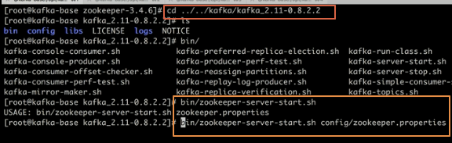

### 查看zookeeper端口

```
lsof -i:2181
```

### 启动kafaka broker

```shell
#指定配置文件，-daemon（指定是否后台运行）
bin/kafka-server-star.sh config/server.properties
//
kafka-server-start.bat ..\..\config\server.properties
```

### 检验kafka端口

```
lsof -i:9092
```

### 创建topic,名称为test，partitions为3

```shell
bin/kafka-topics.sh --zookeeper localhost:2181 --create --topic test1 --partitions 3 --replication-factor 1
#window
kafka-topics.bat --zookeeper localhost:2181 --create --topic test1 --partitions 3 --replication-factor 1
```

### 查看启动topic实例

```shell
bin/kafka-topics.sh --zookeeper localhost:2181 --describe --topic test1
kafka-topics.bat --zookeeper localhost:2181 --describe --topic test1
```

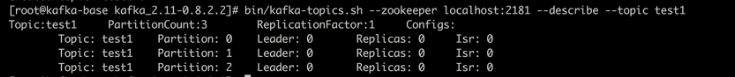

#### 分区增加partition

```shell
 kafka-topics.bat --zookeeper localhost:2181 --alter --topic Class1_producer1_topic --partitions 3
```


### 启动consumer实例

```shell
bin/kafka-console-consumer.sh --zookeeper localhost:2181 --topic test1
##实际使用
bin/kafka-console-consumer.sh --bootstrap-server localhost:9092 --topic test1   
```

### 另起命令窗口启动producer实例

```shell
bin/kafka-console-producer.sh --broker-list localhost:9092 --topic test1
##实际使用
bin/kafka-console-producer.sh --broker-list localhost:9092 --topic test1
```

### 在producer窗口输入信息，在consumer可以查看到发出的消息

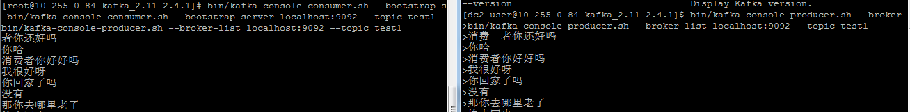

### 查看kafka的日志文件

```shell
##数据
##注意不加--print-data-log，看不到数据，只能看到{}这些数据
#baseOffset: 0 lastOffset: 0 count: 1 baseSequence: -1 lastSequence: -1 producerId: -1 producerEpoch: -1 partitionLeaderEpoch: 0 isTransactional: false isControl: false position: 0 
kafka-run-class.bat kafka.tools.DumpLogSegments --files D:\tmp\kafka-logs\test1-0\00000000000000000000.log --print-data-log >>d:\\kfk.log
##索引
kafka-run-class.bat kafka.tools.DumpLogSegments --files D:\tmp\kafka-logs\test1-0\00000000000000000000.index --print-data-log >>d:\\kfkindex.log
##消费者
kafka-run-class.bat kafka.tools.DumpLogSegments --files D:\tmp\kafka-logs\__consumer_offsets-0\00000000000000000000.log --print-data-log >>d:\\kfkcs.log
```

在kafka的配置文件中，会配置日志的地址如下

```properties
 log.dirs=/tmp/kafka-logs
```

如果是windows那么就是在kafka的安装盘的根目录下创建该目录。改日志下按`topicname-{partitionId}`为每个topic的分区创建文件夹，文件夹内容如下：

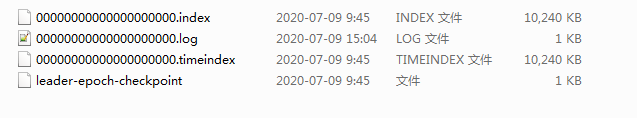

| 名字        | 含义                                                | 备注     |
| ----------- | --------------------------------------------------- | -------- |
| *.log       | 存储消息实体的文件                                  |          |
| *.index     | 记录消息的offset以及消息在log文件中的position的索引 | 稀疏存储 |
| *.timeindex | 记录消息的timestamp和offset的索引                   | 稀疏存储 |

#### 文件名 

日志存储路径根据配置log.dirs ，日志文件通过 topic-partitionId分目录，再通过<font color=red>log.roll.hours 和log.segment.bytes</font>来分文件，默认是超过7天，或者是1GB大小就分文件，在kafka的术语中，这被称为段（segment ）。最初始的文件是00000000000000000000.log命名的，比如下一个log中的第一条消息的offset是18987，则该log文件的命名是00000000000000018987.log。

索引文件中包含的若干条目，每个条目表示的数据文件中的一条message的索引——是当前的message在数据文件的offset和在文件的position（message在文件中的绝对位置信息）的对应关系。如下图所示：


> 图中log文件的Postion应该有错，offset与position应该是正比的，我的理解是log日志数据是顺序存储，offset表示第几个条目，而position由于每个消息长度不一样，所以无法计算出来，而是通过position标记在磁盘的位置，offset大的position一定也较大，所以图中的倒数第三个条目不应该是1108的。

其中00000000000000000000.index文件中的3,4597对应到00000000000000000000.log文件中的第三条消息，并且该消息的绝对位置是4597。但是如果消费者想要 获取5,7912的话，此时index文件中并没有5，所以根据二分查找，先找到3的位置，在进行顺序扫描从而找到5，7912的message。

index文件中并没有为每一条message建立索引。而是采用了稀疏存储的方式，每隔一定字节的数据建立一条索引，这样的话就是避免了索引文件占用过多的空间和资源，从而可以将索引文件保留到内存中。缺点是没有建立索引的数据在查询的过程中需要小范围内的顺序扫描操作。

> not every message within a log has it's corresponding message within the index. The configuration parameter <font color=red>**index.interval.bytes**</font>, which is 4096 bytes by default, sets an index interval which basically describes how frequently (after how many bytes) an index entry will be added.

```cpp
~ kafka-run-class kafka.tools.DumpLogSegments --files /data4/kafka/data/ods_analytics_access_log-3/00000000000197971543.index
Dumping /data4/kafka/data/ods_analytics_access_log-3/00000000000197971543.index
offset: 197971551 position: 5207
offset: 197971558 position: 9927
offset: 197971565 position: 14624
offset: 197971572 position: 19338
offset: 197971578 position: 23509
offset: 197971585 position: 28392
offset: 197971592 position: 33174
offset: 197971599 position: 38036
offset: 197971606 position: 42732
......

~ kafka-run-class kafka.tools.DumpLogSegments --files /data4/kafka/data/ods_analytics_access_log-3/00000000000197971543.timeindex
Dumping /data4/kafka/data/ods_analytics_access_log-3/00000000000197971543.timeindex
timestamp: 1593230317565 offset: 197971551
timestamp: 1593230317642 offset: 197971558
timestamp: 1593230317979 offset: 197971564
timestamp: 1593230318346 offset: 197971572
timestamp: 1593230318558 offset: 197971578
timestamp: 1593230318579 offset: 197971582
timestamp: 1593230318765 offset: 197971592
timestamp: 1593230319117 offset: 197971599
timestamp: 1593230319442 offset: 197971606
......
```

#### kafka记录消费者的offset

获取的group.id，使用下面公式计算该group位移保存在__consumer_offsets的哪个分区上：

```java
Math.abs(groupID.hashCode()) % numPartitions
```

查看consumer_offset文件，其中partition为上面公式计算出来的。

```shell
bin/kafka-simple-consumer-shell.sh --topic __consumer_offsets --partition 11 --broker-list localhost:9092,localhost:9093,localhost:9094 --formatter "kafka.coordinator.group.GroupMetadataManager\$OffsetsMessageFormatter"
```


## 独立的zookeeper启动

### 启动zookeeper实例

```shell
#进入zookeeper解压路径执行
#可选参数 start/start-foreground/stop/restart/sratus/upgrade/print-cmd
bin/zkServer.sh start  conf/zoo_sample.cfg
```


### 检查zookeeper状态

```shell
bin/zkServer.sh status  conf/zoo_sample.cfg
##查看端口
lsof -i:2181
```

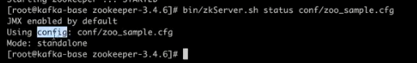

### 其余与上相同


## 使用docker启动

> 1. 安装docker
> 2. 安装centos容器
> 3. 安装jdk1.7+
> 4. 安装zookeeper
> 5. 启动zookeeper broker


### **zookeeper的dockerFile**

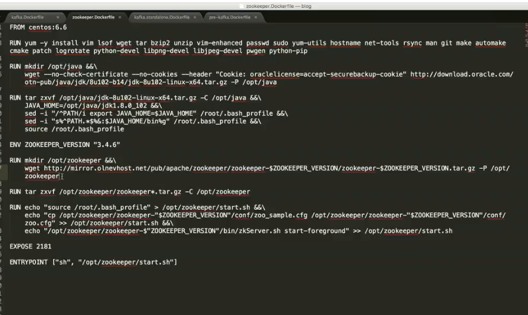

### **kafka的dockerFile**

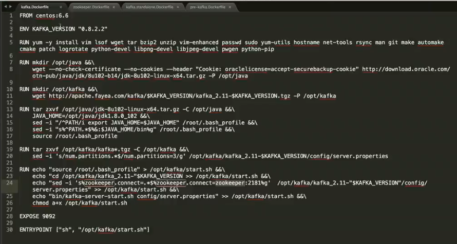

### **docker启动zookeeper**

```shell
docker run -itd --name zookeeper -h zookeeper -p2181:2181 jason/zookeeper:3.4.6 bash
#检查
docker ps
#检查端口
lsof -i:2181
```


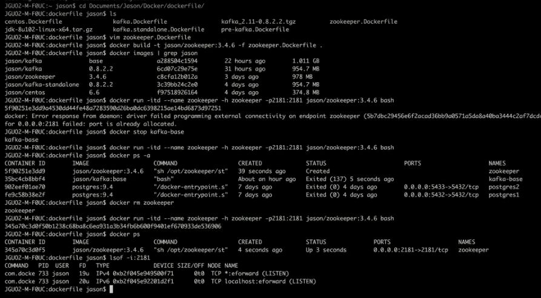

### **docker启动kafka**

```shell
 docker run -itd --name kafka -h kafka -p9092:9092 --link zookeeper jason/kafka:0.8.2.2 bash
 #检查
 docker ps
 ##检查端口
 lsof -i:9092
```


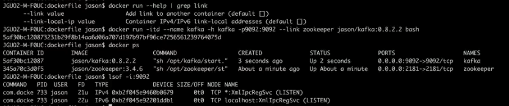

### **启动topic实例**

```shell
bin/kafka-topics.sh --create --topic test1 --zookeeper zookeeper:2181 --partitions 3 --replication-factor 1
##test2
bin/kafka-topics.sh --create --topic test2 --zookeeper zookeeper:2181 --partitions 3 --replication-factor 1
##查看
bin/kafka-topics.sh --describe --topic test2 --zookeeper zookeeper:2181

```

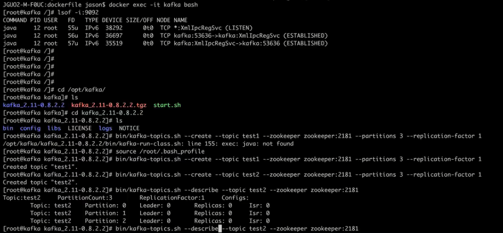

### 启动producer实例

```shell
bin/kafka-console-producer.sh --broker-list localhost:9092 --topic test1
```

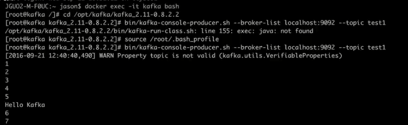

### 启动consumer实例

```shell
bin/kafka-console-consumer.sh --zookeeper zookeeper:2181 --topic test1
```

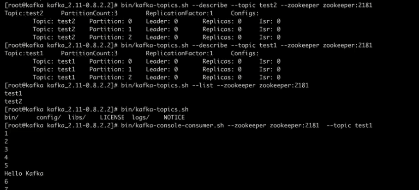

### topic之间传输

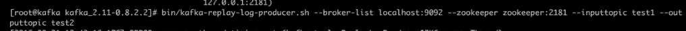


## 伪集群

1. 将kafka解压包，复制三份放置同一目录下

2. 修改配置文件，config/server.properties

   ```properties
   ####必须修改项，参考如下
   #kafka-1
   broker.id=0
   log.dirs=/tmp/kafka-logs0
   port=9092
   #kafka-2
   broker.id=1
   log.dirs=/tmp/kafka-logs1
   port=9093
   #kafka-2
   broker.id=2
   log.dirs=/tmp/kafka-logs2
   port=9094
   ```

3. 启动，在bin/windows目录下，执行

   ```shell
    kafka-server-start.bat ..\..\config\server.properties
   ```

   

4. 检查

   ```shell
   ##查看当前运行的java程序
   jps -l
   ##查看端口连接情况，其中2181是zookeeper默认开启的端口
    netstat -ano |findstr 2181
    
    ############################################
    #可以看到已经启动了三个kafka终端
    #端口号分别为10744、13704、12420,并已经与zookeeper建立连接
   ```

   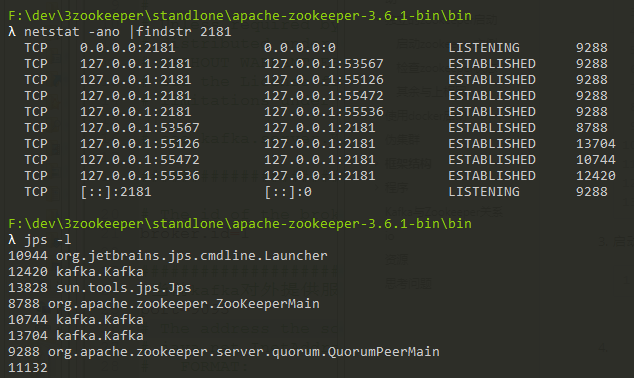

5. 创建topic，注意复制因子为2。

   ```shell
   ##创建topic
   kafka-topics.bat --zookeeper localhost:2181 --create --topic useforKafkaTest --partitions 3 --replication-factor 2
   ##查看topic信息
   kafka-topics.bat --zookeeper localhost:2181 --describe --topic useforKafkaTest
   Topic: useforKafkaTest  PartitionCount: 3       ReplicationFactor: 2    Configs:
           Topic: useforKafkaTest  Partition: 0    Leader: 2       Replicas: 2,1   Isr: 2,1
           Topic: useforKafkaTest  Partition: 1    Leader: 0       Replicas: 0,2   Isr: 0,2
           Topic: useforKafkaTest  Partition: 2    Leader: 1       Replicas: 1,0   Isr: 1,0
   ##给出了Leader、副本所做brokerid、ISR列表
   ```

   

6. zookeeper上查看topic 信息

   ```json
   ##主题信息 
   ###get /brokers/topics/useforKafkaTest
   {
       "version": "版本编号目前固定为数字1",
       "partitions": {
   	        "partitionId编号": [
   		            同步副本组brokerId列表
   		       ],
   	        "partitionId编号": [
   		            同步副本组brokerId列表
   		       ],
   	       .......
              
       }
   }
   {
       "version": 2,
       "partitions": {
           "2": [1, 0],
           "1": [0, 2],
           "0": [2, 1]
       },
       "adding_replicas": {},
       "removing_replicas": {}
   }
   ###分区信息：/brokers/topics/{topicName}/partitions/{partition-id}/state
   ### get /brokers/topics/useforKafkaTest/partitions/0/state
   {
       "controller_epoch": 表示kafka集群中的中央控制器选举次数,
       "leader": 表示该partition选举leader的brokerId,
       "version": 版本编号默认为1,
       "leader_epoch": 该partition leader选举次数,
       "isr": [同步副本组brokerId列表]
   }
   {
       "controller_epoch": 3,
       "leader": 2,
       "version": 1,
       "leader_epoch": 0,
       "isr": [2, 1]
   }
   
   ##brokerid信息
   ##格式：get /brokers/ids/{broker-id}
   {
       "jmx_port": "jmx端口号",
       "timestamp": "kafka broker初始启动时的时间戳",
       "host": "主机名或ip地址",
       "version": "版本编号默认为1",
       "port": "kafka broker的服务端端口号,由server.properties中参数port确定"
   }
   {
       "listener_security_protocol_map": {
           "PLAINTEXT": "PLAINTEXT"
       },
       "endpoints": ["PLAINTEXT://osname.mshome.net:9092"],
       "jmx_port": -1,
       "host": "osname.mshome.net",
       "timestamp": "1595381946870",
       "port": 9092,
       "version": 4
   }
   ######get /controller_epoch
   #kafka集群中第一个broker第一次启动时为1，以后只要集群中center controller中央控制器所在broker变更或挂掉，就会重新选举新的center controller，每次center controller变更controller_epoch值就会 + 1; 
   3
   ########
   ##get /controller
   ##存储center controller中央控制器所在kafka broker的信息
   {
       "version": "版本编号默认为1",
       "brokerid": "kafka集群中broker唯一编号",
       "timestamp": "kafka broker中央控制器变更时的时间戳"
   }
   {
       "version": 1,
       "brokerid": 0,
       "timestamp": "1595381947195"
   }
   
   ```

   

   

7. zookeeper-dev-ZooInspector.jar。zookeeper可视化工具

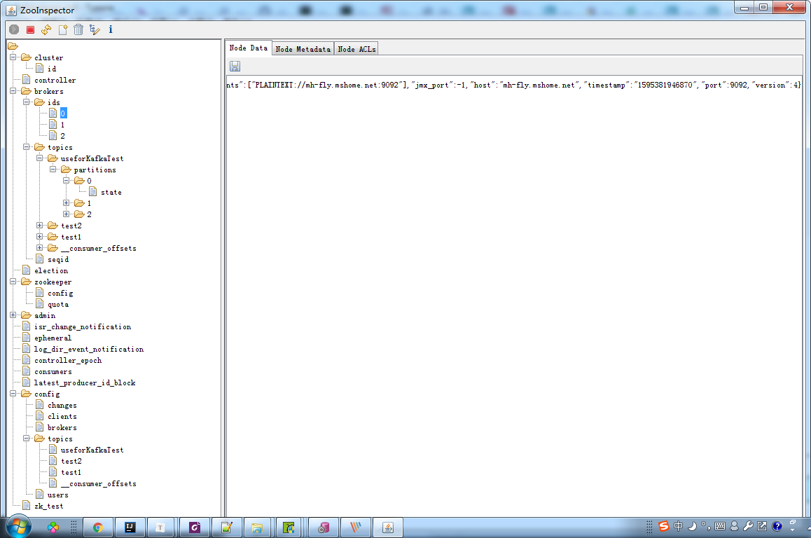


## 框架结构，主要是翻译官网

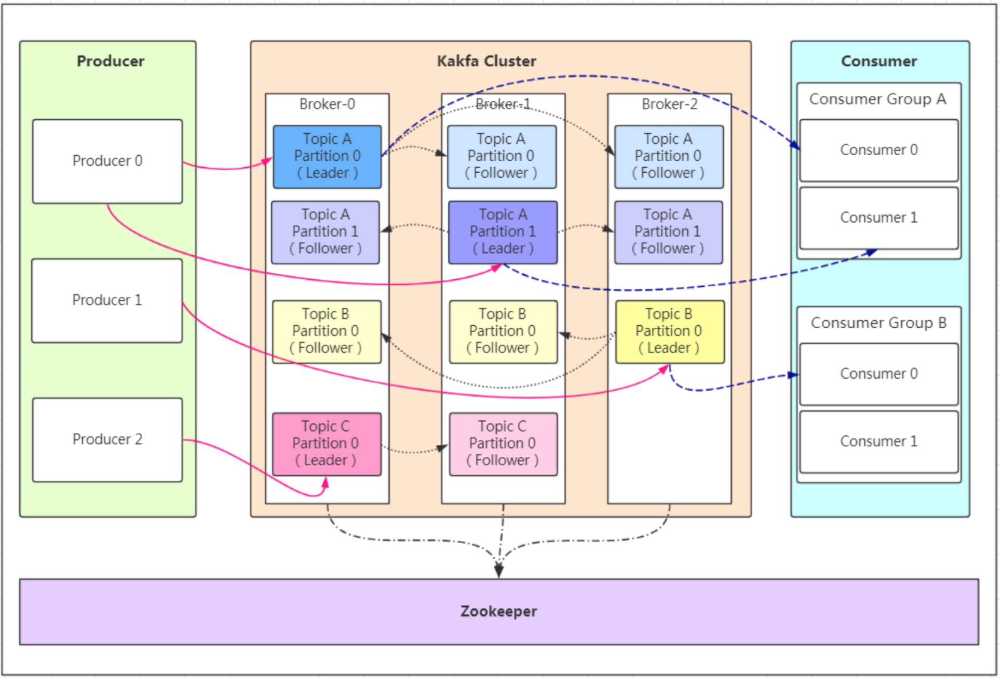

### **topic**

Topic 就是数据主题，是数据记录发布的地方,可以用来区分业务系统。Kafka中的Topics总是多订阅者模式，一个topic可以拥有一个或者多个消费者来订阅它的数据。

对于每一个topic， Kafka集群都会维持一个分区日志，如下所示：


每个分区都是有序且顺序不可变的记录集，并且不断地追加到结构化的commit log文件。**分区中的每一个记录都会分配一个id号来表示顺序，我们称之为offset，*offset*用来唯一的标识分区中每一条记录**。

Kafka 集群保留所有发布的记录—无论他们是否已被消费—并通过一个可配置的参数——保留期限来控制. 举个例子， 如果保留策略设置为2天，一条记录发布后两天内，可以随时被消费，两天过后这条记录会被抛弃并释放磁盘空间。Kafka的性能和数据大小无关，所以长时间存储数据没有什么问题.


事实上，**在每一个消费者中唯一保存的元数据是offset（偏移量）即消费在log中的位置**.偏移量由消费者所控制:通常在读取记录后，消费者会以线性的方式增加偏移量，但是实际上，由于这个位置由消费者控制，所以消费者可以采用任何顺序来消费记录。例如，一个消费者可以重置到一个旧的偏移量，从而重新处理过去的数据；也可以跳过最近的记录，从"现在"开始消费。

日志中的 partition（分区）有以下几个用途。第一，**当日志大小超过了单台服务器的限制，允许日志进行扩展**。每个单独的分区都必须受限于主机的文件限制，不过一个主题可能有多个分区，因此可以处理无限量的数据。第二，**可以作为并行的单元集—**关于这一点，更多细节如下

#### [分布式](http://kafka.apachecn.org/documentation.html#intro_distribution)

日志的分区partition （分布）在Kafka集群的服务器上。每个服务器在处理数据和请求时，共享这些分区。每一个分区都会在已配置的服务器上进行备份，确保容错性.

每个分区都有一台 server 作为 “leader”，零台或者多台server作为 follwers 。**leader server 处理一切对 partition （分区）的读写请求，而follwers只需被动的同步leader上的数据**。当leader宕机了，followers 中的一台服务器会自动成为新的 leader。每台 server 都会成为某些分区的 leader 和某些分区的 follower，因此集群的负载是平衡的。

#### [生产者](http://kafka.apachecn.org/documentation.html#intro_producers)

生产者可以将数据发布到所选择的topic（主题）中。**生产者负责将记录分配到topic的哪一个 partition（分区）中。可以使用循环的方式来简单地实现负载均衡，也可以根据某些语义分区函数(例如：记录中的key)来完成**。下面会介绍更多关于分区的使用。

永远找leader！消息写入leader后，follower是主动的去leader进行同步的！producer采用push模式将数据发布到broker，每条消息追加到分区中，顺序写入磁盘，所以保证同一分区内的数据是有序的！

* partition在写入的时候可以指定需要写入的partition，如果有指定，则写入对应的partition。
* 如果没有指定partition，但是设置了数据的key，则会根据key的值hash出一个partition。
* 如果既没指定partition，又没有设置key，则会轮询选出一个partition。

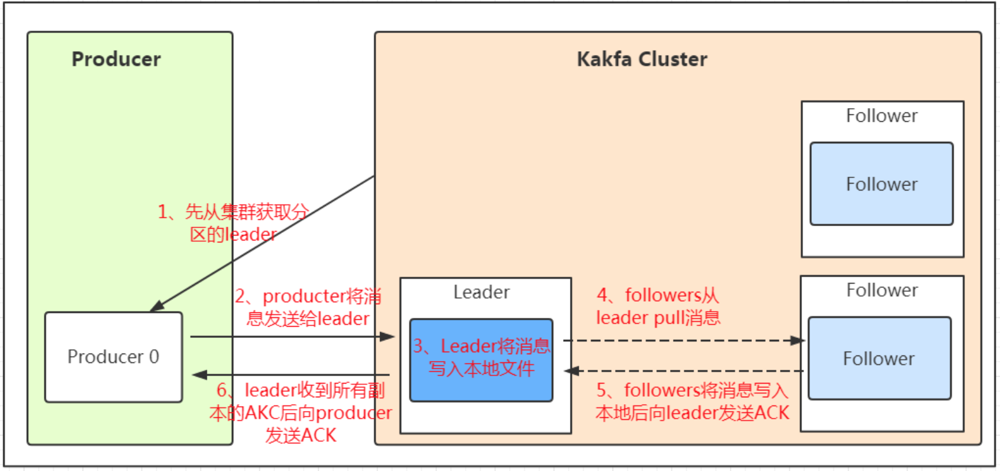

发送数据可靠性保证：ACK机制！

* 0：代表producer往集群发送数据不需要等到集群的返回，不确保消息发送成功。安全性最低但是效率最高。

* 1：代表producer往集群发送数据只要leader应答就可以发送下一条，只确保leader发送成功。

* all：代表producer往集群发送数据需要所有的follower都完成从leader的同步才会发送下一条，确保leader发送成功和所有的副本都完成备份。安全性最高，但是效率最低。

  **所以这里可能是会丢消息的哟！**

* 0：发丢了，生产端不知道，就是丢了。

* 1：保证leader不丢，但是如果leader挂了，恰好选了一个没有ACK的follower，那也丢了。

* all：保证leader和follower不丢，但是如果网络拥塞，没有收到ACK，会有重复发的问题。

##### 保存数据

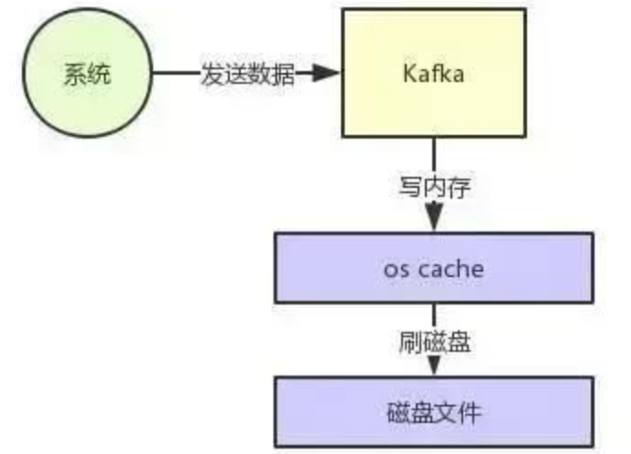

操作系统本身有一层缓存，叫做 Page Cache，是在内存里的缓存，我们也可以称之为 OS Cache，意思就是操作系统自己管理的缓存。你在写入磁盘文件的时候，可以直接写入这个 OS Cache 里，也就是仅仅写入内存中，接下来由操作系统自己决定什么时候把 OS Cache 里的数据真的刷入磁盘文件中。

Kafka提供了一个参数——producer.type来控制是不是主动flush，如果Kafka写入到mmap之后就立即flush然后再返回Producer叫 同步 (sync)；写入mmap之后立即返回Producer不调用flush叫异步 (async)。

**敲黑板：所以这里也可能是会丢消息的哟！**

> 假如已经写在了OS cache中但是还没来得及刷入磁盘，此时突然机器宕机，或者broker重启，那就丢了。

#### [消费者](http://kafka.apachecn.org/documentation.html#intro_consumers)

消费者使用一个 *消费组* 名称来进行标识，发布到topic中的每条记录被分配给订阅消费组中的一个消费者实例.消费者实例可以分布在多个进程中或者多个机器上。

如果所有的消费者实例在同一消费组中，消息记录会负载平衡到每一个消费者实例.

如果所有的消费者实例在不同的消费组中，**每条消息记录会广播到所有的消费者进程.**


如图，这个 Kafka 集群有两台 server 的，四个分区(p0-p3)和两个消费者组。消费组A有两个消费者，消费组B有四个消费者。

通常情况下，每个 topic 都会有一些消费组，一个消费组对应一个"逻辑订阅者"。一个消费组由许多消费者实例组成，便于扩展和容错。这就是发布和订阅的概念，只不过订阅者是一组消费者而不是单个的进程。

在Kafka中实现消费的方式是将日志中的分区划分到每一个消费者实例上，以便在任何时间，**每个实例都是分区唯一的消费者**。维护消费组中的消费关系由Kafka协议动态处理。如果新的实例加入组，他们将从组中其他成员处接管一些 partition 分区;如果一个实例消失，拥有的分区将被分发到剩余的实例。

Kafka 只保证分区内的记录是有序的，而不保证主题中不同分区的顺序。每个 partition 分区按照key值排序足以满足大多数应用程序的需求。但如果你需要总记录在所有记录的上面，可使用仅有一个分区的主题来实现，这意味着每个消费者组只有一个消费者进程。

```shell
#查看partition
bin/kafka-topics.sh --zookeeper localhost:2181 --describe --topic test1
##查看所在文件夹
 cd kafka_2.11-2.4.1
 pushd /tmp/kafka-logs/
 ##即可看到主题topic的partition分区文件夹
 ls
```

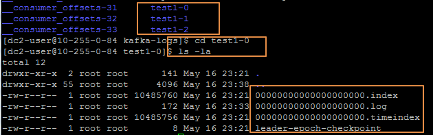


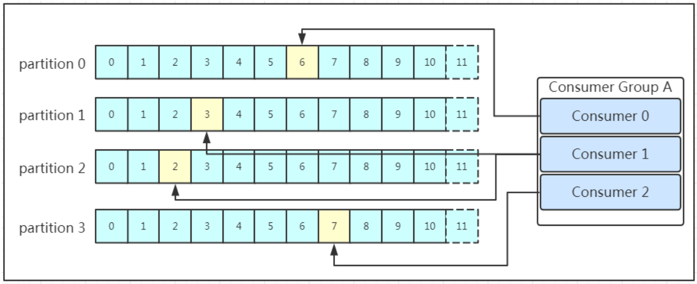

消费者通过pull模式主动的去kafka集群拉取消息，与producer相同的是，消费者在拉取消息的时候也是找leader去拉取。

多个消费者可以组成一个消费者组（consumer group），每个消费者组都有一个组id！同一个消费组者的消费者可以消费同一topic下不同分区的数据，但是不会组内多个消费者消费同一分区的数据。
在早期的版本中，消费者将消费到的offset维护zookeeper中，consumer每间隔一段时间上报一次，这里容易导致重复消费，且性能不好！在新的版本中消费者消费到的offset已经直接维护在kafka集群的__consumer_offsets这个topic中！

消费消息的时候可以大致分为两个阶段：1、标示该消息已被消费（commit记录一下）；2、处理消息。

**敲黑板：所以这里也可能是会丢消息的哟！**

先commit，但是在处理消息的异常了，此时这条消息就丢了。

先处理，再commit，不丢。

#### 消息可靠性保证

> * At most once 消息可能会丢，但绝不会重复传输
>
> * At least once 消息绝不会丢，但可能会重复传输
>
> * Exactly once 每条消息肯定会被传输一次且仅传输一次，很多时候这是用户所想要的
>
>   
>
>   从 Producer 向 broker 发送消息时，通过ACK机制保证不丢消息，但是不可靠，依赖kafka的参数配置：
>
> * 0：发丢了，生产端不知道，就是丢了，对应At most once。
> * 1：保证leader不丢，但是如果leader挂了，恰好选了一个没有ACK的follower，那也丢了，对应At most once。
> * all：保证leader和follower不丢，但是如果网络拥塞，没有收到ACK，会有重复发的问题，对应At least once。


#### Kafka数据丢失

1. producer配置acks=0

   > 在acks=0的模式下，消息传输到Broker端没收到Broker的反馈就发送下一条

2. producer配置acks=1

   > acks为1的模式下，消息传到leader节点，leader节点返回ack，即认为数据发送成功。无需等待副本同步。这种模式在，leader宕机，follower没同步leader数据，情况下会丢失数据

3. NO_ENOUGH_REPLICATE异常

   > produer配置acks=all的时候，也是有可能会丢数据的，当某个partition的ISR列表中的副本数，不满足min.inSync.replicate的时候，生产者发送消息就得不到ack确认，这时候生产者会进入重试，重试次数为配置的message.send.max.retries，如果在重试次数内ISR列表副本数仍然达不到最小同步副本数，那么，生产者会抛出NO_ENOUGH_REPLICATE的异常，如果没能正确处理这个异常，很可能这条数据就丢失了。
   >
   > 如下，可能导致follower未能及时反馈。
   >
   > follower副本进程卡住，在一段时间内根本没有向leader副本发起同步请求，比如频繁的Full GC。
   > follower副本进程同步过慢，在一段时间内都无法追赶上leader副本，比如IO开销过大。

4. NOT_LEADER_FOR_PARTITION

   > 其中一台Broker会出现与zk的sessionTime out 连接超时，接着导致Controller重新选举，导致producer元数据不正确，此时写入该Broker，会抛出NOT_LEADER_FOR_PARTITION的警告，此时可能会发生数据丢失。auto.leader.rebalance.enable=true 也会进行重新选举leader的操作，导致写入原leader，抛出NOT_LEADER_FOR_PARTITION

5. 磁盘故障

   > kafka的数据一开始就是存储在PageCache上的，定期flush到磁盘上的，也就是说，不是每个消息都被存储在磁盘了，如果出现断电或者机器故障等，PageCache上的数据就丢失了。
   >
   > 可以通过log.flush.interval.messages和log.flush.interval.ms来配置flush间隔

6. 消费者崩溃

   > 如果auto.commit.enable=true，当consumer fetch了一些数据但还没有完全处理掉的时候，刚好到commit interval出发了提交offset操作，接着consumer crash掉了。这时已经fetch的数据还没有处理完成但已经被commit掉，因此没有机会再次被处理，数据丢失。

7. 消费者批处理

   > Consumer手动批量提交位点，在批量位点中某个位点数据异常时，没有正确处理异常，而是将批量位点的最后一个位点提交，导致异常数据丢失。

8. Producer生产数据过长

   > 单批数据的长度超过限制会丢失数据，报kafka.common.MessageSizeTooLargeException异常
   > 生产者生产的数据，大于消费者配置的能拉取的最大消息大小，这条大数据将会消费失败

9. 


### 4. 设计

#### 4.1动机

我们设计Kafka作为一个统一的平台处理所有大公司可能需要处理的所有实时的数据。为此，我们考虑了相当广的使用情景。

它必须具有高吞吐量才能支持大量事件流，例如实时日志聚合。

它将需要妥善处理大量数据积压，以便能够支持定期从脱机系统加载数据。

这也意味着系统将必须是低延迟的，以能够处理更多的传统的消息场景，

我们希望能够支持分区、分布式、实时处理。这激发了我们的分区和消费者模型。

最后，在将流发送至其他数据系统进行服务的场景中，该系统必须能够在存在机器故障的情况下保证容错能力。

为了支持这些用途，我们设计了许多独特元素，与传统的消息传递系统相比，更类似于数据库日志。


#### 4.2持久化persistence

Kafka relies heavily on the filesystem for storing and caching messages. There is a general perception that "disks are slow" which makes people skeptical that a persistent structure can offer competitive performance. In fact disks are both much slower and much faster than people expect depending on how they are used; and a properly designed disk structure can often be as fast as the network.

> Kafka在很大程度上依赖于文件系统来存储和缓存消息。人们普遍认为“磁盘速度很慢”，这使人们怀疑这种持久性的结构能否提供有竞争力的性能。实际上，磁盘的使用速度要比人们期望的慢得多也快得多，取决于如何使用。正确设计的磁盘结构通常可以和网络一样快。

The key fact about disk performance is that the throughput of hard drives has been diverging from the latency of a disk seek for the last decade. As a result the performance of linear writes on a JBOD configuration with six 7200rpm SATA RAID-5 array is about 600MB/sec but the performance of random writes is only about 100k/sec—a difference of over 6000X. These linear reads and writes are the most predictable of all usage patterns, and are heavily optimized by the operating system. A modern operating system provides read-ahead and write-behind techniques that prefetch data in large block multiples and group smaller logical writes into large physical writes. A further discussion of this issue can be found in this ACM Queue article; they actually find that sequential disk access can in some cases be faster than random memory access!

有关磁盘性能的关键事实是，在过去十年中，硬盘驱动器的吞吐量与磁盘寻道的延迟相背离的。在具有六个7200rpm SATA RAID-5阵列的JBOD配置上，线性写入的性能约为600MB / sec，但随机写入的性能仅为100k / sec，相差超过6000倍。这些线性读取和写入是所有使用模式中最可预测的，并且已由操作系统进行了大幅优化。现代操作系统提供了预读和后写技术，这些技术可以以多个大块来预取数据，并将大数据的物理写入分组成较小的逻辑写入。更多的讨论可以在ACM Queue Artical中找到，他们发现，对磁盘的线性读在有些情况下可以比内存的随机访问要更快。

To compensate for this performance divergence, modern operating systems have become increasingly aggressive in their use of main memory for disk caching. A modern OS will happily divert *all* free memory to disk caching with little performance penalty when the memory is reclaimed. All disk reads and writes will go through this unified cache. This feature cannot easily be turned off without using direct I/O, so even if a process maintains an in-process cache of the data, this data will likely be duplicated in OS pagecache, effectively storing everything twice.

Furthermore, we are building on top of the JVM, and anyone who has spent any time with Java memory usage knows two things:

1. The memory overhead of objects is very high, often doubling the size of the data stored (or worse).
2. Java garbage collection becomes increasingly fiddly and slow as the in-heap data increases.

> 为了弥补这种性能差异，现代操作系统在更积极的尝试使用主内存进行磁盘缓存。当回收内存时，现代的操作系统会很乐意将所有可用内存转移到磁盘缓存中，而对性能的影响很小。所有磁盘读写都将通过此统一缓存。如果不使用直接I / O，就无法轻易关闭此功能，因此，即使进程维护了数据的进程内的缓存，该数据也很可能被缓存在OS的页高速缓存中，从而将所有数据存储两次。
>
> 而且，我们系统构建在jvm之上，熟悉java内存模型的人应该只对：
>
> * 对象的开销是非常高的，通常两倍于存储数据的大小（或更糟糕）
> * 随着堆内数据的增加，java垃圾回收变得频繁以及缓慢

As a result of these factors using the filesystem and relying on pagecache is superior to maintaining an in-memory cache or other structure—we at least double the available cache by having automatic access to all free memory, and likely double again by storing a compact byte structure rather than individual objects. Doing so will result in a cache of up to 28-30GB on a 32GB machine without GC penalties. Furthermore, this cache will stay warm even if the service is restarted, whereas the in-process cache will need to be rebuilt in memory (which for a 10GB cache may take 10 minutes) or else it will need to start with a completely cold cache (which likely means terrible initial performance). This also greatly simplifies the code as all logic for maintaining coherency between the cache and filesystem is now in the OS, which tends to do so more efficiently and more correctly than one-off in-process attempts. If your disk usage favors linear reads then read-ahead is effectively pre-populating this cache with useful data on each disk read.

> 由于这些因素，使用<font color=red>文件系统并依赖操作系统的页面缓存（pagecache）</font>优于维护内存中缓存或其他结构，我们通过自动访问 所有可用内存至少将可用缓存翻了一倍，并且通过存储压缩字节的结构而不是对象再次翻了一倍。这样做将导致在32GB的计算机上最多可缓存28-30GB的缓存，而不会造成GC损失。此外，即使重新启动服务，此缓存也会保持warm（经常使用的cache），而进程内缓存将需要在内存中重建（10GB缓存可能需要10分钟），否则将需要从完全cold cache（空的cache称为cold cache）开始（这可能意味着糟糕的初始性能）。这也极大地简化了代码，因为所有用于保持缓存和文件系统之间一致性的逻辑现在都在OS中，这比使用一次性进程更有效。如果您的磁盘支持线性读取，每次读取的磁盘上的数据时都会预读有用的数据到cache中。

This suggests a design which is very simple: rather than maintain as much as possible in-memory and flush it all out to the filesystem in a panic when we run out of space, we invert that. All data is immediately written to a persistent log on the filesystem without necessarily flushing to disk. In effect this just means that it is transferred into the kernel's pagecache.

This style of pagecache-centric design is described in an [article](http://varnish-cache.org/wiki/ArchitectNotes) on the design of Varnish here (along with a healthy dose of arrogance).

> 这种设计是非常简单的，当我们空间不足时，将其全部数据刷新flush到文件系统中，而不是在内存中维护尽可能多的内存。所有的数据马上写入文件系统的持久化日志中，而没有必要马上刷新至磁盘中。实际上，<font color=red>它只是被转移到了内核的pagecache</font>

**Constant Time Suffices**

The persistent data structure used in messaging systems are often a per-consumer queue with an associated BTree or other general-purpose random access data structures to maintain metadata about messages. BTrees are the most versatile data structure available, and make it possible to support a wide variety of transactional and non-transactional semantics in the messaging system. They do come with a fairly high cost, though: Btree operations are O(log N). Normally O(log N) is considered essentially equivalent to constant time, but this is not true for disk operations. Disk seeks come at 10 ms a pop, and each disk can do only one seek at a time so parallelism is limited. Hence even a handful of disk seeks leads to very high overhead. Since storage systems mix very fast cached operations with very slow physical disk operations, the observed performance of tree structures is often superlinear as data increases with fixed cache--i.e. doubling your data makes things much worse than twice as slow.

> 消息中间件中使用的持久性数据结构通常是，每个消费者队列关联至BTree或其他通用的随机访问数据结构，以维护有关消息的元数据。BTree是可用的最通用的数据结构，它使消息中间件能支持各种事务性和非事务性语义成为可能。不过，它们的代价确实很高：Btree操作为O（log N）。通常认为O（log N）本质上等同于恒定时间，但是对于磁盘操作而言并非如此。磁盘寻址时间为10毫秒，每个磁盘一次只能执行一次搜寻，因此并行性受到限制。因此，即使很少的磁盘搜索也会导致非常高的开销。由于存储系统将混合了非常快的缓存操作与非常慢的物理磁盘操作，因此当数据随着固定缓存的增加而增加时，观察到的树结构的性能通常是超线性的。数据翻倍，而数据缺慢了不止两倍。

Intuitively a persistent queue could be built on simple reads and appends to files as is commonly the case with logging solutions. This structure has the advantage that all operations are O(1) and reads do not block writes or each other. This has obvious performance advantages since the performance is completely decoupled from the data size—one server can now take full advantage of a number of cheap, low-rotational speed 1+TB SATA drives. Though they have poor seek performance, these drives have acceptable performance for large reads and writes and come at 1/3 the price and 3x the capacity.

> 直观上讲，持久性队列可以建立在简单的读取上和追加（append）到文件上，这与日志记录解决方案通常是一样的。这种结构的优点是所有操作均为O（1），读取不会阻塞写入或彼此阻塞。最明显的优势是，由于性能与数据大小完全解耦，因此一台服务器现在可以充分利用许多廉价的低转速1 + TB SATA驱动器。尽管它们的寻址性能较差，但对于大型读写操作，这些驱动器的性能仍是可以接受的，而且相对于其他，价格仅为1/3和而容量提升3倍。

Having access to virtually unlimited disk space without any performance penalty means that we can provide some features not usually found in a messaging system. For example, in Kafka, instead of attempting to delete messages as soon as they are consumed, we can retain messages for a relatively long period (say a week). This leads to a great deal of flexibility for consumers, as we will describe.

> 可以访问几乎无限的磁盘空间而不会降低性能，这意味着我们可以提供消息中间件中通常不具备的某些功能。比如，我们可以将消息保留相对较长的时间（例如一周），而不是尝试在消息被消费后立即删除。正如我们将要描述的，这为消费者带来了极大的灵活性。

#### 4.3 efficiency 效率

We have put significant effort into efficiency. One of our primary use cases is handling web activity data, which is very high volume: each page view may generate dozens of writes. Furthermore, we assume each message published is read by at least one consumer (often many), hence we strive to make consumption as cheap as possible.

> 我们为提高效率付出了巨大的努力。我们的主要用例之一是处理Web活动的数据，该数据量非常大：浏览每个web页面可能会产生数十次写入。此外，我们假设发布的每条消息都至少由一个消费者（通常是许多消费者）读取，因此我们努力使消费尽可能开销小。

We have also found, from experience building and running a number of similar systems, that efficiency is a key to effective multi-tenant operations. If the downstream infrastructure service can easily become a bottleneck due to a small bump in usage by the application, such small changes will often create problems. By being very fast we help ensure that the application will tip-over under load before the infrastructure. This is particularly important when trying to run a centralized service that supports dozens or hundreds of applications on a centralized cluster as changes in usage patterns are a near-daily occurrence.

> 我们还从构建和运行许多类似系统的经验中发现，效率是有效的多租户（ multi-tenant）操作的关键。如果下游基础设施服务由于应用程序使用量的小幅度增加而容易成为瓶颈，那么这种小的更改通常会带来问题。我们可以非常快的确保应用程序在基础架构之前先在负载下tip-over。当尝试在集中式的集群上运行数十个或数百个应用程序时，这尤其重要，因为使用模式的更改几乎每天都会发生。

We discussed disk efficiency in the previous section. Once poor disk access patterns have been eliminated, there are two common causes of inefficiency in this type of system: too many small I/O operations, and excessive byte copying.

> 我们在上一节中讨论了磁盘效率。一旦消除了不良的磁盘访问模式，这种系统效率低下的常见原因有两个：<font color=red>过多的小I / O操作和过多的字节复制。</font>

The small I/O problem happens both between the client and the server and in the server's own persistent operations.

> 小I/O问题发生在客户端与服务器之间，以及服务器自身的持久化操作

To avoid this, our protocol is built around a "message set" abstraction that naturally groups messages together. This allows network requests to group messages together and amortize the overhead of the network roundtrip rather than sending a single message at a time. The server in turn appends chunks of messages to its log in one go, and the consumer fetches large linear chunks at a time.

> 为了避免这种情况，我们的协议围绕“message set“概念构建，该概念将消息自然地组合在一起。 这允许网络请求将消息分组在一起并分摊网络往返的开销，而不是一次发送单个消息。服务器又将消息块一次性添加到其日志中，而消费者则一次获取大的线性数据块。

This simple optimization produces orders of magnitude speed up. Batching leads to larger network packets, larger sequential disk operations, contiguous memory blocks, and so on, all of which allows Kafka to turn a bursty stream of random message writes into linear writes that flow to the consumers.

> 这种简单的优化可以提供数量级的速度提升。批处理导致更大的网络数据包，更大的顺序磁盘操作，连续的内存块等，所有这些都使Kafka能够将突发的随机消息写入流转换为线性写入流，这些写入流将流向消费者。

The other inefficiency is in byte copying. At low message rates this is not an issue, but under load the impact is significant. To avoid this we employ a standardized binary message format that is shared by the producer, the broker, and the consumer (so data chunks can be transferred without modification between them).

> 另一个低效率是字节复制。在低消息速率下，这不是问题，但是在负载下影响很大。为避免这种情况，我们采用了标准的二进制消息格式，该格式由producer，broker和consumer共享(因此数据块可以在它们之间进行传输而无需修改)

The message log maintained by the broker is itself just a directory of files, each populated by a sequence of message sets that have been written to disk in the same format used by the producer and consumer. Maintaining this common format allows optimization of the most important operation: network transfer of persistent log chunks. Modern unix operating systems offer a highly optimized code path for transferring data out of pagecache to a socket; in Linux this is done with the [sendfile system call](http://man7.org/linux/man-pages/man2/sendfile.2.html).

> 代理维护的消息日志本身只是文件目录，每个文件目录都由一系列"message sets"填充，这些"message sets"以生产者和使用者所用的相同格式写入磁盘。维持这种通用格式可以优化最重要的操作：持久日志块的网络传输。现代的Unix操作系统提供了高度优化的代码路径，可用于将数据从页面缓存(pagecache)传输到套接字(socket)。linux系统是通过sendfile的系统调用实现的。<font color=red>零拷贝</font>

To understand the impact of sendfile, it is important to understand the common data path for transfer of data from file to socket:

1. The operating system reads data from the disk into pagecache in kernel space
2. The application reads the data from kernel space into a user-space buffer
3. The application writes the data back into kernel space into a socket buffer
4. The operating system copies the data from the socket buffer to the NIC buffer where it is sent over the network

> 要了解sendfile的影响，重要的是要了解将数据从文件传输到套接字的通用数据路径：
>
> 1. 操作系统从磁盘中读取数据到内核空间的pagecache中
> 2. 应用程序从内核空间中读取数据到用户空间
> 3. 应用程序写入数据返回内核空间中的socket 缓冲区
> 4. 操作系统从socket缓存区中复制数据进入NIC缓冲区，并从nic缓存区发送到网络中

This is clearly inefficient, there are four copies and two system calls. Using sendfile, this re-copying is avoided by allowing the OS to send the data from pagecache to the network directly. So in this optimized path, only the final copy to the NIC buffer is needed.

> 这显然是低效的，有四个副本和两个系统调用。使用sendfile，可以通过允许OS将数据从页面缓存（pagecache）直接发送到网络来避免这种重复的复制。因此，在此优化路径中，仅需要最终复制到NIC缓冲区。

We expect a common use case to be multiple consumers on a topic. Using the<font color=red> zero-copy optimization</font> above, data is copied into pagecache exactly once and reused on each consumption instead of being stored in memory and copied out to user-space every time it is read. This allows messages to be consumed at a rate that approaches the limit of the network connection.

> 我们期望的一个常见的用例是某个主题（topic）存在多个消费者。使用上述零拷贝优化后，数据将被复制到页面缓存（pagecache）中一次，并在每次消费时重复使用，而不是存储在内存中，并在每次读取时复制到用户空间。这允许以接近网络连接限制的速率使用消息。

This combination of pagecache and sendfile means that on a Kafka cluster where the consumers are mostly caught up you will see no read activity on the disks whatsoever as they will be serving data entirely from cache.

For more background on the sendfile and zero-copy support in Java, see this [article](https://developer.ibm.com/articles/j-zerocopy/).

> pagecache和sendfile的这种组合意味着，Kafka集群上的生产者和消费者，将看不到磁盘上的任何读取活动，因为它们将完全从缓存中提供数据。
>
> 有关在Java中Sendfile和zero-copy（零拷贝）的支持更多的背景，请参阅此文。

In some cases the bottleneck is actually not CPU or disk but network bandwidth. This is particularly true for a data pipeline that needs to send messages between data centers over a wide-area network. Of course, the user can always compress its messages one at a time without any support needed from Kafka, but this can lead to very poor compression ratios as much of the redundancy is due to repetition between messages of the same type (e.g. field names in JSON or user agents in web logs or common string values). Efficient compression requires compressing multiple messages together rather than compressing each message individually.

Kafka supports this with an efficient batching format. A batch of messages can be clumped together compressed and sent to the server in this form. This batch of messages will be written in compressed form and will remain compressed in the log and will only be decompressed by the consumer.

Kafka supports GZIP, Snappy, LZ4 and ZStandard compression protocols. More details on compression can be found [here](https://cwiki.apache.org/confluence/display/KAFKA/Compression).

> 在某些情况下，瓶颈实际上不是CPU或磁盘，而是网络带宽。对于需要通过广域网在数据中心之间发送消息的数据管道而言，尤其如此。

#### 4.4 The Producer

##### [Load balancing](http://kafka.apache.org/documentation/#design_loadbalancing)

The producer sends data directly to the broker that is the leader for the partition without any intervening routing tier. To help the producer do this all Kafka nodes can answer a request for metadata about which servers are alive and where the leaders for the partitions of a topic are at any given time to allow the producer to appropriately direct its requests.

The client controls which partition it publishes messages to. This can be done at random, implementing a kind of random load balancing, or it can be done by some semantic partitioning function. We expose the interface for semantic partitioning by allowing the user to specify a key to partition by and using this to hash to a partition (there is also an option to override the partition function if need be). For example if the key chosen was a user id then all data for a given user would be sent to the same partition. This in turn will allow consumers to make locality assumptions about their consumption. This style of partitioning is explicitly designed to allow locality-sensitive processing in consumers.

> 生产者将数据直接发送到作为partition leader的broker，而无需任何中间路由层。为了帮助生产者做到这一点，所有的Kafka节点都可以在任何给定时间回答关于哪些服务器处于活动状态以及topic  partition的leader在哪里，以允许生产者适当地定向其请求。
>
> 客户端控制将消息发布到哪个分区。这可以通过实现一种随机负载平衡，来随机指定分区，也可以通过某些语义分区功能来完成。我们公开了用于分区语义的接口（如果需要，还有一个选项可以覆盖分区功能），允许用户指定要使用的键来进行分区并使用其散列到特定的分区。例如，如果选择的键是用户ID，则给定用户的所有数据将发送到同一分区。反过来，这将允许消费者对他们的消费做出本地化假设。明确设计了这种分区样式，以允许使用者使用本地化敏感的处理。

Batching is one of the big drivers of efficiency, and to enable batching the Kafka producer will attempt to accumulate data in memory and to send out larger batches in a single request. The batching can be configured to accumulate no more than a fixed number of messages and to wait no longer than some fixed latency bound (say 64k or 10 ms). This allows the accumulation of more bytes to send, and few larger I/O operations on the servers. This buffering is configurable and gives a mechanism to trade off a small amount of additional latency for better throughput.

Details on [configuration](http://kafka.apache.org/documentation/#producerconfigs) and the [api](http://kafka.apache.org/082/javadoc/index.html?org/apache/kafka/clients/producer/KafkaProducer.html) for the producer can be found elsewhere in the documentation.

批处理是提高效率的主要驱动力之一，而要启用批处理，Kafka生产者将尝试在内存中累积数据并在单个请求中发出更大的批处理。批处理可以配置为累积不超过固定数量的消息，并且等待不超过某个固定等待时间限制（例如64k或10 ms）。这样可以积累更多的字节来发送，并且在服务器很少进行大的I / O操作。此缓冲是可配置的，并提供了一种机制来权衡少量额外的延迟以提高吞吐量。

#### 4.5 The Consumer

The Kafka consumer works by issuing "fetch" requests to the brokers leading the partitions it wants to consume. The consumer specifies its offset in the log with each request and receives back a chunk of log beginning from that position. The consumer thus has significant control over this position and can rewind it to re-consume data if need be.

Kafka使用者通过向负责它要使用的分区的代理发出“获取”请求来工作。使用者通过每个请求在日志中指定其偏移量，并从该位置开始接收回日志的消息。消费者因此对该位置具有主要的控制权，并且可以根据需要倒带以重新使用数据。

##### [Push vs. pull](http://kafka.apache.org/documentation/#design_pull) 

An initial question we considered is whether consumers should pull data from brokers or brokers should push data to the consumer. In this respect Kafka follows a more traditional design, shared by most messaging systems, where data is pushed to the broker from the producer and pulled from the broker by the consumer. Some logging-centric systems, such as [Scribe](http://github.com/facebook/scribe) and [Apache Flume](http://flume.apache.org/), follow a very different push-based path where data is pushed downstream. There are pros and cons to both approaches. However, a push-based system has difficulty dealing with diverse consumers as the broker controls the rate at which data is transferred. The goal is generally for the consumer to be able to consume at the maximum possible rate; unfortunately, in a push system this means the consumer tends to be overwhelmed when its rate of consumption falls below the rate of production (a denial of service attack, in essence). A pull-based system has the nicer property that the consumer simply falls behind and catches up when it can. This can be mitigated with some kind of backoff protocol by which the consumer can indicate it is overwhelmed, but getting the rate of transfer to fully utilize (but never over-utilize) the consumer is trickier than it seems. Previous attempts at building systems in this fashion led us to go with a more traditional pull model.

> 我们考虑的第一个问题是，消费者应该从broker那里提取数据还是broker应该将数据推送给消费者。在这方面，Kafka遵循大多数消息中间件更传统、更通用的设计，在该设计中，数据从生产者推送到代理，再由消费者从代理提取。一些以日志为中心的系统，比如flume，遵循完全不同的基于推送的方式，数据被推送到下游。两种方法都各有利弊。但是，基于推送的系统很难与多样化的消费者打交道，因为broker控制着数据的传输速率。

Another advantage of a pull-based system is that it lends itself to aggressive batching of data sent to the consumer. A push-based system must choose to either send a request immediately or accumulate more data and then send it later without knowledge of whether the downstream consumer will be able to immediately process it. If tuned for low latency, this will result in sending a single message at a time only for the transfer to end up being buffered anyway, which is wasteful. A pull-based design fixes this as the consumer always pulls all available messages after its current position in the log (or up to some configurable max size). So one gets optimal batching without introducing unnecessary latency.

> 基于拉取的系统的另一个优点是，有可以批量的发送数据给消费者。基于推送的系统必须选择立即发送请求或累积更多数据，并在不知道消费者是否可以立即处理请求的情况下延迟消息的推送。如果针对低延迟进行了调整，这将导致一次仅发送一条消息，而无论如何传输最终都会被缓冲，这很浪费。基于拉取的设计可解决此问题，因为消费者始终拉取日志中在当前位置之后所有可用的消息（或达到某些可配置的最大大小）。这样一来，您可以在不引入不必要延迟的情况下获得最佳批处理。

The deficiency of a naive pull-based system is that if the broker has no data the consumer may end up polling in a tight loop, effectively busy-waiting for data to arrive. To avoid this we have parameters in our pull request that allow the consumer request to block in a "long poll" waiting until data arrives (and optionally waiting until a given number of bytes is available to ensure large transfer sizes).

基于原生拉取模式的系统的不足之处在于，如果broker没有数据，则消费者最终可能在不断的轮询，等待数据到达。为了避免这种情况，我们在拉取请求中有一些参数，这些参数允许消费者请求阻塞在“长时间轮询”中，直到数据到达为止（也可以选择等待直到满足给定数量的字节，确保较大的传输大小）。 

You could imagine other possible designs which would be only pull, end-to-end. The producer would locally write to a local log, and brokers would pull from that with consumers pulling from them. A similar type of "store-and-forward" producer is often proposed. This is intriguing but we felt not very suitable for our target use cases which have thousands of producers. Our experience running persistent data systems at scale led us to feel that involving thousands of disks in the system across many applications would not actually make things more reliable and would be a nightmare to operate. And in practice we have found that we can run a pipeline with strong SLAs at large scale without a need for producer persistence.

> 您可以想像其他可能的设计，只是端到端的拉取。生产者将在本地写入本地日志，broker从生产者本地日志中提取，而消费者则从broker那里提取日志。经常提出类似“存储转发”这类型的生产者。这很有趣，但是我们觉得它不适合我们的目标用例，因为它有成千上万的生产者。我们运行大型持久性数据系统的经验告诉我们，应用程序如果涉及千上万个磁盘实际上并不能使系统变得更可靠，并且将是一场噩梦。实践中我们发现可以运行一个有SLAs的管道在大规模中，而不需要生产者持久化。

##### [Consumer Position ](http://kafka.apache.org/documentation/#design_consumerposition) 

Keeping track of *what* has been consumed is, surprisingly, one of the key performance points of a messaging system.

> 令人惊讶的是，跟踪已消耗的内容是消息传递系统的关键性能点之一。

Most messaging systems keep metadata about what messages have been consumed on the broker. That is, as a message is handed out to a consumer, the broker either records that fact locally immediately or it may wait for acknowledgement from the consumer. This is a fairly intuitive choice, and indeed for a single machine server it is not clear where else this state could go. Since the data structures used for storage in many messaging systems scale poorly, this is also a pragmatic choice--since the broker knows what is consumed it can immediately delete it, keeping the data size small.

> 大多数消息中间件保留有关在broker上消耗了哪些消息的元数据。也就是说，当消息被发送给消费者时，broker要么立即记录消费的位置，要么等待消费者返回确认的消息后再记录。这是一个相当直观的选择，实际上对于单台机器的服务，是不确定他的状态会如何变化。由于许多消息中间件存储的数据结构的扩展性很差，因此这也是一个务实的选择-因为broker知道被消耗的内容，因此可以立即删除它，从而使数据量变小。

What is perhaps not obvious is that getting the broker and consumer to come into agreement about what has been consumed is not a trivial problem. If the broker records a message as **consumed** immediately every time it is handed out over the network, then if the consumer fails to process the message (say because it crashes or the request times out or whatever) that message will be lost. To solve this problem, many messaging systems add an acknowledgement feature which means that messages are only marked as **sent** not **consumed** when they are sent; the broker waits for a specific acknowledgement from the consumer to record the message as **consumed**. This strategy fixes the problem of losing messages, but creates new problems. First of all, if the consumer processes the message but fails before it can send an acknowledgement then the message will be consumed twice. The second problem is around performance, now the broker must keep multiple states about every single message (first to lock it so it is not given out a second time, and then to mark it as permanently consumed so that it can be removed). Tricky problems must be dealt with, like what to do with messages that are sent but never acknowledged.

> 可能并不明显的是，使broker和consumer就已消费的消息达成一致并不是一个小问题。如果broker每次将消息发送到网络上就立即认为该消息已被消费，则如果消费者无法处理该消息（例如，崩溃或请求超时等），该消息就会丢失。为了解决这个问题，许多消息中间件都添加了确认功能，意思是消息被发送出去时，broker只是标记该消息为“已发送”而不是“已消费”，broker等待从消费者返回的特定的确认信息然后才记录为“已消费”。这个策略解决了丢失消息的 问题，但创建了新的问题。<font color=red>首先，如果消费者处理了消息但在发送确认信息前宕机了，那么消息就可能被消费两次。第二个问题涉及到性能，broker必须为每个消息保留多个状态（首先锁定它，这样就不会再发出它了，然后将其标记为永久消费，以便可以将其删除）。必须处理的棘手的问题，例如如何处理已发送但从未确认的消息。</font> 

Kafka handles this differently. Our topic is divided into a set of totally ordered partitions, each of which is consumed by exactly one consumer within each subscribing consumer group at any given time. This means that the position of a consumer in each partition is just a single integer, the offset of the next message to consume. This makes the state about what has been consumed very small, just one number for each partition. This state can be periodically checkpointed. This makes the equivalent of message acknowledgements very cheap.

> kafka对此的处理有所不同，我们的主题（topic）分为一组完全有序的分区（partition），每个分区都在任何给定时间由每个订阅的消费者组（consumer group）中的一个消费者正好一次（exactly one）消费。这意味着，消费者在每个分区的位置仅仅是一个数字,即消费者下一个消息的offset。这使得记录关于已经被消费的数据的状态的开销是非常 小的。仅仅是每个分区中的一个数字。这个状态能被周期的检查。这也是消息确认的开销非常小。

There is a side benefit of this decision. A consumer can deliberately *rewind* back to an old offset and re-consume data. This violates the common contract of a queue, but turns out to be an essential feature for many consumers. For example, if the consumer code has a bug and is discovered after some messages are consumed, the consumer can re-consume those messages once the bug is fixed.

> 这个设计还有一个附加的优点。消费者可以倒带回一个旧的offset并重新消费数据。这违反了队列的通用约定，但事实证明这是许多消费者的所必需的功能。比如，如果一个消费者代码有一个bug，并在已经消费了一些消息后才被发现，消费者可以在bug修复后重新消费消息

##### [Offline Data Load](http://kafka.apache.org/documentation/#design_offlineload) 

Scalable persistence allows for the possibility of consumers that only periodically consume such as batch data loads that periodically bulk-load data into an offline system such as Hadoop or a relational data warehouse.

> 可扩展的持久化，允许消费者仅定期消费比如批处理数据的加载，这些数据将周期性地将数据批量加载到诸如Hadoop或关系数据仓库的脱机系统中。

In the case of Hadoop we parallelize the data load by splitting the load over individual map tasks, one for each node/topic/partition combination, allowing full parallelism in the loading. Hadoop provides the task management, and tasks which fail can restart without danger of duplicate data—they simply restart from their original position.

> 在Hadoop中，我们通过将负载拆分到单个map任务(每个节点/主题/分区组合一个任务)来并行化数据加载，从而允许在加载时完全并行。Hadoop提供了任务管理，失败的任务可以重新启动，而不会有重复数据的危险——它们只是从原始位置重新启动。

##### [Static Membership](http://kafka.apache.org/documentation/#static_membership) 

Static membership aims to improve the availability of stream applications, consumer groups and other applications built on top of the group rebalance protocol. The rebalance protocol relies on the group coordinator to allocate entity ids to group members. These generated ids are ephemeral and will change when members restart and rejoin. For consumer based apps, this "dynamic membership" can cause a large percentage of tasks re-assigned to different instances during administrative operations such as code deploys, configuration updates and periodic restarts. For large state applications, shuffled tasks need a long time to recover their local states before processing and cause applications to be partially or entirely unavailable. Motivated by this observation, Kafka’s group management protocol allows group members to provide persistent entity ids. Group membership remains unchanged based on those ids, thus no rebalance will be triggered.


If you want to use static membership,

- Upgrade both broker cluster and client apps to 2.3 or beyond, and also make sure the upgraded brokers are using `inter.broker.protocol.version` of 2.3 or beyond as well.
- Set the config `ConsumerConfig#GROUP_INSTANCE_ID_CONFIG` to a unique value for each consumer instance under one group.
- For Kafka Streams applications, it is sufficient to set a unique `ConsumerConfig#GROUP_INSTANCE_ID_CONFIG` per KafkaStreams instance, independent of the number of used threads for an instance.

If your broker is on an older version than 2.3, but you choose to set `ConsumerConfig#GROUP_INSTANCE_ID_CONFIG` on the client side, the application will detect the broker version and then throws an UnsupportedException. If you accidentally configure duplicate ids for different instances, a fencing mechanism on broker side will inform your duplicate client to shutdown immediately by triggering a `org.apache.kafka.common.errors.FencedInstanceIdException`. For more details, see [KIP-345](https://cwiki.apache.org/confluence/display/KAFKA/KIP-345%3A+Introduce+static+membership+protocol+to+reduce+consumer+rebalances) 

#### 4.6 Message Delivery Semantics

Now that we understand a little about how producers and consumers work, let's discuss the semantic guarantees Kafka provides between producer and consumer. Clearly there are multiple possible message delivery guarantees that could be provided:

- *At most once*—Messages may be lost but are never redelivered.
- *At least once*—Messages are never lost but may be redelivered.
- *Exactly once*—this is what people actually want, each message is delivered once and only once.

It's worth noting that this breaks down into two problems: the durability guarantees for publishing a message and the guarantees when consuming a message.

Many systems claim to provide "exactly once" delivery semantics, but it is important to read the fine print, most of these claims are misleading (i.e. they don't translate to the case where consumers or producers can fail, cases where there are multiple consumer processes, or cases where data written to disk can be lost).

Kafka's semantics are straight-forward. When publishing a message we have a notion of the message being "committed" to the log. Once a published message is committed it will not be lost as long as one broker that replicates the partition to which this message was written remains "alive". The definition of committed message, alive partition as well as a description of which types of failures we attempt to handle will be described in more detail in the next section. For now let's assume a perfect, lossless broker and try to understand the guarantees to the producer and consumer. If a producer attempts to publish a message and experiences a network error it cannot be sure if this error happened before or after the message was committed. This is similar to the semantics of inserting into a database table with an autogenerated key.

Prior to 0.11.0.0, if a producer failed to receive a response indicating that a message was committed, it had little choice but to resend the message. This provides at-least-once delivery semantics since the message may be written to the log again during resending if the original request had in fact succeeded. Since 0.11.0.0, the Kafka producer also supports an idempotent delivery option which guarantees that resending will not result in duplicate entries in the log. To achieve this, the broker assigns each producer an ID and deduplicates messages using a sequence number that is sent by the producer along with every message. Also beginning with 0.11.0.0, the producer supports the ability to send messages to multiple topic partitions using transaction-like semantics: i.e. either all messages are successfully written or none of them are. The main use case for this is exactly-once processing between Kafka topics (described below).

Not all use cases require such strong guarantees. For uses which are latency sensitive we allow the producer to specify the durability level it desires. If the producer specifies that it wants to wait on the message being committed this can take on the order of 10 ms. However the producer can also specify that it wants to perform the send completely asynchronously or that it wants to wait only until the leader (but not necessarily the followers) have the message.

Now let's describe the semantics from the point-of-view of the consumer. All replicas have the exact same log with the same offsets. The consumer controls its position in this log. If the consumer never crashed it could just store this position in memory, but if the consumer fails and we want this topic partition to be taken over by another process the new process will need to choose an appropriate position from which to start processing. Let's say the consumer reads some messages -- it has several options for processing the messages and updating its position.

1. It can read the messages, then save its position in the log, and finally process the messages. In this case there is a possibility that the consumer process crashes after saving its position but before saving the output of its message processing. In this case the process that took over processing would start at the saved position even though a few messages prior to that position had not been processed. This corresponds to "at-most-once" semantics as in the case of a consumer failure messages may not be processed.

> 它能读取消息，并保存它的位置在日志中，并最终处理消息。在这种情况下，消费者进程可能在保存其位置之后，但在保存其消息处理的输出结果之前宕机。在这种情况下，接管处理的进程将从保存的位置开始，即使在该位置之前的一些消息没有被处理。这对应于“at most once”的语义，因为在消费者失败的情况下，消息可能不会被处理。

1. It can read the messages, process the messages, and finally save its position. In this case there is a possibility that the consumer process crashes after processing messages but before saving its position. In this case when the new process takes over the first few messages it receives will already have been processed. This corresponds to the "at-least-once" semantics in the case of consumer failure. In many cases messages have a primary key and so the updates are idempotent (receiving the same message twice just overwrites a record with another copy of itself).

> 它可以读取消息，处理消息，最后保存它的位置。在这种情况下，消费者进程有可能在处理消息之后但在保存其位置之前崩溃。在这种情况下，当接管它新进程处理接收到的前几个消息中，这些 消息其实已经被处理。这对应于“最少一次”语义。在许多情况下，消息有一个主键，因此更新是幂等的(接收两次相同的消息只是用它自己的另一个副本覆盖一条记录)。

So what about exactly once semantics (i.e. the thing you actually want)? When consuming from a Kafka topic and producing to another topic (as in a [Kafka Streams](https://kafka.apache.org/documentation/streams) application), we can leverage the new transactional producer capabilities in 0.11.0.0 that were mentioned above. The consumer's position is stored as a message in a topic, so we can write the offset to Kafka in the same transaction as the output topics receiving the processed data. If the transaction is aborted, the consumer's position will revert to its old value and the produced data on the output topics will not be visible to other consumers, depending on their "isolation level." In the default "read_uncommitted" isolation level, all messages are visible to consumers even if they were part of an aborted transaction, but in "read_committed," the consumer will only return messages from transactions which were committed (and any messages which were not part of a transaction).

> 那么，“exactly once”的语义又是什么？(即你真正想要的东西)？当从Kafka主题消费并生成到另一个主题时(就像在Kafka Streams应用程序中一样)，我们可以利用上面提到的0.11.0.0中的新的事务生成功能。消费者的位置作为消息存储在主题topic中，因此我们可以在处理接收到数据的输出topic中，使用同一个事务中将偏移量写入Kafka。如果事务中止，使用者的位置将恢复到原来的值，并且根据其他消费者的“隔离级别”，在输出topic主题上生成的数据将对其他消费者不可见。在默认的“read_uncommitted”隔离级别中，所有消息对于使用者都是可见的，即使它们是中止的事务的一部分，但是在“read_committed”中，使用者将只返回来自已提交事务的消息(以及任何不属于事务的消息)。

When writing to an external system, the limitation is in the need to coordinate the consumer's position with what is actually stored as output. The classic way of achieving this would be to introduce a two-phase commit between the storage of the consumer position and the storage of the consumers output. But this can be handled more simply and generally by letting the consumer store its offset in the same place as its output. This is better because many of the output systems a consumer might want to write to will not support a two-phase commit. As an example of this, consider a [Kafka Connect](https://kafka.apache.org/documentation/#connect) connector which populates data in HDFS along with the offsets of the data it reads so that it is guaranteed that either data and offsets are both updated or neither is. We follow similar patterns for many other data systems which require these stronger semantics and for which the messages do not have a primary key to allow for deduplication.

> 当向外部系统写入时，限制在于需要协调消费者的位置和实际存储的位置作为输出的内容。<font color=red>实现这一点的经典方法是在消费者位置的存储和使用者输出的存储之间引入两阶段提交。但这可以通过让消费者将其偏移量存储在与其输出相同的位置来简化。</font>这样做更好，因为许多消费者可能希望写入的输出系统不支持两阶段提交。举个例子，考虑一个Kafka Connect连接器，它在HDFS中操作数据以及它读取的数据的偏移量，这样就可以保证数据和偏移量要么都更新了，要么都没有更新。我们对许多其他数据系统遵循类似的模式，这些系统需要这些更强的语义，并且消息没有主键来支持重复数据删除。

So effectively Kafka supports exactly-once delivery in [Kafka Streams](https://kafka.apache.org/documentation/streams), and the transactional producer/consumer can be used generally to provide exactly-once delivery when transferring and processing data between Kafka topics. Exactly-once delivery for other destination systems generally requires cooperation with such systems, but Kafka provides the offset which makes implementing this feasible (see also [Kafka Connect](https://kafka.apache.org/documentation/#connect)). Otherwise, Kafka guarantees at-least-once delivery by default, and allows the user to implement at-most-once delivery by disabling retries on the producer and committing offsets in the consumer prior to processing a batch of messages.

> 因此Kafka有效地支持在Kafka stream中 "exactly-once"传递，而事务生产者/消费者通常可以在Kafka toptic之间传输和处理数据，来实现“exactly-once”。其用途的系统的Exactly-once 传递需要与此类系统合作，但Kafka提供了偏移量(参见Kafka Connect)使得实现变得可行。否则，Kafka默认**at-least-once** 传递，并允许用户在处理一批消息之前，在生产者上禁用重试和在消费者中提交偏移量，来实现 **at-most-once** 传递。

#### 4.7 Replication

Kafka replicates the log for each topic's partitions across a configurable number of servers (you can set this replication factor on a topic-by-topic basis). This allows automatic failover to these replicas when a server in the cluster fails so messages remain available in the presence of failures.

> Kafka在可配置数量的服务器上为每个主题的分区创建日志副本(可以根据每个主题设置复制因子)。这允许在集群中的服务器出现故障时自动将故障转移到这些副本，从而在出现故障时消息仍然可用。

Other messaging systems provide some replication-related features, but, in our (totally biased) opinion, this appears to be a tacked-on thing, not heavily used, and with large downsides: replicas are inactive, throughput is heavily impacted, it requires fiddly manual configuration, etc. Kafka is meant to be used with replication by default—in fact we implement un-replicated topics as replicated topics where the replication factor is one.

> 其他的消息中间件也提供了一些与副本相关的特性，但在我们(完全有偏见)看来，这似乎是附加的东西，没有大量使用，并且有很大的缺点:副本是不活动的，吞吐量受到严重影响，它需要繁琐的手动配置，等等。默认情况下，Kafka是使用副本功能的——实际上，我们将复制因子设置为1的主题作为不创建副本的实现。

The unit of replication is the topic partition. Under non-failure conditions, each partition in Kafka has a single leader and zero or more followers. The total number of replicas including the leader constitute the replication factor. All reads and writes go to the leader of the partition. Typically, there are many more partitions than brokers and the leaders are evenly distributed among brokers. The logs on the followers are identical to the leader's log—all have the same offsets and messages in the same order (though, of course, at any given time the leader may have a few as-yet unreplicated messages at the end of its log).

> 创建副本的单位是topic partition。在非故障条件下，Kafka中的每个分区都有一个leader和零个或更多的follower。副本的总数包括leader，构成复制因子。所有的读写操作都由分区的leader执行。通常，分区比broker多很多，并且分区的leader均匀地分布在broker之间。follower的日志与leaser的日志相同——都有相同的偏移量offset和相同顺序的消息(当然，在任何给定时间，leaser在其日志的末尾可能有一些尚未复制的消息)。

Followers consume messages from the leader just as a normal Kafka consumer would and apply them to their own log. Having the followers pull from the leader has the nice property of allowing the follower to naturally batch together log entries they are applying to their log.

As with most distributed systems automatically handling failures requires having a precise definition of what it means for a node to be "alive". For Kafka node liveness has two conditions

1. A node must be able to maintain its session with ZooKeeper (via ZooKeeper's heartbeat mechanism)
2. If it is a follower it must replicate the writes happening on the leader and not fall "too far" behind

> follower像kafka普通的消费者一样消费来自leader的消息，并将其应用到自己的日志中。follower从leader那里拉取消息这种模式有一个很好的特性，即允许follower批量的应用日志条目到follower本地日志中。
>
> 与大多数分布式系统一样，自动处理故障需要对节点“活动”的含义有一个精确定义。对于Kafka节点，活性有两个条件
>
> 1. 节点必须能够维护与ZooKeeper的会话(通过ZooKeeper的心跳机制)
>
> 2. 如果它是一个follower，它必须复制在leader上写入操作，并且 不能落后leader太多

We refer to nodes satisfying these two conditions as being "in sync" to avoid the vagueness of "alive" or "failed". The leader keeps track of the set of "in sync" nodes. If a follower dies, gets stuck, or falls behind, the leader will remove it from the list of in sync replicas. The determination of stuck and lagging replicas is controlled by the replica.lag.time.max.ms configuration.

> 我们将满足这两个条件的节点称为“同步（in sync）”，以避免“活着”或“宕机”的模糊性。leaser跟踪“同步”节点的集合。如果一个follower死了，卡住了，或者落后了，leaser将把它从同步副本列表中删除。控制follower卡壳(多久没联系leader)的配置是 `replica.lag.time.max.ms`.

In distributed systems terminology we only attempt to handle a "fail/recover" model of failures where nodes suddenly cease working and then later recover (perhaps without knowing that they have died). Kafka does not handle so-called "Byzantine" failures in which nodes produce arbitrary or malicious responses (perhaps due to bugs or foul play).

在分布式系统术语中，我们只尝试处理故障的“失败/恢复”模型，即节点突然停止工作，然后恢复(可能不知道它们已经死亡)。Kafka不处理所谓的“Byzantine”故障，即节点产生任意的或恶意的响应(可能是由于错误或不合理的操作)。

We can now more precisely define that a message is considered committed when all in sync replicas for that partition have applied it to their log. Only committed messages are ever given out to the consumer. This means that the consumer need not worry about potentially seeing a message that could be lost if the leader fails. Producers, on the other hand, have the option of either waiting for the message to be committed or not, depending on their preference for tradeoff between latency and durability. This preference is controlled by the acks setting that the producer uses. Note that topics have a setting for the "minimum number" of in-sync replicas that is checked when the producer requests acknowledgment that a message has been written to the full set of in-sync replicas. If a less stringent acknowledgement is requested by the producer, then the message can be committed, and consumed, even if the number of in-sync replicas is lower than the minimum (e.g. it can be as low as just the leader).

> 我们现在可以更精确地定义，当该分区的所有同步副本都将消息应用到它们的日志中时，会认为该消息已提交。只有已提交的消息才会发送给消费者。这意味着消费者不必担心会接收到leader失败时可能丢失的消息。另一方面，生产者可以选择等待消息提交或不提交，这取决于他们偏好在延迟和持久性之间进行权衡。该首选项由生成器使用的 **acks** 设置控制。请注意，主题的同步副本有一个“最小数目”的设置，当生产者请求确认已将消息写入所有完整的同步副本时，将检查该设置。如果生产者请求一个不那么严格要求确认，则可以提交并使用消息，即使同步副本的数量低于最小值(例如，可能只有leader)。

The guarantee that Kafka offers is that a committed message will not be lost, as long as there is at least one in sync replica alive, at all times.

Kafka will remain available in the presence of node failures after a short fail-over period, but may not remain available in the presence of network partitions.

> <font color=red>kafka提供的保证是，在任何时候只要至少有一个同步副本活着，一个已提交的消息不会丢失。</font>
>
> 在短暂的故障转移周期后，Kafka将在存在的节点故障中保持可用，但可能在存在的网络分区中不保持可用。

##### [Replicated Logs: Quorums, ISRs, and State Machines (Oh my!)](http://kafka.apache.org/documentation/#design_replicatedlog) 

At its heart a Kafka partition is a replicated log. The replicated log is one of the most basic primitives in distributed data systems, and there are many approaches for implementing one. A replicated log can be used by other systems as a primitive for implementing other distributed systems in the [state-machine style](http://en.wikipedia.org/wiki/State_machine_replication).

A replicated log models the process of coming into consensus on the order of a series of values (generally numbering the log entries 0, 1, 2, ...). There are many ways to implement this, but the simplest and fastest is with a leader who chooses the ordering of values provided to it. As long as the leader remains alive, all followers need to only copy the values and ordering the leader chooses.

Of course if leaders didn't fail we wouldn't need followers! When the leader does die we need to choose a new leader from among the followers. But followers themselves may fall behind or crash so we must ensure we choose an up-to-date follower. The fundamental guarantee a log replication algorithm must provide is that if we tell the client a message is committed, and the leader fails, the new leader we elect must also have that message. This yields a tradeoff: if the leader waits for more followers to acknowledge a message before declaring it committed then there will be more potentially electable leaders.

If you choose the number of acknowledgements required and the number of logs that must be compared to elect a leader such that there is guaranteed to be an overlap, then this is called a Quorum.

A common approach to this tradeoff is to use a majority vote for both the commit decision and the leader election. This is not what Kafka does, but let's explore it anyway to understand the tradeoffs. Let's say we have 2*f*+1 replicas. If *f*+1 replicas must receive a message prior to a commit being declared by the leader, and if we elect a new leader by electing the follower with the most complete log from at least *f*+1 replicas, then, with no more than *f* failures, the leader is guaranteed to have all committed messages. This is because among any *f*+1 replicas, there must be at least one replica that contains all committed messages. That replica's log will be the most complete and therefore will be selected as the new leader. There are many remaining details that each algorithm must handle (such as precisely defined what makes a log more complete, ensuring log consistency during leader failure or changing the set of servers in the replica set) but we will ignore these for now.

This majority vote approach has a very nice property: the latency is dependent on only the fastest servers. That is, if the replication factor is three, the latency is determined by the faster follower not the slower one.

There are a rich variety of algorithms in this family including ZooKeeper's [Zab](http://web.archive.org/web/20140602093727/http://www.stanford.edu/class/cs347/reading/zab.pdf), [Raft](https://ramcloud.stanford.edu/wiki/download/attachments/11370504/raft.pdf), and [Viewstamped Replication](http://pmg.csail.mit.edu/papers/vr-revisited.pdf). The most similar academic publication we are aware of to Kafka's actual implementation is [PacificA](http://research.microsoft.com/apps/pubs/default.aspx?id=66814) from Microsoft.

The downside of majority vote is that it doesn't take many failures to leave you with no electable leaders. To tolerate one failure requires three copies of the data, and to tolerate two failures requires five copies of the data. In our experience having only enough redundancy to tolerate a single failure is not enough for a practical system, but doing every write five times, with 5x the disk space requirements and 1/5th the throughput, is not very practical for large volume data problems. This is likely why quorum algorithms more commonly appear for shared cluster configuration such as ZooKeeper but are less common for primary data storage. For example in HDFS the namenode's high-availability feature is built on a [majority-vote-based journal](http://blog.cloudera.com/blog/2012/10/quorum-based-journaling-in-cdh4-1), but this more expensive approach is not used for the data itself.

> 多数投票的不利之处在于，不需要很多次故障，你就没有可以当选的leader。要容忍一次故障，需要数据的三份副本;要容忍两次故障，需要数据的五份副本。根据我们的经验，对于一个实际的系统来说，只有足够的冗余来容忍一个故障是不够的，但是每次都需要执行5次写操作，意味着磁盘空间需求的5倍和吞吐量的1/5的情况下，对于处理大容量数据问题是不太实际的。这可能就是为什么仲裁算法（quorum algorithms）更常见地出现在共享集群配置(如ZooKeeper)中，而在主数据存储中不那么常见的原因。例如，在HDFS中，namenode的高可用性特性是建立在基于`majority-vote-based journal`的，但是这种更昂贵的方法并不用于数据本身。

Kafka takes a slightly different approach to choosing its quorum set. Instead of majority vote, Kafka dynamically maintains a set of in-sync replicas (ISR) that are caught-up to the leader. Only members of this set are eligible for election as leader. A write to a Kafka partition is not considered committed until *all* in-sync replicas have received the write. This ISR set is persisted to ZooKeeper whenever it changes. Because of this, any replica in the ISR is eligible to be elected leader. This is an important factor for Kafka's usage model where there are many partitions and ensuring leadership balance is important. With this ISR model and *f+1* replicas, a Kafka topic can tolerate *f* failures without losing committed messages.

> Kafka采用一种稍微不同的方法来选择它的quorum列表。<font color=red>Kafka动态地维护一组同步副本(ISR)，而不是多数投票</font>。只有这一组的成员才有资格当选为leader。对Kafka分区的写操作在*所有*同步副本接收到写操作之前不会被认为是提交的。每当ISR设置发生变化时，它都会持久化到ZooKeeper。因此，任何ISR的成员都有资格当选leader。Kafka的使用模型的一个关键因素是，因为它有很多分区，所以确保leader的平衡非常重要。有了这个ISR模型和*f+1*副本，Kafka主题可以容忍*f*失败而不会丢失提交的消息。

For most use cases we hope to handle, we think this tradeoff is a reasonable one. In practice, to tolerate *f* failures, both the majority vote and the ISR approach will wait for the same number of replicas to acknowledge before committing a message (e.g. to survive one failure a majority quorum needs three replicas and one acknowledgement and the ISR approach requires two replicas and one acknowledgement). The ability to commit without the slowest servers is an advantage of the majority vote approach. However, we think it is ameliorated by allowing the client to choose whether they block on the message commit or not, and the additional throughput and disk space due to the lower required replication factor is worth it.

> 对于我们希望处理的大多数用例，我们认为这种权衡是合理的。在实践中,为了容忍 f 个失败,多数投票和ISR方法在提交消息前都需要等待相同数量的副本确认(例如，多数投票中，一个失败，需要三个副本和一个确认，而ISR方法需要两个副本,一个确认)。能够在不使用最慢服务器的情况下提交消息是多数投票方式的一个优点。但是，我们认为，通过允许客户机选择是否阻塞消息提交，可以改善这种情况，并且由于所需复制因子较低而增加的吞吐量和磁盘空间是值得的。

Another important design distinction is that Kafka does not require that crashed nodes recover with all their data intact. It is not uncommon for replication algorithms in this space to depend on the existence of "stable storage" that cannot be lost in any failure-recovery scenario without potential consistency violations. There are two primary problems with this assumption. First, disk errors are the most common problem we observe in real operation of persistent data systems and they often do not leave data intact. Secondly, even if this were not a problem, we do not want to require the use of fsync on every write for our consistency guarantees as this can reduce performance by two to three orders of magnitude. Our protocol for allowing a replica to rejoin the ISR ensures that before rejoining, it must fully re-sync again even if it lost unflushed data in its crash.

> 另一个重要的设计区别是，Kafka不要求宕机的节点恢复时所有数据完好无损。在这个空间中，复制算法依赖于“稳定存储”的存在是很常见的，在任何故障恢复场景中，稳定存储不会丢失，而不会违反潜在的一致性。这种假设存在两个主要问题。首先，磁盘错误是我们在持久数据系统的实际操作中观察到的最常见的问题，它们通常不会使数据保持完整。其次，即使这不是问题，我们也不希望在每次写操作时都使用fsync来保证一致性，因为这会降低性能2到3个数量级。我们允许副本重新加入ISR的协议确保了在重新加入之前，它必须重新完全同步，即使它在崩溃时丢失了未刷新的数据。

##### [Unclean leader election: What if they all die?](http://kafka.apache.org/documentation/#design_uncleanleader) 

Note that Kafka's guarantee with respect to data loss is predicated on at least one replica remaining in sync. If all the nodes replicating a partition die, this guarantee no longer holds.

However a practical system needs to do something reasonable when all the replicas die. If you are unlucky enough to have this occur, it is important to consider what will happen. There are two behaviors that could be implemented:

> 注意，Kafka关于数据丢失的保证是基于至少一个副本保持同步。如果一个分区的所有副本节点都死亡，则此保证将不再成立。
>
> 然而，实际的系统需要在所有副本都死亡时做一些合理的事情。如果你很不幸地遇到了这种情况，考虑一下会发生什么是很重要的。有两种行为可以实现:

1. Wait for a replica in the ISR to come back to life and choose this replica as the leader (hopefully it still has all its data).
2. Choose the first replica (not necessarily in the ISR) that comes back to life as the leader.

> 1. 等待ISR列表中的一个副本复活并选择这个副本作为leader(希望它仍然拥有它的所有数据)。
>
> 2. 选择第一个副本(不一定是在ISR中)作为leader复活。

This is a simple tradeoff between availability and consistency. If we wait for replicas in the ISR, then we will remain unavailable as long as those replicas are down. If such replicas were destroyed or their data was lost, then we are permanently down. If, on the other hand, a non-in-sync replica comes back to life and we allow it to become leader, then its log becomes the source of truth even though it is not guaranteed to have every committed message. By default from version 0.11.0.0, Kafka chooses the first strategy and favor waiting for a consistent replica. This behavior can be changed using configuration property unclean.leader.election.enable, to support use cases where uptime is preferable to consistency.

> 这是可用性和一致性之间的一个简单的权衡。如果我们等待ISR中副本，那么只要这些副本关闭，我们就会一直不可用。如果这样的副本被销毁或它们的数据丢失，那么我们将永久停机。另一方面，如果一个非同步的副本复活了，而我们允许它成为leader，那么它的日志就会成为消息的来源，尽管它不能保证拥有所有已提交的信息。默认情况下，从版本0.11.0.0开始，Kafka选择第一种策略，并倾向于等待一致的副本。可以使用配置属性`unclean.leader.election`更改此行为。启用，以支持正常运行时间优于一致性的用例。

This dilemma is not specific to Kafka. It exists in any quorum-based scheme. For example in a majority voting scheme, if a majority of servers suffer a permanent failure, then you must either choose to lose 100% of your data or violate consistency by taking what remains on an existing server as your new source of truth.

> 这种困境并不是kafka特有的。它存在于任何基于quorum的方案中。例如，在多数投票方案中，如果大多数服务器遭受永久故障，那么您必须选择要么丢失100%的数据，要么违反一致性，将现有服务器上的剩余数据作为新的数据来源。

##### [Availability and Durability Guarantees](http://kafka.apache.org/documentation/#design_ha) 

When writing to Kafka, producers can choose whether they wait for the message to be acknowledged by 0,1 or all (-1) replicas. Note that "acknowledgement by all replicas" does not guarantee that the full set of assigned replicas have received the message. By default, when acks=all, acknowledgement happens as soon as all the current in-sync replicas have received the message. For example, if a topic is configured with only two replicas and one fails (i.e., only one in sync replica remains), then writes that specify acks=all will succeed. However, these writes could be lost if the remaining replica also fails. Although this ensures maximum availability of the partition, this behavior may be undesirable to some users who prefer durability over availability. Therefore, we provide two topic-level configurations that can be used to prefer message durability over availability:

> 当写入Kafka时，生产者可以选择他们是否等待消息被0,1或all(-1)副本确认。请注意，“所有副本的确认”并不保证所有已分配的副本都已收到消息。默认情况下，当acks=all时，只有在所有当前同步副本ISR都收到消息后才立即确认。例如，如果一个主题只配置了两个副本，而其中一个失败(ISR中只有一个副本，即leader)，n那么指定ack =all 的写入操作都将成功。但是，如果剩余的副本也失败，这些写操作可能会丢失。尽管这确保了分区的最大可用性，但对于一些更喜欢持久性而不是可用性的用户来说，这种行为可能不受欢迎。因此，我们提供了两种主题级topic-level 的配置，可用于优先考虑消息的持久性而不是可用性:

1. Disable unclean leader election - if all replicas become unavailable, then the partition will remain unavailable until the most recent leader becomes available again. This effectively prefers unavailability over the risk of message loss. See the previous section on Unclean Leader Election for clarification.

> 静止脏leader选举——如果所有副本都不可用，那么分区将保持不可用，直到最近的leader再次可用。这实际上更倾向于不可用性，而不是消息丢失的风险。请参阅前一节关于脏leader选举的说明。

1. Specify a minimum ISR size - the partition will only accept writes if the size of the ISR is above a certain minimum, in order to prevent the loss of messages that were written to just a single replica, which subsequently becomes unavailable. This setting only takes effect if the producer uses acks=all and guarantees that the message will be acknowledged by at least this many in-sync replicas. This setting offers a trade-off between consistency and availability. A higher setting for minimum ISR size guarantees better consistency since the message is guaranteed to be written to more replicas which reduces the probability that it will be lost. However, it reduces availability since the partition will be unavailable for writes if the number of in-sync replicas drops below the minimum threshold.

> 指定最小ISR大小——如果ISR的大小超过某个最小值，分区才接受写操作，以防止将消息写入到单个副本中，而该副本随后变得不可用。<font color=red>只有在生产者使用acks=all并保证至少有这么多同步副本确认消息时，此设置才会生效</font>。此设置提供了一致性和可用性之间的权衡。更高的最小ISR大小设置可以保证更好的一致性，因为可以保证将消息写入更多的副本，从而降低丢失消息的概率。但是，它降低了可用性，因为如果同步副本的数量低于最小阈值，分区将不可执行写操作。

##### [Replica Management](http://kafka.apache.org/documentation/#design_replicamanagment) 

The above discussion on replicated logs really covers only a single log, i.e. one topic partition. However a Kafka cluster will manage hundreds or thousands of these partitions. We attempt to balance partitions within a cluster in a round-robin fashion to avoid clustering all partitions for high-volume topics on a small number of nodes. Likewise we try to balance leadership so that each node is the leader for a proportional share of its partitions.

> 上面关于日志副本的讨论实际上只涉及单个日志，即一个主题分区。但是Kafka集群可以管理成百上千个分区。我们尝试以循环方式平衡集群中的分区，以避免一个大的topic的所有分区集中在一个服务器上。同样，我们尝试平衡leader，以便每个节点都是其分区的比例份额的leader。

It is also important to optimize the leadership election process as that is the critical window of unavailability. A naive implementation of leader election would end up running an election per partition for all partitions a node hosted when that node failed. Instead, we elect one of the brokers as the "controller". This controller detects failures at the broker level and is responsible for changing the leader of all affected partitions in a failed broker. The result is that we are able to batch together many of the required leadership change notifications which makes the election process far cheaper and faster for a large number of partitions. If the controller fails, one of the surviving brokers will become the new controller.

> 优化领导层选举过程也很重要，因为这是不可用的关键窗口。一个简单幼稚的leader选举实现是，当一个节点（broker）宕机时，将会为该broker上的所有分区的的每个分区执行leader选举。相反，<font color=red>我们选择其中一个broker作为“控制器”。</font>此控制器在broker级别检测故障，并负责更改故障broker中所有受影响分区的leader。其结果是，我们能够将许多所需的领导层变更通知批量处理在一起，这使得选举过程对于大量分区来说更加便宜和快速。如果控制器失败，幸存的一个代理将成为新的控制器。

#### 4.8 Log Compaction


#### 4.9 Quotas


### [5. IMPLEMENTATION ](http://kafka.apache.org/documentation/#implementation)

#### [5.1 Network Layer](http://kafka.apache.org/documentation/#networklayer) 

The network layer is a fairly straight-forward NIO server, and will not be described in great detail. The sendfile implementation is done by giving the `MessageSet` interface a `writeTo` method. This allows the file-backed message set to use the more efficient `transferTo` implementation instead of an in-process buffered write. The threading model is a single acceptor thread and *N* processor threads which handle a fixed number of connections each. This design has been pretty thoroughly tested [elsewhere](http://sna-projects.com/blog/2009/08/introducing-the-nio-socketserver-implementation) and found to be simple to implement and fast. The protocol is kept quite simple to allow for future implementation of clients in other languages.

#### [5.2 Messages](http://kafka.apache.org/documentation/#messages)

Messages consist of a variable-length header, a variable-length opaque key byte array and a variable-length opaque value byte array. The format of the header is described in the following section. Leaving the key and value opaque is the right decision: there is a great deal of progress being made on serialization libraries right now, and any particular choice is unlikely to be right for all uses. Needless to say a particular application using Kafka would likely mandate a particular serialization type as part of its usage. The `RecordBatch` interface is simply an iterator over messages with specialized methods for bulk reading and writing to an NIO `Channel`.

#### [5.3 Message Format](http://kafka.apache.org/documentation/#messageformat) 

Messages (aka Records) are always written in batches. The technical term for a batch of messages is a record batch, and a record batch contains one or more records. In the degenerate case, we could have a record batch containing a single record. Record batches and records have their own headers. The format of each is described below.

#### [5.4 Log](http://kafka.apache.org/documentation/#log) 

A log for a topic named "my_topic" with two partitions consists of two directories (namely `my_topic_0` and `my_topic_1`) populated with data files containing the messages for that topic. The format of the log files is a sequence of "log entries""; each log entry is a 4 byte integer *N* storing the message length which is followed by the *N* message bytes. Each message is uniquely identified by a 64-bit integer *offset* giving the byte position of the start of this message in the stream of all messages ever sent to that topic on that partition. The on-disk format of each message is given below. Each log file is named with the offset of the first message it contains. So the first file created will be 00000000000.kafka, and each additional file will have an integer name roughly *S* bytes from the previous file where *S* is the max log file size given in the configuration.

The exact binary format for records is versioned and maintained as a standard interface so record batches can be transferred between producer, broker, and client without recopying or conversion when desirable. The previous section included details about the on-disk format of records.

> 记录的确切二进制格式作为标准接口进行版本化和维护，这样就可以在生产者、代理和客户端之间传输记录批次，而无需在需要时重新使用或转换。上一节详细介绍了记录的磁盘格式。

The use of the message offset as the message id is unusual. Our original idea was to use a GUID generated by the producer, and maintain a mapping from GUID to offset on each broker. But since a consumer must maintain an ID for each server, the global uniqueness of the GUID provides no value. Furthermore, the complexity of maintaining the mapping from a random id to an offset requires a heavy weight index structure which must be synchronized with disk, essentially requiring a full persistent random-access data structure. Thus to simplify the lookup structure we decided to use a simple per-partition atomic counter which could be coupled with the partition id and node id to uniquely identify a message; this makes the lookup structure simpler, though multiple seeks per consumer request are still likely. However once we settled on a counter, the jump to directly using the offset seemed natural—both after all are monotonically increasing integers unique to a partition. Since the offset is hidden from the consumer API this decision is ultimately an implementation detail and we went with the more efficient approach.

> 


##### [Writes](http://kafka.apache.org/documentation/#impl_writes)

The log allows serial appends which always go to the last file. This file is rolled over to a fresh file when it reaches a configurable size (say 1GB). The log takes two configuration parameters: *M*, which gives the number of messages to write before forcing the OS to flush the file to disk, and *S*, which gives a number of seconds after which a flush is forced. This gives a durability guarantee of losing at most *M* messages or *S* seconds of data in the event of a system crash.

##### [Reads](http://kafka.apache.org/documentation/#impl_reads)

Reads are done by giving the 64-bit logical offset of a message and an *S*-byte max chunk size. This will return an iterator over the messages contained in the *S*-byte buffer. *S* is intended to be larger than any single message, but in the event of an abnormally large message, the read can be retried multiple times, each time doubling the buffer size, until the message is read successfully. A maximum message and buffer size can be specified to make the server reject messages larger than some size, and to give a bound to the client on the maximum it needs to ever read to get a complete message. It is likely that the read buffer ends with a partial message, this is easily detected by the size delimiting.

The actual process of reading from an offset requires first locating the log segment file in which the data is stored, calculating the file-specific offset from the global offset value, and then reading from that file offset. The search is done as a simple binary search variation against an in-memory range maintained for each file.

The log provides the capability of getting the most recently written message to allow clients to start subscribing as of "right now". This is also useful in the case the consumer fails to consume its data within its SLA-specified number of days. In this case when the client attempts to consume a non-existent offset it is given an OutOfRangeException and can either reset itself or fail as appropriate to the use case.

The following is the format of the results sent to the consumer.

```
MessageSetSend (fetch result)
 
total length     : 4 bytes
error code       : 2 bytes
message 1        : x bytes
...
message n        : x bytes
```


```
MultiMessageSetSend (multiFetch result)
 
total length       : 4 bytes
error code         : 2 bytes
messageSetSend 1
...
messageSetSend n
```


##### [Deletes](http://kafka.apache.org/documentation/#impl_deletes)

Data is deleted one log segment at a time. The log manager applies two metrics to identify segments which are eligible for deletion: time and size. For time-based policies, the record timestamps are considered, with the largest timestamp in a segment file (order of records is not relevant) defining the retention time for the entire segment. Size-based retention is disabled by default. When enabled the log manager keeps deleting the oldest segment file until the overall size of the partition is within the configured limit again. If both policies are enabled at the same time, a segment that is eligible for deletion due to either policy will be deleted. To avoid locking reads while still allowing deletes that modify the segment list we use a copy-on-write style segment list implementation that provides consistent views to allow a binary search to proceed on an immutable static snapshot view of the log segments while deletes are progressing.

##### [Guarantees](http://kafka.apache.org/documentation/#impl_guarantees)

The log provides a configuration parameter *M* which controls the maximum number of messages that are written before forcing a flush to disk. On startup a log recovery process is run that iterates over all messages in the newest log segment and verifies that each message entry is valid. A message entry is valid if the sum of its size and offset are less than the length of the file AND the CRC32 of the message payload matches the CRC stored with the message. In the event corruption is detected the log is truncated to the last valid offset.

Note that two kinds of corruption must be handled: truncation in which an unwritten block is lost due to a crash, and corruption in which a nonsense block is ADDED to the file. The reason for this is that in general the OS makes no guarantee of the write order between the file inode and the actual block data so in addition to losing written data the file can gain nonsense data if the inode is updated with a new size but a crash occurs before the block containing that data is written. The CRC detects this corner case, and prevents it from corrupting the log (though the unwritten messages are, of course, lost).


#### [5.5 Distribution](http://kafka.apache.org/documentation/#distributionimpl)

[Consumer Offset Tracking](http://kafka.apache.org/documentation/#impl_offsettracking)

Kafka consumer tracks the maximum offset it has consumed in each partition and has the capability to commit offsets so that it can resume from those offsets in the event of a restart. Kafka provides the option to store all the offsets for a given consumer group in a designated broker (for that group) called the group coordinator. i.e., any consumer instance in that consumer group should send its offset commits and fetches to that group coordinator (broker). Consumer groups are assigned to coordinators based on their group names. A consumer can look up its coordinator by issuing a FindCoordinatorRequest to any Kafka broker and reading the FindCoordinatorResponse which will contain the coordinator details. The consumer can then proceed to commit or fetch offsets from the coordinator broker. In case the coordinator moves, the consumer will need to rediscover the coordinator. Offset commits can be done automatically or manually by consumer instance.

> Kafka消费者记录它在每个分区中消耗的最大偏移量，并能够提交偏移量，以便在重新启动时从这些偏移量恢复。Kafka提供了可配置选项，存储所有给定的消费者组在(group coordinator)指定broker的所有偏移量。该消费者组中的任何消费者实例都应该将其偏移量提交和取值发送到group coordinator (broker)中。消费者组基于消费组的id分配到相应的broker中。消费者可以通过向任何Kafka代理发出FindCoordinatorRequest并读取包含协调器（group coordinator (broker)）细节的FindCoordinatorResponse来查找它的协调器broker。然后，消费者可以继续从broker提交或获取偏移量。如果broker移动，使用者将需要重新发现roker。偏移量提交可以由使用者实例自动或手动完成。

When the group coordinator receives an OffsetCommitRequest, it appends the request to a special [compacted](http://kafka.apache.org/documentation/#compaction) Kafka topic named *__consumer_offsets*. The broker sends a successful offset commit response to the consumer only after all the replicas of the offsets topic receive the offsets. In case the offsets fail to replicate within a configurable timeout, the offset commit will fail and the consumer may retry the commit after backing off. The brokers periodically compact the offsets topic since it only needs to maintain the most recent offset commit per partition. The coordinator also caches the offsets in an in-memory table in order to serve offset fetches quickly.

> 当组协调器收到一个OffsetCommitRequest时，它将该请求追加到一个特殊的[compacted](http://kafka.apache.org/documentation/#compaction) Kafka主题名为*_consumer_offsets*。只有在\_consumer\_offsets 主题的所有副本收到偏移量之后，代理才会向使用者发送成功的偏移量提交响应。如果偏移量不能在可配置的超时内复制，那么偏移量提交将失败，消费者可以在后退后重试提交。代理定期压缩偏移量\_consumer\_offsets主题，因为它只需要维护每个分区最近的偏移量提交。协调器还将偏移量缓存到一个内存表中，以便快速获取偏移量。

When the coordinator receives an offset fetch request, it simply returns the last committed offset vector from the offsets cache. In case coordinator was just started or if it just became the coordinator for a new set of consumer groups (by becoming a leader for a partition of the offsets topic), it may need to load the offsets topic partition into the cache. In this case, the offset fetch will fail with an CoordinatorLoadInProgressException and the consumer may retry the OffsetFetchRequest after backing off.

> 当协调器收到偏移量获取请求时，它只返回偏移量缓存中最近提交的偏移量向量。如果协调器刚刚启动，或者它刚刚成为一组新的使用者组的协调器(通过成为偏移量主题分区的领导者)，那么它可能需要将偏移量主题分区加载到缓存中。在这种情况下，使用CoordinatorLoadInProgressException获取偏移量将失败，消费者可以在后退后重试OffsetFetchRequest。

##### [ZooKeeper Directories](http://kafka.apache.org/documentation/#impl_zookeeper)

The following gives the ZooKeeper structures and algorithms used for co-ordination between consumers and brokers.

##### [Notation](http://kafka.apache.org/documentation/#impl_zknotation)

When an element in a path is denoted [xyz], that means that the value of xyz is not fixed and there is in fact a ZooKeeper znode for each possible value of xyz. For example /topics/[topic] would be a directory named /topics containing a sub-directory for each topic name. Numerical ranges are also given such as [0...5] to indicate the subdirectories 0, 1, 2, 3, 4. An arrow -> is used to indicate the contents of a znode. For example /hello -> world would indicate a znode /hello containing the value "world".

##### [Broker Node Registry](http://kafka.apache.org/documentation/#impl_zkbroker)

```
/brokers/ids/[0...N] --> {``"jmx_port"``:...,``"timestamp"``:...,``"endpoints"``:[...],``"host"``:...,``"version"``:...,``"port"``:...} (ephemeral node)
```

This is a list of all present broker nodes, each of which provides a unique logical broker id which identifies it to consumers (which must be given as part of its configuration). On startup, a broker node registers itself by creating a znode with the logical broker id under /brokers/ids. The purpose of the logical broker id is to allow a broker to be moved to a different physical machine without affecting consumers. An attempt to register a broker id that is already in use (say because two servers are configured with the same broker id) results in an error.

Since the broker registers itself in ZooKeeper using ephemeral znodes, this registration is dynamic and will disappear if the broker is shutdown or dies (thus notifying consumers it is no longer available).

##### [Broker Topic Registry](http://kafka.apache.org/documentation/#impl_zktopic)

```
/brokers/topics/[topic]/partitions/[0...N]/state --> {``"controller_epoch"``:...,``"leader"``:...,``"version"``:...,``"leader_epoch"``:...,``"isr"``:[...]} (ephemeral node)
```

Each broker registers itself under the topics it maintains and stores the number of partitions for that topic.

##### [Cluster Id](http://kafka.apache.org/documentation/#impl_clusterid)

The cluster id is a unique and immutable identifier assigned to a Kafka cluster. The cluster id can have a maximum of 22 characters and the allowed characters are defined by the regular expression [a-zA-Z0-9_\-]+, which corresponds to the characters used by the URL-safe Base64 variant with no padding. Conceptually, it is auto-generated when a cluster is started for the first time.

Implementation-wise, it is generated when a broker with version 0.10.1 or later is successfully started for the first time. The broker tries to get the cluster id from the `/cluster/id` znode during startup. If the znode does not exist, the broker generates a new cluster id and creates the znode with this cluster id.

##### [Broker node registration](http://kafka.apache.org/documentation/#impl_brokerregistration)

The broker nodes are basically independent, so they only publish information about what they have. When a broker joins, it registers itself under the broker node registry directory and writes information about its host name and port. The broker also register the list of existing topics and their logical partitions in the broker topic registry. New topics are registered dynamically when they are created on the broker.

### 6.operation

#### 6.1 Basic kafka operation

本节将回顾您将在Kafka集群上执行的最常见操作。Kafka的/bin目录下提供了本节中介绍的所有工具，并且如果不带任何参数运行，则每个工具都会显示所有可能的命令行选项的详细信息。

#### 6.3 kafka配置

> 最重要的producer客户端配置：
>
> * acks
> * compression
> * batch size
>
> 最重要的消费配置
>
> * fetch size

生产服务端配置文件示例

```properties
# ZooKeeper
zookeeper.connect=[list of ZooKeeper servers]
 
# Log configuration
num.partitions=8
default.replication.factor=3
log.dir=[List of directories. Kafka should have its own dedicated disk(s) or SSD(s).]
 
# Other configurations
broker.id=[An integer. Start with 0 and increment by 1 for each new broker.]
listeners=[list of listeners]
auto.create.topics.enable=false
min.insync.replicas=2
queued.max.requests=[number of concurrent requests]
```

客户端的配置在不同的使用情景中差别很大

#### 6.4 javaversion

至少jdk1.8版本，jvm启动参数如下

```
-Xmx6g -Xms6g -XX:MetaspaceSize=96m -XX:+UseG1GC
-XX:MaxGCPauseMillis=20 -XX:InitiatingHeapOccupancyPercent=35 -XX:G1HeapRegionSize=16M
-XX:MinMetaspaceFreeRatio=50 -XX:MaxMetaspaceFreeRatio=80
```

作为参考，以下是其中一个linkedin最繁忙的集群（高峰）时的统计

> - 60 brokers
> - 50k partitions (replication factor 2)
> - 800k messages/sec in
> - 300 MB/sec inbound, 1 GB/sec+ outbound

jvm调优看起来相当激进，但是该集群中的所有代理都具有90％的GC暂停时间（约21ms），并且每秒执行的young GC少于1个。


### [kafka controller](https://cwiki.apache.org/confluence/display/KAFKA/Kafka+Controller+Internals) 

kafka中会有一个broker选选为Controller，用于管理分区（partition）和副本（replicas）的状态，以及执行类似重新分配分区的管理任务。下面将详细描述分区和副本的状态，以及controller的操作。

#### PartitionStateChange分区状态：

* NonExistentPartition：表明分区重来 没有创建或创建后被删除了
* NewPartition：创建后，分区处理NewPartition状态。这种状态下，应该分配相应的副本给它，但还没有leader/ISR
* OnlinePartition：一旦分区选举了leader，就处于OnlinePartition状态
* OfflinePartition：选举了leader后，leader又宕机了，则处于OfflinePartition状态

**NonExistentPartition -> NewPartition**

1. 从zk中记载replicas副本到Controller 缓存中

**NewPartition -> OnlinePartition**

1. 选举第一个存活的replicas作为leader，所有存活的replicas作为isr，并将leader写入zk
2. 针对这个分区，发送`LeaderAndIsr`请求给所有存活的副本，以及`UpdateMetadata`请求给所有存活的broker

**OnlinePartition,OfflinePartition -> OnlinePartition**

1. 为该partition选择 一个新的leader和isr，副本集合要接收`LeaderAndIsr`请求，写入 leader和isr到zk

   > 1. OfflinePartitionLeaderSelector: new leader = a live replica (preferably in isr); new isr = live isr if not empty or just the new leader if otherwise; receiving replicas = live assigned replicas
   > 2. ReassignedPartitionLeaderSelector: new leader = a live reassigned replica; new isr = current isr; receiving replicas = reassigned replicas
   > 3. PreferredReplicaPartitionLeaderSelector: new leader = first assigned replica (if in isr); new isr = current isr; receiving replicas = assigned replicas
   > 4. ControlledShutdownLeaderSelector: new leader = replica in isr that's not being shutdown; new isr = current isr - shutdown replica; receiving replicas = live assigned replicas

2. 针对这个分区，发送`LeaderAndIsr`请求给所有存活的副本，以及`UpdateMetadata`请求给所有存活的broker

**NewPartition,OnlinePartition -> OfflinePartition**

1. 将该分区标记为OfflinePartition状态

**OfflinePartition -> NonExistentPartition**

1. 将该分区标记为NonExistentPartition状态

#### ReplicaStateChange:

1. NewReplica：在创建主题或分区重新分配期间创建副本。此时，副本只能成为follower状态
2. OnlineReplica：一旦副本启动并成为该分区的已分配的分区，就是OnlineReplica状态。这种状态可以成为leader或者follower
3. OfflineReplica：如果一个副本宕机了，将变成OfflineReplica状态。这主要是当replicas所在broker主机宕机时。
4. NonExistentReplica: 表明副本被删除了

**NonExistentReplica --> NewReplica**

1. 发送LeaderAndIsr（附带当前 的leader和isr信息）给新的副本，发送UpdateMetadata 请求给该分区所有broker

**NewReplica-> OnlineReplica**

1. 添加新的副本到已分配副本的列表中

**OnlineReplica,OfflineReplica -> OnlineReplica**

1. 发送LeaderAndIsr（附带当前 的leader和isr信息）给新的副本，发送UpdateMetadata 请求给该分区所有broker

**NewReplica,OnlineReplica -> OfflineReplica**

1.  发送StopReplicaRequest请求给副本
2. 从isr礼包中移除副本，发送LeaderAndIsr请求（附带新的 isr列表）给leader replica和UpdateMetadata请求给该分区的broker

**OfflineReplica -> NonExistentReplica**

1. 发送StopReplicaRequest给replica（并完成删除）

#### KafkaController Operations:

onNewTopicCreation：

1. 调用onNewPartitionCreation

onNewPartitionCreation：

1. new partitions -> NewPartition
2. all replicas of new partitions -> NewReplica
3. new partitions -> OnlinePartition
4. all replicas of new partitions -> OnlineReplica

onBrokerFailure:

1. partitions w/o leader -> OfflinePartition
2. partitions in OfflinePartition and NewPartition -> OnlinePartition (with OfflinePartitionLeaderSelector)
3. each replica on the failed broker -> OfflineReplica

onBrokerStartup:

1. send UpdateMetadata requests for all partitions to newly started brokers
2. replicas on the newly started broker -> OnlineReplica
3. partitions in OfflinePartition and NewPartition -> OnlinePartition (with OfflinePartitionLeaderSelector)
4. for partitions with replicas on newly started brokers, call onPartitionReassignment to complete any outstanding partition reassignment

onPartitionReassignment: **(OAR: old assigned replicas; RAR: new re-assigned replicas when reassignment completes)**

1. update assigned replica list with OAR + RAR replicas
2. send LeaderAndIsr request to every replica in OAR + RAR (with AR as OAR + RAR)
3. replicas in RAR - OAR -> NewReplica
4. wait until replicas in RAR join isr
5. replicas in RAR -> OnlineReplica
6. set AR to RAR in memory
7. send LeaderAndIsr request with a potential new leader (if current leader not in RAR) and a new assigned replica list (using RAR) and same isr to every broker in RAR
8. replicas in OAR - RAR -> Offline (force those replicas out of isr)
9. replicas in OAR - RAR -> NonExistentReplica (force those replicas to be deleted)
10. update assigned replica list to RAR in ZK
11. update the /admin/reassign_partitions path in ZK to remove this partition
12. after electing leader, the replicas and isr information changes, so resend the update metadata request to every broker

For example, if OAR = {1, 2, 3} and RAR = {4,5,6}, the values in the assigned replica (AR) and leader/isr path in ZK may go through the following transition.
AR          leader/isr
{1,2,3}       1/{1,2,3}      (initial state)

{1,2,3,4,5,6}  1/{1,2,3}      (step 2)

{1,2,3,4,5,6}  1/{1,2,3,4,5,6}  (step 4)
{1,2,3,4,5,6}  4/{1,2,3,4,5,6}  (step 7)

{1,2,3,4,5,6}  4/{4,5,6}      (step 8)
{4,5,6}       4/{4,5,6}      (step 10)

Note that we have to update AR in ZK with RAR last since it's the only place where we store the OAR persistently. This way, if the controller crashes before that step, we can still recover.

onControllerFailover:

1. replicaStateMachine.startup():
   1. initialize each replica to either OfflineReplica or OnlineReplica
   2. each replica -> OnlineReplica (force LeaderAndIsr request to be sent to every replica)
2. partitionStateMachine.startup():
   1. initialize each partition to either NewPartition, OfflinePartition or OnlinePartition
   2. each OfflinePartition and NewPartition -> OnlinePartition (force leader election)
3. resume partition reassignment, if any
4. resume preferred leader election, if any

onPreferredReplicaElection:

1. affected partitions -> OnlinePartition (with PreferredReplicaPartitionLeaderSelector)

1. each partition whose leader is on shutdown broker -> OnlinePartition (ControlledShutdownPartitionLeaderSelector)
2. each replica on shutdown broker that is follower, send StopReplica request (w/o deletion)
3. each replica on shutdown broker that is follower -> OfflineReplica (to force shutdown replica out of the isr)


### kafka stream


#### 示例

[example](https://github.com/confluentinc/kafka-streams-examples#examples-apps)


## 程序

### 配置

1. server.properties需配置为外网可访问模式，如下：

```shell
#kafka配置文件server.properties
listeners=PLAINTEXT://0.0.0.0:9092
advertised.host.name=ZN-YST-Backup03
advertised.port=9092
##也有其他方案是
#注释
listeners=PLAINTEXT://:9092
#增加
advertised.listeners=PLAINTEXT://host_ip:9092
```

2. 解决无法访问Kafka服务器问题

1. 查看服务器公网IP

   ```shell
   1、curl ifconfig.me
   2、curl cip.cc
   3、curl icanhazip.com
   4、curl ident.me
   5、curl ipecho.net/plain
   6、curl whatismyip.akamai.com
   7、curl tnx.nl/ip
   8、curl myip.dnsomatic.com
   9、curl ip.appspot.com
   
   查看端口
   netstat -anp |grep 9092
   ```

   

2. 开放端口

   ```shell
   /sbin/iptables -I INPUT -p tcp --dport 9092 -j ACCEPT
   ##无效
   ```

   

3. 滴滴云增加对外开放端口，[如何查看阿里云端口是否开放以及开放端口](https://www.cnblogs.com/ergexy/p/9718732.html)

   

   V_CFYG6$RN$S.png)

4. window测是否可用

   ```
   telnet ip 9092
   ```

   cmd测试端口已开放成功，启动java程序任然报错

   ```
   org.apache.kafka.common.errors.TimeoutException: Expiring 22 record(s) for test1-2:121180 ms has passed since batch creation
   ```

   从[test1-2]可以看出已经可以访问成功，因为这事topic的partition分区名称。

   [kafka问题解决](https://blog.csdn.net/maoyuanming0806/article/details/80553632)，从该文章知道是window无法解析服务器的hostname。

5. window的host配置服务器hostname

   ```
   C:\Windows\System32\drivers\etc\hosts
   ##增加以下内容
   ##服务器ip 及服务器hostname，已第一步保持一致
   116.85.28.23 ZN-YST-Backup03
   127.0.0.1 localhost
   ```

   再次启动java程序，producer启动发送成功

   

### POM依赖

```xml
<!--Producer API、Consumer API、Admin API-->
<dependency>
    <groupId>org.apache.kafka</groupId>
    <artifactId>kafka-clients</artifactId>
    <version>2.5.0</version>
</dependency>
<!-- Streams API-->
<dependency>
    <groupId>org.apache.kafka</groupId>
    <artifactId>kafka-streams</artifactId>
    <version>2.5.0</version>
</dependency>
<!--Kafka Streams DSL for Scala for Scala 2.12-->
<dependency>
    <groupId>org.apache.kafka</groupId>
    <artifactId>kafka-streams-scala_2.12</artifactId>
    <version>2.5.0</version>
</dependency>
```

### Broker配置

> - `broker.id`
> - `log.dirs`
> - `zookeeper.connect`


### Producer


## 知识点总结笔记

### Controller：[Kafka controller重设计](https://www.cnblogs.com/huxi2b/p/6980045.html)

“负责管理和协调Kafka集群”的说法实在没有什么营养，上点干货吧——具体来说Controller目前主要提供多达10种的Kafka服务功能的实现，它们分别是：

> - UpdateMetadataRequest：更新元数据请求。topic分区状态经常会发生变更(比如leader重新选举了或副本集合变化了等)。由于当前clients只能与分区的leader broker进行交互，那么一旦发生变更，controller会将最新的元数据广播给所有存活的broker。具体方式就是给所有broker发送UpdateMetadataRequest请求
> - CreateTopics: 创建topic请求。当前不管是通过API方式、脚本方式抑或是CreateTopics请求方式来创建topic，做法几乎都是在Zookeeper的/brokers/topics下创建znode来触发创建逻辑，而controller会监听该path下的变更来执行真正的“创建topic”逻辑
> - DeleteTopics：删除topic请求。和CreateTopics类似，也是通过创建Zookeeper下的/admin/delete_topics/<topic>节点来触发删除topic，controller执行真正的逻辑
> - 分区重分配：即kafka-reassign-partitions脚本做的事情。同样是与Zookeeper结合使用，脚本写入/admin/reassign_partitions节点来触发，controller负责按照方案分配分区
> - Preferred leader分配：preferred leader选举当前有两种触发方式：1. 自动触发(auto.leader.rebalance.enable = true)；2. kafka-preferred-replica-election脚本触发。两者“玩法”相同，向Zookeeper的/admin/preferred_replica_election写数据，controller提取数据执行preferred leader分配
> - 分区扩展：即增加topic分区数。标准做法也是通过kafka-reassign-partitions脚本完成，不过用户可直接往Zookeeper中写数据来实现，比如直接把新增分区的副本集合写入到/brokers/topics/<topic>下，然后controller会为你自动地选出leader并增加分区
> - 集群扩展：新增broker时Zookeeper中/brokers/ids下会新增znode，controller自动完成服务发现的工作
> - broker崩溃：同样地，controller通过Zookeeper可实时侦测broker状态。一旦有broker挂掉了，controller可立即感知并为受影响分区选举新的leader
> - ControlledShutdown：broker除了崩溃，还能“优雅”地退出。broker一旦自行终止，controller会接收到一个ControlledShudownRequest请求，然后controller会妥善处理该请求并执行各种收尾工作
> - Controller leader选举：controller必然要提供自己的leader选举以防这个全局唯一的组件崩溃宕机导致服务中断。这个功能也是通过Zookeeper的帮助实现的

### 选举


### 消息发送

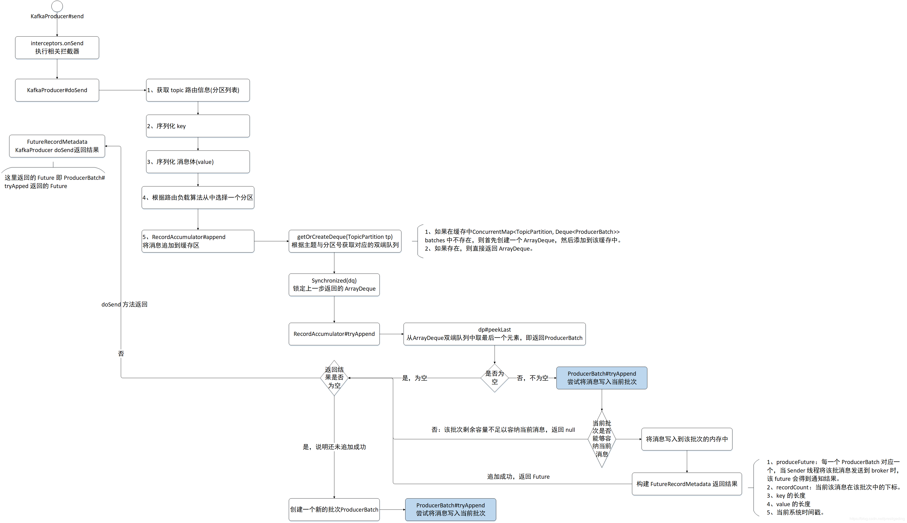


### [**1 生产者幂等性**](http://www.heartthinkdo.com/?p=2040)

[知乎：kafka 生产者和幂等](https://zhuanlan.zhihu.com/p/68743920)

#### 1.1 引入

幂等性引入目的：

- 生产者重复生产消息。生产者进行retry会产生重试时，会重复产生消息。有了幂等性之后，在进行retry重试时，只会生成一个消息。

#### **1.2 幂等性实现**

##### **1.2.1 PID 和 Sequence Number**

为了实现Producer的幂等性，Kafka引入了Producer ID（即PID）和Sequence Number。

- PID。每个新的Producer在初始化的时候会被分配一个唯一的PID，这个PID对用户是不可见的。
- Sequence Numbler。（对于每个PID，该Producer发送数据的每个<Topic, Partition>都对应一个从0开始单调递增的Sequence Number。

**Broker端在缓存中保存了这seq number，对于接收的每条消息，如果其序号比Broker缓存中序号大于1则接受它，否则将其丢弃。**这样就可以实现了消息重复提交了。<font color=red>但是，只能保证单个Producer对于同一个<Topic, Partition>的Exactly Once语义。不能保证同一个Producer一个topic不同的partion幂等。</font>  

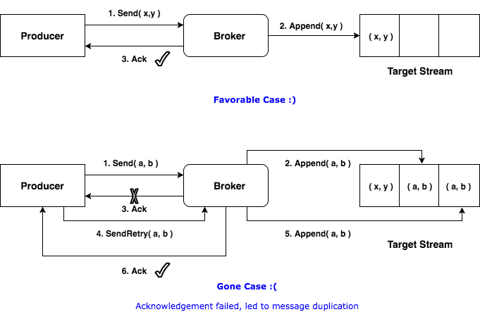


实现幂等之后


调用流程，新版有改动，仅作为参考

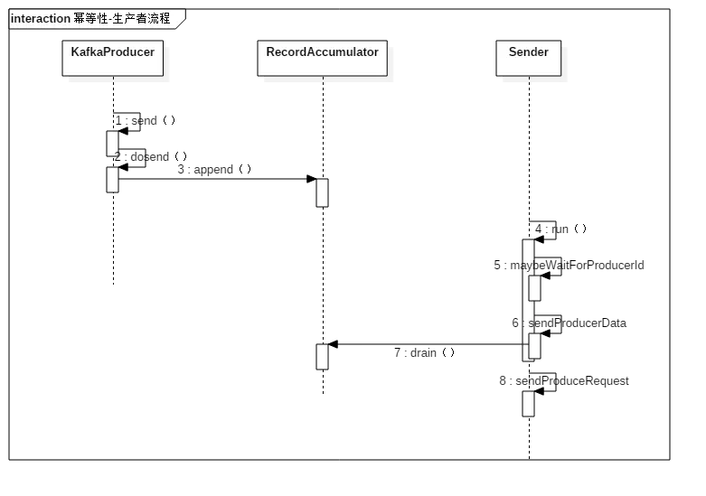

##### **1.2.2 生成PID的流程**

```
org.apache.kafka.clients.producer.internals.Sender#run
```


### 事务

事务属性是2017年Kafka0.11.0.0引入的新特性。Kafka事务是指一系列生产者与消费者提交偏移量的操作在一个事务中，或者说是原子性操作，要么同时成功要么同时失败。

#### 目的

在事务属性之前先引入了生产者幂等性，它的作用为：

- 生产者多次发送消息可以封装成一个原子操作，要么都成功，要么失败
- consumer-transform-producer模式下，因为消费者提交偏移量出现问题，导致在重复消费消息时，生产者重复生产消息。需要将这个模式下消费者提交偏移量操作和生成者一系列生成消息的操作封装成一个原子操作。

***消费者提交偏移量导致重复消费消息的场景\***：消费者在消费消息完成提交偏移量o2之前挂掉了（假设它最近提交的偏移量是o1），此时执行再均衡时，其它消费者会重复消费消息(o1到o2之间的消息）。

#### 相关属性配置

使用kafka的事务api时的一些注意事项：

- 需要消费者的自动模式设置为false,并且不能再手动的进行执行consumer#commitSync或者consumer#commitAsyc
- 生产者配置transaction.id属性
- 生产者不需要再配置enable.idempotence，因为如果配置了transaction.id，则此时enable.idempotence会被设置为true
- 消费者需要配置Isolation.level。在consume-trnasform-produce模式下使用事务时，必须设置为READ_COMMITTED。


### 负载均衡


### 消费者与partition关系

#### 消费者多于分区

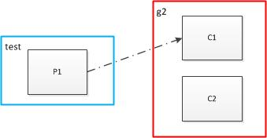

生产者消费者对应关系1.jpg


如上图，向test发送消息：1，2， 3，4，5，6，7，8，9
只有C1能接收到消息，C2则不能接收到消息，**即同一个partition内的消息只能被同一个组中的一个consumer消费。当消费者数量多于partition的数量时，多余的消费者空闲。**
**也就是说如果只有一个partition你在同一组启动多少个consumer都没用，partition的数量决定了此topic在同一组中被可被均衡的程度，例如partition=4，则可在同一组中被最多4个consumer均衡消费。**

#### 消费者少于分区

用图表示为：

 

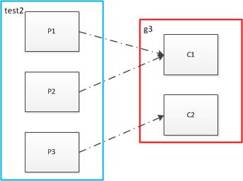

生产者消费者对应关系2.jpg


消费者数量2小于partition的数量3，此时，向test2发送消息1，2，3，4，5，6，7，8，9
C1接收到1，3，4，6，7，9
C2接收到2，5，8
**此时P1、P2对对应C1，即多个partition对应一个消费者，C1接收到消息量是C2的两倍**


## Kafka与Zookeeper关系

图片来源：[apache kafka系列之在zookeeper中存储结构](https://blog.csdn.net/lizhitao/article/details/23744675)  


## io


## 资源

1. [官方文档](http://kafka.apache.org/documentation/):原来是跟踪视频学，后来发现根本就是文档上的东西，所以文档最重要
2. [kafka大佬](https://www.cnblogs.com/huxi2b/p/11525660.html) 
3. [Oracle ORION模拟Database负载测试存储性能](http://blog.itpub.net/23135684/viewspace-1137724/)
4. [SATA SAS SSD 硬盘介绍和评测](https://www.cnblogs.com/qiri07/p/5818606.html)
5. [The C10K problem](http://www.kegel.com/c10k.html)
6. [ Projects: Linux scalability: Accept() scalability on Linux](http://www.citi.umich.edu/projects/linux-scalability/reports/accept.html)
7. [聊聊page cache与Kafka之间的事儿](https://www.jianshu.com/p/92f33aa0ff52)
8. [Kafka到底会不会丢消息](https://blog.csdn.net/wangyu2010302660001/article/details/105935318/?utm_medium=distribute.pc_relevant.none-task-blog-baidujs-1)
9. [Why do .index files exist in the kafka-log directory?](https://stackoverflow.com/questions/19394669/why-do-index-files-exist-in-the-kafka-log-directory)
10. [kafka 中到底是怎么通过 __consumer_offsets 存储消费位移的](https://blog.csdn.net/zhangman0702/article/details/84662272?utm_medium=distribute.pc_relevant.none-task-blog-BlogCommendFromMachineLearnPai2-2.nonecase&depth_1-utm_source=distribute.pc_relevant.none-task-blog-BlogCommendFromMachineLearnPai2-2.nonecase)
11. [Offset topic and consumer group coordinator of Kafka](http://wanwenli.com/kafka/2016/11/04/Kafka-Group-Coordinator.html) 
12. [CPU Cache 机制以及 Cache miss](https://www.cnblogs.com/jokerjason/p/10711022.html)


## 思考问题

1. [为什么Kafka那么快](https://mp.weixin.qq.com/s?__biz=MzIxMjAzMDA1MQ==&mid=2648945468&idx=1&sn=b622788361b384e152080b60e5ea69a7#%23)

   顺序读写、内存映射、零拷贝

2. kafka节点之间如何复制备份的？

   ack机制以及pull

3. kafka消息是否会丢失？为什么？

   ack机制与pagecache

4. kafka最合理的配置是什么？

5. kafka的leader选举机制是什么？

6. kafka对硬件的配置有什么要求？

7. kafka的消息保证有几种方式？

8. 为什么mysql不使用kafka的索引形式？

9. kafka是怎么实现顺序写磁盘的？

   > 平时使用java访问文件既可以是顺序的也可以是随机的，取决于你使用的Java API。比如RandomAccessFile和FileInputStream这样的stream类就是两种不同的方式。
   >
   > 具体到Kafka而言，它使用了基于日志结构(log-structured)的数据格式，即每个分区日志只能在尾部追加写入(append)，而不允许随机“跳到”某个位置开始写入，故此实现了顺序写入。
   >
   > 作者：huxihx
   > 链接：https://www.zhihu.com/question/63408317/answer/217909813

10. kafka怎么知道消费组的最后消费的offset

    goupid

    \_consumer\_offsets\_0至\_consumer\_offsets\_49

11. kafka选举

    * controller选举：zookeeper写入/controller节点信息的broker
    * partition leader选举：获取分区的ISR列表的节点信息，采用类似微软的

12. 

    * 

    


### 进阶问题

1. Kafka 生产者实现流程
   1. Producer 核心流程介绍
   2. Producer 初始化
   3. Producer 端元数据管理
   4. Producer 源码核心流程初探
   5. Producer 加载元数据
2. Kafka 生产者底层原理实现机制
   1. 分区选择
   2. RecordAccumulator 封装消息流程初探
   3. CopyOnWriteMap 数据结构使用
   4. 把数据写入对应批次（分段加锁）
   5. 内存池设计
   6. Sender 线程运行流程初探
   7. 一个 batchs 什么条件下可以发送？
   8. 筛选可以发送消息的 broker
3. Kafka 生产者底层实现原理
   1. Kafka 网络设计
   2. 如果网络没有建立会发送消息吗？
   3. Producer 终于与 Broker 建立连接了！
   4. 生产者终于可以发送请求了！
4. Kafka 生产者源码消息处理
   1. Producer是如何处理粘包、拆包问题的？
   2. 如何处理暂存状态的响应消息？
   3. 如何处理响应消息？
   4. 消息发送完以后内存如何处理？
   5. 消息有异常是如何处理的？
   6. 如何处理超时的批次？
   7. 如何处理长时间没收到响应的消息？