# linux内核架构及管理

## 目录结构

> 为了避免诸多使用者对 Linux 系统目录结构天马行空，Linux 基金会发布了 FHS 标准。多数 Linux 发行版系统都遵循这一标准。
>
> FHS（Filesystem Hierarchy Standard），文件系统层次化标准，该标准规定了 Linux 系统中所有一级目录以及部分二级目录（/usr 和 /var）的用途。发布此标准的主要目的就是为了让用户清楚地了解每个目录应该存放什么类型的文件。

### /bin

* 包含了用于系统启动的二进制文件，以及系统启动后用户操作所可能用的的文件
* 比如，基本命令行程序，比如bash shell，工具如dd、grep、mount
* bin是Binary的缩写, 这个目录存放着最经常使用的命令。
* MX Linux中实际就是指向/usr/bin的链接

### /sbin

* s就是Super User的意思，这里存放的是系统管理员使用的系统管理程序。
* 实际指向/usr/sbin
* 比如ifconfig、

### /boot

* 存放linux系统启动文件，比如linux内核、grub加载器
* 这里存放的是启动Linux时使用的一些核心文件，包括一些连接文件以及镜像文件。
* /boot/ 目录也不能保存额外数据，因为 /boot/ 目录会单独分区作为启动分区，如果没有空闲空间，则会导致系统不能正常启动。
* 普通用户不能修改这里的文件

```
[root@localhost ~]#ls /boot/
config-2.6.32-279.el6.i686
#内核的配置文件，内核编译时选择的功能与模块
efi
#可扩展固件接口，为英特尔为全新PC固件的体系结构、接口和服务提出的建议标准
grub
#启动引导程GTUB的数据目录
initramfe-2.6.32-279.el6.i686.img
#虚拟文件系统（CentOS 6.x 中用initramfs替代了initrd,但功能是一样的）
lost+found
故boot分区的备份目录
symvers-2_6.32-279.el6.i686.gz
#模块符号信息
System.map-2.6.32-279.el6.i686
#内核功能和内存地址的对应列表
vmlinuz-2.6.32-279.el6.i686
#用于启动的Linux内核。这个文件是一个压缩的内核镜像
```


### /dev

* 存放特定的文件用于连接各种IO设备
* 这里的文件不能被user直接访问，除了使用mount命令
* dev是Device(设备)的缩写, 该目录下存放的是Linux的外部设备，在Linux中访问设备的方式和访问文件的方式是相同的。
* linux系统一切皆文件，因此系统上任何设备都以文件的形式存放在该目录下。

### * /etc :Editable Text Configuration

* 包含系统及程序的配置文件

* 这个目录用来存放所有的系统管理所需要的配置文件和子目录。

* inux下/etc为系统配置文件目录，该目录包含系统启动脚本、答启动配置文件、用户登陆配置文件、网络配置文件、httpd 配置文件、IPSec 配置文件和其他文件等

  

### /home

* 用户的个人目录，如果有多个用户则每个用户都有自己独立的子目录。用户不能访问其他用户的home目录（除了root）。
* 隐藏文件以.开头，使用CTRL+H，控制隐藏文件的显示和隐藏。

### /lib

* 包含共享的类库文件，kernel module存放在/lib/modules

* 这个目录里存放着系统最基本的动态连接共享库，其作用类似于Windows里的DLL文件。几乎所有的应用程序都需要用到这些共享库。

* 普通用户不能修改这个目录的文件

* 实际是指向:/usr/lib

* > Linux 会把不重要的功能编译成内核模块，在需要时再调用，从而保证了内核不会过大。在多数 Linux 中，都会把硬件的驱动程序编译为模块， 这些模块保存在 /lib/modules 目录中。常见的 USB、SATA 和 SCSI 等硬盘设备的驱动，还有一些特殊的文件系统（如 LVM、RAID 等）的驱动，都是以模块的方式来保存的。

### /mnt

* 物理存储设备必须挂载在这里才能被访问。当物理设备在文件/etc/fstab中定义后，设备的文件系统机会挂载在这里
* 系统提供该目录是为了让用户临时挂载别的文件系统的，我们可以将光驱挂载在/mnt/上，然后进入该目录就可以查看光驱里的内容了。

### /opt

* 目的是用于第三方应用程序的安装目录
* 比如按照谷歌地图

### * /proc:虚拟文件系统

* 存放系统及进程的信息

* 这个目录是一个虚拟的目录，它是系统内存的映射，我们可以通过直接访问这个目录来获取系统信息。
  这个目录的内容不在硬盘上而是在内存里，我们也可以直接修改里面的某些文件，比如可以通过下面的命令来屏蔽主机的ping命令，使别人无法ping你的机器：

* > 虚拟文件系统。该目录中的数据并不保存在硬盘上，而是保存到内存中。主要保存系统的内核、进程、外部设备状态和网络状态等。如 /proc/cpuinfo 是保存 CPU 信息的，/proc/devices 是保存设备驱动的列表的，/proc/filesystems 是保存文件系统列表的，/proc/net 是保存网络协议信息的......

### /usr :Unix Software Resource

* 用户的应用程序目录，类似与program files
* /usr/bin：普通用户的命令/脚本
* /usr/sbin：root用户的命令
* /usr/src：内核源码
* /usr/lib：系统类库文件
* /usr/include: 存放c/c++等程序语言的头文件和包含文件。
* /usr/local: 系统管理员自行安装的软件的默认放置目录。
* /usr/share: 存放共享文件的目录，常用的子目录如下：
  /usr/share/doc: 软件文件说明。
  /usr/share/man: 在线帮助文档。

| 子目录       | 功能（作用）                                                 |
| ------------ | ------------------------------------------------------------ |
| /usr/bin/    | 存放系统命令，普通用户和超级用户都可以执行。这些命令和系统启动无关，在单用户模式下不能执行 |
| /usr/sbin/   | 存放根文件系统不必要的系统管理命令，如多数服务程序，只有 root 可以使用。 |
| /usr/lib/    | 应用程序调用的函数库保存位置                                 |
| /usr/XllR6/  | 图形界面系统保存位置                                         |
| /usr/local/  | 手工安装的软件保存位置。我们一般建议源码包软件安装在这个位置 |
| /usr/share/  | 应用程序的资源文件保存位置，如帮助文档、说明文档和字体目录   |
| /usr/src/    | 源码包保存位置。我们手工下载的源码包和内核源码包都可以保存到这里。不过笔者更习惯把手工下载的源码包保存到 /usr/local/src/ 目录中，把内核源码保存到 /usr/src/linux/ 目录中 |
| /usr/include | C/[C++](http://c.biancheng.net/cplus/) 等编程语言头文件的放置目录 |

### /var

/var 目录用于存储动态数据，例如缓存、日志文件、软件运行过程中产生的文件等。通常，此目录下建议包含如表 4 所示的这些子目录。

| /var子目录        | 功能（作用）                                                 |
| ----------------- | ------------------------------------------------------------ |
| /var/lib/         | 程序运行中需要调用或改变的数据保存位置。如 [MySQL](http://c.biancheng.net/mysql/) 的数据库保存在 /var/lib/mysql/ 目录中 |
| /var/log/         | 登陆文件放置的目录，其中所包含比较重要的文件如 /var/log/messages, /var/log/wtmp 等。 |
| /var/run/         | 一些服务和程序运行后，它们的 PID（进程 ID）保存位置          |
| /var/spool/       | 里面主要都是一些临时存放，随时会被用户所调用的数据，例如 /var/spool/mail/ 存放新收到的邮件，/var/spool/cron/ 存放系统定时任务。 |
| /var/www/         | RPM 包安装的 Apache 的网页主目录                             |
| /var/nis和/var/yp | NIS 服务机制所使用的目录，nis 主要记录所有网络中每一个 client 的连接信息；yp 是 linux 的 nis 服务的日志文件存放的目录 |
| /var/tmp          | 一些应用程序在安装或执行时，需要在重启后使用的某些文件，此目录能将该类文件暂时存放起来，完成后再行删除 |

### /sys

 这是linux2.6内核的一个很大的变化。该目录下安装了2.6内核中新出现的一个文件系统 sysfs 。

sysfs文件系统集成了下面3种文件系统的信息：针对进程信息的proc文件系统、针对设备的devfs文件系统以及针对伪终端的devpts文件系统。

该文件系统是内核设备树的一个直观反映。

当一个内核对象被创建的时候，对应的文件和目录也在内核对象子系统中被创建。

主要放置内核检测到的设备硬件信息。

### /srv：

系统服务数据文件，主要放置系统的某些服务启动后，这些服务所需要取数据的目录。如：FTP，www等。


## [内存管理](https://www.kernel.org/doc/html/latest/admin-guide/mm/index.html)

> # Memory Management
>
> Linux memory management subsystem is responsible, as the name implies, for managing the memory in the system. This includes implemnetation of virtual memory and demand paging, memory allocation both for kernel internal structures and user space programms, mapping of files into processes address space and many other cool things.
>
> Linux memory management is a complex system with many configurable settings. Most of these settings are available via `/proc` filesystem and can be quired and adjusted using `sysctl`. These APIs are described in Documentation/admin-guide/sysctl/vm.rst and in [man 5 proc](http://man7.org/linux/man-pages/man5/proc.5.html).
>
> Linux memory management has its own jargon and if you are not yet familiar with it, consider reading [Documentation/admin-guide/mm/concepts.rst](https://www.kernel.org/doc/html/latest/admin-guide/mm/concepts.html#mm-concepts).

linux内存管理子系统，正如名字所言，是用于管理系统中的内存的。这包括实现虚拟内存(vistual memory)和“按需调页”(demand―paging),内存加载（包括内核中内部结构以及用户空间程序），映射文件到进程地址空间等

linux内存管理系统是一个复杂的系统，有着许多可配置的设置。大部分设置可以通过`/proc`文件夹查看，并且可以通过`sysctl`调整，这些Api都在`Documentation/admin-guide/sysctl/vm.rst`中有描述，或者使用`man 5 proc ` 命令查询

linux内存管理 系统有自己的术语，如果你还不熟悉，可以考虑阅读[Documentation/admin-guide/mm/concepts.rst](https://www.kernel.org/doc/html/latest/admin-guide/mm/concepts.html#mm-concepts).

### 概念总述

> The memory management in Linux is a complex system that evolved over the years and included more and more functionality to support a variety of systems from MMU-less microcontrollers to supercomputers. The memory management for systems without an MMU is called `nommu` and it definitely deserves a dedicated document, which hopefully will be eventually written. Yet, although some of the concepts are the same, here we assume that an MMU is available and a CPU can translate a virtual address to a physical address.

Linux内存管理是一个复杂的系统，并且随着时间的推移，提供来了越来越多的功能支持从无MMU(memory manager unit)内存管理单元的微控制器到超级计算机的各种各样的系统。没有MMU的系统成为`nommu`并且它绝对值得一个专门的文档。但是，尽管很多概念一样，这里我们假设我们的设备提供了MMU并且CPU能转译一个虚拟地址到物理地址

> 主要放置开机时会调用的库，以及执行/bin,/sbin目录下的命令时所用到的库文件。Virtual Memory Primer
> Huge Pages（大页）
> Zones
> Nodes
> Page cache（页高速缓存）
> Anonymous Memory
> Reclaim
> Compaction
> OOM killer

###  Virtual Memory Primer

> he physical memory in a computer system is a limited resource and even for systems that support memory hotplug there is a hard limit on the amount of memory that can be installed. The physical memory is not necessarily contiguous; it might be accessible as a set of distinct address ranges. Besides, different CPU architectures, and even different implementations of the same architecture have different views of how these address ranges are defined.
>
> All this makes dealing directly with physical memory quite complex and to avoid this complexity a concept of virtual memory was developed.
>
> The virtual memory abstracts the details of physical memory from the application software, allows to keep only needed information in the physical memory (demand paging) and provides a mechanism for the protection and controlled sharing of data between processes.
>
> With virtual memory, each and every memory access uses a virtual address. When the CPU decodes the an instruction that reads (or writes) from (or to) the system memory, it translates the virtual address encoded in that instruction to a physical address that the memory controller can understand.
>
> The physical system memory is divided into page frames, or pages. The size of each page is architecture specific. Some architectures allow selection of the page size from several supported values; this selection is performed at the kernel build time by setting an appropriate kernel configuration option.
>
> Each physical memory page can be mapped as one or more virtual pages. These mappings are described by page tables that allow translation from a virtual address used by programs to the physical memory address. The page tables are organized hierarchically.
>
> The tables at the lowest level of the hierarchy contain physical addresses of actual pages used by the software. The tables at higher levels contain physical addresses of the pages belonging to the lower levels. The pointer to the top level page table resides in a register. When the CPU performs the address translation, it uses this register to access the top level page table. The high bits of the virtual address are used to index an entry in the top level page table. That entry is then used to access the next level in the hierarchy with the next bits of the virtual address as the index to that level page table. The lowest bits in the virtual address define the offset inside the actual page. 

计算机系统中物理内存是一个有限的资源，即使对于那些支持热插拔的系统在可以安装的内存数量上也存在硬性限制。物理内存是没有必要连续的，他可以通过一系列的不同的地址范围访问。除此之外，不同的CPU架构，甚至相同CPU架构的不同实现对于内存地址定义都有不同的做法。

这些导致直接处理物理内存十分复杂，为了避免这些复杂性，开发了一个**虚拟内存（virtual memory）**的概念

虚拟内存从应用程序中抽象出物理内存的细节，允许只有必须的信息才保留在**物理内存中（demand paging按需分页）**，提供一种保护机制以及控制进程之间共享数据。

有了虚拟内存，每个内存访问都要使用虚拟地址。当CPU解码一个从系统内存中读取（写入）的指令，它将转译虚拟地址为内存控制器（memory controller）能理解的物理地址。

物理系统内存被分隔为**page frame（页帧）**或者 **页（pages）**。页的大小取决于特定的架构。一些架构允许从几个支持的值中选取为页的大小，这种选择是在内存构建时通过恰当的内存配置选项设置的。

每个物理内存页能够被映射到一个或多个虚拟页。这种映射通过**页表（page table）**描述。它允许通过程序转换一个虚拟地址到一个物理内存地址。页表是有层级关系的。

在层级最底层的页表包含了软件使用的真**实页（actual page）**的物理地址。在更高层级的页表包含了底层级的**页（page）**的物理地址。指针指向最高层级的页表保存在**寄存器中（register）**。当一个cpu指向地址转译，它使用这个寄存器取访问最高级别的页表。虚拟 地址的高位被用于索引最高层级页表的入口，下一段字节（next bits）用于进入下一个层级的页表，虚拟地址的最低位定义了真实页的偏移量（offset）

> LINUX内核使用了“多层调页（multi-level paging）技术”来达到这一目的。这里的多级指的是;PGD(Page Global Directory,页总目录） + PMD（页中目录）+PTE（页表索引）+ OFFSET(页面内部偏移).

### [Huge Pages](https://www.kernel.org/doc/html/latest/admin-guide/mm/concepts.html#id2)

> The address translation requires several memory accesses and memory accesses are slow relatively to CPU speed. To avoid spending precious processor cycles on the address translation, CPUs maintain a cache of such translations called Translation Lookaside Buffer (or TLB). Usually TLB is pretty scarce resource and applications with large memory working set will experience performance hit because of TLB misses.
>
> Many modern CPU architectures allow mapping of the memory pages directly by the higher levels in the page table. For instance, on x86, it is possible to map 2M and even 1G pages using entries in the second and the third level page tables. In Linux such pages are called huge. Usage of huge pages significantly reduces pressure on TLB, improves TLB hit-rate and thus improves overall system performance.
>
> There are two mechanisms in Linux that enable mapping of the physical memory with the huge pages. The first one is HugeTLB filesystem, or hugetlbfs. It is a pseudo filesystem that uses RAM as its backing store. For the files created in this filesystem the data resides in the memory and mapped using huge pages. The hugetlbfs is described at [Documentation/admin-guide/mm/hugetlbpage.rst](https://www.kernel.org/doc/html/latest/admin-guide/mm/hugetlbpage.html#hugetlbpage).
>
> Another, more recent, mechanism that enables use of the huge pages is called Transparent HugePages, or THP. Unlike the hugetlbfs that requires users and/or system administrators to configure what parts of the system memory should and can be mapped by the huge pages, THP manages such mappings transparently to the user and hence the name. See [Documentation/admin-guide/mm/transhuge.rst](https://www.kernel.org/doc/html/latest/admin-guide/mm/transhuge.html#admin-guide-transhuge) for more details about THP.

地址转换需要访问几次内存，并且访问内存是慢于CPU速度的。为了避免在转换地址上花费昂贵的处理器周期，CPU维护一个这些地址转换的缓存，称之为Translation LookAside Buffer（旁路转换缓冲,或称为页表缓冲），通常TLB是十分稀有的资源，需要大内存工作的应用程序由于缺少TLB，其性能将受到冲击。

很多现代化的CPU架构允许通过高层级的 **页表** 直接映射内存页。比如，在X86，有可能使用第二或者第三层级的页表映射2M甚至1G的page页。在linux中，这些页称为huge。使用**huge page（大页）**减少了TLB的压力，提高了TLB冲击的命中率，也因此提高了整个系统的性能。

在Linux中，有两种机制能够映射物理内存到Huge pages(大页)。第一种是HugeTLB文件系统，或称为HugeTLBfs。这是一个伪文件系统，使用RAM作为底层存储。对于那些在这个 文件 系统中创建的文件来说，数据保留在内存中，并使用huge page(大表)映射。

另一种机制称为Transparent HugePages 或者THP。不同于hugetlbfs需要用户或系统管理员来配置那部分的系统内存应该被huge page所映射，THP通过对用户透明的方式来管理映射。

### [Zones](https://www.kernel.org/doc/html/latest/admin-guide/mm/concepts.html#id3)

> Often hardware poses restrictions on how different physical memory ranges can be accessed. In some cases, devices cannot perform DMA to all the addressable memory. In other cases, the size of the physical memory exceeds the maximal addressable size of virtual memory and special actions are required to access portions of the memory. Linux groups memory pages into zones according to their possible usage. For example, ZONE_DMA will contain memory that can be used by devices for DMA, ZONE_HIGHMEM will contain memory that is not permanently mapped into kernel’s address space and ZONE_NORMAL will contain normally addressed pages.
>
> The actual layout of the memory zones is hardware dependent as not all architectures define all zones, and requirements for DMA are different for different platforms.

通常硬件限制了多大的物理内存范围能被访问。在这种情况，设备不能执行DMA在所有可寻址的内存上。另一种情况，物理内存的大小超过了虚拟内存的最大可寻址值，需要特殊的操作来访问某部分内存。linux根据它们可能的使用情况进行分组。比如，ZONE_DMA将包含被DMA设备所使用的内存，ZONE_HIGHMEN将包含不是永久映射到  内核地址控制的内存，ZONE_NORMAL将包含正常的地址页（addressed pages）

内存空间的真实布局是取决于硬件的，因为并不是所有的架构都定义了所有空间，并且每个平台对DMA的要求都不一样的。

### [Nodes](https://www.kernel.org/doc/html/latest/admin-guide/mm/concepts.html#id4)

> Many multi-processor machines are NUMA - Non-Uniform Memory Access - systems. In such systems the memory is arranged into banks that have different access latency depending on the “distance” from the processor. Each bank is referred to as a node and for each node Linux constructs an independent memory management subsystem. A node has its own set of zones, lists of free and used pages and various statistics counters. You can find more details about NUMA in [Documentation/vm/numa.rst](https://www.kernel.org/doc/html/latest/vm/numa.html#numa) and in [Documentation/admin-guide/mm/numa_memory_policy.rst](https://www.kernel.org/doc/html/latest/admin-guide/mm/numa_memory_policy.html#numa-memory-policy).

多核处理器的设备都是NUMA(Non-Uniform-Menory-Access)非统一内存访问系统。在这样的系统，内存都被排成队列（banks）,这样由于与处理器的距离不同就会造成不同的访问延迟。每个队列可被认为是一个节点，linux为每个节点构建一个独立的内存管理子系统。一个节点有自己的空间集，使用与未使用的页的列表，各种静态计数。

### [Page cache](https://www.kernel.org/doc/html/latest/admin-guide/mm/concepts.html#id5) 页高速缓存

> The physical memory is volatile and the common case for getting data into the memory is to read it from files. Whenever a file is read, the data is put into the page cache to avoid expensive disk access on the subsequent reads. Similarly, when one writes to a file, the data is placed in the page cache and eventually gets into the backing storage device. The written pages are marked as dirty and when Linux decides to reuse them for other purposes, it makes sure to synchronize the file contents on the device with the updated data.

各种物理内存都是易变的（volatile），往内存写数据最普通的列子就是读取文件的数据。一旦文件被读取，数据被加载在page cache（页高速缓存）以避免在后续的读取中再次花费昂贵的硬盘访问。类似的，当写数据到文件时，数据将放在page cache并最终写入到存储设备。已写的page被标记为脏，当linux决定重新使用这些page时，它会确保使用更新的数据同步到文件中。

### [Anonymous Memory](https://www.kernel.org/doc/html/latest/admin-guide/mm/concepts.html#id6) 匿名内存

> The anonymous memory or anonymous mappings represent memory that is not backed by a filesystem. Such mappings are implicitly created for program’s stack and heap or by explicit calls to mmap(2) system call. Usually, the anonymous mappings only define virtual memory areas that the program is allowed to access. The read accesses will result in creation of a page table entry that references a special physical page filled with zeroes. When the program performs a write, a regular physical page will be allocated to hold the written data. The page will be marked dirty and if the kernel decides to repurpose it, the dirty page will be swapped out.

匿名内存或者匿名映射代表这部分内存没有被文件系统返回。这些映射是通过显示调用mmap(2)系统调用为应用程序的栈或堆所创建的。通常，匿名映射只定义虚拟内存区域（程序允许访问的区域）。读 访问会导致创建一个页表条目，该条目指向一个被0填充的特殊页。当程序执行写操作，一个规则的物理page将被分配来填充被写入的数据。页会被标记为脏，如果内核决定要重新使用它，这些dirty page（脏页）会被换出（swap out）

### [Reclaim](https://www.kernel.org/doc/html/latest/admin-guide/mm/concepts.html#id7) 回收

> Throughout the system lifetime, a physical page can be used for storing different types of data. It can be kernel internal data structures, DMA’able buffers for device drivers use, data read from a filesystem, memory allocated by user space processes etc.
>
> Depending on the page usage it is treated differently by the Linux memory management. The pages that can be freed at any time, either because they cache the data available elsewhere, for instance, on a hard disk, or because they can be swapped out, again, to the hard disk, are called reclaimable. The most notable categories of the reclaimable pages are page cache and anonymous memory.
>
> In most cases, the pages holding internal kernel data and used as DMA buffers cannot be repurposed, and they remain pinned until freed by their user. Such pages are called unreclaimable. However, in certain circumstances, even pages occupied with kernel data structures can be reclaimed. For instance, in-memory caches of filesystem metadata can be re-read from the storage device and therefore it is possible to discard them from the main memory when system is under memory pressure.
>
> The process of freeing the reclaimable physical memory pages and repurposing them is called (surprise!) reclaim. Linux can reclaim pages either asynchronously or synchronously, depending on the state of the system. When the system is not loaded, most of the memory is free and allocation requests will be satisfied immediately from the free pages supply. As the load increases, the amount of the free pages goes down and when it reaches a certain threshold (high watermark), an allocation request will awaken the `kswapd` daemon. It will asynchronously scan memory pages and either just free them if the data they contain is available elsewhere, or evict to the backing storage device (remember those dirty pages?). As memory usage increases even more and reaches another threshold - min watermark - an allocation will trigger direct reclaim. In this case allocation is stalled until enough memory pages are reclaimed to satisfy the request.

在整个系统生命周期中，可以使用物理页面存储不同类型的数据。它可以是内核内部的数据结构，为设备驱动程序使用的DMA 缓冲区，从文件系统读取的数据，由用户空间进程分配的内存等等。

### [Compaction](https://www.kernel.org/doc/html/latest/admin-guide/mm/concepts.html#id8) 压缩

> As the system runs, tasks allocate and free the memory and it becomes fragmented. Although with virtual memory it is possible to present scattered physical pages as virtually contiguous range, sometimes it is necessary to allocate large physically contiguous memory areas. Such need may arise, for instance, when a device driver requires a large buffer for DMA, or when THP allocates a huge page. Memory compaction addresses the fragmentation issue. This mechanism moves occupied pages from the lower part of a memory zone to free pages in the upper part of the zone. When a compaction scan is finished free pages are grouped together at the beginning of the zone and allocations of large physically contiguous areas become possible.
>
> Like reclaim, the compaction may happen asynchronously in the `kcompactd` daemon or synchronously as a result of a memory allocation request.

### [OOM killer](https://www.kernel.org/doc/html/latest/admin-guide/mm/concepts.html#id9)


### 资料

1. [Linux分页机制之概述--Linux内存管理(六)](https://blog.csdn.net/gatieme/article/details/52402861?utm_medium=distribute.pc_relevant.none-task-blog-BlogCommendFromMachineLearnPai2-1.nonecase&depth_1-utm_source=distribute.pc_relevant.none-task-blog-BlogCommendFromMachineLearnPai2-1.nonecase)
2. [Linux传统Huge Pages与Transparent Huge Pages再次学习总结](https://www.cnblogs.com/kerrycode/p/7760026.html) 

## 进程管理

### 资料

1.[进程切换分析TLB管理](http://www.wowotech.net/process_management/context-switch-tlb.html)

# linux命令

## 1. 查看debian系统版本

```
cat /proc/version
uname -a
lsb_release -a
```

## 2.uesermod修改用户模式

```
选项：
  -c, --comment 注释            GECOS 字段的新值
  -d, --home HOME_DIR           用户的新主目录,修改用户登入时的目录，例如一般的用户登录时，默认进入预先设定的主目录，某些时候为了方便登录时就需要进入比较复杂的路径时，可以使用这个选项设置进入时目录。
  -e, --expiredate EXPIRE_DATE  设定帐户过期的日期为 EXPIRE_DATE
  -f, --inactive INACTIVE       过期 INACTIVE 天数后，设定密码为失效状态
  -g, --gid GROUP               强制使用 GROUP 为新主组
  -G, --groups GROUPS           新的附加组列表 GROUPS,在改变用户sudo权限时就可以使用这个选项。
  -a, --append GROUP            将用户追加至上边 -G 中提到的附加组中，  仅和-G一块使用，将用户添加到附属组群。
                                并不从其它组中删除此用户
  -h, --help                    显示此帮助信息并推出
  -l, --login LOGIN             新的登录名称
  -L, --lock                    锁定用户帐号
  -m, --move-home               将家目录内容移至新位置 (仅于 -d 一起使用)
  -o, --non-unique              允许使用重复的(非唯一的) UID
  -p, --password PASSWORD       将加密过的密码 (PASSWORD) 设为新密码
  -R, --root CHROOT_DIR         chroot 到的目录
  -s, --shell SHELL             该用户帐号的新登录 shell
  -u, --uid UID                 用户帐号的新 UID
  -U, --unlock                  解锁用户帐号
  -v, --add-subuids FIRST-LAST  add range of subordinate uids
  -V, --del-subuids FIRST-LAST  remove range of subordinate uids
  -w, --add-subgids FIRST-LAST  add range of subordinate gids
  -W, --del-subgids FIRST-LAST  remove range of subordinate gids
  -Z, --selinux-user  SEUSER       用户账户的新 SELinux 用户映射

```

## 3.systemctl


emd 是 Linux 下的一款系统和服务管理器，兼容 SysV 和 LSB 的启动脚本。systemd 的特性有：支持并行化任务；同时采用 socket 式与 D-Bus 总线式激活服务；按需启动守护进程（daemon）；利用 Linux 的 cgroups 监视进程；支持快照和系统恢复；维护挂载点和自动挂载点；各服务间基于依赖关系进行精密控制。

| 任务                   | 旧指令                        | 新指令                                                       |
| ---------------------- | :---------------------------- | ------------------------------------------------------------ |
| 使某服务自动启动       | chkconfig --level 3 httpd on  | systemctl enable httpd.service                               |
| 使某服务不自动启动     | chkconfig --level 3 httpd off | systemctl disable httpd.service                              |
| 检查服务状态           | service httpd status          | systemctl status httpd.service （服务详细信息） systemctl is-enabled httpd.service （仅显示是否 Active) |
| 显示所有已启动的服务   | chkconfig --list              | systemctl list-units --type=service                          |
| 启动某服务             | service httpd start           | systemctl start httpd.service                                |
| 停止某服务             | service httpd stop            | systemctl stop httpd.service                                 |
| 重启某服务             | service httpd restart         | systemctl restart httpd.service                              |
| 某服务重新加载配置文件 | service httpd reload          | systemctl reload httpd.service                               |

```
# systemctl				#输出已激活单元

# systemctl list-units		#输出已激活单元

# systemctl --failed			#输出运行失败的单元

# systemctl list-unit-files		#查看所有已安装服务

# systemctl start nginx		#启动nginx

# systemctl stop nginx		#停止nginx

# systemctl restart nginx		#重启nginx

# systemctl reload nginx		#重新加载nginx配置

# systemctl status nginx		#输出nginx运行状态

# systemctl is-enabled nginx	#检查nginx是否配置为自动启动

# systemctl enable nginx		#开机自动启动nginx

# systemctl disable nginx		#取消开机自动启动nginx

# systemctl help nginx		#显示nginx的手册页

# systemctl daemon-reload		#重新载入 systemd，扫描新的或有变动的单元

# systemctl reboot			#重启

# systemctl poweroff			#退出系统并停止电源

# systemctl suspend			#待机

# systemctl hibernate		#休眠

# systemctl hybrid-sleep		#混合休眠模式（同时休眠到硬盘并待机

# systemctl isolate graphical.target	#等价于telinit 3 或 telinit 5
```

## 4.chkconfig

Linux chkconfig命令用于检查，设置系统的各种服务。

```shell
chkconfig [--add][--del][--list][系统服务] 或 chkconfig [--level <等级代号>][系统服务][on/off/reset]
```


## top命令

### 执行top后显示图


### 列表缩写释意

> 最右边的 `COMMAND` 一列报告进程名（启动它们的命令）。在这个例子里，进程名是 `bash`（一个我们正在运行 `top` 的命令解释器）、`flask`（一个 Python 写的 web 框架）和 `top` 自身。
>
> 其它列提供了关于进程的有用信息：
>
> - `PID`：进程 ID，一个用来定位进程的唯一标识符
> - `USER`：运行进程的用户
> - `PR`：任务的优先级
> - `NI`：Nice 值，优先级的一个更好的表现形式
> - `VIRT`：虚拟内存的大小，单位是 KiB（kibibytes）
> - `RES`：常驻内存大小，单位是 KiB（物理内存和虚拟内存的一部分）
> - `SHR`：共享内存大小，单位是 KiB（共享内存和虚拟内存的一部分）
> - `S`：进程状态，一般 **I** 代表空闲，**R** 代表运行，**S** 代表休眠，**Z** 代表僵尸进程，**T** 或 **t** 代表停止（还有其它更少见的选项）
> - `%CPU`：自从上次屏幕更新后的 CPU 使用率
> - `%MEM`：自从上次屏幕更新后的 `RES` 常驻内存使用率
> - `TIME+`：自从程序启动后总的 CPU 使用时间
> - `COMMAND`：启动命令，如之前描述那样
>
> 确切知道 `VIRT`，`RES` 和 `SHR` 值代表什么在日常操作中并不重要。重要的是要知道 `VIRT` 值最高的进程就是内存使用最多的进程。当你在用 `top` 排查为什么你的电脑运行无比卡的时候，那个 `VIRT` 数值最大的进程就是元凶。如果你想要知道共享内存和物理内存的确切意思，请查阅 [top 手册](http://man7.org/linux/man-pages/man1/top.1.html)的 Linux Memory Types 段落。
>
> 是的，我说的是 kibibytes 而不是 kilobytes。通常称为 kilobyte 的 1024 值实际上是 kibibyte。希腊语的 kilo（χίλιοι）意思是一千（例如一千米是 1000 米，一千克是 1000 克）。Kibi 是 kilo 和 binary 的合成词，意思是 1024 字节（或者 210 ）。但是，因为这个词很难说，所以很多人在说 1024 字节的时候会说 kilobyte。`top` 试图在这里使用恰当的术语，所以按它说的理解就好。

### top头部信息说明

第一行包含系统的大致信息：

- `top`：我们正在运行 `top`！你好！`top`！
- `XX:YY:XX`：当前时间，每次屏幕更新的时候更新
- `up`（接下去是 `X day, YY:ZZ`）：系统的 [uptime](https://en.wikipedia.org/wiki/Uptime)，或者自从系统启动后已经过去了多长时间
- `load average`（后跟三个数字）：分别是过去一分钟、五分钟、15 分钟的[系统负载](https://en.wikipedia.org/wiki/Load_(computing))

第二行（`Task`）显示了正在运行的任务的信息，不用解释。它显示了进程总数和正在运行的、休眠中的、停止的进程数和僵尸进程数。这实际上是上述 `S`（状态）列的总和。

第三行（`%Cpu(s)`）显示了按类型划分的 CPU 使用情况。数据是屏幕刷新之间的值。这些值是：

- `us`：用户进程
- `sy`：系统进程
- `ni`：[nice](https://en.wikipedia.org/wiki/Nice_(Unix)#Etymology) 用户进程
- `id`：CPU 的空闲时间，这个值比较高时说明系统比较空闲
- `wa`：等待时间，或者消耗在等待 I/O 完成的时间
- `hi`：消耗在硬件中断的时间
- `si`：消耗在软件中断的时间
- `st`：“虚拟机管理程序从该虚拟机窃取的时间”

你可以通过点击 `t`（toggle）来展开或折叠 `Task` 和 `%Cpu(s)` 行。

第四行（`Kib Mem`）和第五行（`KiB Swap`）提供了内存和交换空间的信息。这些数值是：

- 总内存容量
- 已用内存
- 空闲内存
- 内存的缓冲值
- 交换空间的缓存值

默认它们是用 KiB 为单位展示的，但是按下 `E`（扩展内存缩放 extend memory scaling）可以轮换不同的单位：KiB、MiB、GiB、TiB、PiB、EiB（kilobytes、megabytes、gigabytes、terabytes、petabytes 和 exabytes）

`top` 用户手册有更多选项和配置项信息。你可以运行 `man top` 来查看你系统上的文档。还有很多 [HTML 版的 man 手册](http://man7.org/linux/man-pages/man1/top.1.html)，但是请留意，这些手册可能是针对不同 top 版本的。

### 辅助命令用法

按下 `h` 调用帮助界面，该界面也显示了默认延迟（屏幕更新的时间间隔）。这个值默认（大约）是 3 秒，但你可以输入 `d`（大概是 delay 的意思）或者 `s`（可能是 screen 或 seconds 的意思）来修改它。显示如下

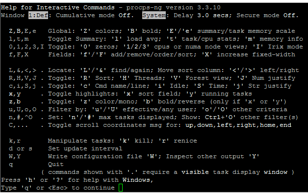

> 按数字1就可以显示每核CPU的使用情况
>
> Z ：高亮
>
> B：加粗
>
> 

### 数据从何而来

那么数据从何而来？ `/proc`目录是一个虚拟目录，存储的是当前内核的一系列特殊文件，你不仅能查看一些状态，甚至能修改一些值来改变系统的行为。

比如top的load （使用uptime命令得到同样的结果）。读取的就是 `/proc/loadavg` 文件 而每核cpu的信息，读取 `/proc/stat`文件

这些命令，是对/proc目录中一系列信息的解析和友好的展示，这些值，Linux内核都算好了躺在那呢。

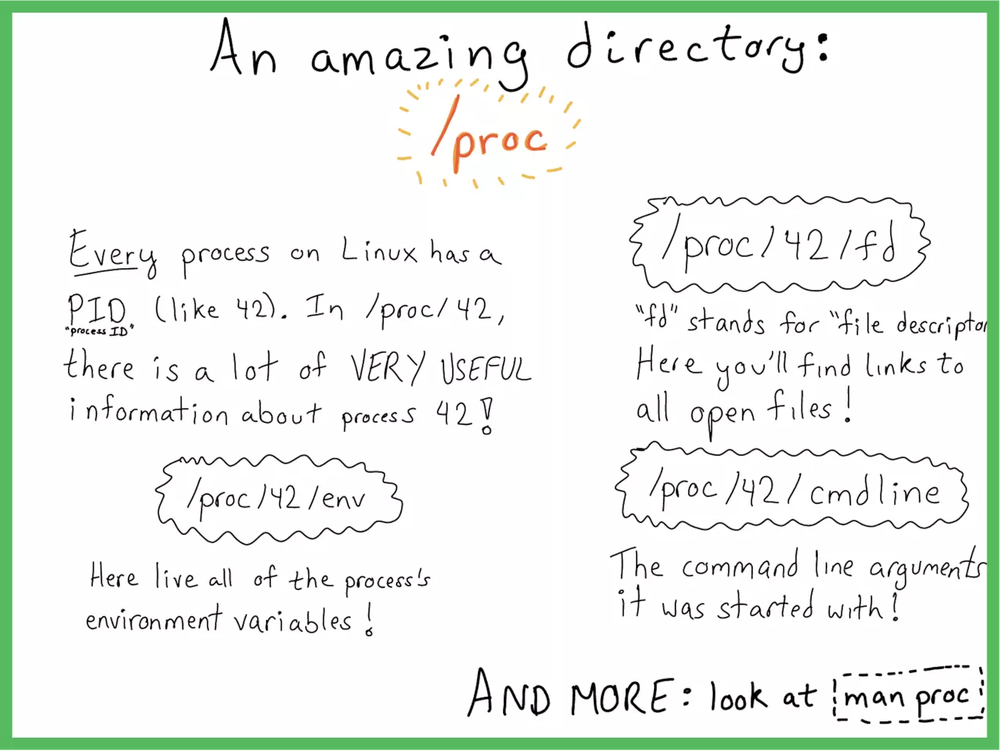

(图片来源网络) 创建这个目录的人真是天才！
作者：小姐姐味道
链接：https://juejin.im/post/5bf0b52df265da611b57f0e6

### 资料参考

1. [TOP命令使用](https://linux.cn/article-9937-1.html)
2. [top命令在线手册](http://man7.org/linux/man-pages/man1/top.1.html)


## ulimit

### 作用

```shell
ulimit主要是用来限制进程对资源的使用情况的，它支持各种类型的限制，常用的有：
内核文件的大小限制
进程数据块的大小限制
Shell进程创建文件大小限制
可加锁内存大小限制
常驻内存集的大小限制
打开文件句柄数限制
分配堆栈的最大大小限制
CPU占用时间限制用户最大可用的进程数限制
Shell进程所能使用的最大虚拟内存限制
```

### 用法

```
-a 显示当前系统所有的limit资源信息。 

-H 设置硬资源限制，一旦设置不能增加。

-S 设置软资源限制，设置后可以增加，但是不能超过硬资源设置。

-c 最大的core文件的大小，以 blocks 为单位。

-f 进程可以创建文件的最大值，以blocks 为单位.

-d 进程最大的数据段的大小，以Kbytes 为单位。

-m 最大内存大小，以Kbytes为单位。

-n 查看进程可以打开的最大文件描述符的数量。

-s 线程栈大小，以Kbytes为单位。

-p 管道缓冲区的大小，以Kbytes 为单位。

-u 用户最大可用的进程数。

-v 进程最大可用的虚拟内存，以Kbytes 为单位。

-t 最大CPU占用时间，以秒为单位。

-l 最大可加锁内存大小，以Kbytes 为单位。

```

注意：/proc为内存的信息，所以使用ulimit所做的修改都是当前有效，重启后就失效。

### 分析

```
[root@centos5 ~]# ulimit -a
core file size          (blocks, -c) 0
data seg size           (kbytes, -d) unlimited
max nice                        (-e) 0
file size               (blocks, -f) unlimited
pending signals                 (-i) 4096
max locked memory       (kbytes, -l) 32
max memory size         (kbytes, -m) unlimited
open files                      (-n) 1024
pipe size            (512 bytes, -p) 8
POSIX message queues     (bytes, -q) 819200
max rt priority                 (-r) 0
stack size              (kbytes, -s) 10240
cpu time               (seconds, -t) unlimited
max user processes              (-u) 4096
virtual memory          (kbytes, -v) unlimited
file locks                      (-x) unlimited||<
```

* ulimit 命令来修改,但ulimit命令修改的数值只对当前登录用户的目前使用环境有效,系统重启或者用户退出后就会失效
* 可以将用户资源的限制统一由一个文件来配置，这个文件就是`/etc/security/limits.conf`
* “cat /proc/sys/fs/file-max”，或“sysctl -a | grep fs.file-max”查看系统能打开的最大文件数

### 系统进程的最大理论数计算

- 每个进程都要在全局段描述表GDT中占据两个表项

- 段寄存器中用作GDT表下标的位段宽度是13位，所以GDT中可以有213=8192213=8192个描述项。

  > 除一些系统的开销(例如GDT中的第2项和第3项分别用于内核 的代码段和数据段，第4项和第5项永远用于当前进程的代码段和数据段，第1项永远是0，等等)以外，尚有8180个表项可供使用，所以理论上系统中最大的 进程数量是8180/2=40908180/2=4090。
  > 原文链接：https://blog.csdn.net/gatieme/article/details/51058797

### 系统中可创建的进程数实际值

```shell
#查看
cat /proc/sys/kernel/pid_max
#修改
ulimit -u 65535
#系统最大进程数还受内核参数kernel.pid_max，我默认是32768
sysctl -w  kernel.pid_max=65535
```

### 最大线程数

> linux 系统中单个进程的最大线程数有其最大的限制 PTHREAD_THREADS_MAX
> 这个限制可以在`/usr/include/bits/local_lim.h`中查看
> 这个系统的资源主要就是线程的 stack 所占用的内存，用 `ulimit -s` 可以查看默认的线程栈大小，一般情况下，这个值是8M=8192KB
>
> Linux无法直接控制单个进程可拥有的线程数，但有参考公式max = VM/stack_size，默认stack为8k，可通过降低stack大小或增加虚拟内存来调大每个进程可拥有的最大线程数；

```shell
shell /proc/sys/kernel/thread-max
```


### 系统最大打开文件数

```shell
cat /proc/sys/fs/file-max
```

### 单个进程可分配的最大文件数

```shell
cat /proc/sys/fs/nr_open
```

### nofile进程最大打开文件描述符数

```shell
ulimit -n
##ulimit -n默认查看的是soft limit，但是ulimit -n 1800000则是同时设置soft limit和hard limit
#soft limit
ulimit -Sn
#hard limit
soft -Hn
#修改永久有效，则需要在
/etc/security/limits.conf
```

注意：

> 1. nofile的soft limit不能超过其hard limit
> 2. nofile的hard limit不能超过/proc/sys/fs/nr_open

### 资料

1. [JVM最大线程](https://www.cnblogs.com/princessd8251/articles/3914434.html)


# shell脚本系统学习

## 小刀牛试

### $ 和 #

> shell命令窗口一般会显示：
>
> username@hostname $
>
> 或者
>
> root@hostname#
>
> $表示普通用户，#表示超级用户

### #！

shell脚本一般是以#！起始的文本文件，如

```shell
#！/bin/bash
```

事实上，Linux下任何脚本都以一种被称为shebang的特殊符号起开始。/bin/bash则是Bash的路径。

shebang即，sharp或hash来称呼“#”，而使用bang来称呼“！”

如果将脚本作为sh命令函参数执行，则第一行shebang行会被忽略。如下

```shell
##相对路径，脚本在当前目录
$sh script.sh 
或
#使用绝对路径
$sh /home/path/script.sh
```

而如果直接执行脚本文件，则会查看shebang行是否为`#！/bin/bash`。

```shell
#相对路径
$ ./script.sh
##绝对路径
$ /home/path/script.sh
##内部以下形式执行
$/bin/bash script.sh
##通过chmod命令设置文件的执行权限~
$chmod a+x script.sh
```

### ~

**~**是`/home/当前用户`文件夹的缩写。如下：

```shell
[dc2-user@10-255-0-84 ~]$ cd /
[dc2-user@10-255-0-84 /]$ cd ~
[dc2-user@10-255-0-84 ~]$ pwd
/home/dc2-user
```

打开shell命令终端时，会首先加载`~/.bashrc`文件，初始化提示文本和颜色等设置。如下

```shell
[dc2-user@10-255-0-84 ~]$ ls -la
##以下是部分文件
c2-user dc2-user  4096 May 17 14:13 .
root     root        36 Nov 11  2019 ..
c2-user docker   10048 May 22 14:11 .bash_history ##记录之前输入的命令
dc2-user dc2-user    18 Apr 11  2018 .bash_logout  ##当你退出时执行的命令
dc2-user dc2-user   193 Apr 11  2018 .bash_profile ##当你登入shell时执行
dc2-user dc2-user   231 Apr 11  2018 .bashrc       ## 当你登入shell时执行
dc2-user dc2-user    25 Jan 13 23:00 .ssh
###’.bash_profile’只在会话开始时被读取一次，而’.bashrc’则每次打开新的终端时，都要被读取。
```

> 这些文件是每一位用户对终端功能和属性设置，修改.bashrc可以改变环境变量PATH、别名alias和提示符。具体如何修改会在下面做介绍。
>
> 除了可以修改用户目录下的.bashrc文件外，还可以修改如“/etc/profile”文件、“/etc/bashrc”文件及目录“/etc /profile.d”下的文件。但是修改/etc路径下的配置文件将会应用到整个系统，属于系统级的配置，而修改用户目录下的.bashrc则只是限制在用户应用上，属于用户级设置。两者在应用范围上有所区别，建议如需修改的话，修改用户目录下的.bashrc，即无需root权限，也不会影响其他用户。

### ；与换行

Bash中，命令以分号或换行符进行分隔

```shell
$ cmd1;cmd2
#等同于
$cmd1
$cmd2
```

### #

#表明注释的开始。注释部分以#号开始，一直到行尾。

### 终端打印

#### echo

```shell
##以下完成相同的工作
$echo hello
$echo 'hello'
$echo "hello"
##对于特殊符号
$echo hello !
$echo 'hello !'
$echo "hello \!" #必须加转义符号
##单引号不会对内容转义
var='hello froggengo'
echo $var
hello froggengo
echo “$var”
“hello froggengo”
echo '$var'
$var #直接数据$var而不会对该变量求值
```

#### printf

```shell
[dc2-user@10-255-0-84 ~]$ printf "%-5s %-10s %-4s\n" no name mark;printf "%-5s %-10s %-4s\n" hello im froggengo
no    name       mark
hello im         froggengo
```

> %s %c %d %f都是格式替代符
>
> %-10s 指一个宽度为10个字符（-表示左对齐，没有则表示右对齐），任何字符都会被显示在10个字符宽的字符内，如果不足则自动以空格填充，超过也会将内容全部显示出来。
>
> %-4.2f 指格式化为小数，其中.2指保留2位小数。

### 变量

```shell
var=value
##区别于
var = value
##前者是赋值操作，后者是相等操作
```

#### 实战

```shell
#新建shell文件
#! /bin/bash
fruit=apple
count=5
echo "we have $count ${fruit}(s)"

##执行
$sh test.sh
we have 5 apple(s)
```

#### export设置环境变量

```shell
#/home/user/bin添加至PATH
$ export PATH="$PATH:/home/user/bin"
##常见环境变量
#HOME、PWD、USER、UID、SHELL
###UID用于检查当前用户是否为超级用户
###超级用户UID为0
```

#### ${}获取字符串长度

```shell
echo ${#PATH}
29
```

### 数学运算

#### 整形运算：let和[ ]和(())和expr

```shell
$ a=5
$ b=3
$ c=$a+$b
$ d=a+b
$ let e=a+b
$ echo $c
5+3
$ echo $d
a+b
$ echo $e
8
$ let f=$a+$b
$ echo $f
8
##使用[ ]
$ echo $[a+b]
8
##使用$(())
$ r=$((a+b))
$ echo $r
8
##expr好像不可以
$ res='expr a+b'
$ echo $res
expr a+b
$ res='expr 4+5'
$ echo $res
expr 4+5
$ res=`expr 4+5`
$ echo $res
4+5
$ rex=$(expr $a+5)
$ echo $rex
5+5

```

#### 浮点预算 bc，scale

可能需要安装，以下没有运算成功

```shell
$ echo "4 *0.56" | bc
2.24
##控制精度，保留两位小数
$ echo "scale=2;3/8"| bc
$ n=100
##进制转换
$ echo "obase=2;$n" |bc
1100100
##平方计算
$ echo "sqrt(100)" |bc
$ echo "10^10"|bc
```

### 文件描述符与重定向：>和>>

文件描述符是与文件输入输出相关联的整数，用来跟踪已打开的文件。最常见的文件描述符是：stdin（标准输入）、stdout（标准输出）和stderr（标准错误）。

```sql
0 -----stdin (标准输入)
1 -----stdout（标准输出）
2 -----stderr（标准错误）
```

当使用重定向操作符时，重定向的内容不会出现在终端，而直接导入文件。

```shell
##清空文件，写入内容
$ echo "This is a sample" > temp.txt
##不请空，追加至末尾
$ echo "This is sample 2" >>temp.txt
##针对特定的文件描述符号，即在重定向符前加上文件描述符的数字
$ echo "This for  specific description" 1>temp.txt

##比如重定向错误信息必须指定文件描述符号为2
####以下语句，并没有将错误进行重定向至文件中
$ ls + >ou.txt
ls: cannot access +: No such file or directory
$ ls + 2>ou.txt
$ cat ou.txt
ls: cannot access +: No such file or directory
####或者将标准错误转换为标准输出，以达到输入到同一个文件的目的
$ ls + 2>&1  ou.txt ##很奇怪没有执行成功
#或
$ ls &> ou.txt
####丢弃错误信息
$ ls 2> /dev/null
####/dev/null相当于垃圾桶、黑洞，丢弃所有接受到的信息
```

创建及使用文件描述符

```shell
##向文件hello.txt输入内容
$ echo this a test >hello.txt
##创建指向hello.txt文件的文件描述符
$ exec 3<hello.txt
##使用文件描述符读取文件
$ cat <&3
this a test
##再次使用文件描述，已经失效
$ cat <&3
##必须重新分配文件描述符才能再次使用
$ exec 3<hello.txt
$ cat <&3
this a test

#####################写文件描述符###
##注意与箭头方向
$ exec 4>out.txt
##写入数据（覆盖）
$ echo newline >&4
##读取
$ cat out.txt
newline
##创建文件描述符
$ exec 5>>out.txt
##写入数据（追加）
$ echo appended line >&5
##读取
$ cat out.txt
newline
appended line
##再次写入居然成功了
$ echo appended line >&5
$ cat out.txt
newline
appended line
appended line

##文件描述符关闭，指向&-
 exec 5>&-
```


### 数组

```shell
##数组定义，注意是括号
$ arr=(1 2 3 4 "a")
#打印全部
$ echo ${arr[*]}
1 2 3 4 a
#打印全部
$ echo ${arr[@]}
1 2 3 4 a
#打印指定位置
$ echo ${arr[0]}
1
#使用变量打印
$ index=4
$ echo ${arr[$index]}
a
#使用变量赋值，注意这里的索引超过原定义的大小
$ arr[5]="b"
$ echo ${arr[@]}
1 2 3 4 a b

###关联数组
#声明关联数组
$ declare -A fruit_value
#赋值
$ fruit_value=([apple]='100yuan' [orange]='40yuan')
#打印，注意这里是索引键
$ echo ${!fruit_value[*]}
orange apple
#打印指定键的值
$ echo ${fruit_value[apple]}
100yuan
#指定键赋值，注意没有覆盖
$ fruit_value[pineapple]="69yuan"
$ echo ${!fruit_value[*]}
orange apple pineapple

```

### 别名

```shell
alias new_command='command sequence'
#示例,列出当前目录文件
alias lsl='ls -l'
lsl
-rw-rw-r-- 1 dc2-user dc2-user   5 Jun 10 09:25 3
-rw-rw-r-- 1 dc2-user dc2-user 104 Jun 15 09:23 array_test.sh
-rw-rw-r-- 1 dc2-user dc2-user  97 Jun 15 09:22 arr.sh
drwxrwxr-x 5 dc2-user dc2-user 133 May 16 22:45 downloadfrog
-rw-rw-r-- 1 dc2-user dc2-user  12 Jun 10 09:27 hello.txt
-rw-rw-r-- 1 dc2-user dc2-user   3 Jun  9 09:47 ou2
-rw-rw-r-- 1 dc2-user dc2-user   3 Jun  9 09:45 ou3
-rw-rw-r-- 1 dc2-user dc2-user 528 Jun 10 17:39 out.txt
-rw-rw-r-- 1 dc2-user dc2-user  47 Jun  9 09:38 ou.txt
-rw-r--r-- 1 root     root      67 Jun  8 10:25 test.sh
```

注意：alias命令是暂时的，关闭命令窗口后设置的别名就失效。需要将命令写在`~/.bashrc`中，才能永久生效。因为每个shell的新进程生成时，都会执行`~/.bashrc`中的命令。

### 终端信息及命令

tput和stty是两款终端处理工具。

```shell
#终端行数与列数
tput cols
tput lines
#打印终端名
tput longname
#设置背景，no为0到7之间取值
tput setb no
#设置文本背景
tput setf no
#设置粗体
tput bold

```


### 获取、设置日期和延时

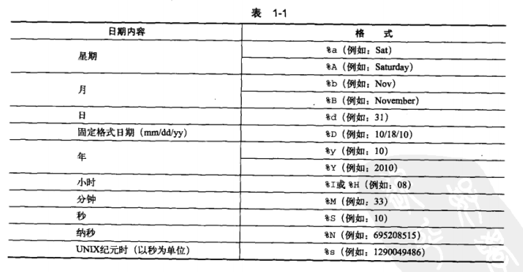


```shell
$ date
Mon Jun 15 10:08:52 CST 2020
$ date +%s
1592186945
$ date +%a
Mon
$ date +%A
Monday
##格式化日期，必有+开头
$ date '%d %b %y'
date: invalid date ‘%d %b %y’
$ date '+%d %b %y'
15 Jun 20
#格式转换
$ date --date "2020-06-12 11:01:22"
Fri Jun 12 11:01:22 CST 2020
#赋值
end=$(date +%s)
$ echo ${end}
1592187389

```

#### 时延

```shell

```

### 调试脚本


### 函数与参数


### 读取命令序列输出


# 知识专题

## 内存寻址

1. 内存地址（80x86）

   > 1. 逻辑地址：段选择符号+偏移量（16位+32位）
   > 2. 线性地址：32位无符号整数，即可表示4GB的地址。
   > 3. 物理地址：内存芯片级内存单元寻址，由32或36位无符号整数表示
   > 4. 线性地址(linear address)或也叫虚拟地址(virtual address)

   内存控制单元（MMU）通过一种称为分段单元（segmentation unit）的硬件电路逻辑地址转换为线性地址，通过一种称为分页单元（paging unit）的硬件电路将线性地址转换为物理地址

2. 段选择符

   > 段寄存器：用于存放段选择符
   >
   > ​		cs：代码寄存器，指向程序指令的段，指明CPU当前的特权级别（Current Privilege Level ,CPL）
   >
   > ​		ss：栈段寄存器
   >
   > ​		ds：数据寄存器
   >
   > ​		es：
   >
   > ​		fs：
   >
   > ​		gs：

3. 段描述符

   每个段由8个字节的段描述符表示，采访于GDT（Global Descriptor Table全局描述符表）和LDT（Local Descriptor Table局部描述符表）

   > GDT在主存中的地址和大小是放在gdtr控制寄存器
   >
   > LDT的地址和大小放在ldtr控制寄存器中

   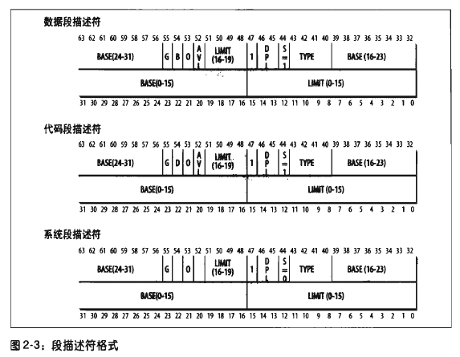

   | 字段  | 描述                                                         |
   | ----- | ------------------------------------------------------------ |
   | Base  | 段首字节的线性地址                                           |
   | Limit | 段最后一个内存单元的偏移量（段的长度）。根据G标识，大小分为1字节到1MB，4KB到4GB |
   | G     | 段中的单位表示，0：以字节为单位，1：以4086字节为单位         |
   | S     | 0：系统段，1：非系统段                                       |
   | TYPE  | 段的类型特征和存取权限                                       |
   | DPL   | 描述符的权限级别（descriptor privilege level）               |
   | P     | segment-present标识，0标识段不再主存中，但linux默认为1       |
   | D/B   | 称为D或B的标志，取决于是代码段还是数据段。如果段偏移量地址长度为32位，则一般为1,否则偏移量为16位，则为0 |
   | AVL   | LINUX忽略                                                    |

   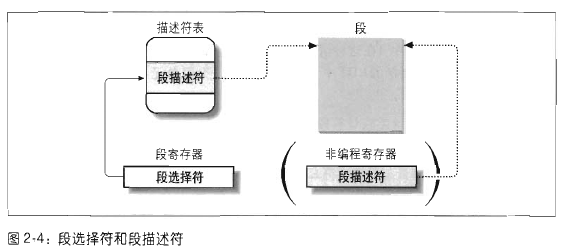

   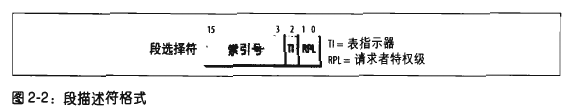

   TI（Table Indicator）:0为GDT，1为LDT

   理解：

   > 段选择符装入段寄存器的同时，会把相对应的段描述符装入非编程CPU寄存器。
   >
   > 通过段选择符的索引，找到GDT中对应的位置（索引号*8，因为一个段描述符占用8个字节）。
   >
   > GDT的最大数目为2^13^-1=8191，GDT的第一项总为0 

   分段单元（电路）转换逻辑地址

   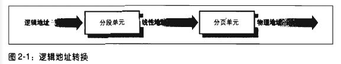

   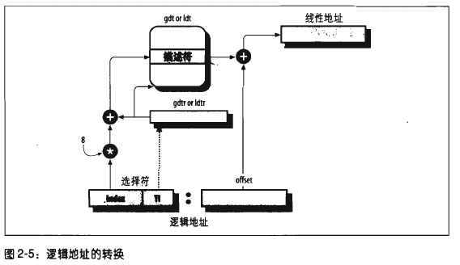

   * index * 8 
   * 根据TI值决定是在gdtr还是ldtr取值
   * 在gdtr/ldtr中获取段描述符号
   * 获取段描述符号的base字段+段选择符offset字段，即为线性地址

4. linux分段

   > 分段：可以给每一个进程分配不同的线性地址空间
   >
   > 分页：可以把同一线性地址映射到不同的物理空间
   >
   > linux更喜欢分页

   linux只有在80x86结构才使用分段

5. 硬件分页

   > **线性地址**被分为以固定长度为单位的组，成为页（page），页内部连续的线性地址被映射到连续的物理地址中。
   >
   > 分页单元把所有的**RAM**分成固定长度的页框（page frame），有时也叫物理页。每个页框包含一个页。
   >
   > 区别：页框是主存的一部分，而页是一个数据块，可以存放在页框或者磁盘中。
   >
   > 线性地址映射到物理地址的数据结构称为页表。页表存放在主存中。
   >
   > CPU的页式内存管理单元，负责把一个线性地址，最终翻译为一个物理地址。从管理和效率的角度出发，线性地址被分为以固定长度为单位的组，称为页(page)，例如一个32位的机器，线性地址最大可为4G，可以用4KB为一个页来划分，这页，整个线性地址就被划分为一个tatol_page[2^20]的大数组，共有2的20个次方个页。这个大数组我们称之为页目录。目录中的每一个目录项，就是一个地址——对应的页的地址。
   >
   > 另一类“页”，我们称之为物理页，或者是页框、页桢的。是分页单元把所有的物理内存也划分为固定长度的管理单位，它的长度一般与内存页是一一对应的。

   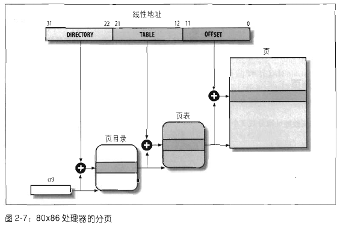

   > 32位线性地址分为3个域：
   >
   > 	* directory目录（最高10位）
   > 	* table 页表（中间10位）
   > 	* offset（偏移量）
   >
   > ​	所以页表的条目总共有（2^20^个表项），页表项包含了页框中的相对位置，长度为12，所以一个页的长度为4KB。

   分析：[来源](https://www.cnblogs.com/zengkefu/p/5452792.html)

   > 如上图，
   > 1、分页单元中，页目录是唯一的，它的地址放在CPU的cr3寄存器中，是进行地址转换的开始点。万里长征就从此长始了。
   > 2、每一个活动的进程，因为都有其独立的对应的虚似内存（页目录也是唯一的），那么它也对应了一个独立的页目录地址。——运行一个进程，需要将它的页目录地址放到cr3寄存器中，将别个的保存下来。
   > 3、每一个32位的线性地址被划分为三部份，面目录索引(10位)：页表索引(10位)：偏移(12位)
   > 依据以下步骤进行转换：
   > 1、从cr3中取出进程的页目录地址（操作系统负责在调度进程的时候，把这个地址装入对应寄存器）；
   > 2、根据线性地址前十位，在数组中，找到对应的索引项，因为引入了二级管理模式，页目录中的项，不再是页的地址，而是一个页表的地址。（又引入了一个数组），页的地址被放到页表中去了。
   > 3、根据线性地址的中间十位，在页表（也是数组）中找到页的起始地址；
   > 4、将页的起始地址与线性地址中最后12位相加，得到最终我们想要的葫芦；
   >
   > 这个转换过程，应该说还是非常简单地。全部由硬件完成，虽然多了一道手续，但是节约了大量的内存，还是值得的。那么再简单地验证一下：
   > 1、这样的二级模式是否仍能够表示4G的地址；
   > 页目录共有：2^10项，也就是说有这么多个页表
   > 每个目表对应了：2^10页；
   > 每个页中可寻址：2^12个字节。
   > 还是2^32 = 4GB
   >
   > 2、这样的二级模式是否真的节约了空间；
   > 也就是算一下页目录项和页表项共占空间 (2^10 * 4 + 2 ^10 *4) = 8KB。哎，……怎么说呢！！！
   > 红色错误，标注一下，后文贴中有此讨论。。。。。。
   > 按<深入理解计算机系统>中的解释,二级模式空间的节约是从两个方面实现的:
   > A、如果一级页表中的一个页表条目为空，那么那所指的二级页表就根本不会存在。这表现出一种巨大的潜在节约，因为对于一个典型的程序，4GB虚拟地址空间的大部份都会是未分配的；
   > B、只有一级页表才需要总是在主存中。虚拟存储器系统可以在需要时创建，并页面调入或调出二级页表，这就减少了主存的压力。只有最经常使用的二级页表才需要缓存在主存中。——不过Linux并没有完全享受这种福利，它的页表目录和与已分配页面相关的页表都是常驻内存的。
   >
   > 值得一提的是，虽然页目录和页表中的项，都是4个字节，32位，但是它们都只用高20位，低12位屏蔽为0——把页表的低12屏蔽为0，是很好理解的，因为这样，它刚好和一个页面大小对应起来，大家都成整数增加。计算起来就方便多了。但是，为什么同时也要把页目录低12位屏蔽掉呢？因为按同样的道理，只要屏蔽其低10位就可以了，不过我想，因为12>10，这样，可以让页目录和页表使用相同的数据结构，方便。
   >
   > **Why-为什么使用两极页表结构？**
   >
   > **w1）**页表含有2^20（1M）个表项，每项占4字节。如果用一个表来存储的话，将最多占用4M；为减少内存占用量，X86使用了两极页表；
   >
   > **w2）**每个，仅有一个页目录占用4k， 每个页表占用4k，而要知道页目录一定常驻内存，而页表是在需要的时候才占用内容空间，当然常用的页表会存储在TLB中，这在一定程度上减少了
   > 页表机制进行线性地址与物理地址映射所占用内存空间；

6. 物理地址

7. 虚拟地址

   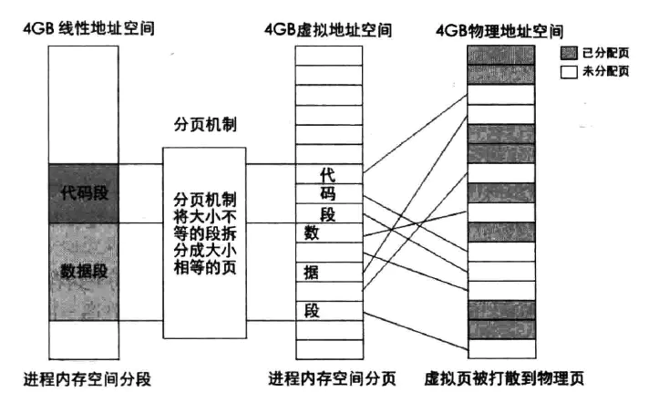

   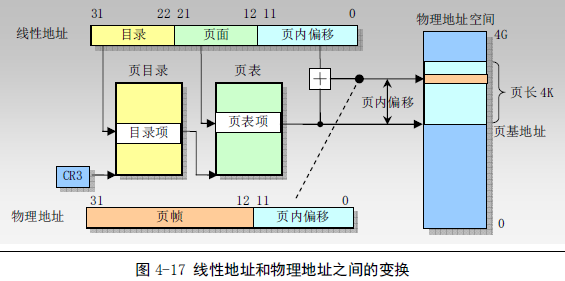

   [来源](https://www.cnblogs.com/pacoson/p/4819374.html)

8. 

## 1.linux执行命令的原理

1. 判断路径

   ```shell
   ##判断用户是否以绝对路径或者相对路径输入命令，如
   /bin/ls
   ##会直接到对于目录执行对于的命令程序
   ```

   

2. 检查别名

   ```shell
   #查看下面的文件
   /etc/bash.bashrc
   #或
   ~/.bashrc
   ##区别第一个是设置给全系统，第二个是用户的
   ##使用alias查看本机所有别名的命令
   alias 
   ##参考某个命令的别名
   alias agu
   alias agu='apt-get update'
   ```

   

3. 判断命令类型

   ```shell
   $ type pwd
   pwd 是 shell 内建
   $ type apt
   apt 是 /usr/bin/apt
   $ type ifconfig
   ifconfig 是 /usr/sbin/ifconfig
   ```

   > 内部命令由 Shell 自带，会随着系统启动，可以直接从内存中读取；而外部命令仅是在系统中有对应的可执行文件，执行时需要读取该文件。

4. 检查外部命令对应的执行文件

   > 当用户执行的是外部命令时，系统会在指定的多个路径中查找该命令的可执行文件，而定义这些路径的变量，就称为 PATH 环境变量，其作用就是告诉 Shell 待执行命令的可执行文件可能存放的位置，也就是说，Shell 会在 PATH 变量包含的多个路径中逐个查找，直到找到为止（如果找不到，Shell 会提供用户“找不到此命令”）。

## 2.开机启动流程

> 目前，CentOS 6.x 的启动流程经历以下几步：
>
> 1. 服务器加电，加载 BIOS 信息，BIOS 进行系统检测。依照 BIOS 设定，找到第一个可以启动的设备（一般是硬盘）；
> 2. 读取第一个启动设备的 MBR (主引导记录），加载 MBR 中的 Boot Loader（启动引导程序，最为常见的是 GRUB）。
> 3. 依据 Boot Loader 的设置加载内核，内核会再进行一遍系统检测。系统一般会采用内核检测硬件的信息，而不一定采用 Bios 的自检信息。内核在检测硬件的同时，还会通过加载动态模块的形式加载硬件的驱动。
> 4. 内核启动系统的第一个进程，也就是 /sbin/init。
> 5. 由 /sbin/init 进程调用 /etc/init/rcS.conf 配置文件，通过这个配置文件调用 /etc/rc.d/rc.sysinit 配置文件。而 /etc/rc.d/rc.sysinit 配置文件是用来进行系统初始化的，主要用于配置计算机的初始环境。
> 6. 还是通过 /etc/init/rcS.conf 配置文件调用 **/etc/inittab** 配置文件。通过 /etc/inittab 配置文件来确定系统的默认运行级别。
> 7. 确定默认运行级别后，调用 /etc/init/rc.conf 配置文件。
> 8. 通过 /etc/init/rc.conf 配置文件调用并执行 /etc/rc.d/rc 脚本，并传入运行级别参数。
> 9. /etc/rc.d/rc 确定传入的运行级别，然后运行相应的运行级别目录 /etc/rc[0-6].d/ 中的脚本。
> 10. /etc/rc[0-6].d/ 目录中的脚本依据设定好的优先级依次启动和关闭。
> 11. 最后执行 /etc/rc.d/rc.local 中的程序。
> 12. 如果是字符界面启动，就可以看到登录界面了。如果是图形界面启动，就会调用相应的 X Window 接口。
>
> 总的来说，Linux 系统的启动，要经历`BIOS自检 -> 启动 GRUB -> 加载内核 -> 执行第一个进程 -> 配置系统初始环境`。当然，本节仅是简单地看启动过程，接下来分别详解介绍每步启动过程。
>
> 

# 操作


# 资料

1. [linux文档,非常重要，整个linux架构原理等](https://www.kernel.org/doc/html/latest/index.html)
2. [linux在线手册](https://linux.die.net/man/)
3. [linux在线手册2](http://man7.org/linux/man-pages/man1/top.1.html)
4. [C 语言常见问题集](http://c-faq-chn.sourceforge.net/ccfaq/index.html)
5. [从苦逼到牛逼，详解Linux运维工程师的打怪升级之路](http://www.yunweipai.com/archives/22629.html)感觉有问题，做个指引吧
6. [linux各种性能报告](http://www.citi.umich.edu/projects/linux-scalability/reports/)