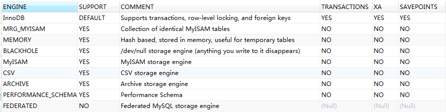

# [官方文档](https://dev.mysql.com/doc/refman/8.0/en/innodb-buffer-pool.html)

## InnoDb Storage Engine

### InnoDB Multi-Versioning

#### 15.3 InnoDb Mutil-Versioning多版本并发控制（Mvcc）

InnoDb是一个多版本存储引擎。它保留了被修改行的旧版本的信息，这提供了数据库支持事务的特性，比如并发访问以及回滚。这些信息存储在表空间中被称为回滚段（rollback segament）的数据结构中。InnoDb使用回滚段的信息执行事务回滚中的undo操作。同时使用这些信息构建数据行更早版本的一致性读。

InnoDb会在每一行的数据上增加三个字段。

* 6 bit的 DB_TRX_ID : 表示插入或更新该行的最新事务标识。delete操作也是作为一种特殊的更新操作，标记改行被删除了。
* 7 bit DB_ROLL_PTR : 称为回滚指针，回滚指针指向回滚段中的undo log日志记录。如果行被更新，undo 日志记录将包含重构该行回到被更新前的所有必要的信息
* 6 bit DB_ROW_ID : 包含一个单调递增的row id，索引则是包含row id的值。但DB_ROW_ID 没有出现在任何的索引中。

回滚段中的undo log分为insert和update undo log。insert undo log只有在回滚事务中使用，一旦事务提交就可以丢弃。update undo log同时还用于一致性读，只能在不存在InnoDb为其分配的一致性读的快照事务时才能被丢弃，一致性读需要unpdate undo log的信息来构建更早版本的行数据。

定期提交食事务，包括那些只有一致性读的事务。否则，InnoDb无法丢弃update undo log中的日志，这将导致回滚段过大而占满了表空间。

回滚段中undo日志的物理大小通常小于插入或更新的行。你可以使用这些信息计数回滚段的空间大小。

在innoDb的多版本方案中，当你执行delete sql时，一个行不会被物理的从数据库上马上删除。当它丢弃delete操作的unpdate undo log时，innoDB才会移除相应的行。这种移除操作称为purge（清除）,这是非常快的，通常花费与执行删除操作的SQL语句相同的时间顺序。

如果在表中以大约相同的速率执行小批次的插入和删除行，则由于所有“死”行，清除（purge）线程可能开始滞后并且表可能变得越来越大，从而使所有内容都受磁盘限制并且非常慢。在这种情况下，请限制新行操作，并通过调整innodb_max_purge_lag系统变量来向清除线程分配更多资源。

#### Multi-Versioning and Secondary Indexes

`InnoDB` multiversion concurrency control (MVCC) 对二级索引的处理不同于聚簇索引（clustered indexes）。聚簇索引中的记录在本地更新，隐藏的系统列指向undo log条目，可以从中重建记录的早期版本的数据。二级索引记录不包含隐藏的系统列，也不会本地更新。

更新二级索引列时，将对旧的二级索引记录写入删除标记，插入新记录行，并最终清除（purge）带有删除标记的记录。当二级索引记录被删除标记或二级索引页面被更新的事务更新时，InnoDB会在聚簇索引中查找数据库记录。在聚簇索引中，如果在已经发起一个读事务后，数据记录 被修改了，将检查数据的隐藏列的`DB_TRX_ID`，并从undo log中获取数据行正确的版本号。

如果二级索引记录被标记为删除，或者二级索引页被更新的事务更新，则不使用覆盖索引（covering index）技术。InnoDB无需从索引结构中返回值，而是在聚集索引中查找记录。

但是，如果启用了索引条件下推（ index condition pushdown (ICP) ）优化，只有部分where条件可以使用索引来评估，MySQL服务器仍将这一部分的WHERE条件下推至存储引擎，并在其中使用索引对其进行评估。如果找不到匹配的记录，则可避免聚簇索引查询。如果找到匹配的记录，即使是被标记为删除的记录，InnoDB也会在聚集索引中查找记录。

### InnoDB In-Memory Structures

innoDB架构


#### Buffer Pool

缓冲池是主内存中的一个区域，InnoDB在访问表和索引时会同时在缓存池中缓存表和索引数据。缓冲池允许频繁使用的数据直接在内存中处理。在一台专用的服务器，80%的物理内存会分配 给缓冲池。

为了提高大容量读取操作的效率，缓冲池被分为多个页（page），这些页包含多个行。为了提高缓存管理的效率，缓冲池的页被实现为的链表形式。使用LRU算法的变体来处理缓存池中很少使用的数据。

利用缓冲池来保留频繁使用的数据在内存中是非常重要的Mysql优化。

#### Buffer Pool LRU Algorithm

缓冲池是使用LRU算法变体管理的列表。当需要空间添加新的页(page)到缓冲池时，least recently used页将被清除，新的页将被添加到列表中间。中点插入策略将列表区分为两个子列：

* 在头部，是最近访问的new（“young”）page子列表
* 在尾部，是最近较少访问的old page子列表。


该算法将大量页面保留在新的子列表中。旧的子列表包含较少使用的页面。这些页面是候选被驱逐（清除）的对象。

默认情况下，该算法的操作如下：

* 3/8的缓冲池专用于旧的子列表。
* 列表的中点是new子列表的尾部与old子列表的头相交的边界。
* 当InnoDB将页面读入缓冲池时，它首先将其插入中点（旧子列表的头部）。读入页面，可以通过用户发起的操作比如sql查询语句、或者InnoDb自动执行的预读取操作。
* 访问old子列表中的页面会使其“young”，并将其移至new子列表的头部。
* 随着数据库的运行，缓冲池中未被访问的页面通过移到列表的尾部将页面“老化”。新和旧子列表中的页面都会随着其他页面的更新而老化。随着将页面插入中点，旧子列表中的页面也会老化。最终，未使用的页面到达旧子列表的尾部并被逐出。

默认情况下，查询语句引发读取的页面会立即移入新的子列表，这意味着它们在缓冲池中的停留时间更长。全表扫描，比如执行一个[**mysqldump**](https://dev.mysql.com/doc/refman/8.0/en/mysqldump.html) 操作或者没有where从句的select操作会导致大量的数据进入缓冲池并驱除对应数量的数据，即使这些新加入的数据不会再次使用。同样，由预读后台线程加载且仅访问一次的页面也会被移到新子列表的头部。这些情况会将经常使用的页面推到old子列表，并可能被驱除。

#### Change Buffer

Change 缓冲区是一种特殊的数据结构，用于当第二索引页不在缓冲池时，缓存对这些页的修改。由insert、update、delete操作引起的缓存修改，会在之后由于其他读操作引发页面被加载到缓冲池时合并。


与聚簇索引不同，二级索引通常不是唯一的，并且二级索引的插入以相对随机的顺序发生。同样，删除和更新可能会影响索引树中不相邻的二级索引页。当稍后通过其他操作将受影响的页读入缓冲池时，合并change buffer中的更改，从而避免从磁盘将二级索引页读入缓冲池所需的大量随机访问I / O。

在系统大部分时间处于空闲状态或缓慢关闭期间，定期执行清除操作将更新的索引页写入磁盘。与将每个值立即写入磁盘相比，清除操作（purge opreation）可以更有效地将一系列索引值写入磁盘块。

当有许多受影响的行和许多二级索引要更新时，change buffer合并可能需要几个小时。在此期间，磁盘I / O会增加，这可能会导致磁盘受限（disk-bound）查询的速度大大降低。提交事务后，甚至在服务器关闭并重新启动之后，更改缓冲区合并也可能继续发生。

在内存中，change buffer占用了缓冲池的一部分。在磁盘上，change buffer是系统表空间（system tablespace）的一部分，当数据库服务器关闭时，索引的修改会存储在system tablespace中。

change buffer中缓存的数据类型由innodb_change_buffering变量控制，参考 [Configuring Change Buffering](https://dev.mysql.com/doc/refman/8.0/en/innodb-change-buffer.html#innodb-change-buffer-configuration) 。配置最大更改缓冲区大小参考 [Configuring the Change Buffer Maximum Size](https://dev.mysql.com/doc/refman/8.0/en/innodb-change-buffer.html#innodb-change-buffer-maximum-size).

如果索引包含降序索引列或主键包含降序索引列，则二级索引不支持更改缓冲Change buffering。

#### Adaptive Hash Index


#### Log Buffer


### InnoDB On-Disk Structures

#### Creating InnoDB Tables

```sql
--指定数据库引擎
CREATE TABLE t1 (a INT, b CHAR (20), PRIMARY KEY (a)) ENGINE=InnoDB;
--查看引擎，
SELECT @@default_storage_engine;
show ENGINES;
SELECT * from information_schema.`ENGINES`;
--查看数据文件存储位置
show global variables like "%datadir%";
--datadir	C:\ProgramData\MySQL\MySQL Server 5.7\Data\
--查看表信息
SELECT * FROM INFORMATION_SCHEMA.INNODB_SYS_TABLESPACES a WHERE a.name='db2019/payment'
SELECT * FROM INFORMATION_SCHEMA.INNODB_SYS_TABLES
```

> 如果默认引擎就是InnoDB，则可以不需要指定

InnoDB table可以在system tablespace，file-per-table tablespace，general tablespace中创建。默认InnoDB table在file-per-table tablespace中创建，如果[`innodb_file_per_table`](https://dev.mysql.com/doc/refman/8.0/en/innodb-parameters.html#sysvar_innodb_file_per_table) 停用，则在system tablespace中创建。

默认情况，当创建一个table在file-table tablespace 中，mysql将会创建一个.idb tablespace 文件在数据库文件存储目录中。当创建一个table在system tablespace中，table将在数据目录中一个已经存在的ibdate file中创建。如果table在general tablespace中创建，则会在一个存在的general tablespace的.idb file中创建。General tablespace files可以在mysql 数据文件目录下或者之外创建。

#### InnoDB Tables and Row Formats

行格式由[`innodb_default_row_format`](https://dev.mysql.com/doc/refman/8.0/en/innodb-parameters.html#sysvar_innodb_default_row_format) 指定，默认值为DYNAMIC。`Dynamic 和 Compressed` 行格式可以更好的利用InnoDB的特性比如表压缩（table compressed） 和对于很长的列值提供高效的页外存储。使用这些行格式，必须开启[`innodb_file_per_table`](https://dev.mysql.com/doc/refman/8.0/en/innodb-parameters.html#sysvar_innodb_file_per_table) 

 `Compact or Redundant row format `

```sql
SET GLOBAL innodb_file_per_table=1;
CREATE TABLE t3 (a INT, b CHAR (20), PRIMARY KEY (a)) ROW_FORMAT=DYNAMIC;
CREATE TABLE t4 (a INT, b CHAR (20), PRIMARY KEY (a)) ROW_FORMAT=COMPRESSED;
```

也可以使用create tablle ....tablespace语法创建general tablespace时指定

```sql
CREATE TABLE t1 (c1 INT PRIMARY KEY) TABLESPACE ts1 ROW_FORMAT=DYNAMIC;
```

#### InnoDB Tables and Primary Keys

必须为innoDB tale定义一个primary key，指定一列或多列：

* 大部分的查询都会使用的字段
* 非空字段
* 唯一值
* 一旦插入几乎不会更改的字段

比如创建一个用户相关的表格，不能使用(firstname, lastname)作为主键，因为名字可能重复，部分人的last name可能为空，人名可能修改。所以最好创建一个ID自增列作为主键。

```sql
# The value of ID can act like a pointer between related items in different tables.
CREATE TABLE t5 (id INT AUTO_INCREMENT, b CHAR (20), PRIMARY KEY (id));

# The primary key can consist of more than one column. Any autoinc column must come first.
CREATE TABLE t6 (id INT AUTO_INCREMENT, a INT, b CHAR (20), PRIMARY KEY (id,a));
```

虽然表格不定义主键也能正确运行，但主键对大数据的或者频繁使用的表格的性能以及关键的设计有着极大的帮助。所以建议必须指定一个key在建表语句中。如果建表并加载数据之后，在执行`alter table`创建主键，这比在建表时就指定主键要慢的多。

#### indexs

##### Clustered and Secondary Indexes

每个InnoDB都有一个特殊的索引称为聚簇索引，它代表了该行所存储的数据。通常，聚簇索引与primary key 主键是同义的。为了获得最好的查询、插入、更新获取其他操作的性能，必须了解InnoDB如何使用聚簇索引来优化最常见的查询以及DML操作。

* 当你在表格中定义一个主键，InnoDB使用它作为聚簇索引。如果没有逻辑唯一且非空的列，自动添加一个新的自增列。
* 如果在创建表格时没有指定一个主键，MYSQL将使用第一个唯一索引并且它所有值都非空的列作为聚簇索引
* 如果没有主键也没有合适的唯一索引，InnoDB内部生成一个隐藏的聚簇索引 `GEN_CLUST_INDEX` ，用ROWID的值进行合成。表格中的数据行按InnoDB分配给该表的rowID进行排序。rowID是一个6字节的字段，随着插入新行而单调递增。所以通过rowid排序的行是物理上按照插入的顺序排序的

##### How the Clustered Index Speeds Up Queries

通过聚集索引访问行是很快的，因为索引查询直接指向包含所有行数据的页面。如果表格数据量非常大，对比于其他存储行数据没有使用索引页，聚簇索引的架构可以节省磁盘IO操作

##### How Secondary Indexes Relate to the Clustered Index

除聚簇索引以外的所有索引都称为二级索引(辅助索引)。在InnoDB中，二级索引中的每个记录都包含该行的主键列以及指定为二级索引的列。InnoDB使用此主键值在聚簇索引中搜索行。

如果主键较长，则二级索引将使用更多空间，因此具有短主键是有利的。

##### The Physical Structure of an InnoDB Index

除了空间索引（spatial indexes），InnoDB索引都是B树数据结构。空间索引使用R树，它是用于索引多维数据的专用数据结构。索引记录存储在其B树或R树数据结构的叶页中。索引页的默认大小为16KB。

将新记录插入InnoDB聚集索引时，InnoDB试图让页面的1/16空闲，以备将来插入和更新索引记录。如果插入索引记录是按顺序的（升序或降序），产生的索引页大约是15/16。如果以随机顺序插入记录，则索引页大约1/2到15/16。

InnoDB在创建或重建B树索引时执行批量加载。这种索引创建方法称为排序索引构建。[`innodb_fill_factor`](https://dev.mysql.com/doc/refman/8.0/en/innodb-parameters.html#sysvar_innodb_fill_factor) 配置选项定义了在构建排序索引（sorted index build）期间填充到每个B树页面上的空间占比，其余空间保留用于将来的索引增长。空间索引不支持排序索引构建。`innodb_fill_factor`设置为100的可使群集索引页中1/16的空间留给将来的索引增长。

如InnoDB索引页的填充因子下降至MERGE_THRESHOLD（如果未指定，默认值为50％）以下，则InnoDB尝试收缩索引树以释放页面。MERGE_THRESHOLD设置适用于B树索引和R树索引。

可以通过在初始化MySQL实例之前设置innodb_page_size配置选项来定义MySQL实例中所有InnoDB表空间的页面大小。定义实例的页面大小后，如果不重新初始化实例就无法更改它。支持的大小为64KB，32KB，16KB（默认），8KB和4KB。

使用特定InnoDB页面大小的MySQL实例不能使用来自使用不同页面大小的实例的数据文件或日志文件。

#### Tablespaces

The System Tablespace

File-Per-Table Tablespaces

General Tablespaces

Undo Tablespaces

Temporary Tablespaces

Moving Tablespace Files While the Server is Offline

#### [redo log](https://dev.mysql.com/doc/refman/8.0/en/innodb-redo-log.html)

redo日志是基于硬盘的用于宕机恢复，纠正已完成的事务的数据的。在正常操作期间redo log对请求进行编码来修改(由sql语句或者低级别的api调用)表数据。由于服务器宕机而导致修改没有更新到数据文件时，这些修改都会在重启后接收连接前重放。
默认情况下，redo log由两个文件存储在物理硬盘中，ib_logfile0 and ib_logfile1。mysql以循环的方式写入记录到redo log。redo log的数据根据修改的数据进行编码，这些数据正确来说成为redo。重做日志的数据传递由不断增加的LSN值表示。
**修改redo log的大小:**

* 停在mysql服务
* 修改my. cnf文件的innodb-log-file-size
* 重启服务

服务器检查单这个值修改后，会创建一个checkpoints，关闭并移除redo log。创建一个对应大小的日志文件
**Group Commit for Redo Log Flushing**
InnoDB和其他任何acid兼容的数据库引擎一样，在事务提交之前刷新事务的重做日志。InnoDB使用分组提交功(group commit)能将多个这样的刷新请求分组在一起体检，以避免每次提交都进行一次刷新。通过分组提交，InnoDB对同时提交的多个用户执行提交操作的事务，向日志文件发出一次写操作，极大地提高了吞吐量。
在进行备份操作时，用于复制redo日志记录的备份程序有时可能跟不上redo日志的生成，从而导致redo日志记录丢失，因为这些记录被覆盖。这个问题通常发生在备份操作期间有重要的MySQL服务器活动，并且重做日志文件存储媒介的运行速度比备份存储媒介更快的情况下。MySQL 8.0.17中引入的重做日志归档特性解决了这个问题，除了重做日志文件外，还按顺序将重做日志记录写入归档文件。备份程序可以根据需要从归档文件复制重做日志记录，从而避免潜在的数据丢失。
在服务器上启用重做日志归档需要设置innodb_redo_log_archive_dirs系统变量。该值指定为重做日志归档的目录，以分号分隔的列表表示(标签:目录)，由冒号(:)分隔。例如:

```sql
mysql> SET GLOBAL innodb_redo_log_archive_dirs='*label1*:*directory_path1*[;*label2*:*directory_path2*;…]';
```


#### undolog

undo log是与单个读写事务关联的撤消日志记录的集合。undo log记录包含有关如何撤消对聚簇索引记录的最新更改的事务信息。如果另一个事务为了一致读（consistent read）需要读取旧版本的数据，则将从undo log records中检索旧版本未修改前的数据。 Undo logs 存放在 [undo log segments](https://dev.mysql.com/doc/refman/8.0/en/glossary.html#glos_undo_log_segment) ，而undo log segments存放在 [rollback segments](https://dev.mysql.com/doc/refman/8.0/en/glossary.html#glos_rollback_segment). rollback segments存放在[undo tablespaces](https://dev.mysql.com/doc/refman/8.0/en/glossary.html#glos_undo_tablespace) 以及  [global temporary tablespace](https://dev.mysql.com/doc/refman/8.0/en/glossary.html#glos_global_temporary_tablespace).

保留在全局临时表空间([global temporary tablespace](https://dev.mysql.com/doc/refman/8.0/en/glossary.html#glos_global_temporary_tablespace))中的(undo log)撤消日志用于修改用户定义的临时表中的数据的事务。这些undo log不需要redo log，因为不需要宕机恢复这些数据。它们仅在服务器运行时用于回滚。undo log通过避免redo  log的I / O来提高性能。

每个撤消表空间和全局临时表空间分别支持最多128个回滚段。innodb_rollback_segments变量定义回滚段的数量。

回滚段支持的事务数取决于回滚段中的撤消插槽数（undo slots ）和每个事务所需的撤消日志数。

回滚段中撤消插槽的数量根据InnoDB页面大小而有所不同。

| InnoDB Page Size | Number of Undo Slots in a Rollback Segment (InnoDB Page Size / 16) |
| ---------------- | :----------------------------------------------------------: |
| `4096 (4KB)`     |                            `256`                             |
| `8192 (8KB)`     |                            `512`                             |
| `16384 (16KB)`   |                            `1024`                            |
| `32768 (32KB)`   |                            `2048`                            |
| `65536 (64KB)`   |                            `4096`                            |

一个事务最多可以分配四个撤消日志，以下每种操作类型都可以分配一个：

* 用户定义的表执行INSERT操作
* 用户定义表上的UPDATE和DELETE操作
* 用户定义的临时表上执行INSERT操作
* 用户定义的临时表上的UPDATE和DELETE操作

撤消日志根据需要分配。例如，对常规表和临时表执行INSERT，UPDATE和DELETE操作的事务需要完全分配四个撤消日志。仅对常规表执行INSERT操作的事务需要单个撤消日志。

分配给事务的撤消日志在事务存活期间始终与它关联。例如，分配给常规表上的INSERT操作事务的撤消日志将会用于该事务对常规表上的所有INSERT操作。（意思是同一个事务将使用同一个undo log），给定上述因素，以下公式可用于估计InnoDB支持的并发读写事务数。

* 如果每个事务都执行INSERT或UPDATE或DELETE操作，则InnoDB能够支持的并发读写事务数为：

  ```sql
  (innodb_page_size / 16) * innodb_rollback_segments * number of undo tablespaces
  ```

  

* 如果每个事务都执行INSERT和(UPDATE或DELETE)操作，则InnoDB能够支持的并发读写事务数为：

  ```sql
  (innodb_page_size / 16 / 2) * innodb_rollback_segments * number of undo tablespaces
  ```

  

* 如果每个事务在临时表上执行INSERT操作，则InnoDB能够支持的并发读写事务数为：

  ```sql
  (innodb_page_size / 16) * innodb_rollback_segments
  ```

  

* 如果每个事务在临时表上执行INSERT和（UPDATE或DELETE）操作，则InnoDB能够支持的并发读写事务数为：

  ```sql
  (innodb_page_size / 16 / 2) * innodb_rollback_segments
  ```

  

### [InnoDB Locking and Transaction Model](https://dev.mysql.com/doc/refman/8.0/en/innodb-locking.html)

自己总结：

丢失更新：覆盖/回滚到导致另一个事务的更新丢失。写的过程其他事务还在写。（写加排他锁）

幻读：由于插入新数据，导致统计count(1),sum()或select结果不一致。（间隙锁）

不可重复读：同一个事务，第一次读取和第二次读取不一致。（mvcc）

脏读：读到没有提交的数据。（读已提交，mvcc）

#### InnoDB Locking

InnoDB实现标准的行级锁定，其中有两种类型的锁定：共享（S）锁定和排他（X）锁定。

* 共享（S）锁允许持有该锁的事务读取一行。
* 排他（X）锁允许持有该锁的事务更新或删除行。

如果事务T1在行r上持有共享（S）锁，那么那些来自不同事务T2的对行r的锁请求将按以下方式处理：

* T2对S锁的请求可以立即获得批准。结果，T1和T2都在r上保持了S锁。 
* T2不能立即授予X锁请求。

如果事务T1在行r上持有排他（X）锁，则不能立即批准某个不同事务T2对r上任一类型的锁的请求。相反，事务T2必须等待事务T1释放对行r的锁定。

##### Intention Locks意向锁

InnoDB支持多种粒度的锁（multiple granularity locking），允许行锁和表锁并存。例如，类似LOCK TABLES ... WRITE之类的语句对指定表采用排他锁（X锁）。为了使在多个粒度级的锁定变得切实可行，InnoDB使用了意图锁。意向锁是表级锁，指示事务稍后对表中的行需要哪种类型的锁（共享锁或排他锁）。

* 意向共享锁（IS）表示事务打算对表中的各个行设置共享锁。
* 意向排他锁（IX）表示事务打算对表中的各个行设置排他锁。

例如，SELECT ... FOR SHARE设置IS锁，而SELECT ... FOR UPDATE设置IX锁。

意图锁的协议如下：

* 在事务可以获取表中某行的共享锁之前，它必须首先获取该表中的IS锁或更强的锁。
* 在事务可以获取表中某行的排它锁之前，它必须首先获取该表中的IX锁。

表级锁类型的兼容性总结如下：

|      | `X`      | `IX`       | `S`        | `IS`       |
| ---- | -------- | ---------- | ---------- | ---------- |
| `X`  | Conflict | Conflict   | Conflict   | Conflict   |
| `IX` | Conflict | Compatible | Conflict   | Compatible |
| `S`  | Conflict | Conflict   | Compatible | Compatible |
| `IS` | Conflict | Compatible | Compatible | Compatible |

如果锁与现有锁兼容，则将其授予请求的事务，但如果与现有锁冲突，则不会授予该请求。

事务等待直到冲突的现有锁被释放。如果锁定请求与现有锁定发生冲突，并且由于会导致死锁而无法被授予，则会发生错误。

意向锁除了全表请求（例如LOCK TABLES ... WRITE）外，不阻止任何其他内容。意图锁定的主要目的是表明某人正在锁定一行，或者打算锁定表中的一行。

在SHOW ENGINE INNODB STATUS和InnoDB监视器输出中，意图锁定的事务数据看起来类似于以下内容：

```sql
TABLE LOCK table `test`.`t` trx id 10080 lock mode IX
```


##### Record Locks

record lock是对索引记录的锁定。例如，从t WHERE c1 = 10 FOR UPDATE中选择SELECT c1；防止任何其他事务插入，更新或删除t.c1值为10的行。

记录锁始终锁定索引记录，即使没有定义索引的表也是如此。对于这种情况，InnoDB将创建一个隐藏的聚集索引，并将该索引用于record lock。

```sql
RECORD LOCKS 
space id 58 
page no 3 n bits 72 
index `PRIMARY` of table `test`.`t`
trx id 10078 
lock_mode X locks rec but not gap
Record lock, heap no 2 PHYSICAL RECORD: n_fields 3; compact format; info bits 0
 0: len 4; hex 8000000a; asc     ;;
 1: len 6; hex 00000000274f; asc     'O;;
 2: len 7; hex b60000019d0110; asc        ;;
```


##### Gap Locks间隙锁

> 因为禁止将数据插入事务的间隙，这样可以避免幻读

间隙锁是对索引记录之间间隙的锁，或者是对第一个或最后一个索引记录之前的间隙的锁。例如，`SELECT c1 FROM t WHERE c1 BETWEEN 10 and 20 FOR UPDATE`，阻止其他事务将值15插入t.c1列，不管列中是否已经有这样的值，因为该范围中所有现有值之间的间隙是已经加锁的。

间隙可能跨越单个索引值，多个索引值，甚至为空。

对于使用唯一索引来搜索唯一行的行锁定的语句，不需要间隙锁。（这不包括搜索条件仅包括多列唯一索引的某些列的情况；在这种情况下，确实发生了间隙锁。）例如，如果id列具有唯一索引，则以下语句仅对ID值为100的行使用索引记录锁定，其他会话是否在前面的间隙中插入行也无关紧要：

```sql
SELECT * FROM child WHERE id = 100;
```

如果id未建立索引或索引不唯一，则该语句会锁定前面的间隙。

在这里还值得注意的是，可以通过不同的事务将冲突的锁添加在间隙上。**例如，事务A可以在间隙上保留一个共享的间隙锁（间隙S锁），而事务B可以在同一间隙上保留排他的间隙锁（间隙X锁）。** 允许冲突的间隙锁的原因是，如果从索引中清除记录，则必须合并由不同事务保留在记录上的间隙锁。

InnoDB中的间隙锁是“完全禁止的”，这意味着它们的唯一目的是防止其他事务插入间隙。间隙锁可以共存。一个事务进行的间隙锁定不会阻止另一事务对相同的间隙进行间隙锁定。共享和排他间隙锁之间没有区别。它们彼此不冲突，并且执行相同的功能。

间隙锁定可以显式禁用。如果将事务隔离级别更改为READ COMMITTED，则会发生这种情况。在这种情况下，对于查询和索引扫描的间隙锁都将被禁用，并且仅用于外键约束检查和重复键检查。

使用READ COMMITTED隔离级别还有其他影响。 MySQL评估WHERE条件后，将释放不匹配行的记录锁。对于UPDATE语句，InnoDB进行“半一致”读取，以便将最新的提交版本返回给MySQL，以便MySQL可以确定行是否与UPDATE的WHERE条件匹配。

##### Next-Key Locks

Next-Key Locks是索引记录上的记录锁和索引记录之前的间隙上的间隙锁的组合。

InnoDB执行行级锁定的方式是，当它搜索或扫描表索引时，会在遇到的索引记录上设置共享或排他锁。因此，行级锁实际上是索引记录锁。索引记录上的Next-Key Locks也会影响该索引记录之前的“间隙”。也就是说，Next-Key Locks是索引记录锁（Record Locks）加上索引记录之前的间隙上的Gap Locks间隙锁。如果一个会话在索引中的记录R上具有共享或排他锁，则另一会话不能在索引顺序紧靠R之前的间隙中插入新的索引记录。

假设索引包含值10、11、13和20。该索引的可能的Next-Key Locks覆盖以下间隔，其中，圆括号表示排除区间端点，方括号表示包括端点：

```sql
(negative infinity, 10]
(10, 11]
(11, 13]
(13, 20]
(20, positive infinity)
```

默认情况下，InnoDB以`REPEATABLE READ`事务隔离级别运行。在这种情况下，InnoDB使用Next-Key Locks进行搜索和索引扫描，从而防止虚读

##### Insert Intention Locks

插入意图锁是一种在通过INSERT执行行插入操作之前设置的间隙锁。插入意图锁的目的是，如果多个事务没有在间隙中的插入相同位置，则无需等待同一索引间隙中的其他事务。假设有索引记录，其值为4和7。不同的事务分别尝试插入值5和6，在获得插入行的排他锁之前，每个事务都使用插入意图锁来锁定4和7之间的间隙，但不要互相阻塞，因为行是无冲突的。

下面的示例演示了在获得对插入记录的排他锁之前，使用插入意图锁的事务。该示例涉及两个客户端A和B。

客户端A创建一个包含两个索引记录（90和102）的表，然后启动一个事务，该事务将排他锁放置在ID大于100的索引记录上。排他锁在记录102之前包括一个间隙锁：

```sql
mysql> CREATE TABLE child (id int(11) NOT NULL, PRIMARY KEY(id)) ENGINE=InnoDB;
mysql> INSERT INTO child (id) values (90),(102);

mysql> START TRANSACTION;
mysql> SELECT * FROM child WHERE id > 100 FOR UPDATE;
+-----+
| id  |
+-----+
| 102 |
+-----+
```

客户B开始交易以将记录插入间隙。事务在等待获得排他锁的同时获取插入意图锁。

```sql
mysql> START TRANSACTION;
mysql> INSERT INTO child (id) VALUES (101);
```

插入意图锁定的事务数据在SHOW ENGINE INNODB STATUS和InnoDB监视器输出中看起来类似于以下内容：

```sql
RECORD LOCKS 
space id 31 
page no 3 n bits 72 
index `PRIMARY` of table `test`.`child`
trx id 8731 
lock_mode X locks gap before rec insert intention waiting
Record lock, heap no 3 PHYSICAL RECORD: n_fields 3; compact format; info bits 0
 0: len 4; hex 80000066; asc    f;;
 1: len 6; hex 000000002215; asc     " ;;
 2: len 7; hex 9000000172011c; asc     r  ;;...
```


##### AUTO-INC Locks

AUTO-INC锁是一种特殊的表级锁，由事务插入具有AUTO_INCREMENT列的表中获得。在最简单的情况下，如果一个事务正在向表中插入值，那么任何其他事务都必须等待自己在该表中进行插入，以便第一个事务插入的行接收连续的主键值。

innodb_autoinc_lock_mode配置选项控制用于自动增量锁定的算法。它使您可以选择如何在可预测的自动增量值序列与插入操作的最大并发性之间进行权衡。

更多细节参考：[innodb-auto-increment-handling](https://dev.mysql.com/doc/refman/8.0/en/innodb-auto-increment-handling.html) 

###### InnoDB AUTO_INCREMENT Lock Modes

在启动时使用innodb_autoinc_lock_mode配置参数配置自动增量锁的模式。

> **“INSERTlike” statements：**所有产生新行的语句，包括：`INSERT, INSERT ... SELECT, REPLACE, REPLACE ... SELECT, and LOAD DATA.`  即 `“simple-inserts”, “bulk-inserts”, and “mixed-mode” inserts.`
>
> **“Simple inserts”**：最初处理该语句时可以预先确定要插入行数的语句。包括：没有子查询的`INSERT和REPLACE`，不包含`INSERT…ON DUPLICATE KEY UPDATE`这类语句。
>
> **“Bulk inserts”:** 事先不知道要插入行数（以及所需的自增值的数目）的语句。 `INSERT ... SELECT, REPLACE ... SELECT, and LOAD DATA`。
>
> **“Mixed-mode inserts”**：比如简单插入中，指定部分自增列的值：
>
> ```sql
> --c1是 AUTO_INCREMENT column 
> INSERT INTO t1 (c1,c2) VALUES (1,'a'), (NULL,'b'), (5,'c'), (NULL,'d');
> ```
>
> ​			另一种则是：`INSERT ... ON DUPLICATE KEY UPDATE`，insert之后update，导致分配的自增列的值没有被使用（被update修改了）

`innodb_autoinc_lock_mode` 参数的配置值为0、1、2。

> 0 : “traditional”
>
> 1: “consecutive”连续
>
> 2: “interleaved” 交错

mysql8.0以前默认是1。现在mysql8.0默认是2。


##### Predicate Locks for Spatial Indexes

lue

#### InnoDB Transaction Model

在InnoDB事务模型中，目标是将多版本数据库的最佳特性与传统的两阶段锁定相结合。InnoDB默认以Oracle风格在行级别执行锁定，并以非锁定一致读取的形式运行查询。InnoDB中的锁信息以节省空间的方式存储，因此不需要锁升级。通常，允许多个用户锁定InnoDB表中的每一行或行的任何随机子集，而不会导致InnoDB内存耗尽。

事务隔离是数据库处理的基础之一。隔离是缩写ACID中的I；设置的隔离级别，需要平衡多个事务同时进行更改和执行查询时，性能与结果的可靠性，一致性和可再现性。

InnoDB提供了SQL：1992标准描述的所有四个事务隔离级别：

> READ UNCOMMITTED：
>
> **READ COMMITTED：** 即使在同一事务中，每个一致读都将读取的新快照。
>
> 对于锁定读取（具有FOR UPDATE或FOR SHARE的SELECT），UPDATE语句和DELETE语句，InnoDB仅锁定索引记录，而不锁定它们之间的间隙。因此允许在锁定记录旁边自由插入新记录。间隙锁定仅用于外键约束检查和重复键检查。
>
> 由于禁用了间隙锁，因此可能会产生幻读问题，因为其他会话可以在间隙中插入新行。
>
> READ COMMITTED隔离级别仅支持基于行的二进制日志记录。如果将READ COMMITTED与binlog_format = MIXED一起使用，则服务器将自动使用基于行的日志记录。
>
> **REPEATABLE READ：**这是InnoDB的默认隔离级别。同一事务中的一致读是读取由第一次读取建立的快照。这意味着，如果您在同一事务中发出多个简单的（非锁定）SELECT语句，则这些SELECT语句的查询结果是一致的。
>
> 对于锁定读取（具有FOR UPDATE或FOR SHARE的SELECT），UPDATE和DELETE语句，锁定取决于该语句是使用一个唯一索引作为唯一搜索条件，还是范围类型搜索条件。
>
> * 使用唯一索引作为唯一搜索条件的，InnoDB仅锁定找到的索引记录，而不锁定其前的间隙。
> * 对于其他搜索条件，InnoDB使用间隔锁（gap lock）定或下一键锁（next-key lock）定来锁定扫描的索引范围，以阻止其他会话插入该范围所覆盖的间隔。
>
> SERIALIZABLE：

InnoDB的默认隔离级别是REPEATABLE READ。

用户可以使用SET TRANSACTION语句更改单个会话或所有后续连接的隔离级别。设置服务器的默认隔离级别，则需要使用命令行或配置文件修改 `--transaction-isolation`,[参考](https://dev.mysql.com/doc/refman/8.0/en/set-transaction.html) 

InnoDB使用不同的锁定策略支持此处描述的每个事务隔离级别。

## 常用查询


1. 查看引擎engines

   ```sql
   show ENGINES
   #或
   SELECT * from information_schema.`ENGINES`
   ```

   

2. 查看buffer pool

   ```sql
   show engine INNODB STATUS
   ```

   

3. 查看事务TRX_ID

   ```sql
   SELECT * from information_schema.INNODB_TRX a
   ```

   

4. 

# 资料

1. [auto increment column](https://www.cnblogs.com/zhoujinyi/p/3433823.html)
2. [我以为我对Mysql事务很熟，直到我遇到了阿里面试官](https://juejin.im/post/5ede6436518825430c3acaf4) 

