## 理论

#### 三范式

* **1．第一范式(确保每列保持原子性)**

* **2．第二范式(确保表中的每列都和主键相关)**

* **3．第三范式(确保每列都和主键列直接相关,而不是间接相关)**

  

## sql基础

### with as

```sql
with temp  as (select a, b from ta 
          union select c,d from  tb),
tc_temp as (select temp.*,tc.* from temp left join tc
           on (tc.a= temp.a))
select * from tc_temp

```

* 不断的复用上一个处理结果，美化了sql，逻辑更清晰
* 优化未知

### case when与decode

```sql

```

* 行转列
* 条件判断

### pivot

行转列

```sql
select *
  from (select STATION_NO, COMPANY_NO, HEAD_COMPANY_NO, QS_DATE, POS_TIME,deal_type,real_fee
          from qs_form_station_balance t)
  pivot( sum(real_fee) as rsum,max(real_fee) rmax for deal_type in ('004' as trade, '025' as card_charge))
----###########
--分组  字段：STATION_NO, COMPANY_NO, HEAD_COMPANY_NO, QS_DATE, POS_TIME
--行转列字段：deal_type
--求和  字段：real_fee
--pivot里面需要使用到行转列字段以及sum或者max,avg等计算字段都要出现在前面的select中
```

列转行

```sql
select card_no, cname, bal, ccount, cdate
  from qs_card_last_list t 
  unpivot((bal, ccount, cdate) for cname in((card_cz_bal_cs,card_count_cz_cs,card_cz_last_time) AS'卡充值',
                                    (card_cz_bal_cx,card_count_cz_cx,card_cz_cx_last_time) AS'卡撤销'))
---列转行后的字段名：bal, ccount, cdate，在unpivot中指定
---列转行后字段分类：cname，并在unpiovt中分组指定原表这种的分组字段以及类型
---card_no，原表中的字段
--分组字段以及类别：(card_cz_bal_cs,card_count_cz_cs,card_cz_last_time) AS'卡充值'
```


### partition by分组查询

```sql
select *
  from (select composite_temp.*,
	               --默认null在排序中为最大值
               row_number() over(partition by card_no order by card_offline_count, card_count asc nulls last ) as rm
          from composite_temp
        )
 where rm =1
 
```

* null在分组排序中被认为是最大值

```sql
select * 
from 
	(select a ,
             b ,
             c ,
             row_number() over(partition by 名称 order by 序号  desc) rn 
	from tab_name
	) 
where rn = 1
```


### connect by 树形查询

```sql
---找儿子
  select s.dept_id,
         s.parent_id,
         lpad(' ',3* level-1)|| s.dept_name
    from sys_dept s
  start with dept_id= '010000000000'
  connect by prior s.dept_id = s.parent_id
	order siblings by s.dept_id;
---找爸爸
  select s.dept_id,
         s.parent_id,
         lpad(' ',3* level-1)|| s.dept_name
    from sys_dept s
  start with dept_id= '4N08'
  connect by  s.dept_id = prior s.parent_id
	order siblings by s.dept_id;
```

实际还不知道怎么用，比如


```sql
select id,level from t connect by level<4;
-- 表t有3条记录，N=3
-- 条件 level<4，L=3
-- 那么会生成3棵高度为3的子树，然后先根遍历
```

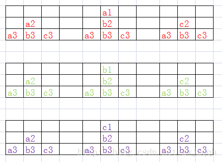

实例

```sql
--查出所有子节点
select aa.account_id,lpad('    ', 5*level - 1) || aa.account_name tree,
       SYS_CONNECT_BY_PATH(aa.account_id, '/') tree_path
  from vc_account aa
 start with aa.account_id = '010000010927'
connect by prior aa.account_id =   aa.parent_account_id
 order siblings by aa.account_id;
 -----------------------------------
--ACCOUNT_ID	TREE						TREE_PATH
--010000010927	 华南外贸有限公司			 /010000010927
--010000010928	   华南外贸有限公司11		 /010000010927/010000010928
--010000010962	     华南外贸有限公司		 /010000010927/010000010928/010000010962
--030000010929	     李一					 /010000010927/010000010928/030000010929
--030000010930	     李二					 /010000010927/010000010928/030000010930
--010000010972	   华南外贸有限公司一分部	   /010000010927/010000010972
--030000010973	     周永平				/010000010927/010000010972/030000010973
--030000010961	   郑云东					/010000010927/030000010961
-------------------------------------------
 
 ---
---查出所有父节点
select aa.account_id,lpad('    ', 5*level - 1) || aa.account_name tree,
       SYS_CONNECT_BY_PATH(aa.account_id, '/') tree_path
  from vc_account aa
 start with aa.account_id = '030000010929'
connect by  aa.account_id =  prior aa.parent_account_id
 order siblings by aa.account_id;
 ----------------------------------
-- ACCOUNT_ID	TREE						TREE_PATH
--030000010929	    李一						/030000010929
--010000010928	         华南外贸有限公司11		/030000010929/010000010928
--010000010927	              华南外贸有限公司	/030000010929/010000010928/010000010927
------------------------------------
```


### 一个select 多次插入

```SQL
--全 表插入
insert all into table1 values() into table2 values() select * from table
--条件插入
insert all when condition1 then into table1 values() when condition2 then into table2 values() select * from table
--或者
insert all when condition1 then into table1 values() else into table2 values() select * from table
-----------------------------------
--区别：该方法中源表table的每条记录只会被插入一次，即使同时满足多个条件也不会重复插入
insert first when condition1 then into table1 values() when condition2 then into table2 values() select * from table
```


#### 示例

```sql

  INSERT ALL WHEN ERR_CODE = '000000' THEN INTO QS_EPS_TRADE_LINE_HIS
    (CARD_NO, deal_status, PAY_TYPE, ERR_CODE, reprocess_status)
  VALUES
    (CARD_NO, deal_status, PAY_TYPE, ERR_CODE, reprocess_status)
	WHEN ERR_CODE = '000014' or reprocess_status in
    ('5', '8') THEN INTO QS_EPS_TRADE_LINE_HIS_ERR
    (CARD_NO, deal_status, PAY_TYPE, ERR_CODE, reprocess_status)
  VALUES
    (CARD_NO, deal_status, PAY_TYPE, ERR_CODE, reprocess_status)
	WHEN
    (ERR_CODE = '000000' or reprocess_status in ('5', '8')) and
    (PAY_TYPE <> 'UNIION' OR PAY_TYPE IS NULL) AND deal_status <> '0'
	THEN INTO QS_AGGR_CARD_BUSSINESS 
    (CARD_NO )
  VALUES
    (CARD_NO)
    SELECT CARD_NO, deal_status, PAY_TYPE, ERR_CODE, reprocess_status
      FROM QS_EPS_TRADE_LINE_QUEUE;

```


### 排序

```sql
--在Oracle官方文档中说明，null值在排序过程是个比较特殊的值类型，默认情况下排序时把它看成了最大值了，也就是说在排序的时候，当排序的记录中出现了Null值，默认是，升序排列在最后，反过来在最前，那么也可以程序自己来定义它前后。

--1、排在最前：
select xx from student order by xx nulls first;
--2、排在最后
select xx from student order by xx nulls last;
```

### 自定义orderby

```sql
select t.*,trunc(qs_deal_time) from zhonghang.qs_trade_err_review_que t
    order by decode(reprocess_status,'6',1,'2',2,'4',3,'7',4,'3',5,'5',6,'8',7,'0',8,9)
--根据decode转换值，进而自定义排序
```


### 分区

range

list

hash

```sql
P_SQL := 'alter table ' || V_TABLE || ' split partition  ' ||
		 P_MAX_NAME || ' at(to_date(''' || P_DATE ||
		 ''', ''yyyymmdd'')) into (partition ' || P_PARTITION_NAME ||
		 ',partition ' || P_MAX_NAME || ' )';
```

其他

```sql
--删除
ALTER TABLE SALES DROP PARTITION P3;
--合并
ALTER TABLE SALES MERGE PARTITIONS P1,P2 INTO PARTITION P2;
--拆分
ALTER TABLE SALES SBLIT PARTITION P2 AT(TO_DATE('2003-02-01','YYYY-MM-DD')) INTO (PARTITION P21,PARTITION P22);
--在hash分区中，增加分区后重新hash数据到新分区
ALTER TABLE SALES COALESCA PARTITION;
--重命名
ALTER TABLE SALES RENAME PARTITION P21 TO P2;
--查看所有分区
SELECT * FROM useR_TAB_PARTITIONS WHERE TABLE_NAME='tableName' 
```


### 自定义对象

```sql
--创建对象
CREATE OR REPLACE TYPE JF_RULE_FOR_ORDER_OBJECT AS OBJECT
(
  P_REC_RULE_ID       VARCHAR2(14),
  P_REC_LIMIT_RULE_ID VARCHAR2(14),
  P_REC_ADD_JF        NUMBER(12, 2),
  P_EXC_FLAG          CHAR(1)

)
--创建table类型，元素为刚才创建的对象
CREATE OR REPLACE TYPE JF_RULE_FOR_ORDER_TABLE_TYPE AS TABLE OF JF_RULE_FOR_ORDER_OBJECT
--使用
P_QS_JF_COLLECT JF_RULE_FOR_ORDER_TABLE_TYPE;
SELECT JF_RULE_FOR_ORDER_OBJECT(B.STATION_PERIOD_RULE_ID,
							  c.integral_excp_rule_id,
							  NULL,
							  NULL)
BULK COLLECT --减少loop开销
INTO P_QS_JF_COLLECT --声明的table类型
FROM PC_STATION_PERIOD_RULE B--真实 表
```


### select  bulk collect into

```sql

通过bulk collect减少loop处理的开销 
 
采用bulk collect可以将查询结果一次性地加载到collections中。 
而不是通过cursor一条一条地处理。 
可以在select into,fetch into,returning into语句使用bulk collect。 
注意在使用bulk collect时，所有的into变量都必须是collections. 
 
 
举几个简单的例子： 
--在select into语句中使用bulk collect 
DECLARE 
TYPE SalList IS TABLE OF emp.sal%TYPE; 
sals SalList; 
BEGIN 
-- Limit the number of rows to 100. 
SELECT sal BULK COLLECT INTO sals FROM emp 
WHERE ROWNUM <= 100; 
-- Retrieve 10% (approximately) of the rows in the table. 
SELECT sal BULK COLLECT INTO sals FROM emp SAMPLE 10; 
END;
```


### ROWID

ROWID：数据库中行的全局唯一地址

对于数据中的每一行，rowid伪列返回行的地址。rowid值主要包含以下信息：

- 对象的数据对象编号
- 该行所在的数据文件中的数据块
- 该行中数据块的位置（第一行是0）
- 数据行所在的数据文件（第一个文件是1）。该文件编号是相对于表空间。

通常来说，一个rowid值唯一标识数据中的一行。然而，存储在同一聚簇中不同的表可以有相同的rowid。

- OOOOOO：数据对象编号（6位显示）
- FFF：相关数据文件编号（3位显示）
- BBBBBB：数据块编号（6位显示）
- RRR：数据块中行编号（3位显示）

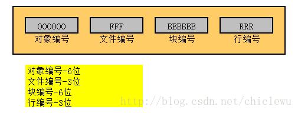

```sql
--1、使用sql
select eps_water_no,
       t.qs_deal_time,
       rowid,
       dbms_rowid.rowid_row_number(rowid) row_number, --行号
			 dbms_rowid.rowid_block_number(rowid) block_id, --数据块号
			 dbms_rowid.rowid_object(rowid) object_id, --行号
       DBMS_ROWID.ROWID_RELATIVE_FNO(rowid) file_id --文件号
  from qs_eps_trade_line_his t;
  
--2、使用脚本
  -- Created on 2020-07-31 by MH 
declare 
    -- Local variables here
    i integer;
    l_rowid  varchar2(200);---数据的rowid
    ls_my_rowid     varchar2(200);

    rowid_type     number;
    object_number     number;
    relative_fno     number;
    block_number     number;
    row_number     number;
 
begin
     l_rowid:='AAAqv5AAUAACNgrAAA';

     dbms_rowid.rowid_info(l_rowid,rowid_type,object_number,relative_fno, block_number, row_number);
     ls_my_rowid := 'Object# is      :'||to_char(object_number)||chr(10)||
                                    'Relative_fno is :'||to_char(relative_fno) ||chr(10)||
                                    'Block number is :'||to_char(block_number) ||chr(10)||
                                    'Row number is   :'||to_char(row_number);
     dbms_output.put_line(ls_my_rowid);
     --return ls_my_rowid ;
end;

--3、使用存储过程
 
create or replace function get_rowid(l_rowid in varchar2) return varchar2 is
 ls_my_rowid   varchar2(200);
 rowid_type    number;
 object_number number;
 relative_fno  number;
 block_number  number;
 row_number    number;
 
begin
 dbms_rowid.rowid_info(l_rowid,
											 rowid_type,
											 object_number,
											 relative_fno,
											 block_number,
											 row_number);
 ls_my_rowid := 'Object# is      :' || to_char(object_number) || chr(10) ||
								'Relative_fno is :' || to_char(relative_fno) || chr(10) ||
								'Block number is :' || to_char(block_number) || chr(10) ||
								'Row number is   :' || to_char(row_number);
 return ls_my_rowid;
end;

--sql中调用存储过程
select empno,get_rowid(rowid) as content  from emp where empno=7788;
```


### (+)的使用

```sql
select * from t_A a left join t_B b on a.id = b.id;
或
select * from t_A a left outer join t_B b on a.id = b.id;
--使用+号
Select * from t_A a,t_B b where a.id=b.id(+);
--用（+）来实现， 这个+号可以这样来理解： + 表示补充，即哪个表有加号，这个表就是匹配表。
--如果加号写在右表，左表就是全部显示，所以是左连接。
```


---

## sql优化[权威官网](https://docs.oracle.com/cd/B10500_01/server.920/a96533/optimops.htm#721) [还是官网](https://docs.oracle.com/database/121/TGSQL/tgsql_interp.htm#TGSQL279) 

### 官方示例

```sql
EXPLAIN PLAN FOR
SELECT e.employee_id, j.job_title, e.salary, d.department_name
    FROM employees e, jobs j, departments d
    WHERE  e.employee_id < 103
       AND e.job_id = j.job_id 
       AND e.department_id = d.department_id;
```

#### *Example 1-4 EXPLAIN PLAN Output*

```sql
-----------------------------------------------------------------------------------
| Id  | Operation                     |  Name        | Rows  | Bytes | Cost (%CPU)|
-----------------------------------------------------------------------------------
|   0 | SELECT STATEMENT              |              |     3 |   189 |    10  (10)|
|   1 |  NESTED LOOPS                 |              |     3 |   189 |    10  (10)|
|   2 |   NESTED LOOPS                |              |     3 |   141 |     7  (15)|
|*  3 |    TABLE ACCESS FULL          | EMPLOYEES    |     3 |    60 |     4  (25)|
|   4 |    TABLE ACCESS BY INDEX ROWID| JOBS         |    19 |   513 |     2  (50)|
|*  5 |     INDEX UNIQUE SCAN         | JOB_ID_PK    |     1 |       |            |
|   6 |   TABLE ACCESS BY INDEX ROWID | DEPARTMENTS  |    27 |   432 |     2  (50)|
|*  7 |    INDEX UNIQUE SCAN          | DEPT_ID_PK   |     1 |       |            |
-----------------------------------------------------------------------------------

Predicate Information (identified by operation id):
---------------------------------------------------
   3 - filter("E"."EMPLOYEE_ID"<103)
   5 - access("E"."JOB_ID"="J"."JOB_ID")
   7 - access("E"."DEPARTMENT_ID"="D"."DEPARTMENT_ID")
```

#### *Graphical View of SQL Explain Plan in SQL Scratchpad*

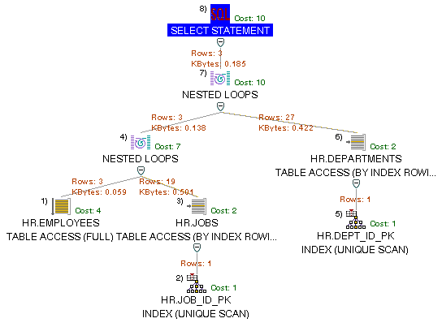


#### Steps in the Execution Plan

> - The following steps in **Example 1-4** physically retrieve data from an object in the database:
>   - Step 3 reads all rows of the `employees` table.
>   - Step 5 looks up each `job_id` in `JOB_ID_PK` index and finds the rowids of the associated rows in the `jobs` table.
>   - Step 4 retrieves the rows with rowids that were returned by Step 5 from the `jobs` table.
>   - Step 7 looks up each `department_id` in `DEPT_ID_PK` index and finds the rowids of the associated rows in the `departments` table.
>   - Step 6 retrieves the rows with rowids that were returned by Step 7 from the `departments` table.
> - The following steps in **Example 1-4** operate on rows returned by the previous row source:
>   - Step 2 performs the nested loop operation on `job_id` in the `jobs` and `employees` tables, accepting row sources from Steps 3 and 4, joining each row from Step 3 source to its corresponding row in Step 4, and returning the resulting rows to Step 2.
>   - Step 1 performs the nested loop operation, accepting row sources from Step 2 and Step 6, joining each row from Step 2 source to its corresponding row in Step 6, and returning the resulting rows to Step 1.

#### 说人话

* 根据explain plain 的层次结构，画出对应的树形图。
* 从树形图最底部开始执行，或者说从table中最靠右的开始执行。同一层级则从上往下执行。

>  **Example 1-4** 执行理解
>
> * 第3步，全表扫描获取`"E"."EMPLOYEE_ID"<103`的数据
> * 第4以及5步，首先第5步是通过`"E"."JOB_ID"="J"."JOB_ID"`找到对应的索引，然后第4步在通过索引的rowid获取该行的在`JOBS`表数据。
> * 第2步，做一次`EMPLOYEES`与`JOBS`的`NESTED LOOPS` 
> * 第6及7步，与第4以及第5步一样
> * 第1步，与第2不一样
> * 第0步，返回数据

所以`from employees e, jobs j, departments d`，这种形式并不是：先执行from做连接后，再执行where，否则三个表连接后黄花菜都凉了，而且连接的大部分数据其实在where条件中并不需要。先使用where条件对`employees`过滤，在做连接，可以最小化工作量。

### sql优化理论

sql执行流程

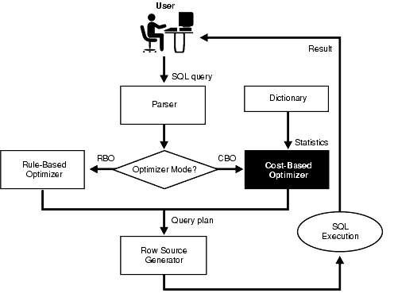

> The Oracle server provides the cost-based (CBO) and rule-based (RBO) optimization. In general, use the cost-based approach.  The optimizer determines the cost of a plan based on:
>
> - Table and column statistics。These statistics are stored in the SYS.TBL_STATS and SYS.COL_STATS tables
> - Metadata information (such as referential integrity, primary key)
> - Index choices (including automatic creation of temporary indexes)
> - Scan methods (full table scan, rowid lookup, range index scan, bitmap index lookup, hash index lookup)
> - Join algorithm choice (nested loop joins, nested loop joins with indexes, or merge join)

#### scan类型

##### index unique scan  

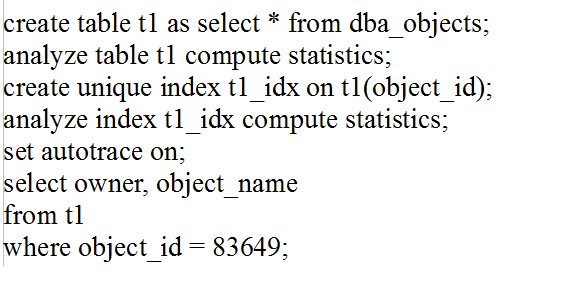

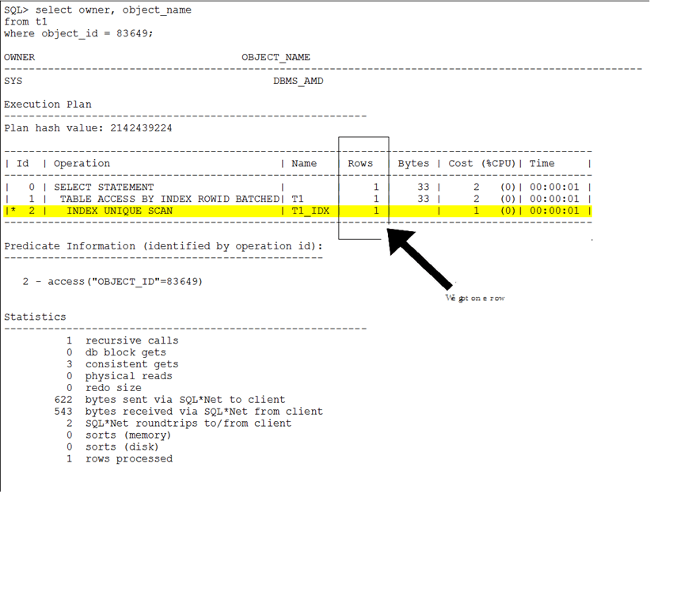

##### INDEX RANGE SCAN 

```sql
--Now lets try this with a normal btree index.
SQL> drop index t1_idx;
Index dropped.
SQL> create index t1_idx on t1(object_id);
Index created.
SQL> analyze index t1_idx compute statistics;
Index analyzed.
```

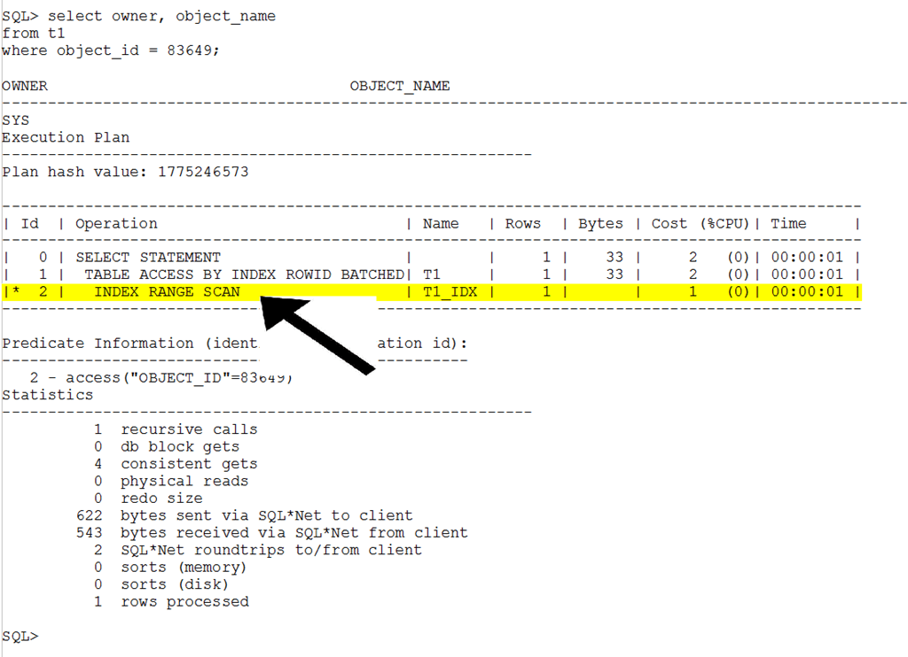

> 改为btree索引（非唯一索引）后，这里变成了范围扫描
>
> 其他，比如在索引上使用between或者大于、小于等，也会导致变成范围索引


##### Index Fast Full Scan


##### Index Full Scan


##### Index Skip Scan


#### join类型：[动图来源](https://bertwagner.com/2019/01/02/hash-match-join-internals/)

##### nested loop join


##### hash join


##### merge join

> merge join 强调的是两个需要连接的表是已排序的

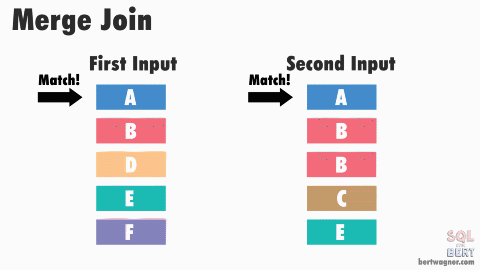

#### 优化总结：

1. 查询首先考虑在where和orderby 上创建索引

2. 避免where中对null进行判断，因为会放弃索引走全表扫描

3. 避免使用<>等号，!=查询

   ```sql
   column<>'aaa'，改成column<'aaa' or column>'aaa'
   ```

   

4. 对like使用两边的`like %xxxx%`，而`xxx%`走索引

5. 对索引字段使用函数，索引失效

6. or语句使用不当会引起全表扫描，比如where A=：1 or B=：2，A上有索引，B上没索引，则比较B=：2时会重新开始全表扫描

7. 一个表的索引最好不超过6个，insert和update都要重构索引

8. 组合索引

9. 杜绝`select count(*) from table；`

10. 避免修改clustered索引，因为该记录是表记录的物理存储顺序，修改将导致耗费巨大资源

11. 不要使用select *  from table

12. 先truncate table，在drop table，避免长时间锁表

13. 避免大的事务，一个大的处理必须拆分

    ```
    while(1){
    	sql: count=delete from table where date< '2012-01-01'limit 100
    	if(count ==0) break;
    }
    ```

    

14. 优化规则

    > * 减少数据库访问
    >
    > * 返回更少的数据
    >
    >   * 数据分页，rownum分页和rowid分页
    >   * 返回只需要的字段
    >
    > * 减少交互次数
    >
    >   * 批量插入
    >   * in 的个数不超过1000
    >   * 使用jdbc时，数据库时根据statement设置的fetch_size，不断从数据库返回，所以可以适当增大，参考值128
    >   * 使用存储过程
    >   * 优化业务逻辑
    >   * 使用Ressult_set游标处理记录
    >
    > * 较少服务器cpu、内存开销
    >
    >   * 使用绑定变量
    >
    >     因为数据库执行sql，首先通过sql的字符串判断是否存在该sql的缓存，如果存在直接执行，所以
    >
    >     使用select * from table的形式，可以避免检查以及使用原来的执行计划
    >
    >     ```java
    >     preparestatement.setint(1,'abc')--使用绑定变量
    >         select *from table  c1='abc'--未使用绑定变量
    >     ```
    >
    >   * 大量复杂的计划放在客户端执行
    >
    > * 利用更多的资源

15. 创建正确的索引

    > * 索引类型：B树、位图、全文索引。位图索引适用于数据仓库
    > * B树索引包括：组合索引、反向索引、函数索引
    >
    > 不适用索引的情况：
    >
    > ```sql
    > 1、<>，not in
    > 2、左边使用运算，函数，+-号等
    > 3、like，以%开头
    > 4、is null 
    > 5、隐式转换，比如字符与数字比较
    > 6、组合索引未使用最左列
    > ```
    >
    > 索引对insert 降低56%的性能
    >
    > 索引对update降低47%的性能
    >
    > 索引对delete降低29%的性能

16. 

17. 

    

## [explain](https://docs.oracle.com/cd/B10500_01/server.920/a96533/ex_plan.htm)

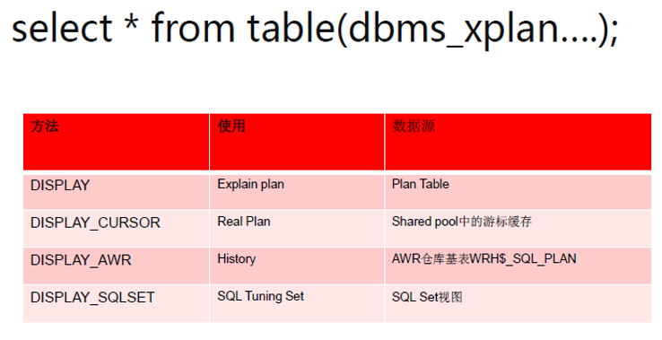

#### 多表连接方式:[来源](https://blog.csdn.net/tianlesoftware/article/details/5826546) 


#### 示例分析1

第一种

```sql
Plan hash value: 4158802001
 
-----------------------------------------------------------------------------------------------------------
| Id  | Operation                      | Name                     | Rows  | Bytes | Cost (%CPU)| Time     |
-----------------------------------------------------------------------------------------------------------
|   0 | SELECT STATEMENT               |                          |     1 |   164 |     5   (0)| 00:00:01 |
|   1 |  NESTED LOOPS OUTER            |                          |     1 |   164 |     5   (0)| 00:00:01 |
|   2 |   NESTED LOOPS OUTER           |                          |     1 |   117 |     4   (0)| 00:00:01 |
|   3 |    NESTED LOOPS OUTER          |                          |     1 |    70 |     3   (0)| 00:00:01 |
|   4 |     TABLE ACCESS BY INDEX ROWID| QS_ACCOUNT_LAST_LIST     |     1 |    23 |     2   (0)| 00:00:01 |
|*  5 |      INDEX UNIQUE SCAN         | IDX_QS_ACCOUNT_LAST_LIST |     1 |       |     1   (0)| 00:00:01 |
|   6 |     TABLE ACCESS BY INDEX ROWID| SYS_DEPT                 |     1 |    47 |     1   (0)| 00:00:01 |
|*  7 |      INDEX UNIQUE SCAN         | SYS_C009165              |     1 |       |     0   (0)| 00:00:01 |
|   8 |    TABLE ACCESS BY INDEX ROWID | SYS_DEPT                 |     1 |    47 |     1   (0)| 00:00:01 |
|*  9 |     INDEX UNIQUE SCAN          | SYS_C009165              |     1 |       |     0   (0)| 00:00:01 |
|  10 |   TABLE ACCESS BY INDEX ROWID  | SYS_DEPT                 |     1 |    47 |     1   (0)| 00:00:01 |
|* 11 |    INDEX UNIQUE SCAN           | SYS_C009165              |     1 |       |     0   (0)| 00:00:01 |
-----------------------------------------------------------------------------------------------------------
 
Predicate Information (identified by operation id):
---------------------------------------------------
 
   5 - access("T"."ACCOUNT_ID"='111111')
   7 - access("T"."HEAD_COMPANY_NO"="F"."DEPT_ID"(+))
   9 - access("T"."COMPANY_NO"="E"."DEPT_ID"(+))
  11 - access("T"."STATION_NO"="S"."DEPT_ID"(+))

```

```sql
 select t.head_company_no,
       t.company_no,
       t.station_no,
       s.dept_name as station_name,
			 e.dept_name as company_name,
			 f.dept_name as head_name,
       t.account_id
  from qs_account_last_list t
  left join sys_dept s
	on (t.station_no =s.dept_id)
	  left join sys_dept e
	on (t.company_no =e.dept_id)
	  left join sys_dept f
	on (t.head_company_no =f.dept_id)
	where account_id ='111111';
--等同于，两者执行计划是一样的
explain plan for (
select t.eps_water_no,
       t.dept_no,
       t.card_no,
       s.dept_name    as station_name,
       e.dept_name    as company_name,
       f.dept_name    as head_name
  from (select a.eps_water_no,
               a.dept_no,
               a.card_no,
               a.station_no,
               a.company_no,
               a.head_company_no
          from zhonghang.qs_eps_trade_line_his a
         where (HEAD_COMPANY_NO = '4N01' or COMPANY_NO = '4N01' or
               station_no = '4N01')) t
  left join zhonghang.sys_dept s
    on (t.station_no = s.dept_id)
  left join zhonghang.sys_dept e
    on (t.company_no = e.dept_id)
  left join zhonghang.sys_dept f
    on (t.head_company_no = f.dept_id)
 );
```

> 第5步，先使用索引执行：`"T"."ACCOUNT_ID"='111111'`(即where条件)，获取所需要的数据，在做关联
>


第二种

```sql
Plan hash value: 1950513092
 
--------------------------------------------------------------------------------------------------------
| Id  | Operation                   | Name                     | Rows  | Bytes | Cost (%CPU)| Time     |
--------------------------------------------------------------------------------------------------------
|   0 | SELECT STATEMENT            |                          |     1 |    23 |     5   (0)| 00:00:01 |
|   1 |  TABLE ACCESS BY INDEX ROWID| SYS_DEPT                 |     1 |    47 |     1   (0)| 00:00:01 |
|*  2 |   INDEX UNIQUE SCAN         | SYS_C009165              |     1 |       |     0   (0)| 00:00:01 |
|   3 |  TABLE ACCESS BY INDEX ROWID| SYS_DEPT                 |     1 |    47 |     1   (0)| 00:00:01 |
|*  4 |   INDEX UNIQUE SCAN         | SYS_C009165              |     1 |       |     0   (0)| 00:00:01 |
|   5 |  TABLE ACCESS BY INDEX ROWID| SYS_DEPT                 |     1 |    47 |     1   (0)| 00:00:01 |
|*  6 |   INDEX UNIQUE SCAN         | SYS_C009165              |     1 |       |     0   (0)| 00:00:01 |
|   7 |  TABLE ACCESS BY INDEX ROWID| QS_ACCOUNT_LAST_LIST     |     1 |    23 |     2   (0)| 00:00:01 |
|*  8 |   INDEX UNIQUE SCAN         | IDX_QS_ACCOUNT_LAST_LIST |     1 |       |     1   (0)| 00:00:01 |
--------------------------------------------------------------------------------------------------------
 
Predicate Information (identified by operation id):
---------------------------------------------------
 
   2 - access("S"."DEPT_ID"=:B1)
   4 - access("S"."DEPT_ID"=:B1)
   6 - access("S"."DEPT_ID"=:B1)
   8 - access("ACCOUNT_ID"='111111')

```

sql

```sql
select t.head_company_no,
       t.company_no,
       t.station_no,
       (select s.dept_name from sys_dept s where t.station_no =s.dept_id )as station_name,
		(select s.dept_name from sys_dept s where t.company_no =s.dept_id ) as company_name,
		(select s.dept_name from sys_dept s where t.head_company_no =s.dept_id ) as head_name,
       t.account_id
  from qs_account_last_list t
  where account_id ='111111';
  
--等同于，两个执行计划是一样的
explain plan for (
select 
	t.eps_water_no,
	t.dept_no,
	t.card_no,
	(select a.dept_name from zhonghang.sys_dept a  where a.dept_id = t.head_company_no) as  head_company_no,
	(select a.dept_name from zhonghang.sys_dept a  where a.dept_id = t.company_no) as  company_no,
	(select a.dept_name from zhonghang.sys_dept a  where a.dept_id = t.station_no) as  station_no
   from (select a.eps_water_no,
               a.dept_no,
               a.card_no,
               a.station_no,
               a.company_no,
               a.head_company_no
          from zhonghang.qs_eps_trade_line_his a
         where (HEAD_COMPANY_NO = '4N01' or COMPANY_NO = '4N01' or
               station_no = '4N01'))t

);
select * from table(dbms_xplan.display());
```

> * 同层级的从上往下执行
>
> 所以解读为，`SYS_DEPT`索引扫描关联`SYS_DEPT`，在索引扫描关联`SYS_DEPT`，再索引扫描关联`QS_ACCOUNT_LAST_LIST`，
>
> 最后执行where条件

第三种

```sql
Plan hash value: 590278108
 
-----------------------------------------------------------------------------------------------------------
| Id  | Operation                      | Name                     | Rows  | Bytes | Cost (%CPU)| Time     |
-----------------------------------------------------------------------------------------------------------
|   0 | SELECT STATEMENT               |                          |     1 |   164 |     5   (0)| 00:00:01 |
|   1 |  NESTED LOOPS                  |                          |     1 |   164 |     5   (0)| 00:00:01 |
|   2 |   NESTED LOOPS                 |                          |     1 |   117 |     4   (0)| 00:00:01 |
|   3 |    NESTED LOOPS                |                          |     1 |    70 |     3   (0)| 00:00:01 |
|*  4 |     TABLE ACCESS BY INDEX ROWID| QS_ACCOUNT_LAST_LIST     |     1 |    23 |     2   (0)| 00:00:01 |
|*  5 |      INDEX UNIQUE SCAN         | IDX_QS_ACCOUNT_LAST_LIST |     1 |       |     1   (0)| 00:00:01 |
|   6 |     TABLE ACCESS BY INDEX ROWID| SYS_DEPT                 |     1 |    47 |     1   (0)| 00:00:01 |
|*  7 |      INDEX UNIQUE SCAN         | SYS_C009165              |     1 |       |     0   (0)| 00:00:01 |
|   8 |    TABLE ACCESS BY INDEX ROWID | SYS_DEPT                 |     1 |    47 |     1   (0)| 00:00:01 |
|*  9 |     INDEX UNIQUE SCAN          | SYS_C009165              |     1 |       |     0   (0)| 00:00:01 |
|  10 |   TABLE ACCESS BY INDEX ROWID  | SYS_DEPT                 |     1 |    47 |     1   (0)| 00:00:01 |
|* 11 |    INDEX UNIQUE SCAN           | SYS_C009165              |     1 |       |     0   (0)| 00:00:01 |
-----------------------------------------------------------------------------------------------------------
 
Predicate Information (identified by operation id):
---------------------------------------------------
 
   4 - filter("T"."STATION_NO" IS NOT NULL AND "T"."COMPANY_NO" IS NOT NULL AND 
              "T"."HEAD_COMPANY_NO" IS NOT NULL)
   5 - access("ACCOUNT_ID"='111111')
   7 - access("T"."HEAD_COMPANY_NO"="F"."DEPT_ID")
   9 - access("T"."COMPANY_NO"="E"."DEPT_ID")
  11 - access("T"."STATION_NO"="S"."DEPT_ID")

```

sql

```sql
select t.head_company_no,
       t.company_no,
       t.station_no,
       s.dept_name as station_name,
	   e.dept_name as company_name,
	   f.dept_name as head_name,
       t.account_id
  from qs_account_last_list t,sys_dept s,sys_dept e,sys_dept f
	where  t.station_no =s.dept_id and t.company_no =e.dept_id and t.head_company_no =f.dept_id 
	and account_id ='111111';
```

> 与第一种相似，但是过滤掉`null`值
>

第四种

```sql

```

> 总结：第二种方式是效果最差的，其余三种的效果类似。
>
> 但实际测试结果，两者时间基本一致，13万的数据量。应 注意到第二种方式没有nested loop


## 存储过程

### 游标


### 集合

### 对象

1.使用对象存储查询结果，并对对象执行sql查询

```sql
---创建对象
create or replace type JF_RULE_FOR_ORDER_OBJECT as object
(
       P_REC_RULE_ID VARCHAR2(14),
       P_REC_ADD_JF NUMBER(12,2)
 
)
--为对象创建表，即表的数据结构是声明 的对象
--实际被认为是集合类型
CREATE OR REPLACE TYPE JF_RULE_FOR_ORDER_TABLE_TYPE AS TABLE OF JF_RULE_FOR_ORDER_OBJECT

--存储过程使用案例
DECLARE 

  I INTEGER;
  JF_RUID JF_RULE_FOR_ORDER_TABLE_TYPE ;
  JF_RUID2 JF_RULE_FOR_ORDER_TABLE_TYPE ;
BEGIN
  -- TEST STATEMENTS HERE
 SELECT 
 	--下面这对相当于new object()
 	--STATION_PERIOD_RULE_ID，PC_AMOUNT是表PC_PERIOD_AMOUNT的字段
 	JF_RULE_FOR_ORDER_OBJECT(STATION_PERIOD_RULE_ID,PC_AMOUNT)
 	--批量存入JF_RUID中，JF_RUID声明为集合类型了
 	BULK COLLECT INTO JF_RUID
 FROM PC_PERIOD_AMOUNT ;
 --遍历集合
 --此处需要先判断JF_RUID集合是否为null，否则为null时候回报错
 FOR J IN 1..JF_RUID.COUNT LOOP   
   	  DBMS_OUTPUT.PUT_LINE(JF_RUID(J).P_REC_RULE_ID); 
      --为集合字段复制
      JF_RUID(J).P_REC_ADD_JF :=TO_NUMBER(SUBSTR(JF_RUID(J).P_REC_RULE_ID,13,1));
 END LOOP;
  
FOR REC IN (
    SELECT 
    	* 
    FROM 
    --下面这句吧JF_RUID，转换为可以使用sql形式
    TABLE(CAST(JF_RUID AS JF_RULE_FOR_ORDER_TABLE_TYPE)) 
    ORDER BY P_REC_ADD_JF
) LOOP
   DBMS_OUTPUT.PUT_LINE(REC.P_REC_RULE_ID ||'--'||rec.P_REC_ADD_JF);                  
END LOOP;
 
 DBMS_OUTPUT.PUT_LINE('结束');   
END;
 

```

> *要使用*TABLE(CAST(JF_RUID AS JF_RULE_FOR_ORDER_TABLE_TYPE))必须显示使用：
>
> <font color=red>create type as。。。。而不能使用type is 。。。</font>


### Exception异常

```sql
CREATE OR REPLACE PROCEDURE procedure_name(p in date,q in number ,r out varchar2)
is
	
begin
EXCEPTION
  WHEN OTHERS THEN
     rollback;
    V_BACKTRACE := SUBSTR(DBMS_UTILITY.FORMAT_ERROR_BACKTRACE, 0, 300);
    P_ERRMSG    := '异常信息:' || SQLERRM || ',错误码:' || SQLCODE || ',' ||
                   V_BACKTRACE;
    DBMS_OUTPUT.PUT_LINE(P_ERRMSG);
    COMMIT;
    RETURN;
END procedure_name;
```


## 工具类sql

#### 查看explain计划

```sql
explain plan for {sql}；
select * from table(dbms_xplan.display());
```

#### 锁表

```sql
select * from v$session t1, v$locked_object t2 where t1.sid = t2.SESSION_ID; 
alter system kill session '24,30865' ;
```


#### 分区查询相关常用sql

```sql
--查看分区表
select * from all_part_tables
--查看分区
select * from all_part_partitions
--查看分区字段
select * from all_part_key_columns
--显示数据库所有分区表的信息：
select * from dba_part_tables
--显示当前用户可访问的所有分区表信息:
select * from all_part_tables
--显示当前用户所有分区表的信息：
select * from user_part_tables
--显示表分区信息 显示数据库所有分区表的详细分区信息：
select * from dba_tab_partitions
--显示当前用户可访问的所有分区表的详细分区信息：
select * from all_tab_partitions
--显示当前用户所有分区表的详细分区信息：
select * from user_tab_partitions
--显示子分区信息 显示数据库所有组合分区表的子分区信息：
select * from dba_tab_subpartitions
--显示当前用户可访问的所有组合分区表的子分区信息：
select * from all_tab_subpartitions
--显示当前用户所有组合分区表的子分区信息：
select * from user_tab_subpartitions
--显示分区列 显示数据库所有分区表的分区列信息：
select * from dba_part_key_columns
--显示当前用户可访问的所有分区表的分区列信息：
select * from all_part_key_columns
--显示当前用户所有分区表的分区列信息：
select * from user_part_key_columns
--显示子分区列 显示数据库所有分区表的子分区列信息：
select * from dba_subpart_key_columns
--显示当前用户可访问的所有分区表的子分区列信息：
select * from all_subpart_key_columns
--显示当前用户所有分区表的子分区列信息：
select * from user_subpart_key_columns
--怎样查询出oracle数据库中所有的的分区表
select * from user_tables a where a.partitioned='YES'
--删除一个表的数据是
truncate table table_name;
--删除分区表一个分区的数据是
alter table table_name truncate partition p5;
```

# 故障排查

## 1. 定时任务卡死，一直不执行

说明：

1. 输出线程信息

   ```shell
   jstack -l 91567 
   "pool-1-thread-1" #18 prio=5 os_prio=0 tid=0x00007f576c96a800 nid=0x165e9 runnable [0x00007f571b4fc000]
      java.lang.Thread.State: RUNNABLE
   	at java.net.SocketInputStream.socketRead0(Native Method)
   	at java.net.SocketInputStream.socketRead(SocketInputStream.java:116)
   	at java.net.SocketInputStream.read(SocketInputStream.java:171)
   	at java.net.SocketInputStream.read(SocketInputStream.java:141)
   	at oracle.net.ns.Packet.receive(Packet.java:300)
   	at oracle.net.ns.DataPacket.receive(DataPacket.java:106)
   	at oracle.net.ns.NetInputStream.getNextPacket(NetInputStream.java:315)
   	at oracle.net.ns.NetInputStream.read(NetInputStream.java:260)
   	at oracle.net.ns.NetInputStream.read(NetInputStream.java:185)
   	at oracle.net.ns.NetInputStream.read(NetInputStream.java:102)
   	at oracle.jdbc.driver.T4CSocketInputStreamWrapper.readNextPacket(T4CSocketInputStreamWrapper.java:124)
   	at oracle.jdbc.driver.T4CSocketInputStreamWrapper.read(T4CSocketInputStreamWrapper.java:80)
   	at oracle.jdbc.driver.T4CMAREngine.unmarshalUB1(T4CMAREngine.java:1137)
   	at oracle.jdbc.driver.T4CTTIfun.receive(T4CTTIfun.java:290)
   	at oracle.jdbc.driver.T4CTTIfun.doRPC(T4CTTIfun.java:192)
   	at oracle.jdbc.driver.T4C8Oall.doOALL(T4C8Oall.java:531)
   	at oracle.jdbc.driver.T4CCallableStatement.doOall8(T4CCallableStatement.java:204)
   	at oracle.jdbc.driver.T4CCallableStatement.executeForRows(T4CCallableStatement.java:1041)
   	at oracle.jdbc.driver.OracleStatement.doExecuteWithTimeout(OracleStatement.java:1329)
   	at oracle.jdbc.driver.OraclePreparedStatement.executeInternal(OraclePreparedStatement.java:3584)
   	at oracle.jdbc.driver.OraclePreparedStatement.execute(OraclePreparedStatement.java:3685)
   	- locked <0x00000000873cbdc0> (a oracle.jdbc.driver.T4CConnection)
   	at oracle.jdbc.driver.OracleCallableStatement.execute(OracleCallableStatement.java:4714)
   	- locked <0x00000000873cbdc0> (a oracle.jdbc.driver.T4CConnection)
   	at oracle.jdbc.driver.OraclePreparedStatementWrapper.execute(OraclePreparedStatementWrapper.java:1376)
   	at com.alibaba.druid.filter.FilterChainImpl.preparedStatement_execute(FilterChainImpl.java:3409)
   	at com.alibaba.druid.wall.WallFilter.preparedStatement_execute(WallFilter.java:627)
   	at com.alibaba.druid.filter.FilterChainImpl.preparedStatement_execute(FilterChainImpl.java:3407)
   	at com.alibaba.druid.filter.FilterEventAdapter.preparedStatement_execute(FilterEventAdapter.java:440)
   	at com.alibaba.druid.filter.FilterChainImpl.preparedStatement_execute(FilterChainImpl.java:3407)
   	at com.alibaba.druid.filter.FilterAdapter.preparedStatement_execute(FilterAdapter.java:1081)
   	at com.alibaba.druid.filter.FilterChainImpl.preparedStatement_execute(FilterChainImpl.java:3407)
   	at com.alibaba.druid.filter.FilterEventAdapter.preparedStatement_execute(FilterEventAdapter.java:440)
   	at com.alibaba.druid.filter.FilterChainImpl.preparedStatement_execute(FilterChainImpl.java:3407)
   	at com.alibaba.druid.proxy.jdbc.PreparedStatementProxyImpl.execute(PreparedStatementProxyImpl.java:167)
   	at com.alibaba.druid.pool.DruidPooledPreparedStatement.execute(DruidPooledPreparedStatement.java:497)
   	at org.apache.ibatis.executor.statement.CallableStatementHandler.query(CallableStatementHandler.java:68)
   	at org.apache.ibatis.executor.statement.RoutingStatementHandler.query(RoutingStatementHandler.java:79)
   	at org.apache.ibatis.executor.ReuseExecutor.doQuery(ReuseExecutor.java:60)
   	at org.apache.ibatis.executor.BaseExecutor.queryFromDatabase(BaseExecutor.java:324)
   	at org.apache.ibatis.executor.BaseExecutor.query(BaseExecutor.java:156)
   	at org.apache.ibatis.executor.CachingExecutor.query(CachingExecutor.java:109)
   	at com.github.pagehelper.PageInterceptor.intercept(PageInterceptor.java:108)
   	at org.apache.ibatis.plugin.Plugin.invoke(Plugin.java:61)
   	at com.sun.proxy.$Proxy124.query(Unknown Source)
   	at org.apache.ibatis.session.defaults.DefaultSqlSession.selectList(DefaultSqlSession.java:147)
   	at org.apache.ibatis.session.defaults.DefaultSqlSession.selectList(DefaultSqlSession.java:140)
   	at org.apache.ibatis.session.defaults.DefaultSqlSession.selectOne(DefaultSqlSession.java:76)
   	at sun.reflect.GeneratedMethodAccessor65.invoke(Unknown Source)
   	at sun.reflect.DelegatingMethodAccessorImpl.invoke(DelegatingMethodAccessorImpl.java:43)
   	at java.lang.reflect.Method.invoke(Method.java:498)
   	at org.mybatis.spring.SqlSessionTemplate$SqlSessionInterceptor.invoke(SqlSessionTemplate.java:426)
   	at com.sun.proxy.$Proxy84.selectOne(Unknown Source)
   	at org.mybatis.spring.SqlSessionTemplate.selectOne(SqlSessionTemplate.java:159)
   	at org.apache.ibatis.binding.MapperMethod.execute(MapperMethod.java:87)
   	at org.apache.ibatis.binding.MapperProxy.invoke(MapperProxy.java:57)
   	at com.sun.proxy.$Proxy94.callProduce(Unknown Source)
   	at com.qssystem.qsexe.procedure.service.QsProduceServiceImpl.callProduce(QsProduceServiceImpl.java:40)
   	at com.qssystem.qsexe.procedure.service.QsProduceServiceImpl$$FastClassBySpringCGLIB$$9c7ed079.invoke(<generated>)
   	at org.springframework.cglib.proxy.MethodProxy.invoke(MethodProxy.java:204)
   	at org.springframework.aop.framework.CglibAopProxy$CglibMethodInvocation.invokeJoinpoint(CglibAopProxy.java:746)
   	at org.springframework.aop.framework.ReflectiveMethodInvocation.proceed(Re
   ```

   关注一下两句

   ```xml
   at oracle.jdbc.driver.OraclePreparedStatement.execute(OraclePreparedStatement.java:3685)
   - locked <0x00000000873cbdc0> (a oracle.jdbc.driver.T4CConnection)
   at oracle.jdbc.driver.OracleCallableStatement.execute(OracleCallableStatement.java:4714)
   - locked <0x00000000873cbdc0> (a oracle.jdbc.driver.T4CConnection)
   ```

   

2. 查询数据库，发现锁表了

   ```sql
   --查询锁表记录
   select * from v$session t1, v$locked_object t2 where t1.sid = t2.SESSION_ID; 
   --根据sqlexeid，查询sql
   select t.* from v$sqltext t where t.sql_id='9aqhjfmupm8cw'; 
   SELECT C.CST_ID, C.CST_LEVEL FROM VC_CUSTOMER C WHERE C.CST_LEVEL <> '04' FOR UPDATE OF CST_LEVEL
   ```

   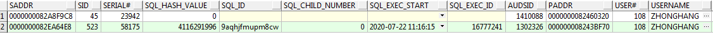

   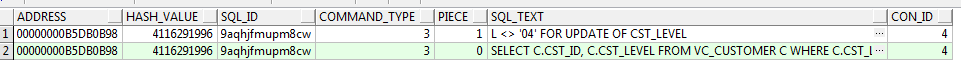

3. 并且sql_exe_start字段的时间与日志的时间吻合。判断为sql语句导致锁表

4. 执行kill命令，杀死会话

   ```sql
   alter system kill session '523,58175' ;--sid serial
   ```

5. 查询日志，继续没有打印

6. 停止运行java程序的脚本

   ```
   pid=`ps -ef | grep java | grep QsCommon.jar | awk '{print $2}'`
   kill -9 $pid
   ```

7. 重新启动程序，程序没有响应，并且卡死。没有启动日志输出

8. 再次输出线程栈信息

   ```shell
   #查看启动的java程序及pid
   jps -l
   #输出线程信息到文件中
   jstack 15187 >> /home/qs/log/problem2.t 
   ###发现输出信息与上面基本一样，如果不是tid不一致，我还以为上面停止运行的脚本出了问题
   
   "pool-1-thread-1" #18 prio=5 os_prio=0 tid=0x00007f37c0efd800 nid=0x3b8c runnable [0x00007f376f5fb000]
      java.lang.Thread.State: RUNNABLE
   	at java.net.SocketInputStream.socketRead0(Native Method)
   	at java.net.SocketInputStream.socketRead(SocketInputStream.java:116)
   	at java.net.SocketInputStream.read(SocketInputStream.java:171)
   	at java.net.SocketInputStream.read(SocketInputStream.java:141)
   	at oracle.net.ns.Packet.receive(Packet.java:300)
   	at oracle.net.ns.DataPacket.receive(DataPacket.java:106)
   	at oracle.net.ns.NetInputStream.getNextPacket(NetInputStream.java:315)
   	at oracle.net.ns.NetInputStream.read(NetInputStream.java:260)
   	at oracle.net.ns.NetInputStream.read(NetInputStream.java:185)
   	at oracle.net.ns.NetInputStream.read(NetInputStream.java:102)
   	at oracle.jdbc.driver.T4CSocketInputStreamWrapper.readNextPacket(T4CSocketInputStreamWrapper.java:124)
   	at oracle.jdbc.driver.T4CSocketInputStreamWrapper.read(T4CSocketInputStreamWrapper.java:80)
   	at oracle.jdbc.driver.T4CMAREngine.unmarshalUB1(T4CMAREngine.java:1137)
   	at oracle.jdbc.driver.T4CTTIfun.receive(T4CTTIfun.java:290)
   	at oracle.jdbc.driver.T4CTTIfun.doRPC(T4CTTIfun.java:192)
   	at oracle.jdbc.driver.T4C8Oall.doOALL(T4C8Oall.java:531)
   	at oracle.jdbc.driver.T4CCallableStatement.doOall8(T4CCallableStatement.java:204)
   	at oracle.jdbc.driver.T4CCallableStatement.executeForRows(T4CCallableStatement.java:1041)
   	at oracle.jdbc.driver.OracleStatement.doExecuteWithTimeout(OracleStatement.java:1329)
   	at oracle.jdbc.driver.OraclePreparedStatement.executeInternal(OraclePreparedStatement.java:3584)
   	at oracle.jdbc.driver.OraclePreparedStatement.execute(OraclePreparedStatement.java:3685)
   	- locked <0x0000000087156568> (a oracle.jdbc.driver.T4CConnection)
   	at oracle.jdbc.driver.OracleCallableStatement.execute(OracleCallableStatement.java:4714)
   	- locked <0x0000000087156568> (a oracle.jdbc.driver.T4CConnection)
   	at oracle.jdbc.driver.OraclePreparedStatementWrapper.execute(OraclePreparedStatementWrapper.java:1376)
   ###新增信息
   "OracleTimeoutPollingThread" #17 daemon prio=10 os_prio=0 tid=0x000000000213f800 nid=0x3b85 waiting on condition [0x00007f3794174000]
   java.lang.Thread.State: TIMED_WAITING (sleeping)
   at java.lang.Thread.sleep(Native Method)
   at oracle.jdbc.driver.OracleTimeoutPollingThread.run(OracleTimeoutPollingThread.java:150)
   
   "Druid-ConnectionPool-Destroy-1058609221" #16 daemon prio=5 os_prio=0 tid=0x00007f37c1e0b000 nid=0x3b7e waiting on condition [0x00007f3794275000]
   java.lang.Thread.State: TIMED_WAITING (sleeping)
   at java.lang.Thread.sleep(Native Method)
   at com.alibaba.druid.pool.DruidDataSource$DestroyConnectionThread.run(DruidDataSource.java:2768)
   
   "Druid-ConnectionPool-Create-1058609221" #15 daemon prio=5 os_prio=0 tid=0x00007f37c1e0a000 nid=0x3b7d waiting on condition [0x00007f3794376000]
   java.lang.Thread.State: WAITING (parking)
   at sun.misc.Unsafe.park(Native Method)
   - parking to wait for  <0x0000000087155d80> (a java.util.concurrent.locks.AbstractQueuedSynchronizer$ConditionObject)
   at java.util.concurrent.locks.LockSupport.park(LockSupport.java:175)
   at java.util.concurrent.locks.AbstractQueuedSynchronizer$ConditionObject.await(AbstractQueuedSynchronizer.java:2039)
   at com.alibaba.druid.pool.DruidDataSource$CreateConnectionThread.run(DruidDataSource.java:2672)
   ```

   

9. 再次查询orcle锁表情况，发现同一个sql再次导致锁表，并且serial与之前不一致

10. 再次执行kill session语句。

11. 此时java日志，打印连接断开的信息。

    ```shell
    ### Error querying database.  Cause: java.sql.SQLRecoverableException: ORA-00028: your session has been killed
    
    ### The error may exist in class path resource [mybatis/qsexe/QsProduceMapper.xml]
    ### The error may involve com.qssystem.qsexe.procedure.mapper.QsProduceMapper.callProduce-Inline
    ### The error occurred while setting parameters
    ### SQL: {call QS2_7010_CACCOUNT_UPGRADE01(             ?,             ?,             ?         )}
    ### Cause: java.sql.SQLRecoverableException: ORA-00028: your session has been killed
    
    ; ]; ORA-00028: your session has been killed
    ; nested exception is java.sql.SQLRecoverableException: ORA-00028: your session has been killed
    
    at org.springframework.jdbc.support.SQLExceptionSubclassTranslator.doTranslate(SQLExceptionSubclassTranslator.java:100)
    at org.springframework.jdbc.support.AbstractFallbackSQLExceptionTranslator.translate(AbstractFallbackSQLExceptionTranslato             r.java:72)
    at org.springframework.jdbc.support.AbstractFallbackSQLExceptionTranslator.translate(AbstractFallbackSQLExceptionTranslato             r.java:81)
    at org.mybatis.spring.MyBatisExceptionTranslator.translateExceptionIfPossible(MyBatisExceptionTranslator.java:74)
    at org.mybatis.spring.SqlSessionTemplate$SqlSessionInterceptor.invoke(SqlSessionTemplate.java:440)
    at com.sun.proxy.$Proxy84.selectOne(Unknown Source)
    at org.mybatis.spring.SqlSessionTemplate.selectOne(SqlSessionTemplate.java:159)
    at org.apache.ibatis.binding.MapperMethod.execute(MapperMethod.java:87)
    at org.apache.ibatis.binding.MapperProxy.invoke(MapperProxy.java:57)
    at com.sun.proxy.$Proxy94.callProduce(Unknown Source)
    at com.qssystem.qsexe.procedure.service.QsProduceServiceImpl.callProduce(QsProduceServiceImpl.java:40)
    at com.qssystem.qsexe.procedure.service.QsProduceServiceImpl$$FastClassBySpringCGLIB$$9c7ed079.invoke(<generated>)
    at org.springframework.cglib.proxy.MethodProxy.invoke(MethodProxy.java:204)
    at org.springframework.aop.framework.CglibAopProxy$CglibMethodInvocation.invokeJoinpoint(CglibAopProxy.java:746)
    at org.springframework.aop.framework.ReflectiveMethodInvocation.proceed(ReflectiveMethodInvocation.java:163)
    at org.springframework.aop.framework.adapter.AfterReturningAdviceInterceptor.invoke(AfterReturningAdviceInterceptor.java:5             5)
    at org.springframework.aop.framework.ReflectiveMethodInvocation.proceed(ReflectiveMethodInvocation.java:185)
    at org.springframework.aop.interceptor.ExposeInvocationInterceptor.invoke(ExposeInvocationInterceptor.java:92)
    at org.springframework.aop.framework.ReflectiveMethodInvocation.proceed(ReflectiveMethodInvocation.java:185)
    at org.springframework.aop.framework.CglibAopProxy$DynamicAdvisedInterceptor.intercept(CglibAopProxy.java:688)
    at com.qssystem.qsexe.procedure.service.QsProduceServiceImpl$$EnhancerBySpringCGLIB$$7a8891be.callProduce(<generated>)
    at com.qssystem.qsbusiness.QsBusinessSerivceImpl.lambda$doExecute$17(QsBusinessSerivceImpl.java:173)
    at java.util.stream.MatchOps$1MatchSink.accept(MatchOps.java:90)
    at java.util.ArrayList$ArrayListSpliterator.tryAdvance(ArrayList.java:1351)
    at java.util.stream.ReferencePipeline.forEachWithCancel(ReferencePipeline.java:126)
    at java.util.stream.AbstractPipeline.copyIntoWithCancel(AbstractPipeline.java:498)
    at java.util.stream.AbstractPipeline.copyInto(AbstractPipeline.java:485)
    at java.util.stream.AbstractPipeline.wrapAndCopyInto(AbstractPipeline.java:471)
    at java.util.stream.MatchOps$MatchOp.evaluateSequential(MatchOps.java:230)
    at java.util.stream.MatchOps$MatchOp.evaluateSequential(MatchOps.java:196)
    at java.util.stream.AbstractPipeline.evaluate(AbstractPipeline.java:234)
    at java.util.stream.ReferencePipeline.anyMatch(ReferencePipeline.java:449)
    at com.qssystem.qsbusiness.QsBusinessSerivceImpl.doExecute(QsBusinessSerivceImpl.java:172)
    at com.qssystem.qsbusiness.QsBusinessSerivceImpl.exeQsOtherLiquidExe(QsBusinessSerivceImpl.java:162)
    at com.qssystem.qsbusiness.QsBusinessSerivceImpl$$FastClassBySpringCGLIB$$cb41ca31.invoke(<generated>)
    at org.springframework.cglib.proxy.MethodProxy.invoke(MethodProxy.java:204)
    at org.springframework.aop.framework.CglibAopProxy$CglibMethodInvocation.invokeJoinpoint(CglibAopProxy.java:746)
    at org.springframework.aop.framework.ReflectiveMethodInvocation.proceed(ReflectiveMethodInvocation.java:163)
    at org.springframework.aop.framework.adapter.AfterReturningAdviceInterceptor.invoke(AfterReturningAdviceInterceptor.java:5             5)
    at org.springframework.aop.framework.ReflectiveMethodInvocation.proceed(ReflectiveMethodInvocation.java:174)
    at org.springframework.aop.interceptor.ExposeInvocationInterceptor.invoke(ExposeInvocationInterceptor.java:92)
    at org.springframework.aop.framework.ReflectiveMethodInvocation.proceed(ReflectiveMethodInvocation.java:185)
    at org.springframework.aop.framework.CglibAopProxy$DynamicAdvisedInterceptor.intercept(CglibAopProxy.java:688)
    at com.qssystem.qsbusiness.QsBusinessSerivceImpl$$EnhancerBySpringCGLIB$$afbf51e6.exeQsOtherLiquidExe(<generated>)
    at com.qssystem.qsexe.QsExeServiceImpl.executeQsSystemDivide(QsExeServiceImpl.java:132)
    at com.qssystem.qsexe.MyDynamicTask$3.run(MyDynamicTask.java:102)
    at org.springframework.scheduling.support.DelegatingErrorHandlingRunnable.run(DelegatingErrorHandlingRunnable.java:54)
    at org.springframework.scheduling.concurrent.ReschedulingRunnable.run(ReschedulingRunnable.java:93)
    at java.util.concurrent.Executors$RunnableAdapter.call(Executors.java:511)
    at java.util.concurrent.FutureTask.run(FutureTask.java:266)
    at java.util.concurrent.ScheduledThreadPoolExecutor$ScheduledFutureTask.access$201(ScheduledThreadPoolExecutor.java:180)
    at java.util.concurrent.ScheduledThreadPoolExecutor$ScheduledFutureTask.run(ScheduledThreadPoolExecutor.java:293)
    at java.util.concurrent.ThreadPoolExecutor.runWorker(ThreadPoolExecutor.java:1149)
    at java.util.concurrent.ThreadPoolExecutor$Worker.run(ThreadPoolExecutor.java:624)
    at java.lang.Thread.run(Thread.java:748)
    ```

    

12. 再次检查发现，事实是：重新启动的程序没有继续写入日志的文件中。只要控制台能输出日志。从7步开始其实已经正常重新启动了，只是在次调用使用了那条sql的存储过程时，再次卡住了，导致再次锁表。


## 测试sql

### 删除重复数据

```sql
--## card_no ##
--100000
--100001
--100001
delete from qs_card_last_list_test a
 where exists (select 1
          from qs_card_last_list_test b
         where a.card_no = b.card_no
           and a.rowid < b.rowid)
--a.rowid <> b.rowid,将导致两笔 100001 都被删除
```

实例二

```sql
--也是删除两条
delete from qs_account_last_list_temp t
 where exists (select 1
          from qs_account_last_list_temp a
         where t.account_id = a.account_id
           and (t.accu_integral > a.accu_integral or
               t.ACCOUNT_INTEGRAL > a.ACCOUNT_INTEGRAL))
--一下语句删除2行记录
delete from qs_account_last_list_temp t
 where exists (select 1
          from qs_account_last_list_temp a
         where t.account_id = a.account_id
           and (t.rowid > a.rowid or
               t.ACCOUNT_INTEGRAL > a.ACCOUNT_INTEGRAL))
---均由于exists子查询中，where条件包含or，导致可能两条sql都被删除
```


#### 数据更新

```sql
update qs_card_last_list_test a
   set a.col_A = a.col_B, a.col_B = a.col_A;
--可以成功将a列b列互换
```

> 与上一个删除重复数据一样，意味着，当前执行的sql在执行过程中只能看到，该sql执行之前的状态

## 问题

### 分区导致磁盘占用过大


```sql
select b.file_name 物理文件名,
       b.tablespace_name 表空间,
       b.bytes / 1024 / 1024 大小M,
       (b.bytes - sum(nvl(a.bytes, 0))) / 1024 / 1024 已使用M,
       substr((b.bytes - sum(nvl(a.bytes, 0))) / (b.bytes) * 100, 1, 5) 利用率
  from dba_free_space a, dba_data_files b
 where a.file_id = b.file_id
 group by b.tablespace_name, b.file_name, b.bytes
 order by b.tablespace_name;

```

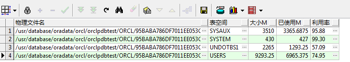

如上自动分区是默认next为1M，那么即使在没有数据时候也将占用1m，导致磁盘空间耗尽