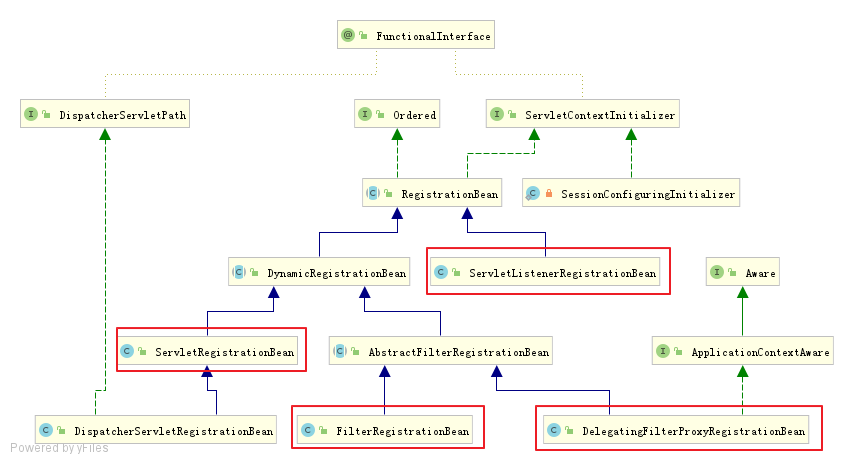
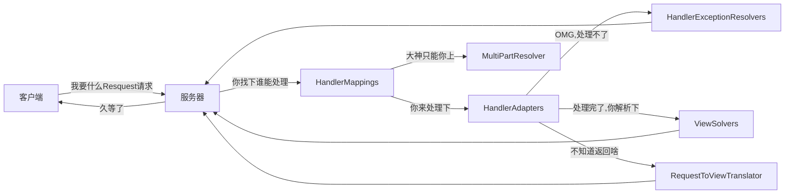
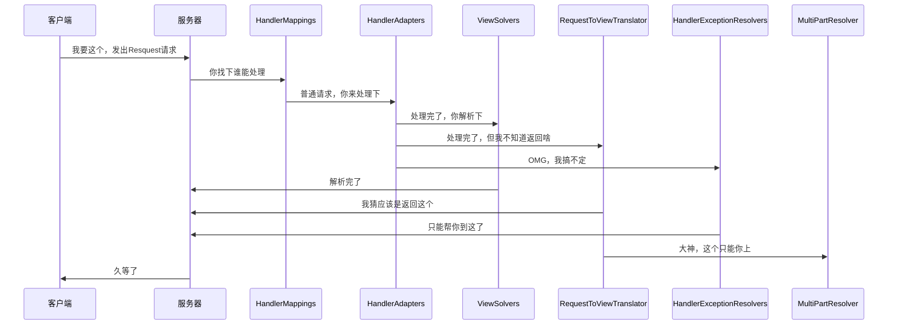

# springboot mvc部分启动流程

## 笔记：

相关类：

```java
//org.springframework.boot.web.server.WebServerFactoryCustomizerBeanPostProcessor
private void postProcessBeforeInitialization(WebServerFactory webServerFactory) {
	LambdaSafe.callbacks(WebServerFactoryCustomizer.class, getCustomizers(), webServerFactory)
			.withLogger(WebServerFactoryCustomizerBeanPostProcessor.class)
			.invoke((customizer) -> customizer.customize(webServerFactory));
}
```

> BeanFactoryPostProcess实现，这里是在初始化前调用，这里使用到了`LambdaSafe`，代码有点神奇。[有空了解](https://blog.didiyun.com/index.php/2020/01/13/%E5%9B%9E%E8%B0%83%E5%92%8Cspring%E7%9A%84lambdasafe%E7%B1%BB/)下

### servlet容器启动历史演变

1. servlet3.0以前

   * web.xml 中配置 servlet 和 filter

2. servlet3.0 新特性

   * 提供 @WebServlet，@WebFilter 

   * 运行时动态注册 servlet

     ```java
     ServletRegistration.Dynamic addServlet(String servletName,Class<? extends Servlet> servletClass)
     ServletRegistration.Dynamic addServlet(String servletName, Servlet servlet)
     ServletRegistration.Dynamic addServlet(String servletName, String className)
     T createServlet(Class clazz)
     ServletRegistration getServletRegistration(String servletName)
     Map<String,? extends ServletRegistration> getServletRegistrations()
     ```

     1. ServletContextListener 的 contexInitialized 方法中调用

     2. 或ServletContainerInitializer 的 onStartup()

   * 容器在启动时使用 JAR 服务 API(JAR Service API) 来发现 ServletContainerInitializer 的实现类，@HandlesTypes可以指定希望处理的类

3. Spring framework的支持

   * ```
     SpringServletContainerInitializer implements ServletContainerInitializer
     //实现onstartup(),调用spirng容器WbeApplicationInitilizer接口
     ```

   * 注解开发时，通常通过实现AbstractAnnotationConfigDispatcherServletInitializer接口来启动容器,[官网示例](https://docs.spring.io/spring/docs/5.1.2.RELEASE/spring-framework-reference/web.html#mvc-servlet)

     ```java
     public class MyWebAppInitializer extends AbstractAnnotationConfigDispatcherServletInitializer {
         @Override
         protected Class<?>[] getRootConfigClasses() {
             return new Class<?>[] { RootConfig.class };
         }
         @Override
         protected Class<?>[] getServletConfigClasses() {
             return new Class<?>[] { App1Config.class };
         }
         @Override
         protected String[] getServletMappings() {
             return new String[] { "/app1/*" };
         }
     }
     ```

### SpringBoot中在servlet容器中注册filter、listener、servlet

1. 使用servlet规范中的注解

```java
@WebServlet，@WebFilter，@WebListener
配置类添加@ServletComponentScan
```

2. 使用 RegistrationBean 

   ```java
   ServletRegistrationBean 
   FilterRegistrationBean 
   ServletListenerRegistrationBean
   DelegatingFilterProxyRegistrationBean
       
   @Bean
   public FilterRegistrationBean helloWorldFilter() {
       FilterRegistrationBean helloWorldFilter = new FilterRegistrationBean();
       myFilter.addUrlPatterns("/hello/*");
       myFilter.setFilter(new HelloWorldFilter());
       return helloWorldFilter;
   }
   ```

   

### Tomcat启动

```java
org.springframework.context.support.AbstractApplicationContext#onRefresh
   //调用子类实现
org.springframework.boot.web.servlet.context.ServletWebServerApplicationContext#onRefresh
org.springframework.boot.web.servlet.context.ServletWebServerApplicationContext#createWebServer
org.springframework.boot.web.embedded.tomcat.TomcatServletWebServerFactory#getWebServer
//找出BeanFactory中查找ServletWebServerFactor   
getBeanFactory().getBean(beanNames[0], ServletWebServerFactory.class);
//执行servletConextInitializer
getSelfInitializer()
//返回webServer
//即TomcatServletWebServerFactory负责实例化TomcatWebServer
(TomcatWebServer)((ServletWebServerFactory)factory).getWebServer(getSelfInitializer());
//TomcatStarter实现了ServletContainerInitializer接口，在tomcat启动时会调用器onstartup方法
org.springframework.boot.web.embedded.tomcat.TomcatStarter#onStartup
//进而会调用Tomcat中的ServletContextInitializer，进而调用springBeanFactory中的ServletContextInitializer的Bean
org.springframework.boot.web.servlet.ServletContextInitializerBeans#addServletContextInitializerBeans
```

* 注意`ServletContextInitializer`与`ServletContainerInitializer`区别，

  * 一个是servlet容器调用，一个是spring容器调用，都是用于加工`ServletContext`

  * `ServletContainerInitializer`是servlet规范，在servlet容器启动时也即是tomcat启动时候由`StandContext`调用，springboot对`ServletContainerInitializer`的实现是`TomcatStarter`，实现调用`ServletContextInitializer`的实现。

  * 都是加工`ServletContext`，为什么springboot要搞自己的一套东西呢？[官方答复](https://github.com/spring-projects/spring-boot/issues/321)

    > This was actually an intentional design decision. The search algorithm used by the containers was problematic. It also causes problems when you want to develop an executable WAR as you often want a `javax.servlet.ServletContainerInitializer` for the WAR that is not executed when you run `java -jar`.
    >
    > See the `org.springframework.boot.context.embedded.ServletContextInitializer` for an option that works with Spring Beans.

* `ServletContextInitializer`有哪些实现？

  

  这就回到了怎么通过spring注册filter、listener、servlet的问题了。

  这段代码很隐蔽，是通过lamda函数式接口传给`TomcatStarter`执行的

  ```java
  	private void addServletContextInitializerBeans(ListableBeanFactory beanFactory) {
  		for (Entry<String, ServletContextInitializer> initializerBean : getOrderedBeansOfType(
  				beanFactory, ServletContextInitializer.class)) {
  			addServletContextInitializerBean(initializerBean.getKey(),
  					initializerBean.getValue(), beanFactory);
  		}
  	}
  ```

  再说清楚点吧。

  * 首先理解函数式接口

    `this::selfInitialize`最后会以`ServletContextInitializer`接口的形式传给`TomcatStarter`,因为`ServletContextInitializer`本来就是函数式接口只有一个方法`onstartup()`，所以调用`ServletContextInitializer`的`onStartup()`方法就是调用`selfInitialize(ServletContext servletContext)`

  * 相当于：

    ```java
    tomcatq启动过程调用TomcatStarter.onstartup(){//因为实现了ServletContainerInitializer
        	ServletContextInitializer.onStartup(){//这里只是注册在TomcatStarter中的
                addServletContextInitializerBeans(beanFactory)//获取spring容器的 ServletContextInitializer
                   SpringBeanFacory.ServletContextInitializer.onStartup(){
                    //完成filter、listener、servlet的注册
                }
            }
    	}
    ```

  ```java
  /**
  *@see org.springframework.boot.web.servlet.context.ServletWebServerApplicationContext#createWebServer
  创TomcatServer过程会传ServletContextInitializer给tomcatStart
  **/
  private org.springframework.boot.web.servlet.ServletContextInitializer getSelfInitializer() {
  		return this::selfInitialize;
  	}
  
  	private void selfInitialize(ServletContext servletContext) throws ServletException {
  		prepareWebApplicationContext(servletContext);
  		ConfigurableListableBeanFactory beanFactory = getBeanFactory();
  		ExistingWebApplicationScopes existingScopes = new ExistingWebApplicationScopes(
  				beanFactory);
  		WebApplicationContextUtils.registerWebApplicationScopes(beanFactory,
  				getServletContext());
  		existingScopes.restore();
  		WebApplicationContextUtils.registerEnvironmentBeans(beanFactory,
  				getServletContext());
  		for (ServletContextInitializer beans : getServletContextInitializerBeans()) {
  			beans.onStartup(servletContext);
  		}
  	}
  ```

  * 从BeanFactory中此时会找到两个ServletContextInitializer的实现

    ```java
    filterShiroFilterRegistrationBean//org.apache.shiro.spring.web.ShiroFilterFactoryBean.SpringShiroFilter
    //FilterRegistrationBean<T extends Filter>
    DispatcherServletRegistrationBean
    ```

### Request详解

1. [四种常见的 POST 提交数据方式](https://imququ.com/post/four-ways-to-post-data-in-http.html)

   * HTTP协议以ASCII码传输，建立在TCP/IP协议之上，将请求分为三部分：请求行、请求头、请求体

   * Post提交的数据必须在请求体中，服务器通过不同的Content-Type采用不同的编码方式进行解析

   * 常见三种方式

     ```properties
     # 1.<form>表单提交方式，不设置enctype属性默认以这种方式提交
     ## title=test&sub%5B%5D=1&sub%5B%5D=2&sub%5B%5D=3
     Content-Type:application/x-www-form-urlencoded
     # 2.<form>表单提交方式，指定enctype属性multipart/form-data
     ## 这种方式一般用于提交文件，boundary用于分割字段
     Content-Type:multipart/form-data;boundary=----WebKitFormBoundaryrGKCBY7qhFd3TrwA
     ######## 完整示例
     POST http://www.example.com HTTP/1.1
     Content-Type:multipart/form-data; boundary=----WebKitFormBoundaryrGKCBY7qhFd3TrwA
     
     ------WebKitFormBoundaryrGKCBY7qhFd3TrwA
     Content-Disposition: form-data; name="text"
     
     title
     ------WebKitFormBoundaryrGKCBY7qhFd3TrwA
     Content-Disposition: form-data; name="file"; filename="chrome.png"
     Content-Type: image/png
     
     PNG ... content of chrome.png ...
     ------WebKitFormBoundaryrGKCBY7qhFd3TrwA--
     ##########################################################################
     
     # 3.application/json
     ## 适合 RESTful 的接口，复杂的数据层次
     Content-Type: application/json;charset=utf-8
     ####完整示例
     POST http://www.example.com HTTP/1.1 
     Content-Type: application/json;charset=utf-8
     
     {"title":"test","sub":[1,2,3]}
     ##########################################################################
     
     ## 4.text/xml
     ##不常用
     
     ```

     

   * 

     

2. Request的parameter和attribute区别

   

3. post、get、content-type

   > 常见的媒体格式类型如下：
   >
   > - text/html ： HTML格式
   >
   > - text/plain ：纯文本格式   
   >
   > - text/xml ： XML格式
   >
   > - image/gif ：gif图片格式  
   >
   > - image/jpeg ：jpg图片格式 
   >
   > - image/png：png图片格式
   >
   >   以application开头的媒体格式类型：
   >
   > - application/xhtml+xml ：XHTML格式
   >
   > - application/xml   ： XML数据格式
   >
   > - application/atom+xml ：Atom XML聚合格式  
   >
   > - application/json  ： JSON数据格式
   >
   > - application/pdf    ：pdf格式 
   >
   > - application/msword ： Word文档格式
   >
   > - application/octet-stream ： 二进制流数据（如常见的文件下载）
   >
   > - application/x-www-form-urlencoded ： <form encType="">中默认的encType，form表单数据被编码为key/value格式发送到服务器（表单默认的提交数据的格式）
   >
   >   另外一种常见的媒体格式是上传文件之时使用的：
   >
   > - multipart/form-data ： 需要在表单中进行文件上传时，就需要使用该格式
   >
   >   以上就是我们在日常的开发中，经常会用到的若干content-type的内容格式。

   * get

   * post ，指定 `headers: { 'Content-Type': 'application/json; charset=utf-8' }`

     

     加了`Content-Type: "application/json;charset=UTF-8"`之后，post的数据会已流的形式传输，可以用`request.getInputStream()`来获得流，然后读取流中的参数数据。无法通过`request.getParameter("arr")`获取数据

     > 

   * post

4. Request Payload和Form Data区别

   * Request Payload ：请求头部的 Content-Type: application/json，并且请求正文是一个 json 格式的字符串。 必须加 @RequestBody 才能将请求正文解析到对应的 bean 中，且只能通过 request.getReader() 来获取请求正文内容
   * Form Data ：请求头部的 Content-Type: application/x-www-form-urlencoded，并且请求正文是类似 get 请求 url 的请求参数，无需任何注解，springmvc 会自动使用 MessageConverter 将请求参数解析到对应的 bean，且通过 request.getParameter(...) 能获取请求参数 

5. Tomcat解析request的参数

   ```java
   /**
    @see org.apache.catalina.connector.Request#parseParameters
    **/
   // 文件上次请求，不解析parameter
   if ("multipart/form-data".equals(contentType)) {
       parseParts(false);
       success = true;
       return;
   }
   
   if( !getConnector().isParseBodyMethod(getMethod()) ) {
       success = true;
       return;
   }
   //对于Content-Type不是application/x-www-form-urlencoded,不做处理，所有无法获取parameter
   if (!("application/x-www-form-urlencoded".equals(contentType))) {
       success = true;
       return;
   }
   ```

   服务器默认只解析解析HttpRequestLine（HTTP请求行）和解析HttpHeader（HTTP请求头）

   如果需要获取请求体的内容，则需调用

   ```java
   request.getInputStream();
   request.getParameter();
   
   ```

   

6. @RequestParam和@RequestBody

   1. get，`url？key1=value&key2=value2`

   2. post，`context-type：application/x-www-form-urlencoded`,在请求体中生成类型get的keyvalue形式

      此时，@RequestParam或者request.getParameter可以获取值

   3. post，非`context-type：application/x-www-form-urlencoded`，比如`Content-Type: application/json;charset=utf-8`,只能通过@RequestBody获取

7. 实战问题

   1. post，`context-type：application/x-www-form-urlencoded`。怎么在后台取值

      * 需求：

        > `request.getParameter()`获取分页相关的参数，并设置至pagehelper中
        >
        > 如果使用post，`Content-Type=application/json`格式，无法通过`request.getParameter()`获取值
        >
        > 使用`context-type：application/x-www-form-urlencoded`，格式可以满足需求，但spring怎么封装值Bean中呢？

      * @RequestParam，只能获取一个个key的值。相当于`request.getParameter()`

      * 那么怎么可以直接封装在Bean中呢，就是什么注解也不加，@RequestParam和@RequestBody都不要加。`@RequestBody`会导致

        ```
        Content type 'application/x-www-form-urlencoded;charset=UTF-8' not supported
        ```

      * 如果封装的Bean中有Map需要传值，则urlcode中的key需修改下格式

        ```JAVA
        //入参Bean类
        class TestBean {
         HashMap beanPropertyName;
        }
        beanPropertyName[key]=value ;//自动封装到HashMap中
        //即json对象如下  
        var j={
                  pageSize: pager.pageSize,
                  pageNum: pager.current,
                  'params[beginTimes]': this.queryParam.qsDate[0],
                  'params[endTimes]': this.queryParam.qsDate[1]
                }
        //调用qs.stringify(parameter) 后
        //转为
        pageSize=10&pageNum=1&params%5BbeginTimes%5D=2019-04-04&params%5BendTimes%5D=2019-12-31;
        //对应格式为
        pageSize: 10
        pageNum: 1
        params[beginTimes]: 2019-04-04
        params[endTimes]: 2019-12-31;
        //mybatis中通过.操作符使用，如下
        to_date(#{params.optBeginTime},'yyyy-MM-dd')
        ```

      * 问题：

        * 印象中文档写的，是当没有注解时候，默认使用`@RequestParameter`，但是添加该注解会报错。难道是跨域引起的吗？项目是node.js加springboot，Controller已加上`@CrossOrigin`

      * 

### 入参数据校验

1. JSR对List<>类型入参无效，参考[Stack Overflow](https://stackoverflow.com/questions/28150405/validation-of-a-list-of-objects-in-spring#)
   1. 原因JSR只对javaBean有效，所以可以将List<>在次包裹为一个Bean
   2. 在Controller上添加`@validated`,注意要配合`ControllerAdvice`使用
   3. [嵌套list的校验](https://www.cnblogs.com/javastack/p/10297550.html)

### 问题

1. shiroFilter怎么注册到servlet容器中

### 参考

1. [Spring 揭秘 -- 寻找遗失的 web.xml

### org.springframework.web.servlet.DispatcherServlet初始化

#### 初始化

```java
org.springframework.web.servlet.HttpServletBean#init
    org.springframework.web.servlet.FrameworkServlet#initServletBean
    org.springframework.web.servlet.FrameworkServlet#initWebApplicationContext
    org.springframework.web.servlet.FrameworkServlet#initFrameworkServlet(空)
    	org.springframework.web.servlet.DispatcherServlet#onRefresh
    		org.springframework.web.servlet.DispatcherServlet#initStrategies
    
  	protected void initStrategies(ApplicationContext context) {
    	//部分来自DispatcherServlet.properties
		initMultipartResolver(context);//StandardServletMultipartResolver
		initLocaleResolver(context);//AcceptHeaderLocaleResolver
		initThemeResolver(context);
		initHandlerMappings(context);
    /** 0 = "faviconHandlerMapping"
        1 = "requestMappingHandlerMapping"
        2 = "viewControllerHandlerMapping"
        3 = "beanNameHandlerMapping"
        4 = "resourceHandlerMapping"
        5 = "defaultServletHandlerMapping"
        6 = "welcomePageHandlerMapping"
        */
		initHandlerAdapters(context);
    /**
    	RequestMappingHandlerAdapter
    	HttpRequestHandlerAdapter
    	SimpleControllerHandlerAdapter
    */
		initHandlerExceptionResolvers(context);
    /**
    	DefaultErrorAttributes
    	HandlerExceptionResolverComposite
    */
		initRequestToViewNameTranslator(context);
    /**
        "beanNameViewResolver" -> {BeanNameViewResolver@13126} 
        "mvcViewResolver" -> {ViewResolverComposite@13140} 
        "defaultViewResolver" -> {InternalResourceViewResolver@13141} 
        "viewResolver" -> {ContentNegotiatingViewResolver@13142} 
        "thymeleafViewResolver" -> {ThymeleafViewResolver@13143} 
    */
		initViewResolvers(context);
		initFlashMapManager(context);
	}
```

### Tomcat至Spring处理

```java
org.apache.catalina.core.StandardWrapperValve#invoke()
    org.apache.catalina.core.StandardWrapper#allocate()
        org.apache.catalina.core.StandardWrapper#initServlet()
    org.apache.catalina.core.ApplicationFilterFactory#createFilterChain()
    	filterChain.setServlet(servlet);//servlet作为链的末尾执行
		org.apache.catalina.core.ApplicationFilterChain
	filterChain.doFilter (request.getRequest(), response.getResponse());	
		new RequestFacade(this)
        new ResponseFacade(this);  
    org.apache.shiro.web.servlet.AbstractShiroFilter#createSubject()
   
      //spring实现相似的链式 
org.springframework.web.servlet.handler.AbstractHandlerMapping#getHandler
org.springframework.web.servlet.handler.AbstractHandlerMapping#getHandlerExecutionChain
    0 = {ConversionServiceExposingInterceptor@10417} 
    1 = {ResourceUrlProviderExposingInterceptor@10418} 
org.springframework.web.servlet.mvc.method.annotation.RequestMappingHandlerAdapter#invokeHandlerMethod//真正处理
```

* **ApplicationFilterFactory**装配Filter和servlet

* org.apache.shiro.web.servlet.AbstractShiroFilter#createSubject

* ```
  RequestMappingInfo
  ```

* **RequestMapping**

  **RequestMapping注解有六个属性，下面我们把她分成三类进行说明。**

  **【1】value， method**

  value：指定请求的实际地址，指定的地址可以是URI Template 模式；

  method： 指定请求的method类型， GET、POST、PUT、DELETE等；

  ------

  **【2】consumes，produces**

  consumes： 指定**处理请求的提交内容类型（Content-Type）**，例如application/json, text/html;

  produces: 指定**返回的内容类型**，仅当request请求头中的(Accept)类型中包含该指定类型才返回；

  ------

  **【3】params，headers**

  params： 指定request中必须包含某些参数值时，才让该方法处理。

  headers： 指定request中必须包含某些指定的header值，才能让该方法处理请求。


## 重要接口

### ServletContainerInitializer

#### 接口定义

```java
/**
 * ServletContainerInitializers (SCIs) are registered via an entry in the
 * file META-INF/services/javax.servlet.ServletContainerInitializer that must be
 * included in the JAR file that contains the SCI implementation.
 * <p>
 * SCI processing is performed regardless of the setting of metadata-complete.
 * SCI processing can be controlled per JAR file via fragment ordering. If
 * absolute ordering is defined, then only the JARs included in the ordering
 * will be processed for SCIs. To disable SCI processing completely, an empty
 * absolute ordering may be defined.
 * <p>
 * SCIs register an interest in annotations (class, method or field) and/or
 * types via the {@link javax.servlet.annotation.HandlesTypes} annotation which
 * is added to the class.
 *
 * @since Servlet 3.0
 */
public interface ServletContainerInitializer {
    void onStartup(Set<Class<?>> c, ServletContext ctx) throws ServletException;
}
```

> 这里保留了原文的注释，因为非常重要。
>
> * servlet3.0版本后，可以通过ServletContainerInitializer的实现类启动web容器
> * 通过spi服务，即META-INF/services目录下，以接口命名的文件，在文件中指定实现类的形式，将其添加到容器中，比如
> * servlet 规范还规定了，可以通过`@HandlesTypes`，注解引入相关的类到容器中

#### 自定义ServletContainerInitializer

```java
@HandlesTypes(MyHandlesTypeImpl.class)
public class MyServletContainerInitializer implements ServletContainerInitializer {
    @Override
    public void onStartup(Set<Class<?>> clz, ServletContext ctx) throws ServletException {
        System.out.println("我是ServletContainerInitializer");
        for (Class<?> cz:clz){
            if(cz.isAssignableFrom(UseForHandleTypeInterface.class)){
                try {
                    UseForHandleTypeInterface ht = (UseForHandleTypeInterface) ReflectionUtils.accessibleConstructor(cz).newInstance();
                    ht.saySomething();
                } catch (Exception e) {
                    e.printStackTrace();
                }

            }
        }
    }
}
public class MyHandlesTypeImpl implements UseForHandleTypeInterface {

   public void  saySomething(){
       System.out.println("我是HandleTypeInterface");
   }
}

在resources目录下创建\META-INF\services\javax.servlet.ServletContainerInitializer
    并给出启动类com.froggengo.practise.webmvc.servletContainerInitializer.MyServletContainerInitializer
```

> 但在实际测试过程中，没有效果，查阅其他资料，原因是 ：使用内置的Tomcat后，不会启动spi服务，来发现ServletContainerInitializer的实现类。所以这里也就没有测试。


#### 相关实现

##### spring-web：SpringServletContainerInitializer

```properties
##spring-web-5.2.2.RELEASE.jar!\META-INF\services\javax.servlet.ServletContainerInitializer
org.springframework.web.SpringServletContainerInitializer
```

##### springboot：TomcatStarter

Springboot内置tomcat启动 过程，会启动TomcatStarter，默认实现如下。通过启动`ServletContextInitializer`的实现类，该类由Spring提供，所以只要在Springboot的容器中 注入 ServletContainerInitializer实现类，就会被调用。具体见下文。

```java
class TomcatStarter implements ServletContainerInitializer {

	TomcatStarter(ServletContextInitializer[] initializers) {
		this.initializers = initializers;
	}
    public void onStartup(Set<Class<?>> classes, ServletContext servletContext) throws ServletException {
        try {
            //tomcater启动会有三个ServletContextInitializer
            for (ServletContextInitializer initializer : this.initializers) {
                initializer.onStartup(servletContext);
            }
        }
        catch (Exception ex) {
            this.startUpException = ex;
            // Prevent Tomcat from logging and re-throwing when we know we can
            // deal with it in the main thread, but log for information here.
            if (logger.isErrorEnabled()) {
                logger.error("Error starting Tomcat context. Exception: " + ex.getClass().getName() + ". Message: "
                        + ex.getMessage());
            }
        }
    }
}
```

### ServletContainerInitializer

#### 接口定义：

```java
public interface ServletContainerInitializer {

    /**
     * Receives notification during startup of a web application of the classes
     * within the web application that matched the criteria defined via the
     * {@link javax.servlet.annotation.HandlesTypes} annotation.
     */
    void onStartup(Set<Class<?>> c, ServletContext ctx) throws ServletException;
}

```

#### 自定义ServletContainerInitializer

```java
@Component
public class MyServletContextInitializer implements ServletContextInitializer {

    @Override
    public void onStartup(ServletContext servletContext) throws ServletException {
        System.out.println("MyServletContextInitializer");
        System.out.println(servletContext.getMajorVersion());
        //servletContext.addFilter();
        //servletContext.addListener();
        //servletContext.addServlet();
        System.out.println("MyServletContextInitializer 结束");
    }
}
```

> ServletContextInitializer传入参数为ServletContext，所以可以直接对ServletContext中任何事情

#### spring 默认实现

##### springboot启动过程调用的ServletContainerInitializer

> * 1、org.springframework.boot.web.servlet.context.ServletWebServerApplicationContext#getSelfInitializer
> * 2、org.springframework.boot.web.servlet.server.AbstractServletWebServerFactory#mergeInitializers
> * 上面两个方法，将3个lambda形式的 ServletContainerInitializer注入servlet容器中，最后在TomcatStarter中被调用
> * 其中，第一个ServletWebServerApplicationContext#getSelfInitializer还将会在BeanFactory中查找所有ServletContainerInitializer的实现类并依次调用

```java
//org.springframework.boot.web.servlet.context.ServletWebServerApplicationContext#getSelfInitializer
private org.springframework.boot.web.servlet.ServletContextInitializer getSelfInitializer() {
	return this::selfInitialize;
}

private void selfInitialize(ServletContext servletContext) throws ServletException {
	prepareWebApplicationContext(servletContext);
	registerApplicationScope(servletContext);
	WebApplicationContextUtils.registerEnvironmentBeans(getBeanFactory(), servletContext);
	for (ServletContextInitializer beans : getServletContextInitializerBeans()) {
		beans.onStartup(servletContext);
	}
}
```

### Filter

#### 接口定义

```java
public interface Filter {
    public default void init(FilterConfig filterConfig) throws ServletException {}
    public void doFilter(ServletRequest request, ServletResponse response,
            FilterChain chain) throws IOException, ServletException;
    public default void destroy() {}
}

```

#### 自定义Filter

```java
/**
 * 1、@WebServlet => 代替 servlet 配置，@WebFilter => 代替 filter 配置，@WebListener => 代替 listener 配置
 * 2、ServletContextInitializer
 * 3、filter可以直接加@Component等注解，注入beanfactory即可,
 * 4、servlet使用ServletRegistrationBean
 */
@Component
public class MyFilter implements Filter {
    @Override
    public void init(FilterConfig filterConfig) throws ServletException {
        System.out.println("MyFilter init()");
    }

    @Override
    public void doFilter(ServletRequest request, ServletResponse response, FilterChain chain) throws IOException, ServletException {
        System.out.println("MyFilter doFilter() before");
        chain.doFilter(request, response);
        System.out.println("MyFilter doFilter() after");
    }

    @Override
    public void destroy() {
        System.out.println("MyFilter doFilter() after");
    }
}
```

#### 初始化

```java
//在StandardContext#startInternal最后会调用org.apache.catalina.core.StandardContext#filterStart
//其中在创建ApplicationFilterConfig对象是会调用filter.init()方法
ApplicationFilterConfig filterConfig =new ApplicationFilterConfig(this, entry.getValue());
//ApplicationFilterConfig初始化
ApplicationFilterConfig(Context context, FilterDef filterDef)
		throws ClassCastException, ReflectiveOperationException, ServletException,
		NamingException, IllegalArgumentException, SecurityException {

	super();

	this.context = context;
	this.filterDef = filterDef;
	// Allocate a new filter instance if necessary
	if (filterDef.getFilter() == null) {
		getFilter();
	} else {
		this.filter = filterDef.getFilter();
		context.getInstanceManager().newInstance(filter);
        //调用filter的init
		initFilter();
	}
}
```


### Servlet

#### 接口定义

```java
public interface Servlet {

    public void init(ServletConfig config) throws ServletException;

    public ServletConfig getServletConfig();

    public void service(ServletRequest req, ServletResponse res)
            throws ServletException, IOException;

    public String getServletInfo();

    public void destroy();
}
```

自定义实现

```java
public class MyServlet implements Servlet {

        @Override
        public void init(ServletConfig config) throws ServletException {
                System.out.println("MyServlet");
        }
        @Override
        public ServletConfig getServletConfig() {
                return null;
        }
    	//处理逻辑在这里实现
        @Override
        public void service(ServletRequest req, ServletResponse res) throws ServletException, IOException {
        }
        @Override
        public String getServletInfo() {
                return null;
        }
        @Override
        public void destroy() {

        }
}
//注册
//1、使用ServletRegistrationBean
//2、使用@WebServlet注解
//3、使用ServletContextInitializer
@Component
public class MyServletRegistration  {
    @Bean
    public ServletRegistrationBean  myServlet(){
        ServletRegistrationBean bean = new ServletRegistrationBean(new MyServlet(), "/myServlet");
        bean.setLoadOnStartup(1);
        return bean;
    }
}
```


### Listener

支持 的listener类型

```java
public class ServletListenerRegistrationBean<T extends EventListener> extends RegistrationBean {

	private static final Set<Class<?>> SUPPORTED_TYPES;

	static {
		Set<Class<?>> types = new HashSet<>();
		types.add(ServletContextAttributeListener.class);
		types.add(ServletRequestListener.class);
		types.add(ServletRequestAttributeListener.class);
		types.add(HttpSessionAttributeListener.class);
		types.add(HttpSessionListener.class);
		types.add(ServletContextListener.class);
		SUPPORTED_TYPES = Collections.unmodifiableSet(types);
	}
}
```


### HandlerInterceptor

```java
public interface HandlerInterceptor {
	default boolean preHandle(HttpServletRequest request, HttpServletResponse response, Object handler)
			throws Exception {
		return true;
	}
	default void postHandle(HttpServletRequest request, HttpServletResponse response, Object handler,
			@Nullable ModelAndView modelAndView) throws Exception {
	}
	default void afterCompletion(HttpServletRequest request, HttpServletResponse response, Object handler,
			@Nullable Exception ex) throws Exception {
	}

}
```

##### 执行顺序

**当环境中有多个`@ControllerAdvice`或者`@RestControllerAdvice`注解标注的类，它们是有优先级顺序的，排在前面的先执行**

- 在`@Bean`处使用`@Order`，结果发现无效
- 让标注`@ControllerAdvice`或者`@RestControllerAdvice`的类实现`Ordered`接口，无效
- 在标注`@ControllerAdvice`或者`@RestControllerAdvice`的类上标注`@Order`，成功解决问题

具体分析请参考：[调整多个ControllerAdvice的执行顺序](https://blog.csdn.net/xufei_0320/article/details/105604983) 


### HttpMessageConverter 


#### 资料

1. [HttpMessageConverter是这样转换数据的](https://mp.weixin.qq.com/s/wWj8M46EmxRRgBWdch2Big)


### HandlerMethodArgumentResolver

#### 接口定义

```java
public interface HandlerMethodArgumentResolver {
	boolean supportsParameter(MethodParameter parameter);
	@Nullable
	Object resolveArgument(MethodParameter parameter, @Nullable ModelAndViewContainer mavContainer,
			NativeWebRequest webRequest, @Nullable WebDataBinderFactory binderFactory) throws Exception;

}
```

#### 自定义实现

##### MyArguementResolverController

```java
@RestController
public class MyArguementResolverController {

    @GetMapping("/arg")
    public AnnotationUserEntity getUseer(@AnnotationUser AnnotationUserEntity user){
        System.out.println(user.getName());
        System.out.println(user.getAddress());
        return user;
    }
}
```


##### UserArguementResolver

```java
@Target(ElementType.PARAMETER)
@Retention(RetentionPolicy.RUNTIME)//必须加，因为默认是CLASS，运行时丢弃
public @interface AnnotationUser {
}
public class UserArguementResolver implements HandlerMethodArgumentResolver {

    @Override
    public boolean supportsParameter(MethodParameter parameter) {
        //判断参数是否有AnnotationUser注解
        return parameter.hasParameterAnnotation(AnnotationUser.class);
    }

    @Override
    public Object resolveArgument(MethodParameter parameter, ModelAndViewContainer mavContainer, NativeWebRequest webRequest, WebDataBinderFactory binderFactory) throws Exception {
        Annotation[] annotations = parameter.getParameterAnnotations();
        for (Annotation annotation : annotations) {
            //这里其实应该要使用shiroUtil获取当前登录的user的
            if(annotation instanceof AnnotationUser) return  new AnnotationUserEntity("fly","gz");
        }
        return null;
    }
}
```


##### 配置configuration

```java
@RestController
public class MyArguementResolverController {

    @GetMapping("/arg")
    public AnnotationUserEntity getUseer(@AnnotationUser AnnotationUserEntity user){
        System.out.println(user.getName());
        System.out.println(user.getAddress());
        return user;
    }
}
```

##### 测试

```java
发送请求 ，结果返回{"fly","gz"}即可
```

#### spring示例

```properties
##RequestMappingHandlerAdapter#getDefaultArgumentResolvers中配置了很多个默认的ArgumentResolver，比如
PathVariableMethodArgumentResolver
RequestResponseBodyMethodProcessor
RequestParamMethodArgumentResolver
RequestResponseBodyMethodProcessor
等
测试在没有加RequestBody下，返回的是
resolver=ServletModelAttributeMethodProcessor
##0、先通过constructor.newInstance()创建对象
##1、ServletModelAttributeMethodProcessor#getRequestValueForAttribute
##尝试直接通过attributeName获取
String parameterValue = request.getParameter(attributeName);
##2、ServletModelAttributeMethodProcessor#bindRequestParameters
##org.springframework.web.bind.ServletRequestDataBinder#bind
MutablePropertyValues mpvs = new ServletRequestParameterPropertyValues(request);
	封装：Enumeration<String> paramNames = request.getParameterNames();
##后面就是对对象的属性值进行类型转换与赋值了
```


### ResponseBodyAdvice 

#### 接口

```java
/**
 * Allows customizing the response after the execution of an {@code @ResponseBody}
 * or a {@code ResponseEntity} controller method but before the body is written
 * with an {@code HttpMessageConverter}.
 *
 * <p>Implementations may be registered directly with
 * {@code RequestMappingHandlerAdapter} and {@code ExceptionHandlerExceptionResolver}
 * or more likely annotated with {@code @ControllerAdvice} in which case they
 * will be auto-detected by both.
 */
public interface ResponseBodyAdvice<T> {
	boolean supports(MethodParameter returnType, Class<? extends HttpMessageConverter<?>> converterType);
	@Nullable
	T beforeBodyWrite(@Nullable T body, MethodParameter returnType, MediaType selectedContentType,
			Class<? extends HttpMessageConverter<?>> selectedConverterType,
			ServerHttpRequest request, ServerHttpResponse response);

}
```

> 文档很重要，指出ResponseBodyAdvice执行在标注了@ResponseBody注解的方法之后，在HttpMessageConverter之前，执行。
>
> 通常与@ControllerAdvice一起使用。因为标记@ControllerAdvice会被解析为

#### 自定义示例

```java

```


#### 原理

```java
supports(MethodParameter, Class):22, MyMessageControllerAdvice
processBody:140, RequestResponseBodyAdviceChain
beforeBodyWrite:116, RequestResponseBodyAdviceChain
writeWithMessageConverters:286, AbstractMessageConverterMethodProcessor
handleReturnValue:181, RequestResponseBodyMethodProcessor
handleReturnValue:82, HandlerMethodReturnValueHandlerComposite
invokeAndHandle:124, ServletInvocableHandlerMethod
invokeHandlerMethod:888, RequestMappingHandlerAdapter
handleInternal:793, RequestMappingHandlerAdapter
handle:87, AbstractHandlerMethodAdapter
doDispatch:1040, DispatcherServlet
doService:943, DispatcherServlet
```

分析过程：

```java
//1、在RequestMappingHandlerAdapter初始化的时候
//resolvers.add(new RequestResponseBodyMethodProcessor(getMessageConverters(), this.requestResponseBodyAdvice));
//2、在父类RequestResponseBodyMethodProcessor
//AbstractMessageConverterMethodArgumentResolver#AbstractMessageConverterMethodArgumentResolver
//维护一个RequestResponseBodyAdviceChain是在初始化的时候就注入的
public AbstractMessageConverterMethodArgumentResolver(List<HttpMessageConverter<?>> converters,
		@Nullable List<Object> requestResponseBodyAdvice) {
	this.messageConverters = converters;
	this.allSupportedMediaTypes = getAllSupportedMediaTypes(converters);
	this.advice = new RequestResponseBodyAdviceChain(requestResponseBodyAdvice);
}
//分界线
//###################RequestResponseBodyAdviceChain##############
public RequestResponseBodyAdviceChain(@Nullable List<Object> requestResponseBodyAdvice) {
	this.requestBodyAdvice.addAll(getAdviceByType(requestResponseBodyAdvice, RequestBodyAdvice.class));
	this.responseBodyAdvice.addAll(getAdviceByType(requestResponseBodyAdvice, ResponseBodyAdvice.class));
}

@SuppressWarnings("unchecked")
static <T> List<T> getAdviceByType(@Nullable List<Object> requestResponseBodyAdvice, Class<T> adviceType) {
	if (requestResponseBodyAdvice != null) {
		List<T> result = new ArrayList<>();
		for (Object advice : requestResponseBodyAdvice) {
			Class<?> beanType = (advice instanceof ControllerAdviceBean ?
					((ControllerAdviceBean) advice).getBeanType() : advice.getClass());
			if (beanType != null && adviceType.isAssignableFrom(beanType)) {
				result.add((T) advice);
			}
		}
		return result;
	}
	return Collections.emptyList();
}
```


##### RequestResponseBodyMethodProcessor的UML类图


可以看到RequestResponseBodyMethodProcessor既实现了处理方法入参的接口，也实现了处理方法返回值的接口，即

```java
@RequestBody
@ReponseBody
```


### @ControllerAdvice

多个ControllerAdvice，优先级由@Order决定，order的数值越小 则优先级越高。或者，实现Ordered接口，实现getOrder()方法。


### HandlerMethodReturnValueHandler


#### spring示例

##### RequestResponseBodyMethodProcessor

```java
RequestResponseBodyMethodProcessor
```


### HandlerExceptionResolver

```
public interface HandlerExceptionResolver {
   @Nullable
   ModelAndView resolveException(
         HttpServletRequest request, HttpServletResponse response, @Nullable Object handler, Exception ex);
}
```


#### spring示例

##### ExceptionHandlerExceptionResolver


### 启动流程

```java
//首先理解ServletContext、Servlet容器、web服务器、ApplicationContext、spring容器等概念。

//1、servlet3.0容器内自动搜索ServletContainerInitializer的实现类
interface ServletContainerInitializer{
	public void onStartup(Set<Class<?>> c, ServletContext ctx)throws ServletException; 
}
//2、spring默认的实现类，@HandlesTypes用来接收WebApplicationInitializer，并传递给onStartup的参数webAppInitializerClasses别问我怎么传的？我也不知道。。。
@HandlesTypes(WebApplicationInitializer.class)
public class SpringServletContainerInitializer implements ServletContainerInitializer{
	public void onStartup(Set<Class<?>> webAppInitializerClasses, ServletContext servletContext)throws ServletException 	{
		//实现
		//省略
		for (WebApplicationInitializer initializer : initializers) {
			initializer.onStartup(servletContext);
		}//逐一调用(WebApplicationInitializer.class)实现类的onStartup
	}
} 
//3、WebApplicationInitializer(接口)-----AbstractContextLoaderInitializer（抽象类）----AbstractDispatcherServletInitializer（抽象类）---AbstractAnnotationConfigDispatcherServletInitializer（抽象类）
//4、实现onStartup()，为ServletContext注册ContextLoaderListener监听器，当ServletContext创建时调用先调用该监听器初始化，监听器将创建好的ApplicationContext传给ContextLoader并自动调用listener.contextInitialized(ServletContextEvent even)
  public void onStartup(ServletContext servletContext)throws ServletException
  {
    registerContextLoaderListener(servletContext);//注册ContextLoaderListener
  }
  protected void registerContextLoaderListener(ServletContext servletContext){
    WebApplicationContext rootAppContext = createRootApplicationContext();//创建spring容器上下为需要自己实现。
	//即ApplicationContext context = new FileSystemXmlApplicationContext("E:/Spring/applicationContext.xml");
	//或者ApplicationContext context = new AnnotationConfigApplicationContext(ManConfig.class);
    if (rootAppContext != null) {
      ContextLoaderListener listener = new ContextLoaderListener(rootAppContext);
      listener.setContextInitializers(getRootApplicationContextInitializers());
      servletContext.addListener(listener);
	//servlet添加ContextLoaderListener监听器。servletContext创建的时候就会调用listener.contextInitialized(ServletContextEvent even)
	//注意是ServletContextEvent而不是ApplicationContextEvent
	//不懂就搜索ServletcontetLister的原理。ContextLoaderListener 继承ContextLoader 并实现ServletContextListener
    }
    else {
      this.logger.debug("No ContextLoaderListener registered, as createRootApplicationContext() did not return an application context");
    }
  }
//5.监听器调用父类ContextLoader 的initWebApplicationContext方法
public class ContextLoaderListener extends ContextLoader implements ServletContextListener{
	
  public ContextLoaderListener(WebApplicationContext context){
    super(context);
  }
  public void contextInitialized(ServletContextEvent event){
    initWebApplicationContext(event.getServletContext());
  }
}
//6.ContextLoader 类较为复杂，initWebApplicationContext大概的意识就是servletContext.setAttribute(WebApplicationContext.ROOT_WEB_APPLICATION_CONTEXT_ATTRIBUTE, this.context);将ApplicationContext加入到ServletContext中
//还可以看到其他需要配置的参数比如contextConfigLocation、contextClass、contextInitializerClasses、ContextLoader.properties
  public WebApplicationContext initWebApplicationContext(ServletContext servletContext)
  {
    if (servletContext.getAttribute(WebApplicationContext.ROOT_WEB_APPLICATION_CONTEXT_ATTRIBUTE) != null) {
      throw new IllegalStateException("Cannot initialize context ");
    }
    Log logger = LogFactory.getLog(ContextLoader.class);
    servletContext.log("Initializing Spring root WebApplicationContext");
    long startTime = System.currentTimeMillis();
    try
    {
      if (this.context == null) {
        this.context = createWebApplicationContext(servletContext);
	//如果上面传过来的ApplicationContext为空自动到ServletContext查找名为ContextClass参数生成该代理类
	//servletContext.getInitParameter("contextClass");
	//如果没有则查找属性为WebApplicationContext.class.getName()的参数并生成代理类
	//contextClassName = defaultStrategies.getProperty(WebApplicationContext.class.getName());
      }
      if ((this.context instanceof ConfigurableWebApplicationContext)) {
        ConfigurableWebApplicationContext cwac = (ConfigurableWebApplicationContext)this.context;
        if (!cwac.isActive())
        {
          if (cwac.getParent() == null)
          {
            ApplicationContext parent = loadParentContext(servletContext);
            cwac.setParent(parent);
          }
          configureAndRefreshWebApplicationContext(cwac, servletContext);
        }
      }
      servletContext.setAttribute(WebApplicationContext.ROOT_WEB_APPLICATION_CONTEXT_ATTRIBUTE, this.context);
      //将ApplicationContext设置到ServletContext上下文中
      ClassLoader ccl = Thread.currentThread().getContextClassLoader();
      if (ccl == ContextLoader.class.getClassLoader()) {
        currentContext = this.context;
      }
      else if (ccl != null) {
        currentContextPerThread.put(ccl, this.context);
      }
      return this.context;
    }
  }
```


Tomcat重要组件

```
Connector
=》AbstractProtocol
=》AbstractEndpoint
=》NioEndpoint.Poller
=》
```

mvc重要组件


## 问题

1. filter注册和interceptor注册，使用场景
2. redirect和forward
3. 自定义类型转换
4. 


## 其他

#### RestTemplate

> 在ClientHttpRequestFactory的实现那张图中列出了RestTemplate的几种REST Client的封装。其中最常用的有以下三种：
>
> 1. SimpleClientHttpRequestFactory（封装URLConnection）
> 2. HttpComponentsClientHttpRequestFactory（封装HttpClient）
> 3. OkHttp3ClientHttpRequestFactory(封装OKHttp)

```java
<dependencies>
	<dependency>
		<groupId>org.apache.httpcomponents</groupId>
		<artifactId>httpclient</artifactId>
		<version>4.5.6</version>
	</dependency>
	<dependency>
		<groupId>com.squareup.okhttp3</groupId>
		<artifactId>okhttp</artifactId>
		<version>3.11.0</version>
	</dependency>
</dependencies>
```


# 流程图（草稿craft）

[图片来源1](https://blog.csdn.net/weixin_38938982/article/details/80534803)


[图片来源](https://blog.csdn.net/weixin_38938982/article/details/80534803)2







