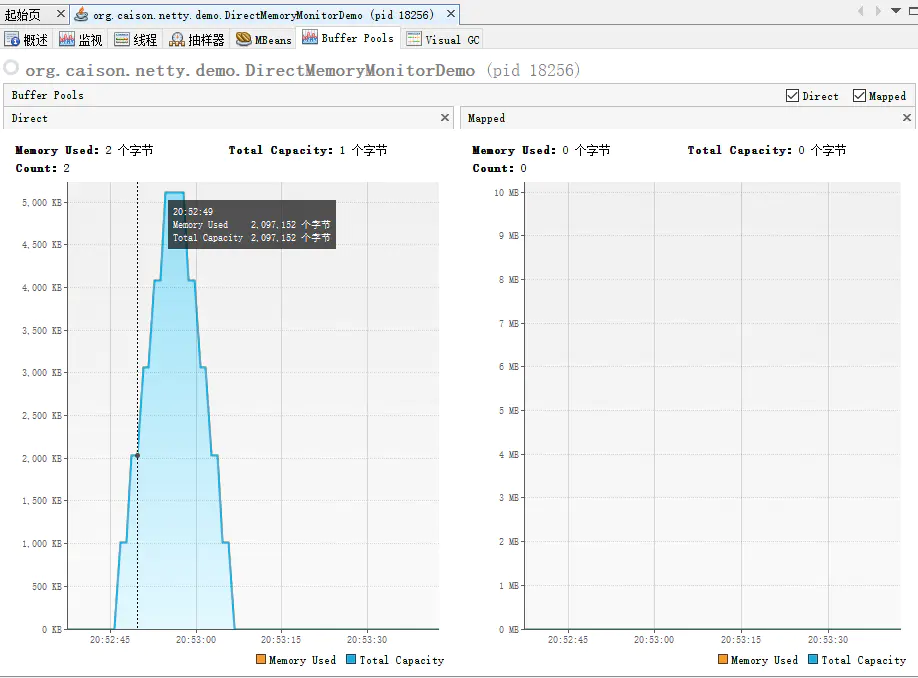

# Netty堆外内存泄漏排查，一篇讲清楚[from](https://juejin.im/post/5e0dbc67f265da5d153f3f35#heading-1)

上篇文章介绍了Netty内存模型原理，由于Netty在使用不当会导致堆外内存泄漏，网上关于这方面的资料比较少，所以写下这篇文章，专门介绍排查Netty堆外内存相关的知识点，诊断工具，以及排查思路提供参考

# 现象

堆外内存泄漏的现象主要是，进程占用的内存较高(Linux下可以用top命令查看)，但Java堆内存占用并不高(jmap命令查看)，常见的使用堆外内存除了Netty，还有基于java.nio下相关接口申请堆外内存，JNI调用等，下面侧重介绍Netty堆外内存泄漏问题排查

# 堆外内存释放底层实现

## 1 java.nio堆外内存释放

Netty堆外内存是基于原生java.nio的DirectByteBuffer对象的基础上实现的，所以有必要先了解下它的释放原理

java.nio提供的DirectByteBuffer提供了sun.misc.Cleaner类的clean()方法，进行系统调用释放堆外内存，触发clean()方法的情况有2种

- **(1) 应用程序主动调用**

```
ByteBuffer buf = ByteBuffer.allocateDirect(1);
((DirectBuffer) byteBuffer).cleaner().clean();
复制代码
```

- **(2) 基于GC回收**

Cleaner类继承了java.lang.ref.Reference，GC线程会通过设置Reference的内部变量（pending变量为链表头部节点，discovered变量为下一个链表节点），将可被回收的不可达的Reference对象以链表的方式组织起来

Reference的内部守护线程从链表的头部(head)消费数据，如果消费到的Reference对象同时也是Cleaner类型，线程会调用clean()方法(Reference#tryHandlePending())

## 2 Netty noCleaner策略

介绍noCleaner策略之前，需要先理解带有Cleaner对象的DirectByteBuffer在初始化时做了哪些事情：

只有在DirectByteBuffer(int cap)构造方法中才会初始化Cleaner对象，方法中检查当前内存是否超过允许的最大堆外内存(可由-XX:MaxDirectMemorySize配置)

如果超出，则会先尝试将不可达的Reference对象加入Reference链表中，依赖Reference的内部守护线程触发可以被回收DirectByteBuffer关联的Cleaner的run()方法

如果内存还是不足， 则执行 System.gc()，触发full gc，来回收堆内存中的DirectByteBuffer对象来触发堆外内存回收，如果还是超过限制，则抛出java.lang.OutOfMemoryError(代码位于java.nio.Bits#reserveMemory()方法)

而Netty在4.1引入可以noCleaner策略：创建不带Cleaner的DirectByteBuffer对象，这样做的好处是绕开带Cleaner的DirectByteBuffer执行构造方法和执行Cleaner的clean()方法中一些额外开销，当堆外内存不够的时候，不会触发System.gc()，提高性能

hasCleaner的DirectByteBuffer和noCleaner的DirectByteBuffer主要区别如下：

- 构造器方式不同： noCleaner对象：由反射调用 private DirectByteBuffer(long addr, int cap)创建 hasCleaner对象：由 new DirectByteBuffer(int cap)创建
- 释放内存的方式不同 noCleaner对象：使用 UnSafe.freeMemory(address); hasCleaner对象：使用 DirectByteBuffer 的 Cleaner 的 clean() 方法

> **note：**Unsafe是位于sun.misc包下的一个类，可以提供内存操作、对象操作、线程调度等本地方法，这些方法在提升Java运行效率、增强Java语言底层资源操作能力方面起到了很大的作用，但不正确使用Unsafe类会使得程序出错的概率变大，程序不再“安全”，因此官方不推荐使用，并可能在未来的jdk版本移除

Netty在启动时需要判断检查当前环境、环境配置参数是否允许noCleaner策略(具体逻辑位于PlatformDependent的static代码块)，例如运行在Android下时，是没有Unsafe类的，不允许使用noCleaner策略，如果不允许，则使用hasCleaner策略

> **note：** 可以调用PlatformDependent.useDirectBufferNoCleaner()方法查看当前Netty程序是否使用noCleaner策略

读到这里，也许有读者会问，如果Netty基于hasCleaner策略，通过GC触发Cleaner.clean()，自动回收堆外内存，是不是就可以不用考虑ByteBuf.release()方法的调用，不会内存泄漏？

当然不是，一方面原因是自动触发不实时：需要ByteBuffer对象被GC线程回收才会触发，如果ByteBuffer对象进入老年代后才变得可回收，则需要等到发送频率较低老年代GC才会触发

另一方面，Netty需要基于ByteBuf.release()方法执行其他操作，例如池化内存释放回内存池，否则该对象会被内存池一直标记为已使用

# ByteBuf.release()触发机制

业界有一种误解认为 Netty 框架分配的 ByteBuf，框架会自动释放，业务不需要释放；业务创建的 ByteBuf 则需要自己释放，Netty 框架不会释放

产生这种误解是有原因的，Netty框架是会在一些场景调用ByteBuf.release()方法：

## 1 入站消息处理

当处理入站消息时，Netty会创建ByteBuf读取channel上的消息，并触发调用pipeline上的ChannelHandler处理，应用程序定义的使用ByteBuf的ChannelHandler需要负责release()

```
public void channelRead(ChannelHandlerContext ctx, Object msg) {
    ByteBuf buf = (ByteBuf) msg;
    try {
        ...
    } finally {
        buf.release();
    }
}
复制代码
```

如果该ByteBuf不由当前ChannelHandler处理，则传递给pipeline上下一个handler：

```
public void channelRead(ChannelHandlerContext ctx, Object msg) {
    ByteBuf buf = (ByteBuf) msg;
    ...
    ctx.fireChannelRead(buf);
}
复制代码
```

常用的我们会通过继承**ChannelInboundHandlerAdapter**定义入站消息处理的handler，这种情况下如果所有程序的hanler都没有调用release()方法，**该入站消息Netty最后并不会release()，会导致内存泄漏**；

当在pipeline的handler处理中抛出异常之后，最后Netty框架是会捕捉该异常进行ByteBuf.release()的； 完整流程位于AbstractNioByteChannel.NioByteUnsafe#read(),下面抽取关键片段：

```
try {
	do {
		byteBuf = allocHandle.allocate(allocator);
		allocHandle.lastBytesRead(doReadBytes(byteBuf));
		// 入站消息已读完
		if (allocHandle.lastBytesRead() <= 0) {
            // ...
			break;
		}
        // 触发pipline上handler进行处理
		pipeline.fireChannelRead(byteBuf);
		byteBuf = null;
	} while (allocHandle.continueReading());
	// ...
} catch (Throwable t) {
    // 异常处理中包括调用 byteBuf.release()
	handleReadException(pipeline, byteBuf, t, close, allocHandle);
} 
复制代码
```

不过，常用的还有通过继承**SimpleChannelInboundHandler**定义入站消息处理，在该类会保证消息最终被release：

```
@Override
public void channelRead(ChannelHandlerContext ctx, Object msg) throws Exception {
	boolean release = true;
	try {
	    // 该消息由当前handler处理
		if (acceptInboundMessage(msg)) {
			I imsg = (I) msg;
			channelRead0(ctx, imsg);
		} else {
		    // 不由当前handler处理，传递给pipeline上下一个handler
			release = false;
			ctx.fireChannelRead(msg);
		}
	} finally {
	    // 触发release
		if (autoRelease && release) {
			ReferenceCountUtil.release(msg);
		}
	}
}
复制代码
```

## 2 出站消息处理

不同于入站消息是由Netty框架自动创建的，出站消息通常由应用程序创建，然后调用基于channel的write()方法或writeAndFlush()方法，这些方法内部会负责调用传入的byteBuf的release()方法

> **note：** write()方法在netty-4.0.0.CR2前的版本存在问题，不会调用ByteBuf.release()

## 3 release()注意事项

- **(1) 引用计数**

还有一种常见的误解就是，只要调用了ByteBuf的release()方法，或者ReferenceCountUtil.release()方法，对象的内存就保证释放了，其实不是

因为Netty的ByteBuf引用计数来管理ByteBuf对象的生命周期，ByteBuf继承了ReferenceCounted接口，对外提供retain()和release()方法，用于增加或减少引用计数值，**当调用release()方法时，内部计数值被减为0才会触发内存回收动作**

- **(2) derived ByteBuf**

derived，派生的意思，在ByteBuf.duplicate(), ByteBuf.slice() 和 ByteBuf.order(ByteOrder) 等方法会创建出derived ByteBuf，创建出来的ByteBuf与原有ByteBuf是共享引用计数的，原有ByteBuf的release()方法调用，也会导致这些对象内存回收

相反ByteBuf.copy() 和 ByteBuf.readBytes(int)方法创建出来的对象并不是derived ByteBuf，这些对象与原有ByteBuf不是共享引用计数的，**原有ByteBuf的release()方法调用不会导致这些对象内存回收**

# 堆外内存大小控制参数

配置堆外内存大小的参数有-XX:MaxDirectMemorySize和-Dio.netty.maxDirectMemory，这2个参数有什么区别？

- **-XX:MaxDirectMemorySize** 用于限制Netty中**hasCleaner策略的DirectByteBuffer**堆外内存的大小，默认值是JVM能从操作系统申请的最大内存，如果内存本身没限制，则值为Long.MAX_VALUE个字节(默认值由Runtime.getRuntime().maxMemory()返回)，代码位于java.nio.Bits#reserveMemory()方法中

> **note：**-XX:MaxDirectMemorySize无法限制Netty中**noCleaner策略的DirectByteBuffer**堆外内存的大小

- **-Dio.netty.maxDirectMemory** 用于限制**noCleaner策略下Netty的DirectByteBuffer**分配的最大堆外内存的大小，如果该值为0，则使用hasCleaner策略，代码位于PlatformDependent#incrementMemoryCounter()方法中

# 堆外内存监控

如何获取堆外内存的使用情况？

## 1 代码工具

- **(1) hasCleaner的DirectByteBuffer监控** 对于hasCleaner策略的DirectByteBuffer，java.nio.Bits类是有记录堆外内存的使用情况，但是该类是包级别的访问权限，不能直接获取，可以通过MXBean来获取

> **note：**MXBean，Java提供的一系列用于监控统计的特殊Bean，通过不同类型的MXBean可以获取JVM进程的内存，线程、类加载信息等监控指标

```java
List<BufferPoolMXBean> bufferPoolMXBeans = ManagementFactoryHelper.getBufferPoolMXBeans();
BufferPoolMXBean directBufferMXBean = bufferPoolMXBeans.get(0);
// hasCleaner的DirectBuffer的数量
long count = directBufferMXBean.getCount();
// hasCleaner的DirectBuffer的堆外内存占用大小，单位字节
long memoryUsed = directBufferMXBean.getMemoryUsed();
```

> **note：** MappedByteBuffer：是基于FileChannelImpl.map进行进行mmap内存映射(零拷贝的一种实现)得到的另外一种堆外内存的ByteBuffer，可以通过ManagementFactoryHelper.getBufferPoolMXBeans().get(1)获取到该堆外内存的监控指标

- **(2) noCleaner的DirectByteBuffer监控** Netty中noCleaner的DirectByteBuffer的监控比较简单，直接通过PlatformDependent.usedDirectMemory()访问即可

## 2 Netty自带内存泄漏检测工具

Netty也自带了内存泄漏检测工具，可用于检测出**ByteBuf对象被GC回收，但ByteBuf管理的内存没有释放**的情况，但不适用ByteBuf对象还没被GC回收内存泄漏的情况，例如任务队列积压

为了便于用户发现内存泄露，Netty提供4个检测级别：

- disabled 完全关闭内存泄露检测
- simple 以约1%的抽样率检测是否泄露，默认级别
- advanced 抽样率同simple，但显示详细的泄露报告
- paranoid 抽样率为100%，显示报告信息同advanced

使用方法是在命令行参数设置：

```
-Dio.netty.leakDetectionLevel=[检测级别]
复制代码
```

示例程序如下，设置检测级别为paranoid ：

```
// -Dio.netty.leakDetectionLevel=paranoid
public static void main(String[] args) {
	for (int i = 0; i < 500000; ++i) {
		ByteBuf byteBuf = UnpooledByteBufAllocator.DEFAULT.buffer(1024);
		byteBuf = null;	
	}
	System.gc();
}
复制代码
```

可以看到控制台输出泄漏报告：

```
十二月 27, 2019 8:37:04 上午 io.netty.util.ResourceLeakDetector reportTracedLeak
严重: LEAK: ByteBuf.release() was not called before it's garbage-collected. See https://netty.io/wiki/reference-counted-objects.html for more information.
Recent access records: 
Created at:
	io.netty.buffer.UnpooledByteBufAllocator.newDirectBuffer(UnpooledByteBufAllocator.java:96)
	io.netty.buffer.AbstractByteBufAllocator.directBuffer(AbstractByteBufAllocator.java:187)
	io.netty.buffer.AbstractByteBufAllocator.directBuffer(AbstractByteBufAllocator.java:178)
	io.netty.buffer.AbstractByteBufAllocator.buffer(AbstractByteBufAllocator.java:115)
	org.caison.netty.demo.memory.BufferLeaksDemo.main(BufferLeaksDemo.java:15)
复制代码
```

内存泄漏的原理是利用弱引用，弱引用(WeakReference)创建时需要指定引用队列(refQueue)，通过将ByteBuf对象用弱引用包装起来（代码入口位于AbstractByteBufAllocator#toLeakAwareBuffer()方法）

当发生GC时，如果GC线程检测到ByteBuf对象只被弱引用对象关联，会将该WeakReference加入refQueue； 当ByteBuf内存被正常释放，会调用WeakReference的clear()方法解除对ByteBuf的引用，后续GC线程不会再将该WeakReference加入refQueue；

Netty在每次创建ByteBuf时，基于抽样率，抽样命中时会轮询(poll)refQueue中的WeakReference对象，轮询返回的非null的WeakReference关联的ByteBuf即为泄漏的堆外内存(代码入口位于ResourceLeakDetector#track()方法)

## 3 图形化工具

在代码获取堆外内存的基础上，通过自定义接入一些监控工具定时检测获取，绘制图形即可，例如比较流行的Prometheus或者Zabbix

也可以通过jdk自带的Visualvm获取，需要安装Buffer Pools插件，底层原理是访问MXBean中的监控指标，只能获取hasCleaner的DirectByteBuffer的使用情况





此外，对于JNI调用产生的堆外内存分配，可以使用google-perftools进行监控

# 堆外内存泄漏诊断

堆外内存泄漏的具体原因比较多，先介绍任务队列堆积的监控，再介绍通用堆外内存泄漏诊断思路

## 1 任务队列堆积

这里的任务队列是值NioEventLoop中的Queue taskQueue，提交到该任务队列的场景有：

- (1) 用户自定义普通任务

```
ctx.channel().eventLoop().execute(runnable);
复制代码
```

- (2) 对channel进行写入

```
channel.write(...)
channel.writeAndFlush(...)
复制代码
```

- (3) 用户自定义定时任务

```
ctx.channel().eventLoop().schedule(runnable, 60, TimeUnit.SECONDS);
复制代码
```

当队列中积压任务过多，导致消息不能对channel进行写入然后进行释放，会导致内存泄漏

诊断思路是对任务队列中的任务数、积压的ByteBuf大小、任务类信息进行监控，具体监控程序如下(代码地址 [github.com/caison/cais…](https://github.com/caison/caison-blog-demo/tree/master/netty-demo))：

```
public void channelActive(ChannelHandlerContext ctx) throws NoSuchFieldException, IllegalAccessException {
	monitorPendingTaskCount(ctx);
	monitorQueueFirstTask(ctx);
	monitorOutboundBufSize(ctx);
}
/** 监控任务队列堆积任务数，任务队列中的任务包括io读写任务，业务程序提交任务 */
public void monitorPendingTaskCount(ChannelHandlerContext ctx) {
	int totalPendingSize = 0;
	for (EventExecutor eventExecutor : ctx.executor().parent()) {
		SingleThreadEventExecutor executor = (SingleThreadEventExecutor) eventExecutor;
		// 注意，Netty4.1.29以下版本本pendingTasks()方法存在bug，导致线程阻塞问题
		// 参考 https://github.com/netty/netty/issues/8196
		totalPendingSize += executor.pendingTasks();
	}
	System.out.println("任务队列中总任务数 = " + totalPendingSize);
}
/** 监控各个堆积的任务队列中第一个任务的类信息 */
public void monitorQueueFirstTask(ChannelHandlerContext ctx) throws NoSuchFieldException, IllegalAccessException {
	Field singleThreadField = SingleThreadEventExecutor.class.getDeclaredField("taskQueue");
	singleThreadField.setAccessible(true);
	for (EventExecutor eventExecutor : ctx.executor().parent()) {
		SingleThreadEventExecutor executor = (SingleThreadEventExecutor) eventExecutor;
		Runnable task = ((Queue<Runnable>) singleThreadField.get(executor)).peek();
		if (null != task) {
			System.out.println("任务队列中第一个任务信息：" + task.getClass().getName());
		}
	}
}
/** 监控出站消息的队列积压的byteBuf大小 */
public void monitorOutboundBufSize(ChannelHandlerContext ctx) {
	long outBoundBufSize = ((NioSocketChannel) ctx.channel()).unsafe().outboundBuffer().totalPendingWriteBytes();
	System.out.println("出站消息队列中积压的buf大小" + outBoundBufSize);
}
复制代码
```

> - **note:** 上面程序至少需要基于Netty4.1.29版本才能使用，否则有性能问题

实际基于Netty进行业务开发，耗时的业务逻辑代码应该如何处理？

先说结论，建议**自定义一组新的业务线程池，将耗时业务提交业务线程池**

Netty的worker线程(NioEventLoop)，除了作为NIO线程处理连接数据读取，执行pipeline上channelHandler逻辑，另外还有消费taskQueue中提交的任务，包括channel的write操作。

如果将耗时任务提交到taskQueue，也会影响NIO线程的处理还有taskQueue中的任务，因此建议在单独的业务线程池进行隔离处理

## 2 通用诊断思路

Netty堆外内存泄漏的原因多种多样，例如代码漏了写调用release()；通过retain()增加了ByteBuf的引用计数值而在调用release()时引用计数值未清空；因为Exception导致未能release()；ByteBuf引用对象提前被GC，而关联的堆外内存未能回收等等，这里无法全部列举，所以尝试提供一套通用的诊断思路提供参考

首先，需要能复现问题，为了不影响线上服务的运行，尽量在测试环境或者本地环境进行模拟。但这些环境通常没有线上那么大的并发量，可以通过压测工具来模拟请求

对于有些无法模拟的场景，可以通过Linux流量复制工具将线上真实的流量复制到到测试环境，同时不影响线上的业务，类似工具有Gor、tcpreplay、tcpcopy等

能复现之后，接下来就要定位问题所在，先通过前面介绍的监控手段、日志信息试试能不能直接找到问题所在； 如果找不到，就需要定位出堆外内存泄漏的触发条件，但有时应用程序比较庞大，对外提供的流量入口很多，无法逐一排查。

在非线上环境的话，可以将流量入口注释掉，每次注释掉一半，然后再运行检查问题是否还存在，如果存在，继续再注释掉剩下的一半，通过这种二分法的策略通过几次尝试可以很快定位出问题触发条件

定位出触发条件之后，再检查程序中在该触发条件处理逻辑，如果该处理程序很复杂，无法直接看出来，还可以继续注释掉部分代码，二分法排查，直到最后找出具体的问题代码块

整套思路的核心在于，**问题复现、监控、排除法**，也可以用于排查其他问题，例如堆内内存泄漏、CPU 100%，服务进程挂掉等

# 总结

整篇文章侧重于介绍知识点和理论，缺少实战环节，这里分享一些优质博客文章：

《netty 堆外内存泄露排查盛宴》 闪电侠手把手带如何debug堆外内存泄漏 [www.jianshu.com/p/4e96beb37…](https://www.jianshu.com/p/4e96beb37935)

《Netty防止内存泄漏措施》，Netty权威指南作者，华为李林峰内存泄漏知识分享 [mp.weixin.qq.com/s/IusIvjrth…](https://mp.weixin.qq.com/s/IusIvjrth_bzvodhOMfMPQ)

《疑案追踪：Spring Boot内存泄露排查记》，美团技术团队纪兵的案例分享 [mp.weixin.qq.com/s/aYwIH0TN3…](https://mp.weixin.qq.com/s/aYwIH0TN3nSzNaMR2FN0AA)

《Netty入门与实战：仿写微信 IM 即时通讯系统》，闪电侠的掘金小册(付费)，个人就是学这个专栏入门Netty的 [juejin.im/book/5b4bc2…](https://juejin.im/book/5b4bc28bf265da0f60130116?referrer=598ff735f265da3e1c0f9643)