# 千丝万缕的FGC与Buffer Pool


本文是一次线上的FGC分析及原理剖析。通过本文，可以深入的了解FGC，堆外Buffer和Buffer Pool的设计。

## 1 背景

运维通知，线上系统一直在FGC，通过zabbix查看GC 的次数

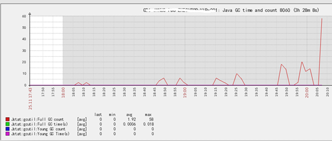

再查看YGC和FGC空间占用情况

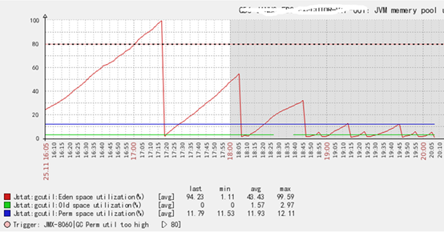

这里有几个疑问：

> 1：old space 空间一直很低，为什么会有频繁的FGC？
>
> 2：Eden space 回收的阈值为什么越来越低，越来越频繁？
>
> 3：从Eden space空间看一直在YGC，但是从YGC的次数看并没有过YGC？
>
> 4：FGC的越来越频繁，到最后为什么一直在FGC？

### 第一个问题

通过查看打印出来的ERROR日志，确定是Direct buffer 不够。在申请DirectByteBuffer的时候，会检查是否还有空闲的空间，剩余空间不够，则会调用system.gc，引起FGC(具体后续会详细介绍)。这里可以解释old space很低，但是一直FGC。并不是old区不够用，而是堆外空间不够用。

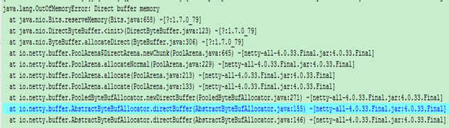

### 第二个问题

FGC是对整个堆进行GC（包含eden space，old space，perm space），FGC越来越频繁，会导致eden space 回收的越来越频繁。 正常的YGC触发是新建对象，申请不到eden space空间，才会进行YGC，但是这里是FGC引起的YGC，所以并不是eden space满了才会进行YGC。

### 第三个问题

统计YGC的次数一般是通过JMX或者日志方式统计。

JMX统计方式： 通过查询java.lang:type=GarbageCollector,name=PS MarkSweep 的CollectionCount

日志方式：统计YGC日志出现的次数。下面为YGC的日志。

[GC2016-11-26T00:05:50.539+0800: 36.542: [ParNew: 3355520K->34972K(3774912K), 0.0249160 secs] 3355520K->34972K(7969216K), 0.0250290 secs] [Times: user=0.31 sys=0.00, real=0.03 secs]

FGC引起的Eden space 回收没有打印YGC日志或者 CollectionCount的增加。

### 第四个问题

申请DirectByteBuffer，会新建cleaner对象(负责资源的回收)。在GC时，会释放没有引用的DirectByteBuffer。开始GC会释放掉部分空间，但是后面越来越频繁，直到一直FGC。说明分配的堆外空间已经被全部使用，每次申请DirectByteBuffer都会导致FGC。 

通过日志发现使用的是netty的buffer pool，基本上可以确定是某个地方在拿到DirectByteBuffer，没有归还导致的堆外内存泄露。

## 2 FGC日志分析

```
[Full GC2016-11-26T00:07:22.259+0800: 128.262: [CMS: 43613K->43670K(4194304K), 0.1500870 secs] 82477K->43670K(7969216K), [CMS Perm : 29810K->29810K(262144K)], 0.1501840 secs] [Times: user=0.15 sys=0.00, real=0.15 secs]
```

上述日志时候调用system.gc打印出来的。可以看到user=real=0.15，可知是只有一个线程在进行FGC，导致STW。

有如下问题 

>  1 :  user和real有什么区别
>
>  2：是哪一个线程在进行FGC
>
>  3：这里FGC是否有优化的空间
>

### 第一个问题

> real代表真实的时间消耗，user代表是所有cpu相加的时间消耗。如果相等，说明只有一个线程在GC。 如果日志如下：[Times: user=0.31 sys=0.00, real=0.03 secs] 说明将近有10个线程在进行gc。
>

### 第二个问题

> System.gc()，实际上是封装了一个_java_lang_system_gc操作放到VMThread的队列上，VMThread会扫描队列，做对应的操作。这里可以判定FGC的线程是VMThread。
>
> VMThread线程是JVM线程，该线程会一直扫描VM_operation的队列。内存分配失败或者system.gc等，都会封装一个操作放到VM_operation队列上。VMThread在对GC等操作执行的时候，会让业务线程都进入到安全点进行阻塞。操作完成后，会让业务线程离开安全点继续做业务操作。
>
> 安全点等信息可查看：[JVM的Stop The World，安全点，黑暗的地底世界](http://calvin1978.blogcn.com/articles/safepoint.html)
>

### 第三个问题

在old区是cms的情况下影响system.gc()的主要有2个jvm属性：DisableExplicitGC和ExplicitGCInvokesConcurrent

具体详细信息参考： [JVM源码分析之SystemGC完全解读](http://lovestblog.cn/blog/2015/05/07/system-gc/)

下面对gc做一个梳理(jdk7和开启CMS)

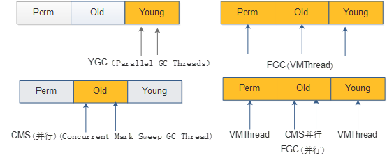

​                         

两个箭头代表多个线程，一个箭头代表单线程。

FGC(并行)前提是开启了ExplicitGCInvokesConcurrent参数。

## 3 触发FGC条件

> 1：正确情况下对象创建需要分配的内存是来自于Heap的Eden区域里，当Eden内存不够用的时候，某些情况下会尝试到Old里进行分配(比如说要分配的内存很大，阈值通过JVM：-XX:PretenureSizeThreshold设置 )，如果还是没有分配成功，于是会触发一次ygc的动作，而ygc完成之后会再次尝试分配，如果仍不足以分配此时的内存，那会接着做一次FGC (不过此时的soft reference不会被强制回收)，将老生代也回收一下，接着再做一次分配，仍然不够分配那会做一次强制将soft reference也回收的FGC，如果还是不能分配，则抛出OutOfMemoryError。
>
>   参考：[JVM源码分析之临门一脚的OutOfMemoryError完全解读](http://lovestblog.cn/blog/2016/08/29/oom/)
>
> 2：system.gc
>
> 3：jmap -histo:live
>
> 4：jvisualvm 操作gc
>
> 5：担保失败
>
> 6：Perm空间满

通过前面分析，一直FGC的原因是DirectByteBuffer泄露，导致一直调用system.gc，

下面将轮到本文的主角登场，堆外buffer。

## 4 堆外Buffer

堆外buffer一般是指：DirectByteBuffer

### 4.1 DirectByteBuffer优点

  1：支持更大的内存

  2：减轻对GC的影响(避免拷贝)

    比如YGC，会将Eden区有引用的对象拷贝到S0或者S1，堆内buffer的数据会频繁拷贝。

  3：减轻FGC的压力

     FGC在old区一般会进行数据整理。 在整理的时候，会进行内存数据的迁移。由于buffer的空间比较大，会导致迁移的时间较长。

  4：降低FGC的频率

     Buffer放在堆内，则old区占用的空间比较大，容易触发FGC。

  5：网络通信降低数据拷贝

   通过NIO 的Channel write一个buffer：SocketChannel.write(ByteBuffer src) ，会调用如下接口：

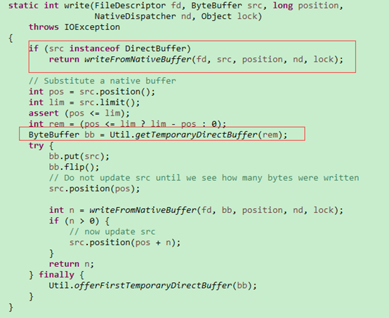

如果是HeapByteBuffer，还是要转换为的DirectByteBuffer，多一次数据拷贝。

### 4.2 DirectByteBuffer介绍

#### 4.2.1 DirectByteBuffer结构

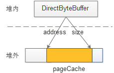

#### 4.2.2资源的销毁方案

新建一个对象，一般情况下JVM在GC的时候会将对象回收掉。如果关联其他资源，在回收后，还需要将其释放。 比如回收掉DirectByteBuffer，还要释放掉申请的堆外空间。

1：Finalize 回收方案

sun不推荐实现finalize，实际上JDK内部很多类都实现了finalize。

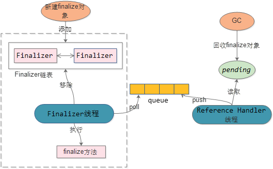

如果对象实现了finalize，在对象初始化后,会封装成Finalizer对象添加到 Finalizer链表中。

对象被GC时，如果是Finalizer对象，会将对象赋值到pending对象。Reference Handler线程会将pending对象push到queue中。

Finalizer 线程poll到对象，先删除掉Finalizer链表中对应的对象，然后再执行对象的finalize方法(一般为资源的销毁)

方案的缺点：

  1：对象至少跨越2个GC，垃圾对象无法及时被GC掉，并且存在多次拷贝。影响YGC和FGC

  2：Finalizer线程优先级较低，会导致finalize方法延迟执行

具体可参考：[JVM源码分析之FinalReference完全解读](http://www.infoq.com/cn/articles/jvm-source-code-analysis-finalreference)

2：Cleaner方案

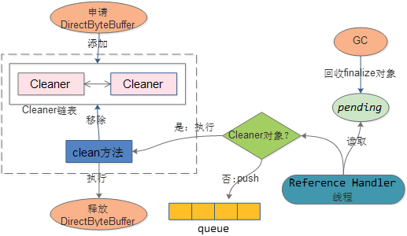

比如创建DirectByteBuffer，会新建Cleaner对象，该对象添加到Cleaner链表中。

对象被GC，如果是Cleaner对象，则会执行该对象的clean方法

Clean方法会将对应的cleaner对象从链表中移除，同时会回收DirectByteBuffer申请的资源。

3：对比

两种方案都是对象被GC后，获取通知，然后对关联的资源进行销毁。

其实就是对象被GC后的notification的实现。Cleaner采用的类似于push的方案，Finalize采用类似于pull的方案。

Cleaner方案相对Finalize的方案性能较高，DirectByteBuffer选择了Cleaner方案来实现资源的销毁

DirectByteBuffer详情可参考：Netty之Java堆外内存扫盲贴

### 4.3 DirectByteBuffer缺点

1：api接口复杂

   区分写模式和读模式，指针移位操作比较复杂。

2：申请或者释放有同步

   在申请资源和释放资源时存在synchronized同步控制，主要是对已分配空间大小进行同步控制。

3：堆外空间得不到及时释放

   只有GC才会对不存在reference的DirectByteBuffer对象进行回收。 如果DirectByteBuffer对象已经到old区了并且已经不存在reference，那么YGC是不能对buffer申请的资源做回收，只有FGC才能进行回收。如果堆外空间不够用了，但是old区DirectByteBuffer对象持有的堆外空间得不到释放，容易导致FGC。

4：停顿时间较长

  堆外空间不够会进行休眠： sleep 100ms 。

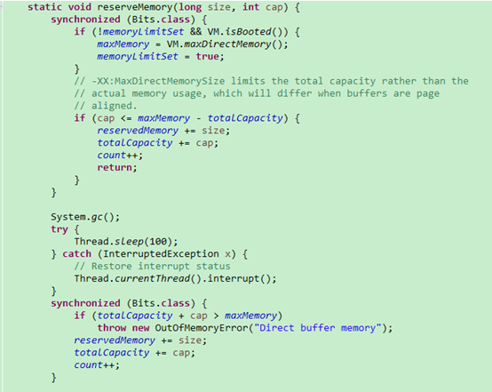

很多文章都有提到会休眠100ms，特别对响应时间敏感的系统，影响比较大。这里需要思考为什么要设计休眠100ms，如果不休眠又会有什么问题？

如下图：(开启了CMS )

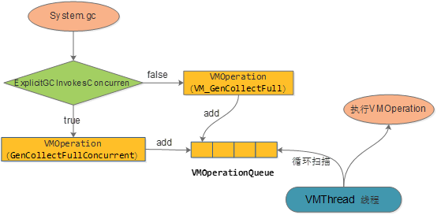

  1：system.gc的仅仅是封装成一个VMOperation，添加到VMOperationQueue。VMThread会循环扫描Queue, 执行VMOperation。

  2：这里也可以看到是否设置ExplicitGCInvokesConcurren 参数，会封装成不同的VMOperation。

 如果不sleep，由于system.gc仅仅是添加队列，很容易导致还没有FGC，就执行了后面的throw new OutOfMemoryError("Direct buffer memory");   

 这里设置100ms，应该是能够保证封装的任务能够被VMThread线程执行。当然，如果在100ms内，VMThread还未执行到FGC的VMOperation，也会直接抛出OutOfMemoryError。

### 4.4 JNA

DirectByteBuffer是使用unsafe(JNI)申请堆外空间(unsafe.allocateMemory(size))。还有一种申请堆外空间的手段：JNA。

JNA的描述(https://github.com/java-native-access/jna)

    JNA provides Java programs easy access to native shared libraries without writing anything but Java code - no JNI or native code is required

堆外缓存OHC便是使用JNA来申请堆外空间。

线下测试：JNA内存申请的性能是unsafe（JNI）的2倍。

### 4.5 netty的ByteBuf

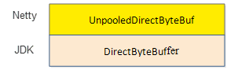

可以看到netty的DirectByteBuf底层的实现是JDK的DirectByteBuffer，仅仅是对JDK的DirectByteBuffer做了api的封装。

Netty DirectByteBuf的特性：

1：易用的api接口。

2：Channel发送Buffer的时候，还需要将ByteBuf转换为JDK的ByteBuffer进行发送。

## 5 Buffer Pool

### 5.1 Buffer Pool设计准则

> **设计准则**：易用性，性能，碎片化，同步，高利用率，安全性
>
> **易用性**：提供的接口是否方便。比如malloc,free使用的便利性，buffer接口的易用性。
>
> **性能**：buffer获取及归还是否高效。
>
> **碎片化**：减少内存碎片化，提升小内存的使用效率
>
> **同步**：在多线程环境下，如何保证内存分配的正确性，避免同一块内存同时对多个线程使用。主要同步点有：bufferPool同步，DirectByteBuffer申请同步，系统的malloc申请同步
>
> **高利用率**：提升内存使用率，内存尽可能服务更多的请求。比如申请1k大小，如果返回了8k大小的buffer，就明显存在内存浪费的情况。
>
> **安全性**：避免内存泄露。比如线程销毁候，线程上的内存是否及时归还。比如业务malloc一块内存，如何检测是否进行了free。

### 5.2 Mycat Buffer Pool

 下面以mycat 1.4.0版本的buffer pool进行描述：

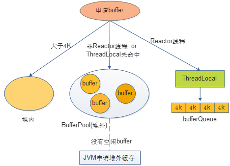

规则：

  1：buffer默认是DirectByteBuffer

  2：buffer大小默认是4K

  3：bufferPool启动会进行初始化。默认申请buffer数量为：4k *1000*processer

申请buffer流程：

  1：申请buffer如果大于4k，则会从堆内进行申请，不进行池化。

  2：小于等于4K，则先从ThreadLocal申请，如果存在，直接返回。

  3：如果ThreadLocal不存在，则从bufferPool申请，如果存在，则直接返回。由于该处是全局访问，需要做同步控制。mycat使用ConcurrentLinkedQueue 来管理buffer。

  4：bufferPool没有可用的buffer，则会到jvm中进行ByteBuffer.allocateDirect(chunkSize)

其他细节这里不再讨论，比如buffer的释放流程等。

缺点：

  1：内存浪费：如果需要的大小是很小，比如100。但是每次都需要申请4k的空间

  2：性能较低：比如申请大于4k的空间，都要在堆内进行申请，性能较低

  3：安全性：没有内存泄露的检查机制。比如未归还等。

Mycat在1.6.0版本，对bufferPool的管理做了优化，此处暂不做讲解。

### 5.3 netty 的Buffer pool

Netty 4实现了一套java版的jemalloc(buddy allocation和slab allocation)，来管理netty的buffer。

下面先看一下twitter对netty buffer pool的性能测试。

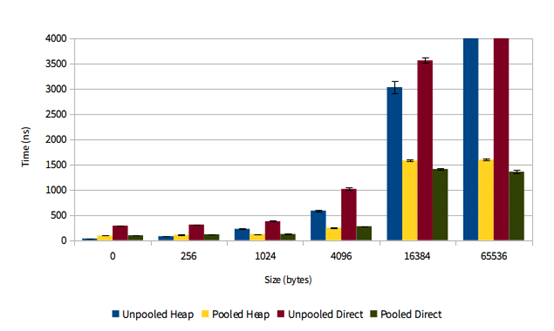

  来源：https://blog.twitter.com/2013/netty-4-at-twitter-reduced-gc-overhead

 可以看到随着申请size的增加，pooled的性能优势越来越明显。

### 5.4 Buffer Pool使用

申请buffer：Allocator.directBuffer(int size) ，使用完成后，必须要release。

如何确定申请buffer的size?

已知大小申请

    如果很清楚需要申请buffer的size，则直接申请对应的size。一般使用场景是IO数据的发送。先将对象序列化为byte[]，再从bufferPool里面申请对应大小的buffer，将byte[]拷贝到buffer中，发送buffer。

未知大小申请

   从channel中read数据，但是read之前并不确定buffer的大小，有两种方式申请buffer的size

   FixedRecvByteBufAllocator：固定大小。比如固定申请4k的buffer。

   AdaptiveRecvByteBufAllocator：自适应大小。可以通过历史申请的buffer size情况预测下一次申请的buffer size。

### 5.5 Buffer Pool设计

#### 5.5.1 层级概念


PoolArena ：作为内存申请和释放的入口。负责同步控制

PoolChunkList ：负责管理chunk的生命周期，提升内存分配的效率

PoolChunk ：主要负责内存块的分配和回收。默认内存块大小为8k*2K=16M。该大小为从内存中申请的连续空间。

Page ：可以分配的最小内存单元 ，默认是8K。

PoolSubpage ：将Page进行拆分，减少内存碎片，提升内存使用效率

#### 5.5.2 Buffer申请流程

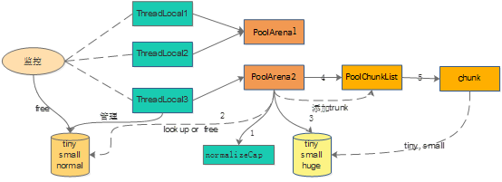


申请Buffer流程

1：从ThreadLocal中拿到对应的PoolArena，由于多个线程可能公用一个PoolArena，需要考虑同步。

2：通过传入的size，计算申请的buffer大小(normalizeCap)。并不是申请多大的size,就返回多大的size。

3：如果size>16M，则申请unpool的buffer。否则从ThreadLocal里面获取对应的buffer。

4：ThreadLocal里没有空闲的buffer，则会从全局的bufferPool中申请buffer。

容量管理

内存分为tiny(16，512)、small[512，8K)、normal[8K,16M]、huge[16M，)这四种类型。其中tiny和small在一个page里面分配。Normal是多个page组成。Huge是单独分配。

tiny：属于PoolSubpage，大小是从16开始，每次增加16字节。中间总共有32个不同值

Small：属于PoolSubpage，大小是从512开始，每次增加2倍，总共有4个不同值

Normal：属于page,大小是从8K开始，一直到16M，每次增加2倍，总共有11个不同值

Huge: 如果判断用户申请的空间大于16M，则不会使用pool，直接申请unpool的buffer。（大内存不方便Pool管理）

ThreadLocal容量管理


 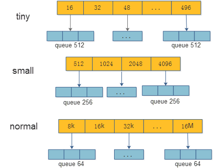

1：为了提升性能，在ThreadLocal里对tiny，small,normal进行缓存。

2：比如tiny，数组中由32个不同的大小。其中每个大小会缓存512份相同大小的buffer。如果超过了512，则不进行缓存 。small和normal类似。

PoolArena容量管理

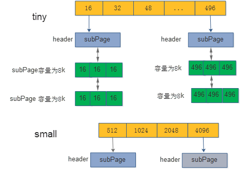

申请的size是tiny或者small ：PoolArena会缓存tiny和small的buffer。从Arena里面的tinyPool和smallPool申请buffer。

Tiny或者small数组每一位代表不同大小的buffer，比如tiny的第0个数组代表size为16的buffer。其中数组是指向subPage的链表。链表的每一个都是总大小为8k，按照size等分的subPage（比如tiny的第0个数组，指向的subPage，全部都是总大小为8k，里面每一个element为16）

申请的size是normal[8K,16M]：则会从PoolChunkList分配，如果分配不到，则会申请一块连续的8K*2k=16M DirectByteBuffer作为一个chunk。再从新申请的chunk中分配normal的buffer。同时将chunk添加到PoolChunkList。

#### 5.5.3 ChunkList管理

本文将不做讲解：[netty5学习笔记-内存池3-PoolChunkList](http://blog.csdn.net/youaremoon/article/details/48085591)

#### 5.5.4 Chunk管理

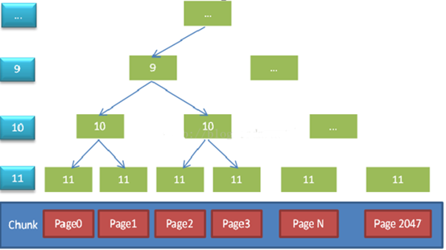

图片来源：http://blog.csdn.net/youaremoon/article/details/47910971

Page默认大小为8k，由2k个page组合成一个chunk。一个chunk的大小为16M。数据结构为一颗二叉树，如果一个节点存在一个已经被分配的子节点，则该节点不能被分配。每次内存分配都是8K*(2^n)，如果需要24K内存时，实际上会申请到一块32K的内存。

#### 5.5.5 内存泄露方案

线程销毁
Netty的bufferPool为了提高内存分配的效率，使用了ThreadLocal来缓存buffer。这里存在一个问题，如果线程注销掉了，如果不把缓存的buffer进行释放，则会存在内存泄露。

Netty会将缓存buffer的线程进行watch，如果发现watch的线程会注销掉，便会释放掉缓存在ThreadLocal里面的Buffer，来避免内存泄露

分配跟踪

如果业务线程申请了buffer，但是未对buffer进行归还，会导致内存泄露。如何避免，可参考：[Netty之有效规避内存泄漏](http://calvin1978.blogcn.com/articles/netty-leak.html)

非常好奇，如果业务线程申请了buffer，未做归还，如何监控发现。我尝试去设计该监控方案，但是一直未有好的思路，发现netty此处设计的非常巧妙。

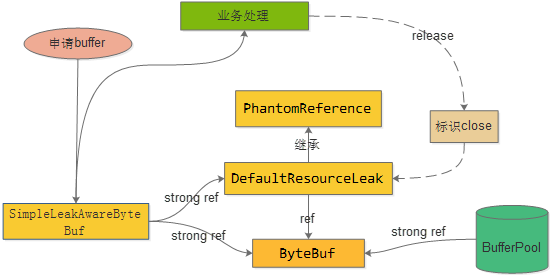

​                    **Simple采样场景**

申请buffer，其实返回的是SimpleLeakAwareByteBuf对象。该对象里面包含了从BufferPool中申请的Bytebuf和DefaultResourceLeak的幻引用对象。

如果业务线程已经不存在对SimpleLeakAwareByteBuf对象的引用(业务线程对申请的Buf使用完成)，在GC的时候，便会回收 SimpleLeakAwareByteBuf对象，同时也会回收DefaultResourceLeak对象，由于ByteBuf还存在BufferPool的strong ref，不会进行回收。

由于DefaultResourceLeak是幻引用，GC时，便会将DefaultResourceLeak对象添加到refQueue 队列中。

如果业务处理正常release了，则会对DefaultResourceLeak标识为close状态。

每次申请buffer时，先查看refQueue里面是否有被回收的DefaultResourceLeak对象。如果有，判断是否是close状态(代表进行了release)，否则存在了内存泄露(业务线程没有调用release方法)。

主要是通过引用关系来巧妙的实现来监控buffer申请未归还。

5.5.6 Buffer Pool缺点
Netty BufferPool带来了性能等各方面优势的同时，他的缺点也非常突出。

1：在申请buffer的同时，还要记得release。

    本文前面提到线上的FGC，便是由于申请的buffer没有release，导致内存泄露。这里其实打破由JVM负责没有引用对象的回收机制。就像江南白衣所说：一下又回到了C的冰冷时代。

2：业务逻辑结构复杂

    申请的buffer可能会存在跨很多方法的传递，也可能会对申请buffer进行slice, copy 等操作，还需要注意异常的处理。导致释放操作是一件非常复杂的事情。

3：bufferPool实现复杂

    从前面的bufferPool实现可以看出，为了达到内存的有效分配，内存分配的性能，实现非常复杂。虽然框架屏蔽了复杂性，但是对于实现原理的了解还是很困难。
————————————————
版权声明：本文为CSDN博主「hetaohappy」的原创文章，遵循CC 4.0 BY-SA版权协议，转载请附上原文出处链接及本声明。
原文链接：https://blog.csdn.net/hetaohappy/article/details/53579187