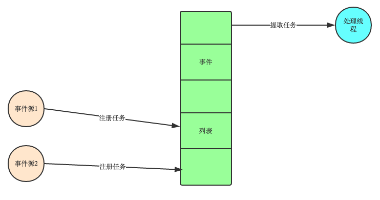
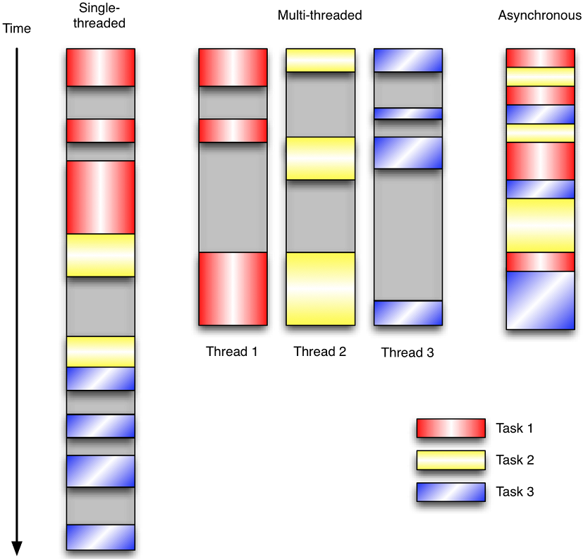

## 事件驱动模型[本文地址](https://www.cnblogs.com/yuanchenqi/articles/5722574.html)

> 很多程序员可能会考虑使用“线程池”或“连接池”。“线程池”旨在减少创建和销毁线程的频率，其维持一定合理数量的线程，并让空闲的线程重新承担新的执行任务。“连接池”维持连接的缓存池，尽量重用已有的连接、减少创建和关闭连接的频率。
>
> 这两种技术都可以很好的降低系统开销，都被广泛应用很多大型系统，如websphere、tomcat和各种数据库等。但是，“线程池”和“连接池”技术也只是在一定程度上缓解了频繁调用IO接口带来的资源占用。而且，所谓“池”始终有其上限，当请求大大超过上限时，“池”构成的系统对外界的响应并不比没有池的时候效果好多少。所以使用“池”必须考虑其面临的响应规模，并根据响应规模调整“池”的大小。
> 对应上例中的所面临的可能同时出现的上千甚至上万次的客户端请求，“线程池”或“连接池”或许可以缓解部分压力，但是不能解决所有问题。总之，多线程模型可以方便高效的解决小规模的服务请求，但面对大规模的服务请求，多线程模型也会遇到瓶颈，可以用非阻塞接口来尝试解决这个问题

传统的编程是如下线性模式的：

开始--->代码块A--->代码块B--->代码块C--->代码块D--->......--->结束

每一个代码块里是完成各种各样事情的代码，但编程者知道代码块A,B,C,D...的执行顺序，唯一能够改变这个流程的是数据。输入不同的数据，根据条件语句判断，流程或许就改为A--->C--->E...--->结束。每一次程序运行顺序或许都不同，但它的控制流程是由输入数据和你编写的程序决定的。如果你知道这个程序当前的运行状态（包括输入数据和程序本身），那你就知道接下来甚至一直到结束它的运行流程。

 对于事件驱动型程序模型，它的流程大致如下：

开始--->初始化--->等待

 与上面传统编程模式不同，事件驱动程序在启动之后，就在那等待，等待什么呢？等待被事件触发。传统编程下也有“等待”的时候，比如在代码块D中，你定义了一个input()，需要用户输入数据。但这与下面的等待不同，传统编程的“等待”，比如input()，你作为程序编写者是知道或者强制用户输入某个东西的，或许是数字，或许是文件名称，如果用户输入错误，你还需要提醒他，并请他重新输入。事件驱动程序的等待则是完全不知道，也不强制用户输入或者干什么。只要某一事件发生，那程序就会做出相应的“反应”。这些事件包括：输入信息、鼠标、敲击键盘上某个键还有系统内部定时器触发。

### 一、事件驱动模型介绍

通常，我们写服务器处理模型的程序时，有以下几种模型：

> （1）每收到一个请求，创建一个新的进程，来处理该请求； 
> （2）每收到一个请求，创建一个新的线程，来处理该请求； 
> （3）每收到一个请求，放入一个事件列表，让主进程通过非阻塞I/O方式来处理请求

第三种就是协程、事件驱动的方式，一般普遍认为第（3）种方式是大多数网络服务器采用的方式 

**论事件驱动模型** 

```
<!DOCTYPE html>
<html lang="en">
<head>
    <meta charset="UTF-8">
    <title>Title</title>

</head>
<body>

<p onclick="fun()">点我呀</p>


<script type="text/javascript">
    function fun() {
          alert('约吗?')
    }
</script>
</body>

</html>
```

在UI编程中，常常要对鼠标点击进行相应，首先如何获得鼠标点击呢？ 两种方式：

#### 1创建一个线程循环检测是否有鼠标点击

   那么这个方式有以下几个缺点：

1. CPU资源浪费，可能鼠标点击的频率非常小，但是扫描线程还是会一直循环检测，这会造成很多的CPU资源浪费；如果扫描鼠标点击的接口是阻塞的呢？
2. 如果是堵塞的，又会出现下面这样的问题，如果我们不但要扫描鼠标点击，还要扫描键盘是否按下，由于扫描鼠标时被堵塞了，那么可能永远不会去扫描键盘；
3. 如果一个循环需要扫描的设备非常多，这又会引来响应时间的问题； 
   所以，该方式是非常不好的。

#### 2 就是事件驱动模型 

目前大部分的UI编程都是事件驱动模型，如很多UI平台都会提供onClick()事件，这个事件就代表鼠标按下事件。事件驱动模型大体思路如下：

1. 有一个事件（消息）队列；
2. 鼠标按下时，往这个队列中增加一个点击事件（消息）；
3. 有个循环，不断从队列取出事件，根据不同的事件，调用不同的函数，如onClick()、onKeyDown()等；
4. 事件（消息）一般都各自保存各自的处理函数指针，这样，每个消息都有独立的处理函数； 
   
   **事件驱动编程是一种编程范式，这里程序的执行流由外部事件来决定。它的特点是包含一个事件循环，当外部事件发生时使用回调机制来触发相应的处理**。另外两种常见的编程范式是（单线程）同步以及多线程编程。 
   　
   让我们用例子来比较和对比一下单线程、多线程以及事件驱动编程模型。下图展示了随着时间的推移，这三种模式下程序所做的工作。这个程序有3个任务需要完成，每个任务都在等待I/O操作时阻塞自身。阻塞在I/O操作上所花费的时间已经用灰色框标示出来了。 
   

最初的问题：怎么确定IO操作完了切回去呢？**通过回调函数** 

> 1.要理解事件驱动和程序，就需要与非事件驱动的程序进行比较。实际上，现代的程序大多是事件驱动的，比如多线程的程序，肯定是事件驱动的。早期则存在许多非事件驱动的程序，这样的程序，在需要等待某个条件触发时，会不断地检查这个条件，直到条件满足，这是很浪费cpu时间的。而事件驱动的程序，则有机会释放cpu从而进入睡眠态（注意是有机会，当然程序也可自行决定不释放cpu），当事件触发时被操作系统唤醒，这样就能更加有效地使用cpu.
> 2.再说什么是事件驱动的程序。一个典型的事件驱动的程序，就是一个死循环，并以一个线程的形式存在，这个死循环包括两个部分，第一个部分是按照一定的条件接收并选择一个要处理的事件，第二个部分就是事件的处理过程。程序的执行过程就是选择事件和处理事件，而当没有任何事件触发时，程序会因查询事件队列失败而进入睡眠状态，从而释放cpu。
> 3.事件驱动的程序，必定会直接或者间接拥有一个事件队列，用于存储未能及时处理的事件。
> 4.事件驱动的程序的行为，完全受外部输入的事件控制，所以，事件驱动的系统中，存在大量这种程序，并以事件作为主要的通信方式。
> 5.事件驱动的程序，还有一个最大的好处，就是可以按照一定的顺序处理队列中的事件，而这个顺序则是由事件的触发顺序决定的，这一特性往往被用于保证某些过程的原子化。
> 6.目前windows,linux,nucleus,vxworks都是事件驱动的，只有一些单片机可能是非事件驱动的。

注意，事件驱动的监听事件是由操作系统调用的cpu来完成的

## **IO多路复用**

前面是用协程实现的IO阻塞自动切换，那么协程又是怎么实现的，在原理是是怎么实现的。如何去实现事件驱动的情况下IO的自动阻塞的切换，这个学名叫什么呢？ => IO多路复用 
比如socketserver，多个客户端连接，单线程下实现并发效果，就叫多路复用。 
　 
同步IO和异步IO，阻塞IO和非阻塞IO分别是什么，到底有什么区别？不同的人在不同的上下文下给出的答案是不同的。所以先限定一下本文的上下文。 

> 本文讨论的背景是Linux环境下的network IO。

### **1 IO模型前戏准备**

在进行解释之前，首先要说明几个概念：

1. 用户空间和内核空间
2. 进程切换
3. 进程的阻塞
4. 文件描述符
5. 缓存 I/O

#### 用户空间与内核空间

现在操作系统都是采用虚拟存储器，那么对32位操作系统而言，它的寻址空间（虚拟存储空间）为4G（2的32次方）。 
操作系统的核心是内核，独立于普通的应用程序，可以访问受保护的内存空间，也有访问底层硬件设备的所有权限。 
为了保证用户进程不能直接操作内核（kernel），保证内核的安全，操心系统将虚拟空间划分为两部分，一部分为内核空间，一部分为用户空间。 
针对linux操作系统而言，将最高的1G字节（从虚拟地址0xC0000000到0xFFFFFFFF），供内核使用，称为内核空间，而将较低的3G字节（从虚拟地址0x00000000到0xBFFFFFFF），供各个进程使用，称为用户空间。 

#### 进程切换

为了控制进程的执行，内核必须有能力挂起正在CPU上运行的进程，并恢复以前挂起的某个进程的执行。这种行为被称为进程切换，这种切换是由操作系统来完成的。因此可以说，任何进程都是在操作系统内核的支持下运行的，是与内核紧密相关的。 
从一个进程的运行转到另一个进程上运行，这个过程中经过下面这些变化：

保存处理机上下文，包括程序计数器和其他寄存器。

更新PCB信息。

把进程的PCB移入相应的队列，如就绪、在某事件阻塞等队列。

选择另一个进程执行，并更新其PCB。

更新内存管理的数据结构。

恢复处理机上下文。 
注：总而言之就是很耗资源的

#### 进程的阻塞

正在执行的进程，由于期待的某些事件未发生，如请求系统资源失败、等待某种操作的完成、新数据尚未到达或无新工作做等，则由系统自动执行阻塞原语(Block)，使自己由运行状态变为阻塞状态。可见，进程的阻塞是进程自身的一种主动行为，也因此只有处于运行态的进程（获得CPU），才可能将其转为阻塞状态。当进程进入阻塞状态，是不占用CPU资源的。

#### 文件描述符fd

文件描述符（File descriptor）是计算机科学中的一个术语，是一个用于表述指向文件的引用的抽象化概念。 
文件描述符在形式上是一个非负整数。实际上，它是一个索引值，指向内核为每一个进程所维护的该进程打开文件的记录表。当程序打开一个现有文件或者创建一个新文件时，内核向进程返回一个文件描述符。在程序设计中，一些涉及底层的程序编写往往会围绕着文件描述符展开。但是文件描述符这一概念往往只适用于UNIX、Linux这样的操作系统。

#### 缓存 I/O

缓存 I/O 又被称作标准 I/O，大多数文件系统的默认 I/O 操作都是缓存 I/O。在 Linux 的缓存 I/O 机制中，操作系统会将 I/O 的数据缓存在文件系统的页缓存（ page cache ）中，也就是说，数据会先被拷贝到操作系统内核的缓冲区中，然后才会从操作系统内核的缓冲区拷贝到应用程序的地址空间。用户空间没法直接访问内核空间的，内核态到用户态的数据拷贝 

思考：为什么数据一定要先到内核区，直接到用户内存不是更直接吗？
缓存 I/O 的缺点： 

数据在传输过程中需要在应用程序地址空间和内核进行多次数据拷贝操作，这些数据拷贝操作所带来的 CPU 以及内存开销是非常大的。

 

​    同步（synchronous） IO和异步（asynchronous） IO，阻塞（blocking） IO和非阻塞（non-blocking）IO分别是什么，到底有什么区别？这个问题其实不同的人给出的答案都可能不同，比如wiki，就认为asynchronous IO和non-blocking IO是一个东西。这其实是因为不同的人的知识背景不同，并且在讨论这个问题的时候上下文(context)也不相同。所以，为了更好的回答这个问题，我先限定一下本文的上下文。
本文讨论的背景是Linux环境下的network IO。 

Stevens在文章中一共比较了五种IO Model：

- - -   blocking IO
    -   nonblocking IO
    -   IO multiplexing
    -   signal driven IO
    -   asynchronous IO

由于signal driven IO在实际中并不常用，所以我这只提及剩下的四种IO Model。
再说一下IO发生时涉及的对象和步骤。
   对于一个network IO (这里我们以read举例)，它会涉及到两个系统对象，一个是调用这个IO的process (or thread)，另一个就是系统内核(kernel)。当一个read操作发生时，它会经历两个阶段：
 1 等待数据准备 (Waiting for the data to be ready)
 2 将数据从内核拷贝到进程中 (Copying the data from the kernel to the process)
记住这两点很重要，因为这些IO Model的区别就是在两个阶段上各有不同的情况。

### 2 blocking IO （阻塞IO）

在linux中，默认情况下所有的socket都是blocking，一个典型的读操作流程大概是这样：

   当用户进程调用了recvfrom这个系统调用，kernel就开始了IO的第一个阶段：准备数据。对于network io来说，很多时候数据在一开始还没有到达（比如，还没有收到一个完整的UDP包），这个时候kernel就要等待足够的数据到来。而在用户进程这边，整个进程会被阻塞。当kernel一直等到数据准备好了，它就会将数据从kernel中拷贝到用户内存，然后kernel返回结果，用户进程才解除block的状态，重新运行起来。
所以，blocking IO的特点就是在IO执行的两个阶段都被block了。

### 3 non-blocking IO（非阻塞IO）

linux下，可以通过设置socket使其变为non-blocking。当对一个non-blocking socket执行读操作时，流程是这个样子：

   从图中可以看出，当用户进程发出read操作时，如果kernel中的数据还没有准备好，那么它并不会block用户进程，而是立刻返回一个error。从用户进程角度讲 ，它发起一个read操作后，并不需要等待，而是马上就得到了一个结果。用户进程判断结果是一个error时，它就知道数据还没有准备好，于是它可以再次发送read操作。一旦kernel中的数据准备好了，并且又再次收到了用户进程的system call，那么它马上就将数据拷贝到了用户内存，然后返回。
所以，用户进程其实是需要不断的主动询问kernel数据好了没有。

 注意：

   在网络IO时候，非阻塞IO也会进行recvform系统调用，检查数据是否准备好，与阻塞IO不一样，”非阻塞将大的整片时间的阻塞分成N多的小的阻塞, 所以进程不断地有机会 ‘被’ CPU光顾”。即每次recvform系统调用之间，cpu的权限还在进程手中，这段时间是可以做其他事情的，

   也就是说非阻塞的recvform系统调用调用之后，进程并没有被阻塞，内核马上返回给进程，如果数据还没准备好，此时会返回一个error。进程在返回之后，可以干点别的事情，然后再发起recvform系统调用。重复上面的过程，循环往复的进行recvform系统调用。这个过程通常被称之为轮询。轮询检查内核数据，直到数据准备好，再拷贝数据到进程，进行数据处理。需要注意，拷贝数据整个过程，进程仍然是属于阻塞的状态。

### 4  IO multiplexing（IO多路复用）

   IO multiplexing这个词可能有点陌生，但是如果我说select，epoll，大概就都能明白了。有些地方也称这种IO方式为event driven IO。我们都知道，select/epoll的好处就在于单个process就可以同时处理多个网络连接的IO。它的基本原理就是select/epoll这个function会不断的轮询所负责的所有socket，当某个socket有数据到达了，就通知用户进程。它的流程如图：

   当用户进程调用了select，那么整个进程会被block，而同时，kernel会“监视”所有select负责的socket，当任何一个socket中的数据准备好了，select就会返回。这个时候用户进程再调用read操作，将数据从kernel拷贝到用户进程。
这个图和blocking IO的图其实并没有太大的不同，事实上，还更差一些。因为这里需要使用两个system call (select 和 recvfrom)，而blocking IO只调用了一个system call (recvfrom)。但是，用select的优势在于它可以同时处理多个connection。（多说一句。所以，如果处理的连接数不是很高的话，使用select/epoll的web server不一定比使用multi-threading + blocking IO的web server性能更好，可能延迟还更大。select/epoll的优势并不是对于单个连接能处理得更快，而是在于能处理更多的连接。）
在IO multiplexing Model中，实际中，对于每一个socket，一般都设置成为non-blocking，但是，如上图所示，整个用户的process其实是一直被block的。只不过process是被select这个函数block，而不是被socket IO给block。

注意1：select函数返回结果中如果有文件可读了，那么进程就可以通过调用accept()或recv()来让kernel将位于内核中准备到的数据copy到用户区。

注意2: select的优势在于可以处理多个连接，不适用于单个连接

### **5  Asynchronous I/O（异步IO）**

linux下的asynchronous IO其实用得很少。先看一下它的流程：

用户进程发起read操作之后，立刻就可以开始去做其它的事。而另一方面，从kernel的角度，当它受到一个asynchronous read之后，首先它会立刻返回，所以不会对用户进程产生任何block。然后，kernel会等待数据准备完成，然后将数据拷贝到用户内存，当这一切都完成之后，kernel会给用户进程发送一个signal，告诉它read操作完成了。

   到目前为止，已经将四个IO Model都介绍完了。现在回过头来回答最初的那几个问题：blocking和non-blocking的区别在哪，synchronous IO和asynchronous IO的区别在哪。
先回答最简单的这个：blocking vs non-blocking。前面的介绍中其实已经很明确的说明了这两者的区别。调用blocking IO会一直block住对应的进程直到操作完成，而non-blocking IO在kernel还准备数据的情况下会立刻返回。

在说明synchronous IO和asynchronous IO的区别之前，需要先给出两者的定义。Stevens给出的定义（其实是POSIX的定义）是这样子的：
  **A synchronous I/O operation causes the requesting process to be blocked until that I/O operationcompletes;
  An asynchronous I/O operation does not cause the requesting process to be blocked;** 
   两者的区别就在于synchronous IO做”IO operation”的时候会将process阻塞。按照这个定义，之前所述的blocking IO，non-blocking IO，IO multiplexing都属于synchronous IO。有人可能会说，non-blocking IO并没有被block啊。这里有个非常“狡猾”的地方，定义中所指的”IO operation”是指真实的IO操作，就是例子中的recvfrom这个system call。non-blocking IO在执行recvfrom这个system call的时候，如果kernel的数据没有准备好，这时候不会block进程。但是，当kernel中数据准备好的时候，recvfrom会将数据从kernel拷贝到用户内存中，这个时候进程是被block了，在这段时间内，进程是被block的。而asynchronous IO则不一样，当进程发起IO 操作之后，就直接返回再也不理睬了，直到kernel发送一个信号，告诉进程说IO完成。在这整个过程中，进程完全没有被block。

​    注意：由于咱们接下来要讲的select，poll，epoll都属于IO多路复用，而IO多路复用又属于同步的范畴，故，epoll只是一个伪异步而已。

各个IO Model的比较如图所示：


   经过上面的介绍，会发现non-blocking IO和asynchronous IO的区别还是很明显的。在non-blocking IO中，虽然进程大部分时间都不会被block，但是它仍然要求进程去主动的check，并且当数据准备完成以后，也需要进程主动的再次调用recvfrom来将数据拷贝到用户内存。而asynchronous IO则完全不同。它就像是用户进程将整个IO操作交给了他人（kernel）完成，然后他人做完后发信号通知。在此期间，用户进程不需要去检查IO操作的状态，也不需要主动的去拷贝数据。

五种IO模型比较：

    

### 6 **select poll epoll IO多路复用介绍**

**首先列一下，sellect、poll、epoll三者的区别**

- **select** 
  select最早于1983年出现在4.2BSD中，它通过一个select()系统调用来监视多个文件描述符的数组，当select()返回后，该数组中就绪的文件描述符便会被内核修改标志位，使得进程可以获得这些文件描述符从而进行后续的读写操作。 
  select目前几乎在所有的平台上支持 
  　 
  select的一个缺点在于单个进程能够监视的文件描述符的数量存在最大限制，在Linux上一般为1024，不过可以通过修改宏定义甚至重新编译内核的方式提升这一限制。 
  　 
  另外，select()所维护的存储大量文件描述符的数据结构，随着文件描述符数量的增大，其复制的开销也线性增长。同时，由于网络响应时间的延迟使得大量TCP连接处于非活跃状态，但调用select()会对所有socket进行一次线性扫描，所以这也浪费了一定的开销。

- **poll** 
  它和select在本质上没有多大差别，但是poll没有最大文件描述符数量的限制。 
  一般也不用它，相当于过渡阶段

- **epoll** 
  直到Linux2.6才出现了由内核直接支持的实现方法，那就是epoll。被公认为Linux2.6下性能最好的多路I/O就绪通知方法。windows不支持 

  没有最大文件描述符数量的限制。 
  比如100个连接，有两个活跃了，epoll会告诉用户这两个两个活跃了，直接取就ok了，而select是循环一遍。 

  （了解）epoll可以同时支持水平触发和边缘触发（Edge Triggered，只告诉进程哪些文件描述符刚刚变为就绪状态，它只说一遍，如果我们没有采取行动，那么它将不会再次告知，这种方式称为**边缘触发**），理论上边缘触发的性能要更高一些，但是代码实现相当复杂。 
  另一个本质的改进在于epoll采用基于事件的就绪通知方式。在select/poll中，进程只有在调用一定的方法后，内核才对所有监视的文件描述符进行扫描，而epoll事先通过epoll_ctl()来注册一个文件描述符，一旦基于某个文件描述符就绪时，内核会采用类似callback的回调机制，迅速激活这个文件描述符，当进程调用epoll_wait()时便得到通知。 

  所以市面上上见到的所谓的异步IO，比如nginx、Tornado、等，我们叫它异步IO，实际上是IO多路复用。

**select与epoll**

> ```
> # 首先我们来定义流的概念，一个流可以是文件，socket，pipe等等可以进行I/O操作的内核对象。
> # 不管是文件，还是套接字，还是管道，我们都可以把他们看作流。
> # 之后我们来讨论I/O的操作，通过read，我们可以从流中读入数据；通过write，我们可以往流写入数据。现在假
> # 定一个情形，我们需要从流中读数据，但是流中还没有数据，（典型的例子为，客户端要从socket读如数据，但是
> # 服务器还没有把数据传回来），这时候该怎么办？
> # 阻塞。阻塞是个什么概念呢？比如某个时候你在等快递，但是你不知道快递什么时候过来，而且你没有别的事可以干
> # （或者说接下来的事要等快递来了才能做）；那么你可以去睡觉了，因为你知道快递把货送来时一定会给你打个电话
> # （假定一定能叫醒你）。
> # 非阻塞忙轮询。接着上面等快递的例子，如果用忙轮询的方法，那么你需要知道快递员的手机号，然后每分钟给他挂
> # 个电话：“你到了没？”
> # 很明显一般人不会用第二种做法，不仅显很无脑，浪费话费不说，还占用了快递员大量的时间。
> # 大部分程序也不会用第二种做法，因为第一种方法经济而简单，经济是指消耗很少的CPU时间，如果线程睡眠了，
> # 就掉出了系统的调度队列，暂时不会去瓜分CPU宝贵的时间片了。
> #
> # 为了了解阻塞是如何进行的，我们来讨论缓冲区，以及内核缓冲区，最终把I/O事件解释清楚。缓冲区的引入是为
> # 了减少频繁I/O操作而引起频繁的系统调用（你知道它很慢的），当你操作一个流时，更多的是以缓冲区为单位进
> # 行操作，这是相对于用户空间而言。对于内核来说，也需要缓冲区。
> # 假设有一个管道，进程A为管道的写入方，Ｂ为管道的读出方。
> # 假设一开始内核缓冲区是空的，B作为读出方，被阻塞着。然后首先A往管道写入，这时候内核缓冲区由空的状态变
> # 到非空状态，内核就会产生一个事件告诉Ｂ该醒来了，这个事件姑且称之为“缓冲区非空”。
> # 但是“缓冲区非空”事件通知B后，B却还没有读出数据；且内核许诺了不能把写入管道中的数据丢掉这个时候，Ａ写
> # 入的数据会滞留在内核缓冲区中，如果内核也缓冲区满了，B仍未开始读数据，最终内核缓冲区会被填满，这个时候
> # 会产生一个I/O事件，告诉进程A，你该等等（阻塞）了，我们把这个事件定义为“缓冲区满”。
> # 假设后来Ｂ终于开始读数据了，于是内核的缓冲区空了出来，这时候内核会告诉A，内核缓冲区有空位了，你可以从
> # 长眠中醒来了，继续写数据了，我们把这个事件叫做“缓冲区非满”
> # 也许事件Y1已经通知了A，但是A也没有数据写入了，而Ｂ继续读出数据，知道内核缓冲区空了。这个时候内核就告
> # 诉B，你需要阻塞了！，我们把这个时间定为“缓冲区空”。
> # 这四个情形涵盖了四个I/O事件，缓冲区满，缓冲区空，缓冲区非空，缓冲区非满（注都是说的内核缓冲区，且这四
> # 个术语都是我生造的，仅为解释其原理而造）。这四个I/O事件是进行阻塞同步的根本。（如果不能理解“同步”是
> # 什么概念，请学习操作系统的锁，信号量，条件变量等任务同步方面的相关知识）。
> #
> # 然后我们来说说阻塞I/O的缺点。但是阻塞I/O模式下，一个线程只能处理一个流的I/O事件。如果想要同时处理多
> # 个流，要么多进程(fork)，要么多线程(pthread_create)，很不幸这两种方法效率都不高。
> # 于是再来考虑非阻塞忙轮询的I/O方式，我们发现我们可以同时处理多个流了（把一个流从阻塞模式切换到非阻塞
> # 模式再此不予讨论）：
> # while true {
> # for i in stream[]; {
> # if i has data
> # read until unavailable
> # }
> # }
> # 我们只要不停的把所有流从头到尾问一遍，又从头开始。这样就可以处理多个流了，但这样的做法显然不好，因为
> # 如果所有的流都没有数据，那么只会白白浪费CPU。这里要补充一点，阻塞模式下，内核对于I/O事件的处理是阻
> # 塞或者唤醒，而非阻塞模式下则把I/O事件交给其他对象（后文介绍的select以及epoll）处理甚至直接忽略。
> #
> # 为了避免CPU空转，可以引进了一个代理（一开始有一位叫做select的代理，后来又有一位叫做poll的代理，不
> # 过两者的本质是一样的）。这个代理比较厉害，可以同时观察许多流的I/O事件，在空闲的时候，会把当前线程阻
> # 塞掉，当有一个或多个流有I/O事件时，就从阻塞态中醒来，于是我们的程序就会轮询一遍所有的流（于是我们可
> # 以把“忙”字去掉了）。代码长这样:
> # while true {
> # select(streams[])
> # for i in streams[] {
> # if i has data
> # read until unavailable
> # }
> # }
> # 于是，如果没有I/O事件产生，我们的程序就会阻塞在select处。但是依然有个问题，我们从select那里仅仅知
> # 道了，有I/O事件发生了，但却并不知道是那几个流（可能有一个，多个，甚至全部），我们只能无差别轮询所有流，
> # 找出能读出数据，或者写入数据的流，对他们进行操作。
> # 但是使用select，我们有O(n)的无差别轮询复杂度，同时处理的流越多，每一次无差别轮询时间就越长。再次
> # 说了这么多，终于能好好解释epoll了
> # epoll可以理解为event poll，不同于忙轮询和无差别轮询，epoll之会把哪个流发生了怎样的I/O事件通知我
> # 们。此时我们对这些流的操作都是有意义的。
> # 在讨论epoll的实现细节之前，先把epoll的相关操作列出：
> # epoll_create 创建一个epoll对象，一般epollfd = epoll_create()
> # epoll_ctl （epoll_add/epoll_del的合体），往epoll对象中增加/删除某一个流的某一个事件
> # 比如
> # epoll_ctl(epollfd, EPOLL_CTL_ADD, socket, EPOLLIN);//有缓冲区内有数据时epoll_wait返回
> # epoll_ctl(epollfd, EPOLL_CTL_DEL, socket, EPOLLOUT);//缓冲区可写入时epoll_wait返回
> # epoll_wait(epollfd,...)等待直到注册的事件发生
> # （注：当对一个非阻塞流的读写发生缓冲区满或缓冲区空，write/read会返回-1，并设置errno=EAGAIN。
> # 而epoll只关心缓冲区非满和缓冲区非空事件）。
> # 一个epoll模式的代码大概的样子是：
> # while true {
> # active_stream[] = epoll_wait(epollfd)
> # for i in active_stream[] {
> # read or write till unavailable
> # }
> # }
> 
> 
> # 举个例子:
> #    select:
> #          班里三十个同学在考试,谁先做完想交卷都要通过按钮来活动,他按按钮作为老师的我桌子上的灯就会变红.
> #          一旦灯变红,我(select)我就可以知道有人交卷了,但是我并不知道谁交的,所以,我必须跟个傻子似的轮询
> #          地去问:嘿,是你要交卷吗?然后我就可以以这种效率极低地方式找到要交卷的学生,然后把它的卷子收上来.
> #
> #
> #    epoll:
> #         这次再有人按按钮,我这不光灯会亮,上面还会显示要交卷学生的名字.这样我就可以直接去对应学生那收卷就
> #         好了.当然,同时可以有多人交卷.
> ```

**IO多路复用的触发方式**

```
# 在linux的IO多路复用中有水平触发,边缘触发两种模式,这两种模式的区别如下:
#
# 水平触发:如果文件描述符已经就绪可以非阻塞的执行IO操作了,此时会触发通知.允许在任意时刻重复检测IO的状态,
# 没有必要每次描述符就绪后尽可能多的执行IO.select,poll就属于水平触发.
#
# 边缘触发:如果文件描述符自上次状态改变后有新的IO活动到来,此时会触发通知.在收到一个IO事件通知后要尽可能
# 多的执行IO操作,因为如果在一次通知中没有执行完IO那么就需要等到下一次新的IO活动到来才能获取到就绪的描述
# 符.信号驱动式IO就属于边缘触发.
#
# epoll既可以采用水平触发,也可以采用边缘触发.
#
# 大家可能还不能完全了解这两种模式的区别,我们可以举例说明:一个管道收到了1kb的数据,epoll会立即返回,此时
# 读了512字节数据,然后再次调用epoll.这时如果是水平触发的,epoll会立即返回,因为有数据准备好了.如果是边
# 缘触发的不会立即返回,因为此时虽然有数据可读但是已经触发了一次通知,在这次通知到现在还没有新的数据到来,
# 直到有新的数据到来epoll才会返回,此时老的数据和新的数据都可以读取到(当然是需要这次你尽可能的多读取).


# 下面我们还从电子的角度来解释一下:
# 
#     水平触发:也就是只有高电平(1)或低电平(0)时才触发通知,只要在这两种状态就能得到通知.上面提到的只要
# 有数据可读(描述符就绪)那么水平触发的epoll就立即返回.
# 
#     边缘触发:只有电平发生变化(高电平到低电平,或者低电平到高电平)的时候才触发通知.上面提到即使有数据
# 可读,但是没有新的IO活动到来,epoll也不会立即返回.
```

### **简单实例**

**实例1(non-blocking IO)：**   

```
import time
import socket
sk = socket.socket(socket.AF_INET,socket.SOCK_STREAM)
sk.setsockopt
sk.bind(('127.0.0.1',6667))
sk.listen(5)
sk.setblocking(False)
while True:
    try:
        print ('waiting client connection .......')
        connection,address = sk.accept()   # 进程主动轮询
        print("+++",address)
        client_messge = connection.recv(1024)
        print(str(client_messge,'utf8'))
        connection.close()
    except Exception as e:
        print (e)
        time.sleep(4)

#############################client

import time
import socket
sk = socket.socket(socket.AF_INET,socket.SOCK_STREAM)

while True:
    sk.connect(('127.0.0.1',6667))
    print("hello")
    sk.sendall(bytes("hello","utf8"))
    time.sleep(2)
    break
```


   优点：能够在等待任务完成的时间里干其他活了（包括提交其他任务，也就是 “后台” 可以有多个任务在同时执行）。

　　缺点：任务完成的响应延迟增大了，因为每过一段时间才去轮询一次read操作，而任务可能在两次轮询之间的任意时间完成。这会导致整体数据吞吐量的降低。

实例2(IO multiplexing):

在非阻塞实例中，轮询的主语是进程，而“后台” 可能有多个任务在同时进行，人们就想到了循环查询多个任务的完成状态，只要有任何一个任务完成，就去处理它。不过，这个监听的重任通过调用select等函数交给了内核去做。IO多路复用有两个特别的系统调用select、poll、epoll函数。select调用是内核级别的，select轮询相对非阻塞的轮询的区别在于—前者可以等待多个socket，能实现同时对多个IO端口进行监听，当其中任何一个socket的数据准好了，就能返回进行可读，然后进程再进行recvfrom系统调用，将数据由内核拷贝到用户进程，当然这个过程是阻塞的。

**实例2:**

[](javascript:void(0);)

```
import socket
import select
sk=socket.socket()
sk.bind(("127.0.0.1",9904))
sk.listen(5)

while True:
    r,w,e=select.select([sk,],[],[],5)
    for i in r:
        # conn,add=i.accept()
        #print(conn)
        print("hello")
    print('>>>>>>')
    
#*************************client.py
import socket

sk=socket.socket()

sk.connect(("127.0.0.1",9904))

while 1:
    inp=input(">>").strip()
    sk.send(inp.encode("utf8"))
    data=sk.recv(1024)
    print(data.decode("utf8"))
```

请思考：为什么不调用accept，会反复print？

> select属于水平触发

**实例3(server端并发聊天):**

```
#***********************server.py
import socket
import select
sk=socket.socket()
sk.bind(("127.0.0.1",8801))
sk.listen(5)
inputs=[sk,]
while True:
    r,w,e=select.select(inputs,[],[],5)
    print(len(r))

    for obj in r:
        if obj==sk:
            conn,add=obj.accept()
            print(conn)
            inputs.append(conn)
        else:
            data_byte=obj.recv(1024)
            print(str(data_byte,'utf8'))
            inp=input('回答%s号客户>>>'%inputs.index(obj))
            obj.sendall(bytes(inp,'utf8'))

    print('>>',r)

#***********************client.py

import socket
sk=socket.socket()
sk.connect(('127.0.0.1',8801))

while True:
    inp=input(">>>>")
    sk.sendall(bytes(inp,"utf8"))
    data=sk.recv(1024)
    print(str(data,'utf8'))
```

文件描述符其实就是咱们平时说的句柄，只不过文件描述符是linux中的概念。注意，我们的accept或recv调用时即向系统发出recvfrom请求

  (1)  如果内核缓冲区没有数据－－－>等待－－－>数据到了内核缓冲区，转到用户进程缓冲区；

  (2) 如果先用select监听到某个文件描述符对应的内核缓冲区有了数据，当我们再调用accept或recv时，直接将数据转到用户缓冲区。


思考1：开启5个client，分别按54321的顺序发送消息，那么server端是按什么顺序回消息的呢？

思考2:  如何在某一个client端退出后，不影响server端和其它客户端正常交流

linux：

```
if not data_byte:
            inputs.remove(obj)
            continue
```

win

```
try:
      data_byte=obj.recv(1024)
      print(str(data_byte,'utf8'))
      inp=input('回答%s号客户>>>'%inputs.index(obj))
      obj.sendall(bytes(inp,'utf8'))
except Exception:
      inputs.remove(obj)
```

### 延伸

**实例4:**

```
#_*_coding:utf-8_*_
__author__ = 'Alex Li'
 
import select
import socket
import sys
import queue
 
# Create a TCP/IP socket
server = socket.socket(socket.AF_INET, socket.SOCK_STREAM)
server.setblocking(False)
 
# Bind the socket to the port
server_address = ('localhost', 10000)
print(sys.stderr, 'starting up on %s port %s' % server_address)
server.bind(server_address)
 
# Listen for incoming connections
server.listen(5)
 
# Sockets from which we expect to read
inputs = [ server ]
 
# Sockets to which we expect to write
outputs = [ ]
 
message_queues = {}
while inputs:
 
    # Wait for at least one of the sockets to be ready for processing
    print( '\nwaiting for the next event')
    readable, writable, exceptional = select.select(inputs, outputs, inputs)
    # Handle inputs
    for s in readable:
 
        if s is server:
            # A "readable" server socket is ready to accept a connection
            connection, client_address = s.accept()
            print('new connection from', client_address)
            connection.setblocking(False)
            inputs.append(connection)
 
            # Give the connection a queue for data we want to send
            message_queues[connection] = queue.Queue()
        else:
            data = s.recv(1024)
            if data:
                # A readable client socket has data
                print(sys.stderr, 'received "%s" from %s' % (data, s.getpeername()) )
                message_queues[s].put(data)
                # Add output channel for response
                if s not in outputs:
                    outputs.append(s)
            else:
                # Interpret empty result as closed connection
                print('closing', client_address, 'after reading no data')
                # Stop listening for input on the connection
                if s in outputs:
                    outputs.remove(s)  #既然客户端都断开了，我就不用再给它返回数据了，所以这时候如果这个客户端的连接对象还在outputs列表中，就把它删掉
                inputs.remove(s)    #inputs中也删除掉
                s.close()           #把这个连接关闭掉
 
                # Remove message queue
                del message_queues[s]
    # Handle outputs
    for s in writable:
        try:
            next_msg = message_queues[s].get_nowait()
        except queue.Empty:
            # No messages waiting so stop checking for writability.
            print('output queue for', s.getpeername(), 'is empty')
            outputs.remove(s)
        else:
            print( 'sending "%s" to %s' % (next_msg, s.getpeername()))
            s.send(next_msg)
    # Handle "exceptional conditions"
    for s in exceptional:
        print('handling exceptional condition for', s.getpeername() )
        # Stop listening for input on the connection
        inputs.remove(s)
        if s in outputs:
            outputs.remove(s)
        s.close()
 
        # Remove message queue
        del message_queues[s]
```

**实例5:**

```
# select 模拟一个socket server，注意socket必须在非阻塞情况下才能实现IO多路复用。
# 接下来通过例子了解select 是如何通过单进程实现同时处理多个非阻塞的socket连接的。
#server端


import select
import socket
import queue

server = socket.socket()
server.bind(('localhost',9000))
server.listen(1000)

server.setblocking(False)  # 设置成非阻塞模式，accept和recv都非阻塞
# 这里如果直接 server.accept() ，如果没有连接会报错，所以有数据才调他们
# BlockIOError：[WinError 10035] 无法立即完成一个非阻塞性套接字操作。
msg_dic = {}
inputs = [server,]  # 交给内核、select检测的列表。
# 必须有一个值，让select检测，否则报错提供无效参数。
# 没有其他连接之前，自己就是个socket，自己就是个连接，检测自己。活动了说明有链接
outputs = []  # 你往里面放什么，下一次就出来了

while True:
    readable, writeable, exceptional = select.select(inputs, outputs, inputs)  # 定义检测
    #新来连接                                        检测列表         异常（断开）
    # 异常的也是inputs是： 检测那些连接的存在异常
    print(readable,writeable,exceptional)
    for r in readable:
        if r is server:  # 有数据，代表来了一个新连接
            conn, addr = server.accept()
            print("来了个新连接",addr)
            inputs.append(conn)  # 把连接加到检测列表里，如果这个连接活动了，就说明数据来了
            # inputs = [server.conn] # 【conn】只返回活动的连接，但怎么确定是谁活动了
            # 如果server活动，则来了新连接，conn活动则来数据
            msg_dic[conn] = queue.Queue()  # 初始化一个队列，后面存要返回给这个客户端的数据
        else:
            try :
                data = r.recv(1024)  # 注意这里是r，而不是conn，多个连接的情况
                print("收到数据",data)
                # r.send(data) # 不能直接发，如果客户端不收，数据就没了
                msg_dic[r].put(data)  # 往里面放数据
                outputs.append(r)  # 放入返回的连接队列里
            except ConnectionResetError as e:
                print("客户端断开了",r)
                if r in outputs:
                    outputs.remove(r) #清理已断开的连接
                inputs.remove(r) #清理已断开的连接
                del msg_dic[r] ##清理已断开的连接

    for w in writeable:  # 要返回给客户端的连接列表
        data_to_client = msg_dic[w].get()  # 在字典里取数据
        w.send(data_to_client)  # 返回给客户端
        outputs.remove(w)  # 删除这个数据，确保下次循环的时候不返回这个已经处理完的连接了。

    for e in exceptional:  # 如果连接断开，删除连接相关数据
        if e in outputs:
            outputs.remove(e)
        inputs.remove(e)
        del msg_dic[e]


#*************************client
import socket
client = socket.socket()

client.connect(('localhost', 9000))

while True:
    cmd = input('>>> ').strip()
    if len(cmd) == 0 : continue
    client.send(cmd.encode('utf-8'))
    data = client.recv(1024)
    print(data.decode())

client.close()
```

**实例6:**


```
import selectors
import socket

sel = selectors.DefaultSelector()

def accept(sock, mask):
    conn, addr = sock.accept()  # Should be ready
    print('accepted', conn, 'from', addr)
    conn.setblocking(False)
    sel.register(conn, selectors.EVENT_READ, read)

def read(conn, mask):
    data = conn.recv(1000)  # Should be ready
    if data:
        print('echoing', repr(data), 'to', conn)
        conn.send(data)  # Hope it won't block
    else:
        print('closing', conn)
        sel.unregister(conn)
        conn.close()

sock = socket.socket()
sock.bind(('localhost', 1234))
sock.listen(100)
sock.setblocking(False)
sel.register(sock, selectors.EVENT_READ, accept)

while True:
    events = sel.select()
    for key, mask in events:
        callback = key.data
        callback(key.fileobj, mask)
```

[](javascript:void(0);)

注：本文最重要的参考文献是Richard Stevens的“**UNIX® Network Programming Volume 1, Third Edition: The Sockets Networking**

 http://mp.weixin.qq.com/s__biz=MzA4MjEyNTA5Mw==&mid=2652563599&idx=1&sn=9781747e54d906c0c140228376e671ed&scene=21#wecha t_redirect

https://pymotw.com/2/select/#module-select

http://blog.csdn.net/lingfengtengfei/article/details/12392449

http://www.jb51.net/article/37416.htm

https://pymotw.com/2/select/#module-select 

https://news.cnblogs.com/)