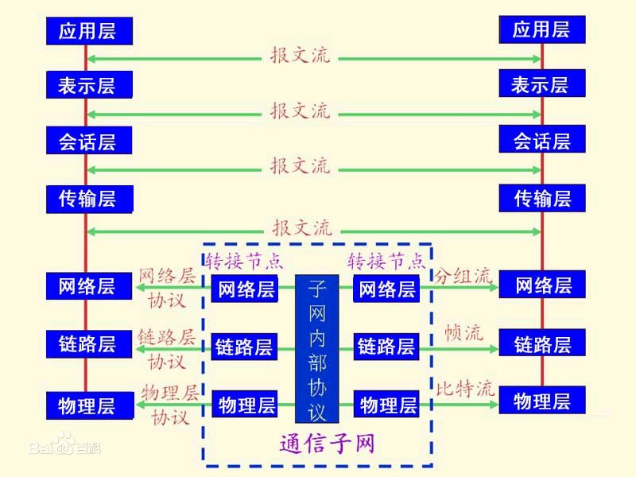
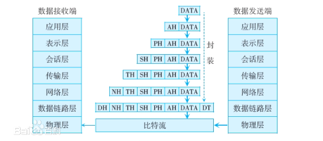
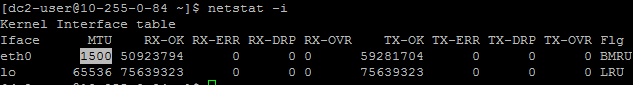
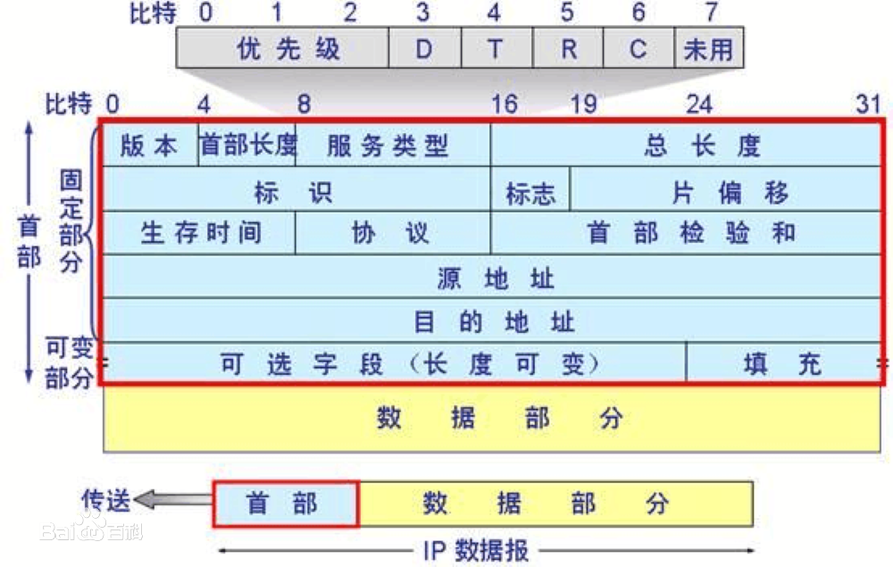
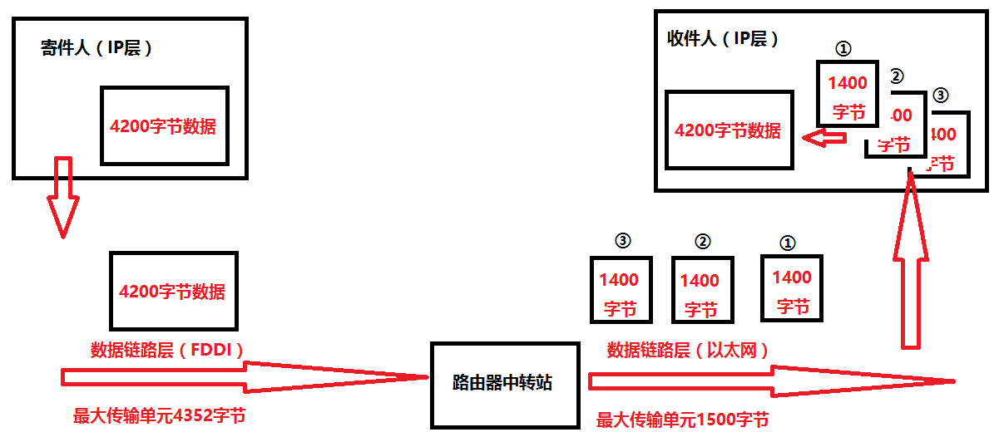
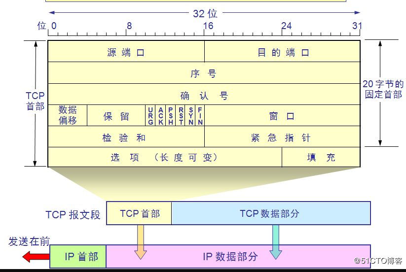

## 理解粘包拆包

1.OSI（Open System Interconnect），即[开放式系统](https://baike.baidu.com/item/开放式系统)互联。 一般都叫OSI参考模型

> ### 链路层
>
> 以太网协议规定，接入网络的设备都必须安装网络适配器，即[网卡](https://baike.baidu.com/item/网卡/155684)，数据包必须是从一块网卡传送到另一块网卡。而网卡地址就是数据包的发送地址和接收地址，有了MAC地址以后，[以太网](https://baike.baidu.com/item/以太网/99684)采用广播形式，把数据包发给该子网内所有主机，子网内每台主机在接收到这个包以后，都会读取首部里的目标MAC地址，然后和自己的MAC地址进行对比，如果相同就做下一步处理，如果不同，就丢弃这个包。 [4] 
>
> 所以链路层的主要工作就是对电信号进行分组并形成具有特定意义的数据帧，然后以广播的形式通过物理介质发送给接收方。 [4] 
>
> ### 网络层
>
> **IP协议**
>
> 网络层引入了IP协议，制定了一套新地址，使得我们能够区分两台主机是否同属一个网络，这套地址就是网络地址，也就是所谓的IP地址。IP协议将这个32位的地址分为两部分，前面部分代表网络地址，后面部分表示该主机在局域网中的地址。如果两个IP地址在同一个子网内，则网络地址一定相同。为了判断IP地址中的网络地址，IP协议还引入了子网掩码，IP地址和子网掩码通过按位与运算后就可以得到网络地址。 [4] 
>
> **ARP协议**
>
> 即地址解析协议，是根据IP地址获取MAC地址的一个网络层协议。其工作原理如下：ARP首先会发起一个请求数据包，数据包的首部包含了目标主机的IP地址，然后这个数据包会在链路层进行再次包装，生成以太网数据包，最终由以太网广播给子网内的所有主机，每一台主机都会接收到这个数据包，并取出标头里的IP地址，然后和自己的IP地址进行比较，如果相同就返回自己的MAC地址，如果不同就丢弃该数据包。ARP接收返回消息，以此确定目标机的MAC地址；与此同时，ARP还会将返回的MAC地址与对应的IP地址存入本机ARP缓存中并保留一定时间，下次请求时直接查询ARP缓存以节约资源。 [4] 
>
> **路由协议**
>
> 首先通过IP协议来判断两台主机是否在同一个[子网](https://baike.baidu.com/item/子网/1186929)中，如果在同一个子网，就通过ARP协议查询对应的MAC地址，然后以广播的形式向该子网内的主机发送数据包；如果不在同一个子网，以太网会将该数据包转发给本子网的网关进行路由。[网关](https://baike.baidu.com/item/网关/98992)是[互联网](https://baike.baidu.com/item/互联网/199186)上子网与子网之间的桥梁，所以网关会进行多次转发，最终将该数据包转发到目标IP所在的子网中，然后再通过ARP获取目标机MAC，最终也是通过广播形式将数据包发送给接收方。而完成这个路由协议的物理设备就是[路由器](https://baike.baidu.com/item/路由器/108294)，路由器扮演着交通枢纽的角色，它会根据信道情况，选择并设定路由，以最佳路径来转发数据包。 [4] 
>
> 所以，网络层的主要工作是定义网络地址、区分网段、子网内MAC寻址、对于不同子网的数据包进行路由。 [4] 
>
> ### 传输层
>
> 链路层定义了主机的身份，即MAC地址，而网络层定义了IP地址，明确了主机所在的[网段](https://baike.baidu.com/item/网段/11026985)，有了这两个地址，数据包就从可以从一个主机发送到另一台主机。但实际上数据包是从一个主机的某个应用程序发出，然后由对方主机的应用程序接收。而每台电脑都有可能同时运行着很多个应用程序，所以当数据包被发送到主机上以后，是无法确定哪个应用程序要接收这个包。因此传输层引入了[UDP](https://baike.baidu.com/item/UDP/571511)协议来解决这个问题，为了给每个应用程序标识身份。
>
> **UDP协议**
>
> UDP协议定义了端口，同一个主机上的每个应用程序都需要指定唯一的端口号，并且规定网络中传输的数据包必须加上端口信息，当数据包到达主机以后，就可以根据端口号找到对应的应用程序了。UDP协议比较简单，实现容易，但它没有确认机制，数据包一旦发出，无法知道对方是否收到，因此可靠性较差，为了解决这个问题，提高网络可靠性，TCP协议就诞生了。
>
> **TCP协议**
>
> TCP即传输控制协议，是一种面向连接的、可靠的、基于字节流的通信协议。简单来说TCP就是有确认机制的UDP协议，每发出一个数据包都要求确认，如果有一个数据包丢失，就收不到确认，发送方就必须重发这个数据包。为了保证传输的可靠性，TCP协议在UDP基础之上建立了三次对话的确认机制，即在正式收发数据前，必须和对方建立可靠的连接。TCP数据包和UDP一样，都是由首部和数据两部分组成，唯一不同的是，TCP数据包没有长度限制，理论上可以无限长，但是为了保证网络的效率，通常TCP数据包的长度不会超过IP数据包的长度，以确保单个TCP数据包不必再分割。 [4] 
>
> 传输层的主要工作是定义[端口](https://baike.baidu.com/item/端口/103505)，标识应用程序身份，实现端口到端口的通信，TCP协议可以保证数据传输的可靠性。 [4] 
>
> ### 应用层
>
> 理论上讲，有了以上三层协议的支持，数据已经可以从一个主机上的应用程序传输到另一台主机的应用程序了，但此时传过来的数据是字节流，不能很好的被程序识别，操作性差，因此，应用层定义了各种各样的协议来规范数据格式，常见的有[http](https://baike.baidu.com/item/http/243074),ftp,[smtp](https://baike.baidu.com/item/smtp/175887)等，在请求[Header](https://baike.baidu.com/item/Header/688992)中，分别定义了请求数据格式Accept和响应数据格式Content-Type，有了这个规范以后，当对方接收到请求以后就知道该用什么格式来解析，然后对请求进行处理，最后按照请求方要求的格式将数据返回，请求端接收到响应后，就按照规定的格式进行解读。

1. 理解模型中上下层通信

> ### 数据单元
>
> 在OSI环境中，对等实体间按协议进行通信，上下层实体间按服务进行通信。这些通信都依靠3种数据单元的传输来实现。 [4] 
>
> **服务数据单元**
>
> 为实现N层服务所要传送的逻辑数据单元，称为N层服务数据单元(Service Data Unit，SDU)，简称SDU。例如，用户需要浏览某网站的网页，该用户所在计算机的应用层实体(如浏览器生成应用层SDU，再通过下一层实体提供的服务，最后将该SDU传送到对等应用层实体(如某网站计算机上[Web](https://baike.baidu.com/item/Web/150564)服务器)。 [4] 
>
> **协议数据单元**
>
> 对等实体之间为实现该层协议所交换的信息单元(Protocol Data Unit，PDU)，称为协议数据单元。为了发送厅层的SDU，N层实体可能根据N层协议，将一个SDU划分为多个PDU。而在接收端，N层实体可能要将多个PDU恢复成一个N层的SDU。例如，用户请求网页信息被附加上[HTTP](https://baike.baidu.com/item/HTTP/243074)(超文本传输协议)报头，变成PDU，而在网站服务器那端，如果用户申请的网页(即SDU)太长，则要被划分成多个PDU传送。 [4] 
>
> **接口数据单元**
>
> 在同一系统上下两层实体的交换信息中，经过SAP的信息单元(Interface Data Unit，IDU)，称为接口数据单元，N层IDU由两部分组成，N层服务数据单元和一些供下一层实体用的控制信息(称为接口控制信息ICI)。
>
> **关系**
>
> [SDU](https://www.baidu.com/s?wd=SDU&tn=SE_PcZhidaonwhc_ngpagmjz&rsv_dl=gh_pc_zhidao)指的是第n层待传送和处理的数据单元。[PDU](https://www.baidu.com/s?wd=PDU&tn=SE_PcZhidaonwhc_ngpagmjz&rsv_dl=gh_pc_zhidao)指的是同等层水平方向传送的数据单元。它通常是将[SDU](https://www.baidu.com/s?wd=SDU&tn=SE_PcZhidaonwhc_ngpagmjz&rsv_dl=gh_pc_zhidao)分成若干段回，每一段加上报头，作为单独协议数据单元[PDU](https://www.baidu.com/s?wd=PDU&tn=SE_PcZhidaonwhc_ngpagmjz&rsv_dl=gh_pc_zhidao)在水平方向上传送。[IDU](https://www.baidu.com/s?wd=IDU&tn=SE_PcZhidaonwhc_ngpagmjz&rsv_dl=gh_pc_zhidao)指的是在相邻层答接口间传送的数据单元，它是由SDU和一些控制信息组成。
>
> 

2. 理解以太网的最大传输单元(Maximum Transmission Unit，MTU)是1500字节

   1. [为什么以太网mtu值被设定为1500?](https://www.zhihu.com/question/31460305)

   2. > [以太网](https://baike.baidu.com/item/以太网/99684)和802.3对数据帧的长度都有一个限制，其最大值分别是1500[字节](https://baike.baidu.com/item/字节/1096318)和1492字节。链路层的这个特性称为MTU，即最大传输单元。不同类型网络的数帧长度大多数都有一个上限。如果IP层有一个数据报要传，而且数据帧的长度比链路层的MTU还大，那么IP层就需要进行[分片](https://baike.baidu.com/item/分片/13677994)( fragmentation)，即把数据报分成干片，这样每一片就都小于MTU。【[百度百科](https://baike.baidu.com/item/%E6%9C%80%E5%A4%A7%E4%BC%A0%E8%BE%93%E5%8D%95%E5%85%83/9730690?fromtitle=mtu&fromid=508920)】
      >
      > **MSS** 是传输层TCP协议范畴内的概念，顾名思义，其标识TCP能够承载的最大的应用数据段长度，因此，MSS=MTU-20字节TCP报头-20字节IP报头，那么在以太网环境下，MSS值一般就是1500-20-20=1460字节。
      >
      > 可以通过`netstat -i`查看这个值
      >
      > 
      >
      > 

3. MTU对IP协议的影响

   > 由于数据链路层MTU的限制，就要对较大的IP数据包进行分包
   >
   > *  将较大的IP包分成多个小包，为每个小包打上标签
   > * 每个小包的IP协议头的16位标识部分都是相同的
   > * 每个小包的IP协议头的3位标志字段中，第2位置为0（为0表示可以分片），第三位表示结束标记（当前包是否为最后一个包，如果是则置为1，否则置为0）
   > * 到达对端时再将这些小包按顺序重组，拼装到一起返回给传输层
   > * 一旦小包中任意一个丢失，接收端的重组就会失败，但是IP层不会负责重新传输数据
   >
   > IP协议是TCP/IP协议族中最为核心的协议。它提供不可靠、无连接的服务，也即依赖其他层的协议进行差错控制。在局域网环境，IP协议往往被封装在以太网帧（见本章1.3节）中传送。**而所有的TCP、UDP、ICMP、IGMP数据都被封装在IP数据报中传送。**
   >
   > 
   >
   > 
   >
   > **IP数据报**
   >
   > 
   >
   > 
   >
   > 
   >
   > 
   >
   > **以太网的数据帧**
   >
   > 
   >
   > **TCP报文**
   >
   > 

4. 