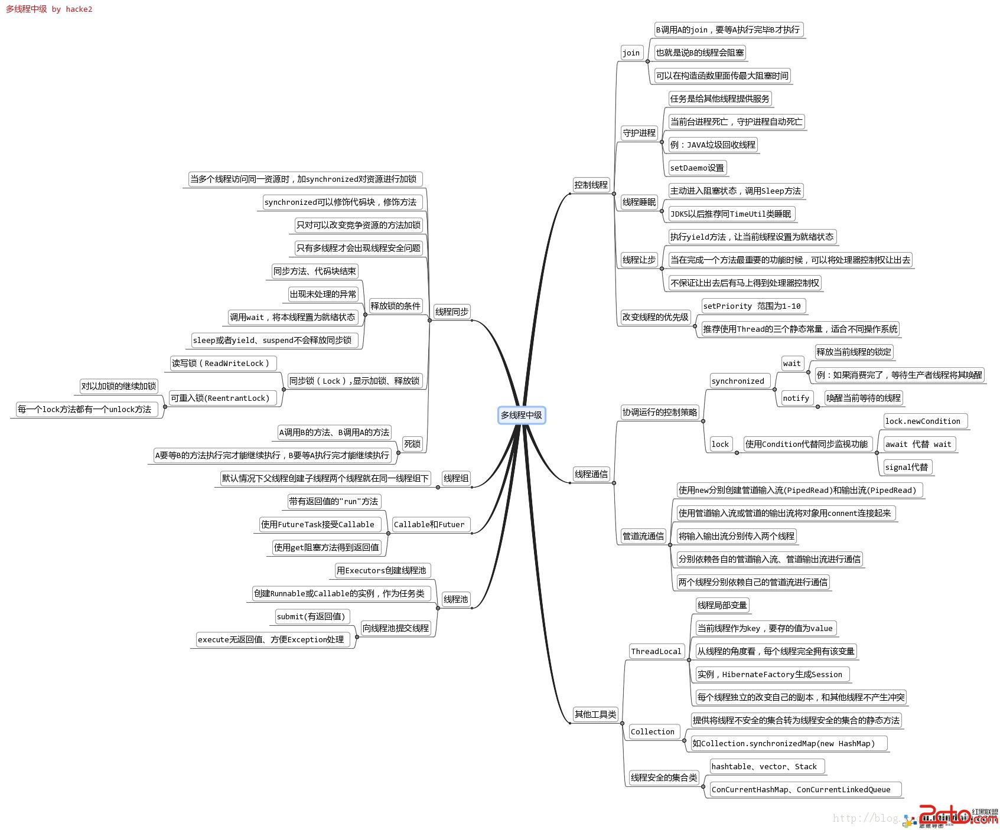
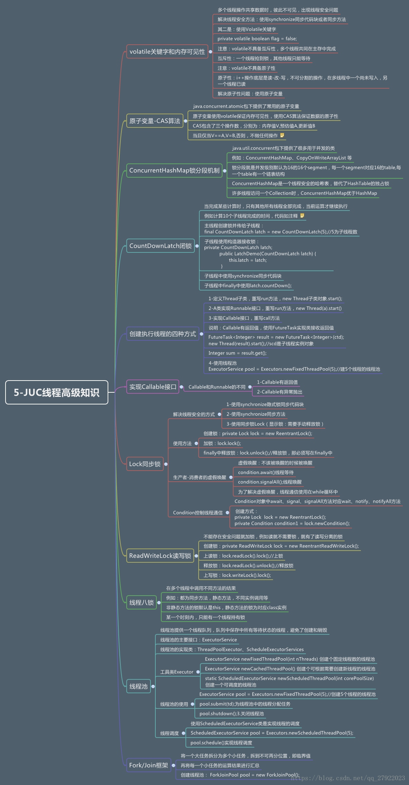
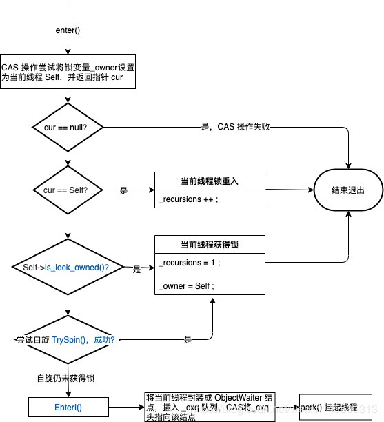
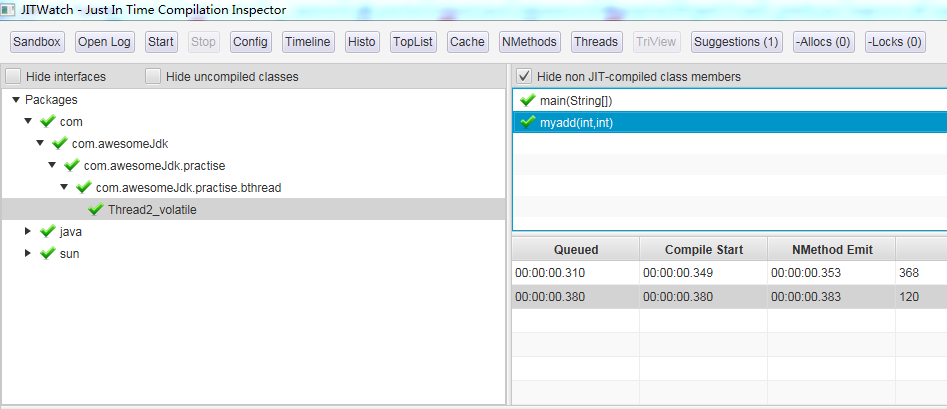
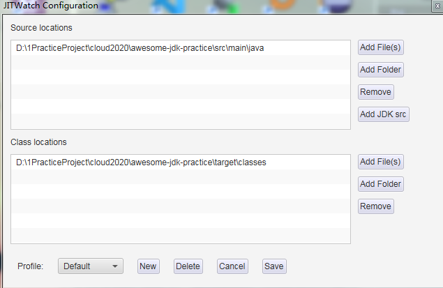
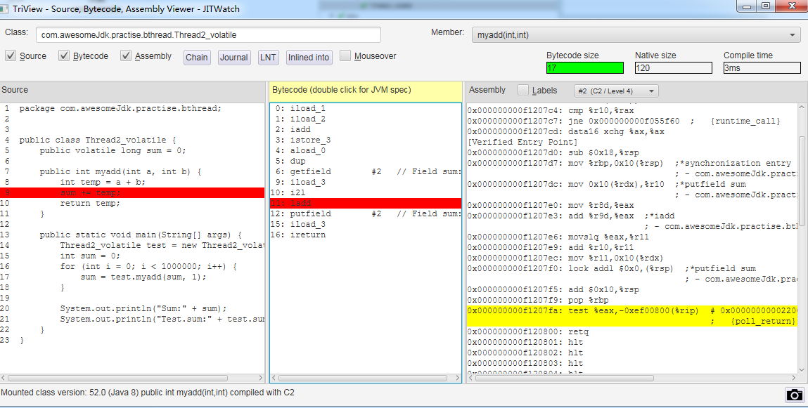
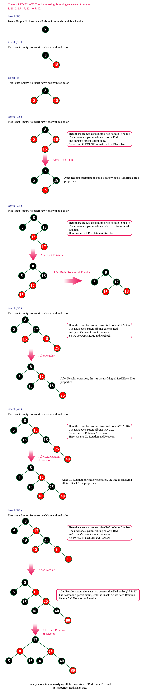
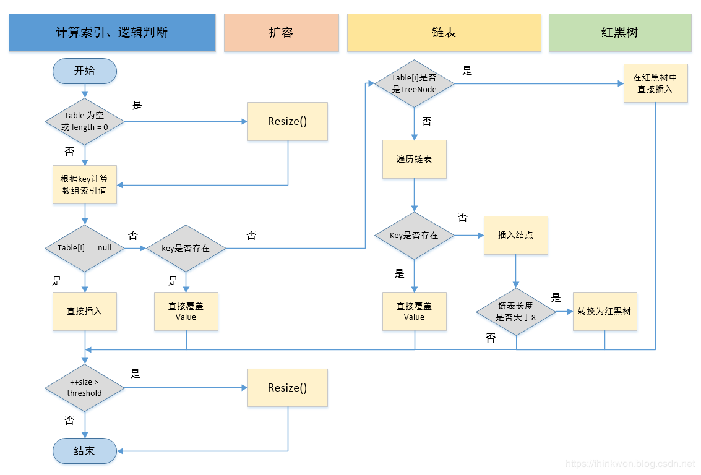

## 线程

### 白嫖脑图






### 线程状态

java.lang.Thread.State数组定义了线程的6中状态

> NEW: 创建但尚未启动的线程
>
> RUNNABLE: 可执行的线程，但可能在等待系统资源比如CPU
>
> BLOCKED: 等待监视器锁(monitor lock)以进入同步代码块或方法（synchronized block/method）的线程
>
> WAITING: 等待线程。线程等待其他线程执行特定的操作。
>
> ```html
> <ul>
>     <li>{@link Object#wait() Object.wait} with no timeout</li>
>     <li>{@link #join() Thread.join} with no timeout</li>
>     <li>{@link LockSupport#park() LockSupport.park}</li>
>  </ul>
> <p>
>     比如一个线程执行Object.wait(),是等待其他线程执行Object.notify()或Object.notifyAll()
>     比如一个线程执行Thread.join()，是等待特定线程terminate
> </p>
> ```
>
> 
>
> TIMED_WAITING: 具有指定等待时间的等待线程的线程状态。
>
> ```html
> <ul>
>     <li>{@link #sleep Thread.sleep}</li>
>     <li>{@link Object#wait(long) Object.wait} with timeout</li>
>     <li>{@link #join(long) Thread.join} with timeout</li>
>     <li>{@link LockSupport#parkNanos LockSupport.parkNanos}</li>
>     <li>{@link LockSupport#parkUntil LockSupport.parkUntil}</li>
> </ul>
> ```
>
> 
>
> TERMINATED: 终止线程的线程转态，线程正常完成执行或出现异常。

### API

#### 构造函数

```java
 public Thread() {
     init(null, null, "Thread-" + nextThreadNum(), 0);
 }


public Thread(Runnable target) {
    init(null, target, "Thread-" + nextThreadNum(), 0);
}

Thread(Runnable target, AccessControlContext acc) {
    init(null, target, "Thread-" + nextThreadNum(), 0, acc);
}

public Thread(ThreadGroup group, Runnable target) {
    init(group, target, "Thread-" + nextThreadNum(), 0);
}

public Thread(String name) {
    init(null, null, name, 0);
}

public Thread(ThreadGroup group, String name) {
    init(group, null, name, 0);
}

public Thread(Runnable target, String name) {
    init(null, target, name, 0);
}

public Thread(ThreadGroup group, Runnable target, String name) {
    init(group, target, name, 0);
}

public Thread(ThreadGroup group, Runnable target, String name,
              long stackSize) {
    init(group, target, name, stackSize);
}
```

> ThreadGroup: A thread group represents a set of threads.线程组可以包含线程组，所以其结构类似于树形结构。一个线程可以访问该线程组的信息，但不能访问父级线程组或者其他线程组的信息。
>
> Runnable：模板设计模式，传入runnable的实现类，并由Thread启动线程时执行`run()`方法，进而调用时`targe.run()` 
>
> name：线程 名称，默认是Thread + 自增序号
>
> StackSize：The stack size is the approximate number of bytes of address space that the virtual  machine is to allocate for this thread's stack.
>
> #### 初始化
>
> ```java
> private void init(ThreadGroup g, Runnable target, String name,
>                       long stackSize, AccessControlContext acc) {
>         this.name = name.toCharArray();
>     	//父线程为创建该线程实例的线程
>         Thread parent = currentThread();
>         SecurityManager security = System.getSecurityManager();
>         if (g == null) {
> 
>             if (security != null) {
>                 g = security.getThreadGroup();
>             }
>             //线程组默认为父线程的线程组
>             if (g == null) {
>                 g = parent.getThreadGroup();
>             }
>         }
>     	//线程组增加未启动的线程计数
>         g.addUnstarted();
>         this.group = g;
>     	//是否为守护线程，继承父线程
>         this.daemon = parent.isDaemon();
> 		//优先级继承父级线程    
>         this.priority = parent.getPriority();
>     	//继承父线程的类加载器
>         if (security == null || isCCLOverridden(parent.getClass()))
>             this.contextClassLoader = parent.getContextClassLoader();
>         else
>             this.contextClassLoader = parent.contextClassLoader;
>         this.inheritedAccessControlContext =
>                 acc != null ? acc : AccessController.getContext();
>         this.target = target;
>         setPriority(priority);
>         if (parent.inheritableThreadLocals != null)
>             this.inheritableThreadLocals =
>                 ThreadLocal.createInheritedMap(parent.inheritableThreadLocals);
>         /* Stash the specified stack size in case the VM cares */
>         this.stackSize = stackSize;
> 
>         /* Set thread ID */
>         tid = nextThreadID();
>     }
> ```
>
> *  初始化时，未调用start()方法前，Thread为普通的JAVA对象。
> * 父线程为创建该线程实例的线程
> * 线程组默认为父线程的线程组
> * 是否为守护线程，继承至父线程
> * 继承父级线程的优先级   
> * 继承父线程的类加载器
> * stackSize栈深度，未指定则默认为0。而栈的大小在jdk5以后后`默认-Xss1M`

#### 设置名称

```JAVA
public final synchronized void setName(String name) {
    checkAccess();
    this.name = name.toCharArray();
    if (threadStatus != 0) {
        setNativeName(name);
    }
}
```

> 线程为启动前，可以设置名称。一旦 启动不能再修改

#### 守护线程

```java
public static void main(String[] arg) throws InterruptedException {
    System.out.println(Thread.currentThread().isDaemon());
    Thread thread = new Thread(() -> {
        try {
            System.out.println("当前线程："+Thread.currentThread().getName()+
                               ", 是否为守护线程："+Thread.currentThread().isDaemon());
            TimeUnit.MINUTES.sleep(10);
        } catch (InterruptedException e) {
            e.printStackTrace();
        }
    });
    //设置为守护线程
    thread.setDaemon(true);
    thread.start();
    Thread.sleep(100);
    System.out.println("设置thread的daemon为true后，立即结束");
} 
```

> 通过设置线程的daemon属性，将线程设置是否守护线程。默认父级线程
>
> 当程序的所有非守护线程执行完毕后，进程结束。
>
> 常见非守护线程：GC（垃圾回收）、心跳检查

#### 休眠

```java
public static native void sleep(long millis) throws InterruptedException;
public static void sleep(long millis, int nanos)throws InterruptedException 
{
    //.......
}
//使用封装好的工具类TimeUnit，更便利
TimeUnit.MINUTES.sleep(10);
```

> 指定休眠的时间(毫秒)。
>
> 注意：休眠并并不会放弃monitor锁的资源

#### yield()：让 步

> `Thread.yield()`方法作用是：暂停当前正在执行的线程对象（及放弃当前拥有的cup资源），并执行其他线程。
>
> yield()做的是让当前运行线程回到可运行状态，以允许具有相同优先级的其他线程获得运行机会。因此，使用yield()的目的是让相同优先级的线程之间能适当的轮转执行。但是，实际中无法保证yield()达到让步目的，因为让步的线程还有可能被线程调度程序再次选中。
>
> 结论：yield()从未导致线程转到等待/睡眠/阻塞状态。在大多数情况下，yield()将导致线程从运行状态转到可运行状态，但有可能没有效果

#### 设置优先级

```java
public class Thread4_priortity {
    public static void main(String[] args) throws InterruptedException {
        //ArrayList<String> list = new ArrayList<>();
        CopyOnWriteArrayList<String> list = new CopyOnWriteArrayList<>();
        AtomicInteger atomicInteger = new AtomicInteger();
        int size=100000;
        ThreadPriority t1 = new ThreadPriority("t1", list, atomicInteger, size, 1);
        ThreadPriority t2 = new ThreadPriority("t2", list, atomicInteger, size, 5);
        ThreadPriority t3 = new ThreadPriority("t3", list, atomicInteger, size, 10);
        t1.start();
        t2.start();
        t3.start();
        t1.join();
        t2.join();
        t3.join();
        System.out.println(atomicInteger.get());
        System.out.println("T1执行次数："+list.stream().filter(n -> n.equals("t1")).count());
        System.out.println("T2执行次数："+list.stream().filter(n -> n.equals("t2")).count());
        System.out.println("T3执行次数："+list.stream().filter(n -> n.equals("t3")).count());
    }
}

class ThreadPriority extends Thread{
    private final int size;
    private final AtomicInteger atomicInteger;
    private final String name;
    private  CopyOnWriteArrayList<String> list;
    public ThreadPriority(String name,CopyOnWriteArrayList<String> list, AtomicInteger atomicInteger,
                          int size, int priority){
        this.list=list;
        this.size=size;
        this.atomicInteger=atomicInteger;
        this.name=name;
        this.setName(name);
        this.setPriority(priority);
    }
    @Override
    public void run() {
        while (atomicInteger.incrementAndGet() <size){
            list.add(name);
        }
    }
}
```

线程的优先级别高并不代表一定优先执行，而是优先级高可能获得更多的cpu时间 片。如上代码t1,t2,t3线程 优先分别为1，5，10。执行的次数也与线程的优先级相应的成比例。参考执行结果：

```properties
T1执行次数：5888
T2执行次数：19548
T3执行次数：74563
```


> ```java
> public final static int MIN_PRIORITY = 1;
> public final static int NORM_PRIORITY = 5;
> public final static int MAX_PRIORITY = 10;
> ```
>
> * 线程优先级未指定情况下默认继承父线程 
> * 线程优先级大小在1到10之间
>
> * 线程的优先级不能超过线程组的优先级

#### 线程中断

```java
public void interrupt() {
    .........
}
public static boolean interrupted() {
    return currentThread().isInterrupted(true);//native
}
public boolean isInterrupted() {
    return isInterrupted(false);
}
```


当线程进入blocked/timed_wating/wating状态时，另一个线程调用被阻塞线程的`interrupt()`方法，就会打断阻塞状态。并抛出`InterruptedException`异常。

##### interrupt()

```java
public static void main(String[] args) throws InterruptedException {
    Thread thread = new Thread(() -> {
        try {
            TimeUnit.MINUTES.sleep(1);
        } catch (InterruptedException e) {
            System.out.println("我在休眠，但被打断了");
        }
    });
    thread.start();
    Thread.sleep(100);
    System.out.println("准备打断线程休眠");
    thread.interrupt();
    Thread.sleep(100);
    System.out.println("结束");
}
//准备打断线程休眠
//我在休眠，但被打断了
//结束
```

##### isInterrupted()

```java
@Test
public  void test() throws InterruptedException {
    Thread thread = new Thread(() -> {
        while (true){

        }
    });
    thread.start();
    Thread.sleep(100);
    System.out.println("准备打断线程休眠，线程状态isInterrupted： "+thread.isInterrupted());
    thread.interrupt();
    Thread.sleep(100);
    System.out.println("结束，线程状态isInterrupted："+thread.isInterrupted());
}
//准备打断线程休眠，线程状态isInterrupted： false
//结束，线程状态isInterrupted：true
```


> 注意与上面的区别，这里的线程没有执行wait/join/sleep等可中断方法(会抛出InterruptedException异常)，而是一个死循环。
>
> `interrupt()`断线程线程过程中，会调用设置中断标志。
>
> ```java
> interrupt0();// Just to set the interrupt flag
> ```
>
> 但如果抛出InterruptedException异常，则会清楚该标志。所有上一个例子打印出来都是`false`

##### interrupted()

```
@Test
public  void testInterruptBoolean() throws InterruptedException {
    Thread thread = new Thread(() -> {
        while (true){
        System.out.println("当前线程中断状态，并清算中断标识 " + 
        Thread.currentThread().interrupted());
        }
    });
    thread.setDaemon(true);
    thread.start();
    Thread.sleep(100);
    System.out.println("准备打断线程休眠，线程状态isInterrupted： "+
    thread.isInterrupted());
    thread.interrupt();
    Thread.sleep(100);
    System.out.println("结束，线程状态isInterrupted："+
    thread.isInterrupted());
}
//当前线程中断状态，并清算中断标识 false
//当前线程中断状态，并清算中断标识 false
//当前线程中断状态，并清算中断标识 true
//当前线程中断状态，并清算中断标识 false
//当前线程中断状态，并清算中断标识 false
```

> 如本小节开偏的接口说明上，`interrupted()与isInterrupted()`底层调用同样的方法。区别是传入的参数`ClearInterrupted`不一样。
>
> `interrupted()`方法会获取中断标识，并清楚该状态。所以上面只打印了一个true。

#### join()

表示当前线程会阻塞，直到调用了 `join()` 方法的线程返回。

设置优先级小节，已有示例

#### 关闭线程

#### 死锁

```java
public class Thread9_deadlock {
    public static void main(String[] args) {
        DeadLock deadLock = new DeadLock();
        new Thread(deadLock::read,"t1").start();
        new Thread(deadLock::write,"t2").start();
    }
}
class DeadLock{
    private Object p1=new Object();
    private Object p2=new Object();

    public void write()  {
        synchronized (p1){
            System.out.println("执行写操作，已对p1加锁,等待p2锁");
            try {
                Thread.sleep(10_000);
            } catch (InterruptedException e) {
                e.printStackTrace();
            }
            synchronized (p2){
                System.out.println("成功获得p1/p2做，执行操作");
            }
        }
    }
    public void read() {
        synchronized (p2){
            System.out.println("执行写操作，已对p2加锁,等待p1锁");
            try {
                Thread.sleep(10_000);
            } catch (InterruptedException e) {
                e.printStackTrace();
            }
            synchronized (p1){
                System.out.println("成功获得p1/p2做，执行操作");
            }
        }
    }
}
//执行写操作，已对p2加锁,等待p1锁
//执行写操作，已对p1加锁,等待p2锁
```

> 输出两行信息后，程序进入死锁状态不在进行往下跑。
>
> * 执行 `jps -l` 获取当前java程序的pid
>
> * 执行 `jstack pid` 查询线程状态。查询有一个死锁
>
>   ```
>   Found one Java-level deadlock:
>   =============================
>   "t2":
>     waiting to lock monitor 0x000000000830bbf8 (object 0x00000000d6014638, a java.lang.Object),
>     which is held by "t1"
>   "t1":
>     waiting to lock monitor 0x00000000083094c8 (object 0x00000000d6014628, a java.lang.Object),
>     which is held by "t2"
>   
>   Java stack information for the threads listed above:
>   ===================================================
>   "t2":
>           at com.awesomeJdk.practise.athread.DeadLock.write(Thread9_deadlock.java:23)
>           - waiting to lock <0x00000000d6014638> (a java.lang.Object)
>           - locked <0x00000000d6014628> (a java.lang.Object)
>           at com.awesomeJdk.practise.athread.Thread9_deadlock$$Lambda$2/1368884364.run(Unknown Source)
>           at java.lang.Thread.run(Thread.java:745)
>   "t1":
>           at com.awesomeJdk.practise.athread.DeadLock.read(Thread9_deadlock.java:36)
>           - waiting to lock <0x00000000d6014628> (a java.lang.Object)
>           - locked <0x00000000d6014638> (a java.lang.Object)
>           at com.awesomeJdk.practise.athread.Thread9_deadlock$$Lambda$1/1134517053.run(Unknown Source)
>           at java.lang.Thread.run(Thread.java:745)
>   
>   Found 1 deadlock.
>   
>   ```
>
>   


### java线程数

```java
    @Test
    /**
     * 不断创建线程直到栈溢出，关注
     * 1、最大的数量以及异常提示
     * 2、不同启动参数的不同
     * 3、很容易死机，清不要轻易尝试
     */
    public void test1(){
        AtomicInteger atomicInteger = new AtomicInteger();
        try{
            while (true){
                new Thread(()->{
                    int value = atomicInteger.getAndIncrement();
                    if(value%1000==0) System.out.println("创建线程："+value);
                    try {
                            TimeUnit.MINUTES.sleep(10);
                        } catch (InterruptedException e) {
                            e.printStackTrace();
                        }
                }).start();
            }
        }catch (Error e){
            System.out.println("线程计数："+atomicInteger.get());
        }
    }
```

> java占用内存大小约为：堆大小+栈大小*线程数据
>
> -Xmx：最大堆空间
>
> -Xms：最小堆空间
>
> -Xss：栈大小
>
> 线程数约等于：(可用内存-堆内存)/栈大小
>
> linxu系统，还受系统设置的最大进程数、最大线程数、进程最大线程数等限制

### volatile的可见性

1.volatile，是怎么可见性的问题（CPU缓存），那么他是怎么解决的--->MESI？

#### 缓存一致性和MESI，[维基百科](https://en.wikipedia.org/wiki/MESI_protocol#Memory_Barriers)，[查看IA-32手册MESI相关内容]()、[博客](https://www.jianshu.com/p/6745203ae1fe) 

缓存一致性协议给缓存行（通常为64字节）定义了个状态：独占（exclusive）、共享（share）、修改（modified）、失效（invalid），用来描述该缓存行是否被多处理器共享、是否修改。所以缓存一致性协议也称MESI协议。

- 独占（exclusive）：仅当前处理器拥有该缓存行，并且没有修改过，是最新的值。当前处理器cache line的值是最新的，与主内存一致。
- 共享（share）：有多个处理器拥有该缓存行，每个处理器都没有修改过缓存，是最新的值。有兩個以上的 cache lines 有最新資料，和 main memory 一致
- 修改（modified）：仅当前处理器拥有该缓存行，并且缓存行被修改过了，一定时间内会写回主存，会写成功状态会变为S。当前处理器cache line的值是最新的，比主内存还新。
- 失效（invalid）：缓存行被其他处理器修改过，该值不是最新的值，需要读取主存上最新的值。

协议协作如下：

- 一个处于M状态的缓存行，必须时刻监听所有试图读取该缓存行对应的主存地址的操作，如果监听到，则必须在此操作执行前把其缓存行中的数据写回CPU。
- 一个处于S状态的缓存行，必须时刻监听使该缓存行无效或者独享该缓存行的请求，如果监听到，则必须把其缓存行状态设置为I。
- 一个处于E状态的缓存行，必须时刻监听其他试图读取该缓存行对应的主存地址的操作，如果监听到，则必须把其缓存行状态设置为S。
- 当CPU需要读取数据时，如果其缓存行的状态是I的，则需要从内存中读取，并把自己状态变成S，如果不是I，则可以直接读取缓存中的值，但在此之前，必须要等待其他CPU的监听结果，如其他CPU也有该数据的缓存且状态是M，则需要等待其把缓存更新到内存之后，再读取。
- 当CPU需要写数据时，只有在其缓存行是M或者E的时候才能执行，否则需要发出特殊的RFO指令(Read Or Ownership，这是一种总线事务)，通知其他CPU置缓存无效(I)，这种情况下会性能开销是相对较大的。在写入完成后，修改其缓存状态为M。

#### 三、happends-before

结合前面的两点，再看happends-before就比较好理解了。因为光说可见性和重排很难联想到happends-before。这个点在并发编程里还是非常重要的，再详细记录下：

- 1.**Each action in a thread happens-before every subsequent action in that thread**
- 2.An unlock on a monitor happens-before every subsequent lock on that monitor.
- 3.**A write to a volatile field happens-before every subsequent read of that volatile**
- 4.A call to start() on a thread happens-before any actions in the started thread.
- 5.All actions in a thread happen-before any other thread successfully returns from a join() on
   that thread.
- 6.**If an action a happens-before an action b, and b happens before an action c, then a happensbefore c**


#### 示例

查看JVM查看汇编代码。

volatile的变量读写回加上:lock指令

```properties
  0x000000000f114189: lock addl $0x0,(%rsp)     ;*putstatic instance
                                                ; - com.awesomeJdk.practise.bthread.Thread2_volatile2::getInstance@13 (line 9)
```

> lock指令的几个作用，[参考](https://blog.csdn.net/qq_26222859/article/details/52235930) ：
>
> 1. 锁总线，其它CPU对内存的读写请求都会被阻塞，直到锁释放，**不过实际后来的处理器都采用锁缓存替代锁总线，因为锁总线的开销比较大，锁总线期间其他CPU没法访问内存**
> 2. 可见性：lock后的写操作会回写已修改的数据，同时让其它CPU相关缓存行失效，从而重新从主存中加载最新的数据。参考MESI协议分析
> 3. 不是内存屏障却能完成类似内存屏障的功能，阻止屏障两遍的指令重排序

#### 内存屏障


#### 参考

* [官方对synchronized各种锁的讨论](https://blogs.oracle.com/dave/lets-say-youre-interested-in-using-hotspot-as-a-vehicle-for-synchronization-research) 
* 
* [维基百科-mesi protocol](https://en.wikipedia.org/wiki/MESI_protocol#Memory_Barriers) 
* [從硬體觀點了解 memory barrier 的實作和效果](https://medium.com/fcamels-notes/從硬體觀點了解-memry-barrier-的實作和效果-416ff0a64fc1) 
* [关于volatile、MESI、内存屏障、#Lock](https://www.jianshu.com/p/6745203ae1fe) 
* [Memory Barriers: a Hardware View for Software Hackers](http://www.puppetmastertrading.com/images/hwViewForSwHackers.pdf) 
* [DoubleCheckedLocking](http://www.cs.umd.edu/~pugh/java/memoryModel/DoubleCheckedLocking.html) 
* [内存屏障白皮书](http://gee.cs.oswego.edu/dl/jmm/cookbook.html) 

### synchronized

#### 代码

```java
public class Thread3_synchronized {
   public static void main(String[] args) {
        synchronized (Thread3_synchronized.class){
        }
        method();
        method2();
    }
    public static synchronized void  method(){
    }
    public static  void  method2(){
    }
}
//执行命令 C:\Program Files\Java\jdk1.8.0_45\bin\javap.exe" -c -l -s -p -v xxx.class
```

#### 反编译

```
  public static void main(java.lang.String[]);
    descriptor: ([Ljava/lang/String;)V
    flags: ACC_PUBLIC, ACC_STATIC
    Code:
      stack=2, locals=3, args_size=1
         0: ldc           #2                  // class com/awesomeJdk/practise/bthread/Thread3_synchronized
         2: dup
         3: astore_1
         4: monitorenter
         5: aload_1
         6: monitorexit
         7: goto          15
        10: astore_2
        11: aload_1
        12: monitorexit
        13: aload_2
        14: athrow
        15: invokestatic  #3                  // Method method:()V
        18: invokestatic  #4                  // Method method2:()V
        21: return
      Exception table:
         from    to  target type
             5     7    10   any
            10    13    10   any
      LineNumberTable:
        line 10: 0
        line 11: 5
        line 12: 15
        line 13: 18
        line 14: 21
      LocalVariableTable:
        Start  Length  Slot  Name   Signature
            0      22     0  args   [Ljava/lang/String;
      StackMapTable: number_of_entries = 2
        frame_type = 255 /* full_frame */
          offset_delta = 10
          locals = [ class "[Ljava/lang/String;", class java/lang/Object ]
          stack = [ class java/lang/Throwable ]
        frame_type = 250 /* chop */
          offset_delta = 4

  public static synchronized void method();
    descriptor: ()V
    flags: ACC_PUBLIC, ACC_STATIC, ACC_SYNCHRONIZED
    Code:
      stack=0, locals=0, args_size=0
         0: return
      LineNumberTable:
        line 16: 0

  public static void method2();
    descriptor: ()V
    flags: ACC_PUBLIC, ACC_STATIC
    Code:
      stack=0, locals=0, args_size=0
         0: return
      LineNumberTable:
        line 18: 0
```

> 关注：
>
> * 同步代码块依赖：`monitorenter 、monitorexit`  
> * 同步方法依赖：`ACC_SYNCHRONIZED`
> * 偏向锁->轻量级锁->自旋锁->重量级锁
> * 偏向锁：偏向第一个获得锁的对象，将对象头通过CAS替换为当前线程的TheadID。此后再次访问时只需要必要ThreadID，而不用CAS
> * 轻量级锁：当区别于第一个线程的第二个线程访问时，发现对象头已偏向。则先确认偏向锁对应的线程是否存活，如果没有存活则重新将对象设置为无锁状态，否则尝试CAS替换对象头（指向自己线程的lock record），更新成功（偏向线程存活但不执行同步代码块）则为轻量锁，否则 **自旋** 或者升级为重量级锁。**轻量级锁是认为有竞争，但是这种竞争是错开的** 
> * 自旋锁：即在同时竞争的情况下，通过自旋等待不断尝试获得锁。因为可能等一会就可以获得锁了，时间损耗少小于升级为重量级锁。
> * 重量级锁：将对象头替换为执行monitor对象的指针，指针中包含cxq、entrylist和waitset。ower属性执行获得该monitor的线程，其余线程进入cxq自旋或进入entrylist阻塞，调用wait()方法的线程会进入waitset，notify()/notifyAll()方法会将waitset中的线程复制进入entrylist或cxq。依赖于操作系统底层的mutex互斥锁，需要在用户态与内核态之间切换。

```c++
//ObjectMonitor类的变量声明：关注_WaitSet、_EntryList、cxq
ObjectMonitor() {
    _header       = NULL;
    _count        = 0;
    _waiters      = 0,
    _recursions   = 0;
    _object       = NULL;
    _owner        = NULL;
    _WaitSet      = NULL;
    _WaitSetLock  = 0 ;
    _Responsible  = NULL ;
    _succ         = NULL ;
    _cxq          = NULL ;
    FreeNext      = NULL ;
    _EntryList    = NULL ;
    _SpinFreq     = 0 ;
    _SpinClock    = 0 ;
    OwnerIsThread = 0 ;
    _previous_owner_tid = 0;
}
```


#### 翻译objectMonitor.cpp的注释：

> 一个线程成功拥有一个monitor通过cas()修改_owner变量从null替换为non-null
>
> 不变式(Invariant)：一个线程最多出现在一个monitor的list中，比如cxq、EntryList or WaitSet。
>
> 竞争线程“push”自己通过cas替换cxq然后自旋或者停留(spin/park)
>
> 如果一个线程最终获得了lock，它必须重cxq或者Entrylist中出队。至关重要的是，退出的线程不会解除后继线程(the successor thread)与EntryList的连接。在取消停放后（unparked），被唤醒的线程将重新竞争以获得monitor。这些被唤醒的线程要么获得锁要么重新停放（re-park）
>
> 线程的交替是通过一个竞争交接(competitive   handoff)的政策实现的。退出的线程并不授予或传递所有权给继任的线程（这也称为“交接”继承）。而是，退出线程会释放所有权，并可能唤醒一个继任线程，因此继任者可以重新竞争lock的拥有权。【这里的意思是，不指定继任者，而是竞争上岗】。如果EntryList为空，但cxq非空，则退出线程会将cxq插入到EntryList中。做法是分离(detaching)cxq（同时cas设置为null），并把cxq的线程调入EntryList。EntryList是双向链接的，而cxq是单链接的，因为基于cas的“push”用于对最近到达的线程(RATS)排队。
>
> 并发不变式(Concurrency invariants)：
>
> * 只有monitor所有者可以访问或更改EntryList。
>   * monitor本身的mutex属性可保护EntryList 免受并发干扰。
> * 只有monitor拥有者可以分离cxq。
>
> monitor list的操作避开了锁，但严格地说，它们不是无锁的。进入enter是无锁的，退出exit不是。
>
> cxq可以有多个并发的“pusher”，但只有一个并发的分离(detaching)线程。这种机制避免ABA问题。更准确地说，将基于CAS的“推送”到cxq是ABA无关的。
>
> cxq和EntryList合在一起，构成或形成了一个线程的逻辑队列，队列中的线程在尝试获取锁时被阻塞。我们使用两个不同的列表来提高在获取后(在::enter() epilog中)进行恒定时间内执行出队列操作的几率，并减少列表末尾的热度。(c.f. Michael Scott的“2Q”算法)。我们关心的是在持有monitor锁期间，最小化执行queue和monitor元数据操作时间——也就是说，我们希望最小化监视器锁持有时间。值得注意的是，即使少量的自旋也能极大的减少cxq和EntryList的入队出队操作。也就是说，自旋缓解了 inner lock和monitor 元数据的竞争。
>
> cxq指向一个最近到达并尝试进入monitor的线程集合。因为我们通过cas操作间线程push推至cxq链表中，RATS(recently arrived threads)必须以单向链表LIFO的形式。在unlock-time时将cxq排空至EntryList，当unlocking thread 注意到EntryList是null而cxq非空。
>
> EntryList由常用(prevailing )的队列规则排序，并可以以任何方便的形式组织，比如双向链表或者循环双向链表。至关重要的是，我们可以已一个常量时间执行插入以及删除操作。
>
> 在::exit()时强制执行队列规则（Queue discipline），此时unlock thread将cxq排入EntryList，并相应地对EntryList上的线程进行排序或重新排序。
>
> 除非“lock barging”，否则这种机制提供公平的循环排序，这类似于电梯扫描elevator-scan
>
> monitor同步子系统避免使用本地同步原语，但特定于平台的park-unpark抽象除外。请参阅os_solaris.cpp中关于park-unpark语义的注释。换句话说，monitor实现只依赖于原子操作和park-unpark。monitor subsystem管理所有running——>blocked的转换和blocked——>ready的转换，而底层OS管理已ready<->run 的转换。
>
> 等待线程驻留在waitSet中——wait()将调用者放到waitSet上。notify()或notifyAll()只是将线程从waitSet传输到EntryList或cxq。随后的exit()操作将unpark 被唤醒的线程(notifyee)。notify() 方法unpark 线程是非常低效的—很可能notifyee会直接将自己插入到通知器持有的锁上。
>
> 一种有趣的替代方法是将cxq编码为(List,LockByte)，在拥有monitor的情况下，LockByte为0。\_owner在scheme中只是一个辅助变量，就像_recursions一样。组成列表的线程或事件必须以256字节地址对齐。一个线程将使用CAS尝试获得锁或加入队列，但是退出的线程可以使用1-0协议和STB将LockByte设置为0。通常认为full-word cas 与 intermix with STB operation是相同的

#### ObjectMonitor.cpp



疑问：

轻量锁是把线程栈中mark word的地址cas更换到对象头中，而重量级锁也是cas将monitor的地址cas到对象头中，所以性能区别在哪里？ [Implementing Fast Java Monitors with Relaxed-Locks ](https://www.usenix.org/legacy/events/jvm01/full_papers/dice/dice.pdf) 指出轻量 级锁需要1次原子操作就能获得锁，但是重量级锁着至少3次原子性操作。没想明白是那三次？

#### 资料

* [synchronized源码--对应InterpreterRuntime::monitorenter](http://hg.openjdk.java.net/jdk6/jdk6/hotspot/file/tip/src/share/vm/interpreter/interpreterRuntime.cpp) 
* [synchronized源码-对应fast/slow-enterp偏向锁/轻量级锁](http://hg.openjdk.java.net/jdk6/jdk6/hotspot/file/tip/src/share/vm/runtime/synchronizer.cpp) 
* [synchronized博客](https://www.bbsmax.com/A/mo5kK9M45w/) 
* [synchronized源码博客很详细透彻](https://www.jianshu.com/p/c5058b6fe8e5)
* [synchronized C++实现:仅参考，不全面](https://segmentfault.com/a/1190000008532548) 
* [objectMonitor.cpp源码](http://hg.openjdk.java.net/jdk8/jdk8/hotspot/file/87ee5ee27509/src/share/vm/runtime/objectMonitor.cpp) 
* [objectMonitor.hpp 类声明](http://hg.openjdk.java.net/jdk8/jdk8/hotspot/file/87ee5ee27509/src/share/vm/runtime/objectMonitor.hpp) 
* [很好的多线程实例文章](https://blog.csdn.net/weixin_42762133/article/details/103241439) 
* [os_linux.cpp包含park和unpark源码](http://hg.openjdk.java.net/jdk8/jdk8/hotspot/file/87ee5ee27509/src/os/linux/vm/os_linux.cpp) 
* [[Java魔法类：Unsafe应用解析](https://tech.meituan.com/2019/02/14/talk-about-java-magic-class-unsafe.html)](https://tech.meituan.com/2019/02/14/talk-about-java-magic-class-unsafe.html) 
* [彤哥博客](https://www.cnblogs.com/tong-yuan/p/11768904.html) 
* [relaxed locked  有空再看](https://patentcut.com/6735760)

### cas


### transient

不希望改变量被序列化


### AbstractQueuedSynchronizer

中获取锁的几种方式：

```java
///1、AbstractQueuedSynchronizer#acquire
public final void acquire(int arg) {
	if (!tryAcquire(arg) &&
		acquireQueued(addWaiter(Node.EXCLUSIVE), arg))
		selfInterrupt();
}
///2、AbstractQueuedSynchronizer#acquireShared
public final void acquireShared(int arg) {
	if (tryAcquireShared(arg) < 0)
		doAcquireShared(arg);
}
//释放锁
public final boolean release(int arg) {
	if (tryRelease(arg)) {
		Node h = head;
		if (h != null && h.waitStatus != 0)
			unparkSuccessor(h);
		return true;
	}
	return false;
}
public final boolean releaseShared(int arg) {
	if (tryReleaseShared(arg)) {
		doReleaseShared();
		return true;
	}
	return false;
}

```

#### ReentrantLock

##### 示例

```java
ReentrantLock lock = new ReentrantLock();//公平锁
lock.lock();
System.out.println("nihao");
lock.unlock();
//tryLock()// 尝试获取锁,立即返回获取结果 轮询锁
//tryLock(long timeout, TimeUnit unit)//尝试获取锁,最多等待 timeout 时长 超时锁
lock.tryLock();

ReentrantLock unfairlock = new ReentrantLock(false);//非公平锁 
System.out.println("nihao");
lock.unlock();
```

##### 获取锁

```java
static final class NonfairSync extends Sync {
	final void lock() {
        //还是先尝试获取锁
		if (compareAndSetState(0, 1))
			setExclusiveOwnerThread(Thread.currentThread());
		else
            //在走AbstractQueuedSynchronizer的acquire方法
			acquire(1);
	}
}
static final class FairSync extends Sync {
	final void lock() {
        //直接走AbstractQueuedSynchronizer#acquire
		acquire(1);
	}
}
//具体获取锁逻辑参考问题1
```

##### 释放锁：

思考问题：是否等待队列的第一个获得锁

```java
public final boolean release(int arg) {
	if (tryRelease(arg)) {//判断state==0？
		Node h = head;
		if (h != null && h.waitStatus != 0)
            //公平锁和非公平锁都是从取出队列的第一个开始执行
            //但非公平锁，由于获取
			unparkSuccessor(h);
		return true;
	}
	return false;
}
```

#### ReentrantReadWriteLock

##### 示例

```java
private final ReentrantReadWriteLock rwl = new ReentrantReadWriteLock();
private final Lock r = rwl.readLock();    //读锁
private final Lock w = rwl.writeLock();    //写锁
r.lock();
r.unlock();
w.lock();
w.unlock();
```

##### 获取锁

说明：高16位为读锁，低16位表示写锁。所以在获取state时，需要做左移、位与等操作

```java
//writelock 
public void lock() {
    sync.acquire(1);
}
//readlock
public void lock() {
    sync.acquireShared(1);
}
public class ReentrantReadWriteLock
        implements ReadWriteLock, java.io.Serializable {
		protected final int tryAcquireShared(int unused) {
            /*
             * Walkthrough:
             * 1. If write lock held by another thread, fail.
             * 2. Otherwise, this thread is eligible for
             *    lock wrt state, so ask if it should block
             *    because of queue policy. If not, try
             *    to grant by CASing state and updating count.
             *    Note that step does not check for reentrant
             *    acquires, which is postponed to full version
             *    to avoid having to check hold count in
             *    the more typical non-reentrant case.
             * 3. If step 2 fails either because thread
             *    apparently not eligible or CAS fails or count
             *    saturated, chain to version with full retry loop.
             */
            Thread current = Thread.currentThread();
            int c = getState();
            //取低16位写锁。存在写锁且当前线程不是获取写锁的线程，返回-1，获取读锁失败。
            if (exclusiveCount(c) != 0 &&
                getExclusiveOwnerThread() != current)
                return -1;
             //取高16位读锁
            int r = sharedCount(c);
            if (!readerShouldBlock() && //判断是否有等待线程
                r < MAX_COUNT &&  //MAX_COUNT为获取读锁的最大数量
                compareAndSetState(c, c + SHARED_UNIT)) {
                if (r == 0) {
                    //firstReader是不会放到readHolds里的, 
                    //这样，在读锁只有一个的情况下，就避免了查找readHolds。
                    firstReader = current;
                    firstReaderHoldCount = 1;
                } else if (firstReader == current) {
                    firstReaderHoldCount++;
                } else {
                    HoldCounter rh = cachedHoldCounter;
                    if (rh == null || rh.tid != getThreadId(current))
                        //基于ThreadLocal<HoldCounter> {
                        cachedHoldCounter = rh = readHolds.get();
                    else if (rh.count == 0)
                        readHolds.set(rh);
                    rh.count++;
                }
                return 1;
            }
//第一次获取读锁失败，有两种情况：
//1）没有写锁被占用时，尝试通过一次CAS去获取锁时，更新失败（说明有其他读锁在申请）
//2）当前线程占有写锁，并且有其他写锁在当前线程的下一个节点等待获取写锁，除非当前线程的下一个节点被取消，否则fullTryAcquireShared也获取不到读锁
            return fullTryAcquireShared(current);
        }
}		
```

##### 获取写锁

```java
protected final boolean tryAcquire(int acquires) {
	/*
	 * Walkthrough:
	 * 1. If read count nonzero or write count nonzero
	 *    and owner is a different thread, fail.
	 * 2. If count would saturate, fail. (This can only
	 *    happen if count is already nonzero.)
	 * 3. Otherwise, this thread is eligible for lock if
	 *    it is either a reentrant acquire or
	 *    queue policy allows it. If so, update state
	 *    and set owner.
	 */
	Thread current = Thread.currentThread();
	int c = getState();
    // //取同步状态state的低16位，写同步状态
	int w = exclusiveCount(c);
	if (c != 0) {
		// (Note: if c != 0 and w == 0 then shared count != 0)
        ////存在读锁或当前线程不是已获取写锁的线程，返回false
		if (w == 0 || current != getExclusiveOwnerThread())
			return false;
        ////判断同一线程获取写锁是否超过最大次数，支持可重入
		if (w + exclusiveCount(acquires) > MAX_COUNT)
			throw new Error("Maximum lock count exceeded");
		// Reentrant acquire
        //重入
		setState(c + acquires);
		return true;
	}
    //此时c=0,读锁和写锁都没有被获取
	if (writerShouldBlock() ||
		!compareAndSetState(c, c + acquires))
		return false;
    //获得写锁
	setExclusiveOwnerThread(current);
	return true;
}
```

##### 释放写锁

```java
//写锁释放
public void unlock() {
    sync.release(1);
}

//AQS提供独占式释放同步状态的方法
public final boolean release(int arg) {
    if (tryRelease(arg)) {
        Node h = head;
        if (h != null && h.waitStatus != 0)
            unparkSuccessor(h);//唤醒线程
        return true;
    }
    return false;
}

//自定义重写的tryRelease方法
protected final boolean tryRelease(int releases) {
    if (!isHeldExclusively())
        throw new IllegalMonitorStateException();
    int nextc = getState() - releases;    //同步状态减去releases
    //判断同步状态的低16位（写同步状态）是否为0，如果为0则返回true，否则返回false.
    //因为支持可重入
    boolean free = exclusiveCount(nextc) == 0;
    if (free)
        setExclusiveOwnerThread(null);
    setState(nextc);    //以获取写锁，不需要其他同步措施，是线程安全的
    return free;
}
```


#### CyclicBarrier

```java
CyclicBarrier barrier = new CyclicBarrier(4, () -> {
	System.out.println("银行今日存款总额" + hashMap.entrySet().stream().mapToInt(n -> n.getValue()).sum());
	System.out.println("reduce求和："+hashMap.reduceValues(0, Integer::sum));
});
IntStream.range(1,5).forEach(n->executorService.submit(()-> barrier.await()));
```

> 关键点：
>
> * 多个线程之间相互等待，await达到数量后，执行callback
>
> * 可以重复使用
> * 没有使用AQS

```java
private int dowait(boolean timed, long nanos)
	throws InterruptedException, BrokenBarrierException,
		   TimeoutException {
	final ReentrantLock lock = this.lock;
	lock.lock();
	try {
		final Generation g = generation;

		if (g.broken)
			throw new BrokenBarrierException();

		if (Thread.interrupted()) {
			breakBarrier();
			throw new InterruptedException();
		}
        //每次调用await都对cout减一
		int index = --count;
		if (index == 0) {  // tripped
			boolean ranAction = false;
			try {
                //执行初始化中传入的runable方法
				final Runnable command = barrierCommand;
				if (command != null)
					command.run();
				ranAction = true;
                //唤醒沉睡的线程
				nextGeneration();
				return 0;
			} finally {
				if (!ranAction)
					breakBarrier();
			}
		}

		// loop until tripped, broken, interrupted, or timed out
		for (;;) {
			try {
                //trip = lock.newCondition();
                //加入Condition的队列中
				if (!timed)
					trip.await();
				else if (nanos > 0L)
					nanos = trip.awaitNanos(nanos);
			} catch (InterruptedException ie) {
				if (g == generation && ! g.broken) {
					breakBarrier();
					throw ie;
				} else {
					// We're about to finish waiting even if we had not
					// been interrupted, so this interrupt is deemed to
					// "belong" to subsequent execution.
					Thread.currentThread().interrupt();
				}
			}

			if (g.broken)
				throw new BrokenBarrierException();

			if (g != generation)
				return index;

			if (timed && nanos <= 0L) {
				breakBarrier();
				throw new TimeoutException();
			}
		}
	} finally {
		lock.unlock();
	}
}
```


#### CountDownLatch

```java
CountDownLatch latch = new CountDownLatch(2);
IntStream.range(1,2).forEach(n->executorService.submit(()->  latch.countDown();));
//一直阻塞，直到 latch.countDown(); 被调用两次
latch.await();
```

> 理解：
>
> 相关与给state设置了初始值，表示已经被占用了。
>
> countDown在释放state，并在0的时候唤醒线程


### 问题：

1. 公平锁和非公平说的实现

   公平锁：在获取锁的判断队列有没有等待线程，如果有

   非公平锁：

   ```java
   //公平锁
   protected final boolean tryAcquire(int acquires) {
   	final Thread current = Thread.currentThread();
   	int c = getState();
   	if (c == 0) {
           //判断没有等待线程，才会尝试获取锁
   		if (!hasQueuedPredecessors() &&
   			compareAndSetState(0, acquires)) {
   			setExclusiveOwnerThread(current);
   			return true;
   		}
   	}
       //判断获取锁的线程是否是当前线程，这是可重入的关键
   	else if (current == getExclusiveOwnerThread()) {
   		int nextc = c + acquires;
   		if (nextc < 0)
   			throw new Error("Maximum lock count exceeded");
   		setState(nextc);
   		return true;
   	}
   	return false;
   }
   //非公平锁
   final boolean nonfairTryAcquire(int acquires) {
   	final Thread current = Thread.currentThread();
   	int c = getState();
   	if (c == 0) {
           //不判断队列，直接尝试获取锁。如果直接获得锁，那么由于没有线程切换，所以效率会高一点
   		if (compareAndSetState(0, acquires)) {
   			setExclusiveOwnerThread(current);
   			return true;
   		}
   	}
       //判断获取锁的线程是否是当前线程，这是可重入的关键
   	else if (current == getExclusiveOwnerThread()) {
   		int nextc = c + acquires;
   		if (nextc < 0) // overflow
   			throw new Error("Maximum lock count exceeded");
   		setState(nextc);
   		return true;
   	}
   	return false;
   }
   ```

   

2. 


## jvm

#### 查看汇编代码

参考 ：[如何在windows平台下使用hsdis与jitwatch查看JIT后的汇编码](https://www.cnblogs.com/stevenczp/p/7975776.html)  

1. 需要下载的工具：hsdis-amd64.dll    提取码：mdhj 

   > 1）把 hsdis-amd64.dll放在 $JAVA_HOME/jre/bin/server 目录下
   >
   > 2）运行时可添加参数： -XX:+UnlockDiagnosticVMOptions -XX:+PrintAssembly。

2. 安装jitwatch，[github网址](https://github.com/AdoptOpenJDK/jitwatch) 

3. 运行程序，启动参数添加，运行结束可以在项目根目录找到jit.log

   ```properties
   -XX:+UnlockDiagnosticVMOptions -XX:+PrintAssembly -XX:+LogCompilation -XX:LogFile=jit.log
   ```

   

4. 运行jitwatch，配置openlog，即刚才生成的jit.log。配置config，为项目源代码，可class文件地址

   

   

   

5. 点击start开始，注意代码必须足够复杂，否则日志没有自己的类

   

6. 或添加如下启动参数，这种方式打印指定方法的汇编代码。

   ```properties
   -server -Xcomp -XX:+UnlockDiagnosticVMOptions -XX:+PrintAssembly -XX:CompileCommand=compileonly,*Thread2_volatile2.getInstance
   ```

   

7. 示例代码如下。

   ```java
   public class Thread2_volatile2 {
       
       private static volatile Thread2_volatile2 instance = null;
   
       public static Thread2_volatile2 getInstance() {
           if (instance == null) {
               instance = new Thread2_volatile2();
           }
           return instance;
       }
       public static void main(String[] args) {
           Thread2_volatile2.getInstance();
       }
   }
   ```

   ```properties
     0x000000000f114189: lock addl $0x0,(%rsp)     ;*putstatic instance
                                                   ; - com.awesomeJdk.practise.bthread.Thread2_volatile2::getInstance@13 (line 9)
   ```

   

8. 

#### [各种IO设备处理的延迟](https://gist.github.com/jboner/2841832#file-latency-txt) 

```
Latency Comparison Numbers (~2012)
----------------------------------
L1 cache reference                           0.5 ns
Branch mispredict                            5   ns
L2 cache reference                           7   ns                      14x L1 cache
Mutex lock/unlock                           25   ns
Main memory reference                      100   ns                      20x L2 cache, 200x L1 cache
Compress 1K bytes with Zippy             3,000   ns        3 us
Send 1K bytes over 1 Gbps network       10,000   ns       10 us
Read 4K randomly from SSD*             150,000   ns      150 us          ~1GB/sec SSD
Read 1 MB sequentially from memory     250,000   ns      250 us
Round trip within same datacenter      500,000   ns      500 us
Read 1 MB sequentially from SSD*     1,000,000   ns    1,000 us    1 ms  ~1GB/sec SSD, 4X memory
Disk seek                           10,000,000   ns   10,000 us   10 ms  20x datacenter roundtrip
Read 1 MB sequentially from disk    20,000,000   ns   20,000 us   20 ms  80x memory, 20X SSD
Send packet CA->Netherlands->CA    150,000,000   ns  150,000 us  150 ms

Notes
-----
1 ns = 10^-9 seconds
1 us = 10^-6 seconds = 1,000 ns
1 ms = 10^-3 seconds = 1,000 us = 1,000,000 ns

Credit
------
By Jeff Dean:               http://research.google.com/people/jeff/
Originally by Peter Norvig: http://norvig.com/21-days.html#answers

Contributions
-------------
'Humanized' comparison:  https://gist.github.com/hellerbarde/2843375
Visual comparison chart: http://i.imgur.com/k0t1e.png
```

## 数据结构与算法

### 性能关心：

1. 插入时间：
2. 删除时间：
3. 查询时间：
4. 排序时间：

### 二叉树

> **二叉树：**二叉树规定了在每个节点下最多只能拥有两个子节点，一左一右；其中，左节点可以称为左子树，右节点称为右子树；但没有要求左子树中任意节点的值要小于右子树中任意节点的值。
>
> **二叉查找树**：如果二叉查找树的左子树不为空，那么它的左子树上的任意节点的值都小于根节点的值；如果二叉查找树的右子树不为空，那么它的右子树上的任意节点的值都大于根节点的值。如果根节点不好，则可能退化为二叉树
>
> **平衡二叉树（AVL树）：** 它要求左右子树的高度差的绝对值不能大于1。必须从更节点开始插入。
>
> **红黑树：** 满足二叉查找树的要求，同时还需满足：
>
> 1. 根节点必须是黑色
> 2. 节点要么黑色要么红色
> 3. 所有叶子都是黑色。（叶子是NUIL节点）
> 4.  每个红色节点的两个子节点都是黑色。（从每个叶子到根的所有路径上不能有两个连续的红色节点）
> 5. 从任一节点到其每个叶子的所有路径都包含相同数目的黑色节点。
>
> 这些约束强制了红黑树的关键性质: 从根到叶子的最长的可能路径不多于最短的可能路径的两倍长。结果是这个树大致上是平衡的。因为操作比如插入、删除和查找某个值的最坏情况时间都要求与树的高度成比例，这个在高度上的理论上限允许红黑树在最坏情况下都是高效的，而不同于普通的二叉查找树。
>
> **区别：** 
>
> 1、红黑树放弃了追求完全平衡，追求大致平衡，在与平衡二叉树的时间复杂度相差不大的情况下，保证每次插入最多只需要三次旋转就能达到平衡，实现起来也更为简单。
>
> 2、平衡二叉树追求绝对平衡，条件比较苛刻，实现起来比较麻烦，每次插入新节点之后需要旋转的次数不能预知。
>
> 四种基本的遍历思想为：
>
> 前序遍历：根结点 ---> 左子树 ---> 右子树
>
> 中序遍历：左子树---> 根结点 ---> 右子树
>
> 后序遍历：左子树 ---> 右子树 ---> 根结点
>
> 层次遍历：仅仅需按层次遍历就可以


### 红黑树

#### [Properties of Red Black Tree](http://btechsmartclass.com/data_structures/red-black-trees.html)

- **Property #1:** Red - Black Tree must be a Binary Search Tree.
- **Property #2:** The ROOT node must be colored BLACK.
- **Property #3:** The children of Red colored node must be colored BLACK. (There should not be two consecutive RED nodes).
- **Property #4:** In all the paths of the tree, there should be same number of BLACK colored nodes.
- **Property #5:** Every new node must be inserted with RED color.
- **Property #6:** Every leaf (e.i. NULL node) must be colored BLACK.

The insertion operation in Red Black tree is performed using the following steps...

- **Step 1 -** Check whether tree is Empty.
- **Step 2 -** If tree is Empty then insert the **newNode** as Root node with color **Black** and exit from the operation.
- **Step 3 -** If tree is not Empty then insert the newNode as leaf node with color Red.
- **Step 4 -** If the parent of newNode is Black then **exit** from the operation.
- **Step 5 -** If the parent of newNode is Red then check the color of parentnode's sibling of newNode.
- **Step 6 -** If it is colored Black or NULL then make suitable Rotation and Recolor it.
- **Step 7 -** If it is colored Red then perform Recolor. Repeat the same until tree becomes Red Black Tree.



### 资料

1. [数据结构与算法-各种语言实现](https://www.geeksforgeeks.org/linked-list-set-1-introduction/)
2. [数据结构与算法--有c语言的代码实现](https://www.javatpoint.com/singly-linked-list)
3. [studytonight-Data Structure-c++实现](https://www.studytonight.com/data-structures/stack-data-structure) 
4. 


## 资料

1. [github openjdk](https://github.com/openjdk/jdk/tree/master/src/hotspot)
2. [深入理解 Java 内存模型（四）——volatile](https://www.infoq.cn/article/java-memory-model-4)：重点，好文
3. [java多线程作者博客](http://gee.cs.oswego.edu/)
4. [JMM文档英文版](http://www.cs.umd.edu/~pugh/java/memoryModel/)
5. [reactor文档](https://www.dre.vanderbilt.edu/~schmidt/PDF/reactor-siemens.pdf)
6. [reactor文档（juc作者编写）,netty简化版](http://gee.cs.oswego.edu/dl/cpjslides/nio.pdf)


# 面试相关

 **本文主要是整理思考问题，以及简要回答**

## 集合


**putVal方法执行流程图**

putVal方法执行流程图

[Java集合容器面试题（2020最新版）](https://thinkwon.blog.csdn.net/article/details/104588551)

1. hashmap1.7与1.8区别

   红黑树

2. hashmap的key

   1. **重写`hashCode()`是因为需要计算存储数据的存储位置**，需要注意不要试图从散列码计算中排除掉一个对象的关键部分来提高性能，这样虽然能更快但可能会导致更多的Hash碰撞；
   2. **重写`equals()`方法**，需要遵守自反性、对称性、传递性、一致性以及对于任何非null的引用值x，x.equals(null)必须返回false的这几个特性，**目的是为了保证key在哈希表中的唯一性**；

3. hashmap的put和扩容

   ```java
   /**
   * 1、第一次putval，resize进行初始化：初始容量为16，负载因子为0.75，阈值为12
   * 2、putval后modcount达到阈值，则扩容，需要重新计算所有节点的位置，当前容量左移1位即*2，阈值也是
   * 3、当链表，达到8个是转为红黑树
   * 4、新加入的值put在链表末尾 
   */
   
   ```

   

4. ArrayList 的 elementData 加上 transient 修饰：transient 的变量不能被序列化

5. 区别集合不会被修改

   ```java
   Collection<String> clist = Collections. unmodifiableCollection(list);
   ```

   

6. 

## 线程


## 反射与代理


#### 