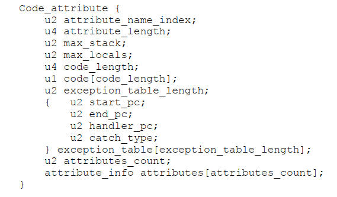
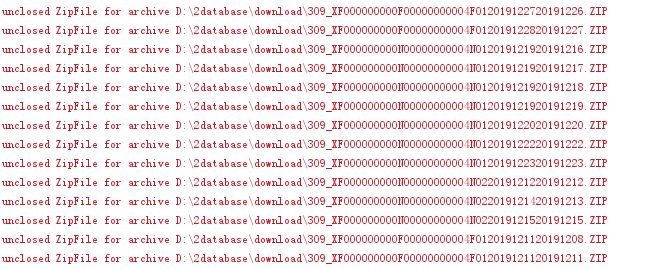

## 字节码

### 规范

```properties
###1. Class文件结构
ClassFile {
		u4 magic;                          -----占用四个字节，固定为CAFEBABY
		u2 minor_version;             -----CLASS文件版本号，与JDK版本关联
		u2 major_version;             -----CLASS文件版本号，与JDK版本关联
		u2 constant_pool_count;    ----常量池数量
		cp_info constant_pool[constant_pool_count-1];  ----各个常量池信息
		u2 access_flags;                  ----类的可见性声明 0x0021
		u2 this_class;                      -----常量池中当前类名的索引
		u2 super_class;                    ----常量池中父类的索引：默认继承java/lang/Object
		u2 interfaces_count;           ------当前类声明中实现的接口数量 ，0x00
		u2 interfaces[interfaces_count];  ---常量池中接口名的索引 ，
		u2 fields_count;                      ------属性数量 
		field_info fields[fields_count];  -----每个属性的信息：访问修饰符 +常量池中属性名索引+相关描述说明的索引（属性类型）+特性（attributes）数量+特性信息（数量为0则没有）
		u2 methods_count;           --------方法的数量
		method_info methods[methods_count];  --每个方法的信息：访问修饰符[2]+常量池中方法名索引[2]+描述说明的索引[2](比如参数类型，返回值类型)+特性（attributes）数量[2]+特性信息（数量为0则没有）
		u2 attributes_count;
		attribute_info attributes[attributes_count];
} 
```

> 1. u+数字：数字代表占用几个字节
>
> 2. access_flags
>
>    Java8以上class文件默认设置ACC_SUPER，配合访问修饰符如果为public，则为0x0021
>
>    
>
> 3. field_info
>
>    
>
>    
>
> 4. method_info
>
>    
>
> 5. attribute_info
>
>    
>
>    
>
>    


### 示例代码

```java
package myex03Io;

import java.io.Serializable;

public class BookOne implements Serializable {
    private String name;
    private int price;

    public BookOne(String name, int price) {
        this.name = name;
        this.price = price;
    }

    public String getName() {
        return this.name;
    }

    public void setName(String name) {
        this.name = name;
    }

    public int getPrice() {
        return this.price;
    }

    public void setPrice(int price) {
        this.price = price;
    }
}
```

### 反编译文件

```java
Classfile /F:/practice/Java8Learning/out/production/Java8Learning/myex03Io/BookOne.class
  Last modified 2019-12-6; size 811 bytes
  MD5 checksum 8020e80500b54efbc4b581e8ceea8f62
  Compiled from "BookOne.java"
public class myex03Io.BookOne implements java.io.Serializable
  minor version: 0
  major version: 52
  flags: ACC_PUBLIC, ACC_SUPER
Constant pool:
   #1 = Methodref          #5.#28         // java/lang/Object."<init>":()V
   #2 = Fieldref           #4.#29         // myex03Io/BookOne.name:Ljava/lang/String;
   #3 = Fieldref           #4.#30         // myex03Io/BookOne.price:I
   #4 = Class              #31            // myex03Io/BookOne
   #5 = Class              #32            // java/lang/Object
   #6 = Class              #33            // java/io/Serializable
   #7 = Utf8               name
   #8 = Utf8               Ljava/lang/String;
   #9 = Utf8               price
  #10 = Utf8               I
  #11 = Utf8               <init>
  #12 = Utf8               (Ljava/lang/String;I)V 
  #13 = Utf8               Code
  #14 = Utf8               LineNumberTable
  #15 = Utf8               LocalVariableTable
  #16 = Utf8               this
  #17 = Utf8               Lmyex03Io/BookOne;
  #18 = Utf8               getName
  #19 = Utf8               ()Ljava/lang/String;
  #20 = Utf8               setName
  #21 = Utf8               (Ljava/lang/String;)V
  #22 = Utf8               getPrice
  #23 = Utf8               ()I
  #24 = Utf8               setPrice
  #25 = Utf8               (I)V
  #26 = Utf8               SourceFile
  #27 = Utf8               BookOne.java
  #28 = NameAndType        #11:#34        // "<init>":()V
  #29 = NameAndType        #7:#8          // name:Ljava/lang/String;
  #30 = NameAndType        #9:#10         // price:I
  #31 = Utf8               myex03Io/BookOne
  #32 = Utf8               java/lang/Object
  #33 = Utf8               java/io/Serializable
  #34 = Utf8               ()V
{
  public myex03Io.BookOne(java.lang.String, int);
    descriptor: (Ljava/lang/String;I)V
    flags: ACC_PUBLIC
    Code:
      stack=2, locals=3, args_size=3
         0: aload_0
         1: invokespecial #1                  // Method java/lang/Object."<init>":()V
         4: aload_0
         5: aload_1
         6: putfield      #2                  // Field name:Ljava/lang/String;
         9: aload_0
        10: iload_2
        11: putfield      #3                  // Field price:I
        14: return
      LineNumberTable:
        line 9: 0
        line 10: 4
        line 11: 9
        line 12: 14
      LocalVariableTable:
        Start  Length  Slot  Name   Signature
            0      15     0  this   Lmyex03Io/BookOne;
            0      15     1  name   Ljava/lang/String;
            0      15     2 price   I

  public java.lang.String getName();
    descriptor: ()Ljava/lang/String;
    flags: ACC_PUBLIC
    Code:
      stack=1, locals=1, args_size=1
         0: aload_0
         1: getfield      #2                  // Field name:Ljava/lang/String;
         4: areturn
      LineNumberTable:
        line 15: 0
      LocalVariableTable:
        Start  Length  Slot  Name   Signature
            0       5     0  this   Lmyex03Io/BookOne;

  public void setName(java.lang.String);
    descriptor: (Ljava/lang/String;)V
    flags: ACC_PUBLIC
    Code:
      stack=2, locals=2, args_size=2
         0: aload_0
         1: aload_1
         2: putfield      #2                  // Field name:Ljava/lang/String;
         5: return
      LineNumberTable:
        line 19: 0
        line 20: 5
      LocalVariableTable:
        Start  Length  Slot  Name   Signature
            0       6     0  this   Lmyex03Io/BookOne;
            0       6     1  name   Ljava/lang/String;

  public int getPrice();
    descriptor: ()I
    flags: ACC_PUBLIC
    Code:
      stack=1, locals=1, args_size=1
         0: aload_0
         1: getfield      #3                  // Field price:I
         4: ireturn
      LineNumberTable:
        line 23: 0
      LocalVariableTable:
        Start  Length  Slot  Name   Signature
            0       5     0  this   Lmyex03Io/BookOne;

  public void setPrice(int);
    descriptor: (I)V
    flags: ACC_PUBLIC
    Code:
      stack=2, locals=2, args_size=2
         0: aload_0
         1: iload_1
         2: putfield      #3                  // Field price:I
         5: return
      LineNumberTable:
        line 27: 0
        line 28: 5
      LocalVariableTable:
        Start  Length  Slot  Name   Signature
            0       6     0  this   Lmyex03Io/BookOne;
            0       6     1 price   I
}
SourceFile: "BookOne.java"

```


## JVM内存结构


### Method area：方法区

#### [规范](https://docs.oracle.com/javase/specs/jvms/se8/html/jvms-2.html#jvms-2.6)

>  【规范原文】The method area is  analogous to the storage area for compiled code of a conventional language or analogous to the  "text" segment in an operating system process. It stores per-class structures such as the  run-time constant pool, field  and method data, and the code for methods and constructors, including the special methods (§2.9) used in class  and instance initialization and interface initialization.  
>
> 所有线程共享，逻辑上是堆的一部分，但可能不实现gc并且可能和堆在内存在不是紧靠在一起的，所以也称为非堆（non-heap）.
>
> 但也是可以被gc回收，因为java可以使用classloader动态加载类
>

可以看做是class文件在内存中的存储形式，但有略微有区别【inside the jvm第五章】

| Type  Information                  |                                                              |
| ---------------------------------- | ------------------------------------------------------------ |
| The  Constant Pool                 |                                                              |
| Field  Information                 |                                                              |
| Method  Information                |                                                              |
| Class  Variables                   | 区别于实例变量、及final变量。<br/>final变量与non-fianl变量区别：non-final变量；会在声明他的类中存储，而final变量会存储在使用它的地方。 <br/> |
| A Reference to Class *ClassLoader* |                                                              |
| A Reference to Class *Class*       |                                                              |
| Method  Tables                     | 参考【inside the jvm第五章the heap】                         |

#### class variables

> Every type that uses a final class variable gets a copy of the constant value in its own constant pool. As part of the constant pool, final class variables are stored in the method area--just like non-final class variables. But whereas non-final class variables are stored as part of the data for the type that declares them, final class variables are stored as part of the data for any type that uses them. 【inside the jvm第5章P127】   
>
> As mentioned in earlier chapters, class files do not contain symbolic references to static final fields of other classes. **Instead, class files contain a copy of the constant value of any static final fields it uses.**【inside the jvm(第6章The CONSTANT_Fieldref_info Table p202)】
>
> **Compile-Time Resolution of Constants** 【inside the jvm（第8章334）】
>
> As mentioned in Chapter 7, "The Lifetime of a Class," references to static final variables initialized to a compile-time constant are resolved at compile-time to a local copy of the constant value. This is true for constants of all the primitive types and of type java.lang.String
>
> 有两个优点
>
> 1）switch case语法中：case必须使用Compile-Time Constants ，不能使用Run-time resolution value。
>
> 2）if语法中：编译是会直接解析常量值，如下
>
> ```java
> class Example2 { 
> 	public static void main(String[] args) { 
> 		if (AntHill.debug) {
> 			System.out.println("Debug is true!");
> 		} 
> 	} 
> }
> class AntHill {
> 	static final boolean debug = false;
> }
> //0 return // return void 
> //注释：编译是生成的class文件不包含if代码，因为已经解析到debug为false，永远不会执行
> ```

#### 问题

是否就是class对象?不是，参考【class文件生命周期】loding三件必须做的事情，提供字节流数据、解析为method area的数据结构、创建class对象

### HEAP：堆

* Young generator

* Old    generator

* Permanent      generator

### Constant     pool


### Interned     string


### pc（program counter）：程序计数器


### Native stack


### Java stack Frame：可以参考javap后的文件

	a. 由当前线程的一系列帧组成（frame），帧由
		a. Local variables：zero-base array(数组)
			i. int、float、reference、returnvalue占用一个位置、long、double占用两个连续（consecutive）位置。
			ii. 由operand stack使用，如iload_0：加载本地变量表索引为0的int类型的数值进入operand中
			iii. 包括方法入参，按声明顺序在数组中排列。如果为实例方法（非staitc）则索引为0的位置存放this
		b. Operand stack：
			i. 存储的数据类型和local variables一样，但将local variables中的char、byte、short均转换为int再存储在operand中
		c. Frame date：
			i. 常量池的引用，比如类名、字段名、Exceptions等
		d.Retrun values：包括在local variables中？
	####20200729更新
	Local Variables：an array of variables known as its local variables. 
	Operand Stacks：a last-in-first-out (LIFO) stack known as its operand stack
	Dynamic Linking ： a reference to the run-time constant pool
	Normal Method Invocation Completion
	Abrupt Method Invocation Completion
#### 示例一

| iload_0  | //  push the int in local variable 0 onto the stack |
| -------- | --------------------------------------------------- |
| iload_1  | //  push the int in local variable 1 onto the stack |
| iadd     | //  pop two ints, add them, push result             |
| istore_2 | //  pop int, store into local variable 2            |


#### 示例二


 


#### 资料

* [Java内存区域（运行时数据区域）和内存模型（JMM）](https://www.cnblogs.com/czwbig/p/11127124.html)


### 对象占用内存空间

#### Object overhead for "housekeeping" information

Instances of an object on the Java heap don't just take up memory for their actual fields. Inevitably, they also require some "housekeeping" information, such as recording an object's class, ID and status flags such as whether the object is currently reachable, currently synchronization-locked etc. 

In Hotspot: 

- a normal object     requires **8 bytes** of "housekeeping" space; 
- **arrays     require 12 bytes** (the same as a normal object, plus 4 bytes for the     array length). 

Other JVMs probably have a similar object overhead. 

**Object size granularity**

In Hotspot, every object occupies a number of bytes that is a **multiple of 8**. If the number of bytes required by an object for its header and fields is not a multiple 8, then you **round up to the next multiple of 8**. 

This means, for example, that:

- a bare Object takes     up 8 bytes; 

- an instance of a     class with a single boolean field takes up 16 bytes: 8 bytes of header, 1     byte for the boolean and 7 bytes of "padding" to make the size     up to a multiple of 8; 

- an instance with *eight* boolean fields     will also take up 16 bytes: 8 for the header, 8 for the booleans; since     this is already a multiple of 8, no padding is needed; 

- an object with a     two long fields, three int fields and a boolean will take up: 

- - 8 bytes for the      header; 
  - 16 bytes for the 2      longs (8 each); 
  - 12 bytes for the 3      ints (4 each); 
  - 1 byte for the      boolean; 
  - a further 3 bytes      of padding, to round the total up from 37 to 40, a multiple of 8. 

From <https://www.javamex.com/tutorials/memory/object_memory_usage.shtml>

#### 变量排序

* doubles and longs

* ints and floats

* shorts and chars

* booleans and bytes

* references

From <https://www.programering.com/a/MDO2YjMwATE.html> 

#### 示例

##### pom

[Code Tools: jol](http://openjdk.java.net/projects/code-tools/jol/)：该工具用于分析对象在JVM中的布局，内存占用大小等。

```xml
<dependency>
    <groupId>org.openjdk.jol</groupId>
    <artifactId>jol-core</artifactId>
    <version>put-the-version-here</version>
</dependency>

```

到[官网（org/openjdk/jol/jol-cli）](http://central.maven.org/maven2/org/openjdk/jol/jol-cli/)下载jar包，并添加到项目中。

#### 代码

java类

```java
public class TestClassObjectSize {
    long numLong;
    int numint;
    char numChar;
    byte b;
    long l;
    ChildrenClass cObject;
    int add(int i,int j){
        return i+j;
    }
}
```

主类

```java
publicclassMainClassLayout{
publicstaticvoidmain(String[]args)throwsException{
	Layouterl;
	/*------------当前虚拟机----------------------*/
	l=newCurrentLayouter();
	System.out.println("**当前虚拟机***"+l);
	System.out.println(ClassLayout.parseClass(TestClassObjectSize.class,l).toPrintable());
	/*--------------模拟32位虚拟机--------------------*/
	l=newHotSpotLayouter(newX86_32_DataModel());
	System.out.println("**模拟32位虚拟机***"+l);
	System.out.println(ClassLayout.parseClass(TestClassObjectSize.class,l).toPrintable());
	/*--------------模拟64位虚拟机--------------------*/
	l=newHotSpotLayouter(newX86_64_DataModel());
	System.out.println("***模拟64位虚拟机**"+l);
	System.out.println(ClassLayout.parseClass(TestClassObjectSize.class,l).toPrintable());
	/*--------------模拟64位虚拟机，使用oop-klassmodel--------------------*/
	l=newHotSpotLayouter(newX86_64_COOPS_DataModel());
	System.out.println("**模拟64位虚拟机，使用oop-klassmodel***"+l);
	System.out.println(ClassLayout.parseClass(TestClassObjectSize.class,l).toPrintable());
	}
}
```

#### 输出

```
**当前虚拟机*** Current VM Layout
jvmex.TestClassObjectSize object internals:
 OFFSET  SIZE                  TYPE DESCRIPTION                               VALUE
      0    12                       (object header)                           N/A
     12     4                   int TestClassObjectSize.numint                N/A
     16     8                  long TestClassObjectSize.numLong               N/A
     24     8                  long TestClassObjectSize.l                     N/A
     32     2                  char TestClassObjectSize.numChar               N/A
     34     1                  byte TestClassObjectSize.b                     N/A
     35     1                       (alignment/padding gap)                  
     36     4   jvmex.ChildrenClass TestClassObjectSize.cObject               N/A
Instance size: 40 bytes
Space losses: 1 bytes internal + 0 bytes external = 1 bytes total

**模拟32位虚拟机*** VM Layout Simulation (X32 model, 8-byte aligned, compact fields, field allocation style: 1)
jvmex.TestClassObjectSize object internals:
 OFFSET  SIZE                  TYPE DESCRIPTION                               VALUE
      0     8                       (object header)                           N/A
      8     8                  long TestClassObjectSize.numLong               N/A
     16     8                  long TestClassObjectSize.l                     N/A
     24     4                   int TestClassObjectSize.numint                N/A
     28     2                  char TestClassObjectSize.numChar               N/A
     30     1                  byte TestClassObjectSize.b                     N/A
     31     1                       (alignment/padding gap)                  
     32     4   jvmex.ChildrenClass TestClassObjectSize.cObject               N/A
     36     4                       (loss due to the next object alignment)
Instance size: 40 bytes
Space losses: 1 bytes internal + 4 bytes external = 5 bytes total

***模拟64位虚拟机** VM Layout Simulation (X64 model, 8-byte aligned, compact fields, field allocation style: 1)
jvmex.TestClassObjectSize object internals:
 OFFSET  SIZE                  TYPE DESCRIPTION                               VALUE
      0    16                       (object header)                           N/A
     16     8                  long TestClassObjectSize.numLong               N/A
     24     8                  long TestClassObjectSize.l                     N/A
     32     4                   int TestClassObjectSize.numint                N/A
     36     2                  char TestClassObjectSize.numChar               N/A
     38     1                  byte TestClassObjectSize.b                     N/A
     39     1                       (alignment/padding gap)                  
     40     8   jvmex.ChildrenClass TestClassObjectSize.cObject               N/A
Instance size: 48 bytes
Space losses: 1 bytes internal + 0 bytes external = 1 bytes total

**模拟64位虚拟机，使用oop-klass model*** VM Layout Simulation (X64 model (compressed oops), 8-byte aligned, compact fields, field allocation style: 1)
jvmex.TestClassObjectSize object internals:
 OFFSET  SIZE                  TYPE DESCRIPTION                               VALUE
      0    12                       (object header)                           N/A
     12     4                   int TestClassObjectSize.numint                N/A
     16     8                  long TestClassObjectSize.numLong               N/A
     24     8                  long TestClassObjectSize.l                     N/A
     32     2                  char TestClassObjectSize.numChar               N/A
     34     1                  byte TestClassObjectSize.b                     N/A
     35     1                       (alignment/padding gap)                  
     36     4   jvmex.ChildrenClass TestClassObjectSize.cObject               N/A
Instance size: 40 bytes
Space losses: 1 bytes internal + 0 bytes external = 1 bytes total
```


#### 总结：

> a. 关注点：
> 	i.  objectheader不同位数，是否采用oop-klass model下，占用空间不同
> 	ii.  变量顺序不同操作系统下不一致，是否采用oop-klass model下也不一致。与声明顺序不一致。
> 	iii.  Padding的大小
> 	iv.  对象内存占用总是8个字节的倍数
>
> b. 不对的类型变量占用字节位数不同，但寄存器必须按照8的倍数进行读取。所以为了节省空间，不能按照程序声明的顺序存储不同类型的变量，JVM会按照留白最小的方式重新编排变量顺序（自己意淫的）
>
> ```
> 若按声明顺序存放变量，则TestClassObjectSize 对象可能变成
> 0【objectheader】
> 12【Pading】
> 16【long】
> 24【int】
> 28【char】
> 30【byte】
> 31【padding】
> 32【long】
> 40【ObectReference】
> 44【padding】
> Total：48bytes
> Padding：4+1+4=9bytes
> ```
>
> c. 对象在内存中存放对象头object header
> 		i. Lock
>
> d. 虚拟机中采用oop-klass model


#### 资料

1. [Memory usage of Java objects: general guide ](https://www.javamex.com/tutorials/memory/object_memory_usage.shtml)
2. [JOL (Java Object Layout) is      the tiny toolbox to analyze object layout schemes in JVMs ](http://openjdk.java.net/projects/code-tools/jol/)
3. [其他实例](http://hg.openjdk.java.net/code-tools/jol/file/tip/jol-samples/src/main/java/org/openjdk/jol/samples/) 

### 对象头


## 处理的问题

### unclosed zipfile

1. 问题：ftp下载zipfile 到本地，然后解压，提示问题如下

   

2. 堆栈信息，在打印上述红字时，发生gc,年轻代内存降低，

   

3. 代码

   ```java
   public static List<File> unCompress(File source) throws IOException{
       List<File> unCompressFileList=new ArrayList<>();
       ZipFile zipFile = null;
       zipFile = new ZipFile(source,"GBK");
       String zipFilePath=source.getPath();
       String path=zipFilePath.substring(0,zipFilePath.lastIndexOf('.'));
       FileUtils.createPaths(path);
       Enumeration<ZipEntry> entries = zipFile.getEntries();
       while (entries.hasMoreElements()) {
           ZipEntry zipEntry = entries.nextElement();
           String name = zipEntry.getName();
           String unCompressFile=path+File.separator+name;//可能为文件或目录
           System.out.println(name);
           if(zipEntry.isDirectory()){
               FileUtils.createPaths(unCompressFile);
           }else{
               File file = new File(unCompressFile);
               FileUtils.createPaths(file.getParentFile().getCanonicalPath());
               try(FileOutputStream fileOutputStream = new FileOutputStream(unCompressFile);
                   BufferedOutputStream bufferedOutputStream = new BufferedOutputStream(fileOutputStream);
                   InputStream inputStream = zipFile.getInputStream(zipEntry);
                   //可能导致内存溢出，Cleaning up unclosed ZipFile for archive需要在测试一次
                   //未搞清楚Cleaning up unclosed ZipFile for archive问题，因为匿名的zipFile.getInputStream(zipEntry)会被bufferedInputStream的close()关闭掉
                   BufferedInputStream bufferedInputStream =new BufferedInputStream(inputStream)){
                   byte[] buf=new byte[1024];
                   int read = 0;
                   while ((read=bufferedInputStream.read(buf))!=-1){
                       bufferedOutputStream.write(buf,0,read);
                   }
               }
               unCompressFileList.add(file);
           }
       }
       return unCompressFileList;
   }
   ```

4. 结论

   > 结论：刚开始以为是outputsteam未关闭，但实际上时候try-with-resource的写法不存在这个问题，并且注意到bufferinputstream会吧传入的inputstream关闭。
   >
   > 解决问题：最后增加zipfile文件的关闭
   >
   > 
   >
   > 
   >
   > 

jvm启动参数

-Xms：初始，默认1/64物理内存

-Xmx：最大，默认1/4物理内存

-xmn：年轻代

-survivorRatio：年轻代eden与survivor比值，默认8：1：1

heapsize最好不超过物理内存80%

两者尽量一致：避免堆调整大小带来频繁一定堆内的对象

## JVM工具


#### JPS

1. jps -q ：不显示类名、jar名、传递给main函数的参数，只给出本地jvm运行java进程的pid列表

      

1. jps -m ：输出传递给jvm的参数，如果是内嵌的JVM可能输出为空

window：

|   注意：这里还显示了类名 |
| ------------------------------------------------------------ |
|       |

1. jps -l ：显示完整的main class完整的包名或者完整的jar包路径名

| window：                |  |
| ------------------------------------------------------------ | ------------------------------------------------------ |
|                                                              |                                                        |

1. jps -v :传递给jvm的参数

| window：其中-XX:+TraceClassLoading  是真实设置的，其他应该是idea自动加上的                |      |
| ------------------------------------------------------------ | ---- |
|       |      |

1. jps -joption ：为正在运行的程序设置JVM参数，如jps -j-Xms48m

#### jstat

jstat命令可以查看堆内存各部分的使用量，以及加载类的数量。命令的格式如下：

jstat [-命令选项] [vmid] [间隔时间/毫秒] [查询次数]

注意！！！：使用的jdk版本是jdk8.

##### 类加载统计：


image

- Loaded:加载class的数量
- Bytes：所占用空间大小
- Unloaded：未加载数量
- Bytes:未加载占用空间
- Time：时间

##### 编译统计


image

- Compiled：编译数量。
- Failed：失败数量
- Invalid：不可用数量
- Time：时间
- FailedType：失败类型
- FailedMethod：失败的方法

##### 垃圾回收统计


image

- S0C：第一个幸存区的大小
- S1C：第二个幸存区的大小
- S0U：第一个幸存区的使用大小
- S1U：第二个幸存区的使用大小
- EC：伊甸园区的大小
- EU：伊甸园区的使用大小
- OC：老年代大小
- OU：老年代使用大小
- MC：方法区大小
- MU：方法区使用大小
- CCSC:压缩类空间大小
- CCSU:压缩类空间使用大小
- YGC：年轻代垃圾回收次数
- YGCT：年轻代垃圾回收消耗时间
- FGC：老年代垃圾回收次数
- FGCT：老年代垃圾回收消耗时间
- GCT：垃圾回收消耗总时间

##### 堆内存统计


image

- NGCMN：新生代最小容量
- NGCMX：新生代最大容量
- NGC：当前新生代容量
- S0C：第一个幸存区大小
- S1C：第二个幸存区的大小
- EC：伊甸园区的大小
- OGCMN：老年代最小容量
- OGCMX：老年代最大容量
- OGC：当前老年代大小
- OC:当前老年代大小
- MCMN:最小元数据容量
- MCMX：最大元数据容量
- MC：当前元数据空间大小
- CCSMN：最小压缩类空间大小
- CCSMX：最大压缩类空间大小
- CCSC：当前压缩类空间大小
- YGC：年轻代gc次数
- FGC：老年代GC次数

##### 新生代垃圾回收统计


image

- S0C：第一个幸存区大小
- S1C：第二个幸存区的大小
- S0U：第一个幸存区的使用大小
- S1U：第二个幸存区的使用大小
- TT:对象在新生代存活的次数
- MTT:对象在新生代存活的最大次数
- DSS:期望的幸存区大小
- EC：伊甸园区的大小
- EU：伊甸园区的使用大小
- YGC：年轻代垃圾回收次数
- YGCT：年轻代垃圾回收消耗时间

##### 新生代内存统计


image

- NGCMN：新生代最小容量
- NGCMX：新生代最大容量
- NGC：当前新生代容量
- S0CMX：最大幸存1区大小
- S0C：当前幸存1区大小
- S1CMX：最大幸存2区大小
- S1C：当前幸存2区大小
- ECMX：最大伊甸园区大小
- EC：当前伊甸园区大小
- YGC：年轻代垃圾回收次数
- FGC：老年代回收次数

##### 老年代垃圾回收统计


image

- MC：方法区大小
- MU：方法区使用大小
- CCSC:压缩类空间大小
- CCSU:压缩类空间使用大小
- OC：老年代大小
- OU：老年代使用大小
- YGC：年轻代垃圾回收次数
- FGC：老年代垃圾回收次数
- FGCT：老年代垃圾回收消耗时间
- GCT：垃圾回收消耗总时间

##### 老年代内存统计


image

- OGCMN：老年代最小容量
- OGCMX：老年代最大容量
- OGC：当前老年代大小
- OC：老年代大小
- YGC：年轻代垃圾回收次数
- FGC：老年代垃圾回收次数
- FGCT：老年代垃圾回收消耗时间
- GCT：垃圾回收消耗总时间

##### 元数据空间统计


image

- MCMN: 最小元数据容量
- MCMX：最大元数据容量
- MC：当前元数据空间大小
- CCSMN：最小压缩类空间大小
- CCSMX：最大压缩类空间大小
- CCSC：当前压缩类空间大小
- YGC：年轻代垃圾回收次数
- FGC：老年代垃圾回收次数
- FGCT：老年代垃圾回收消耗时间
- GCT：垃圾回收消耗总时间

##### 总结垃圾回收统计


image

- S0：幸存1区当前使用比例
- S1：幸存2区当前使用比例
- E：伊甸园区使用比例
- O：老年代使用比例
- M：元数据区使用比例
- CCS：压缩使用比例
- YGC：年轻代垃圾回收次数
- FGC：老年代垃圾回收次数
- FGCT：老年代垃圾回收消耗时间
- GCT：垃圾回收消耗总时间

##### JVM编译方法统计


image

- Compiled：最近编译方法的数量
- Size：最近编译方法的字节码数量
- Type：最近编译方法的编译类型。
- Method：方法名标识。


#### jmap

```shell
查看实体类占用空间最大前100位
jmap -histo:live 33606 |head -n 100
```


#### Top

```properties
top查看所有进程占用cpu的情况
top -p pid 观察某进程的情况
top -p pid -H 该进程内所有线程cpu占用情况
获取线程pid并转为16进制
jstack pid |grep 16进制pid
##"VM Periodic Task Thread" os_prio=0 tid=0x00007f7344165800 nid=0x19fc3 waiting on condition
将打印 出线程信息
也可以直接，将所有线程信息输出到文件上
jstack -l  pid >>path.txt
```


## 问题

1. Memory structure？And definitions?What's the exception may     cause in each partition?Give the     case and solve them.

2. Relative parameters  for tuning the jvm?Give the code example

3. Instructions?And   give the example compare the code before and after compiling?

4. Garbage  collection algorithm？

5. String  interned pool？String literals?

6. What's the method table

7. 运行的多个java程序是共用一个堆吗？

8. 1. 不是的，每启动一个程序，就会生成一个JVM实例

9. 偏向锁、轻量锁、重量锁、及objectheader转换

10. 偏向锁与轻量锁区别

11. 了解monitor对象，如何实现

12. [java memory      model与hardware memory architecture怎么工作](http://tutorials.jenkov.com/java-concurrency/java-memory-model.html)

## 资源

1. **书单**

2. 1. Inside the      Java Virtual Machine Bill Venners
   2. The Java® Virtual Machine      Specification Java SE 8 Edition
   3. HotSpot实战
   4. Oracle JRockit The Definitive      Guide
   5. 深入理解Java虚拟机：JVM高级特性与最佳实践（最新第二版）
   6.  

3. **相关网址**

4. 1. [Inside the Java Virtual Machine homepage](https://www.artima.com/insidejvm/resources/index.html)
   2. [JVM architecture](https://codepumpkin.com/jvm-architecture-introduction/#)
   3. [vmoptions](https://www.oracle.com/technetwork/java/javase/tech/vmoptions-jsp-140102.html)
   4. [oracle官网gc-tuning with the 5.0 Java       TM Virtual Machine](https://www.oracle.com/technetwork/java/gc-tuning-5-138395.html)
   5. [oracle官网Java SE HotSpot at a Glance](https://www.oracle.com/technetwork/java/javase/tech/index-jsp-136373.html)
   6. [oracle官网Java SE 6 HotSpot Virtual Machine Garbage Collection Tuning](https://www.oracle.com/technetwork/java/javase/gc-tuning-6-140523.html)
   7. [oracle官网Java Platform, Standard       Edition HotSpot Virtual Machine Garbage Collection Tuning Guide](https://docs.oracle.com/javase/8/docs/technotes/guides/vm/gctuning/index.html)
   8. [JSR133中文版](http://ifeve.com/jsr133-cn/)