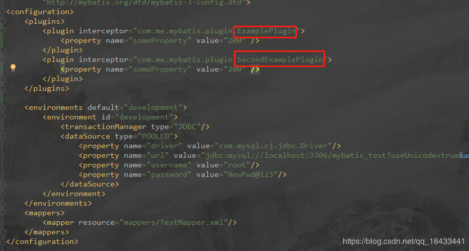
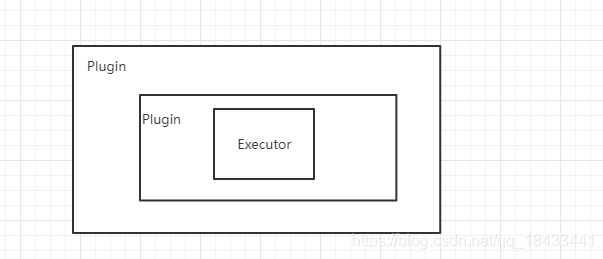
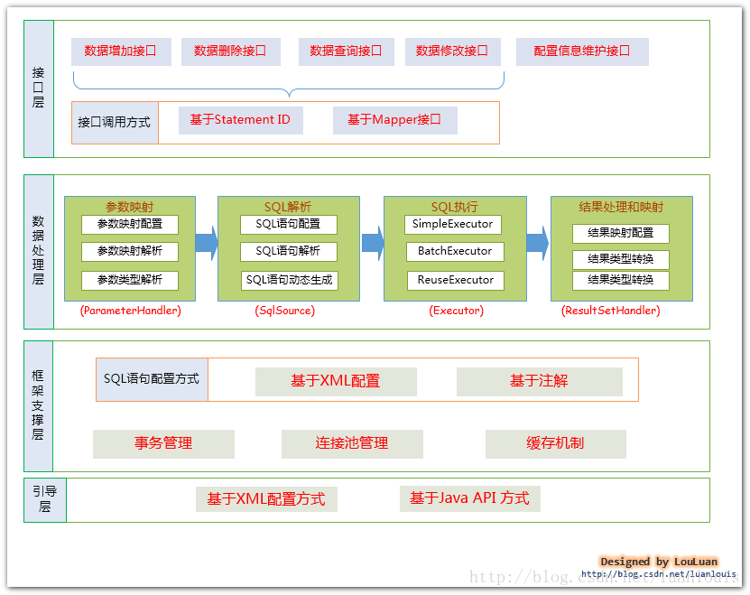
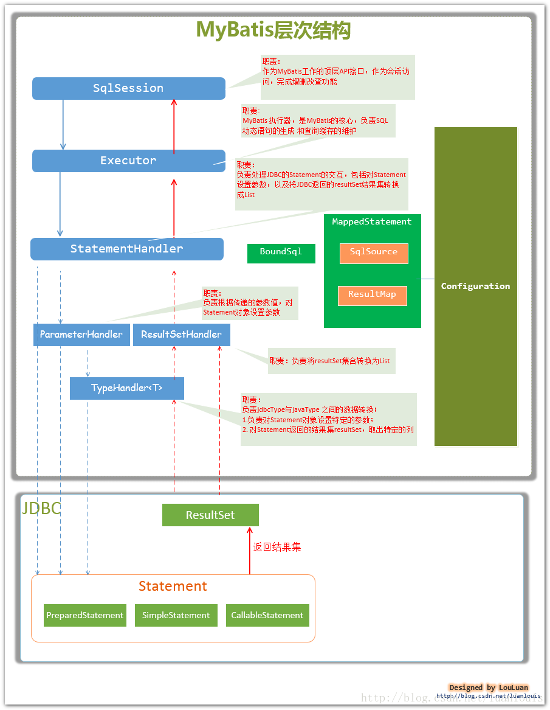

1.  主动装配:`MybatisAutoConfiguration`
2. 扫描注册BeanDefinition:`MybatisAutoConfiguration.AutoConfiguredMapperScannerRegistrar`，用于注册`MapperScannerConfigurer`，识别basePackage下的`@Mapper`注解类
3. 当使用`@MapperScan`时会`@Import(MapperScannerRegistrar.class)`,通过扫描@MapperScan配置的包路径扫描所有类型，此时2)将不生效
4. 创建`SqlSessionFactory`
5. 创建`SqlSessionTemplate`
6. 执行过程中
   1. 扫描BeanDefinition：`org.mybatis.spring.mapper.ClassPathMapperScanner#doScan`
   2. 修改BeanDefinition：
      1. **修改BeanClass为`MapperFactoryBean.class`**
      2. 添加sqlSessionFactory属性：`definition.getPropertyValues().add("sqlSessionFactory",new RuntimeBeanReference(this.sqlSessionFactoryBeanName));`
      3. 添加sqlSessionTemplate属性：`definition.getPropertyValues().add("sqlSessionTemplate",  new RuntimeBeanReference(this.sqlSessionTemplateBeanName));`
      4. 设置autowiredType：`definition.setAutowireMode(AbstractBeanDefinition.AUTOWIRE_BY_TYPE);`
      5. 根据config配置文件设置：`definition.setLazyInit(lazyInitialization);`

7. 通过Mapper创建可执行实例
   1. 工厂方法：`org.mybatis.spring.mapper.MapperFactoryBean#getObject`
   2. Sqlsession：`org.mybatis.spring.SqlSessionTemplate#getMapper`
   3. 具体执行：`org.apache.ibatis.binding.MapperRegistry#getMapper`
   4. 代理生成实例：`MapperProxyFactory#newInstance(org.apache.ibatis.session.SqlSession)`
   5. 即`MapperProxy<T>`

### sqlCommand

```java
    @Test
    public void testMaperInterface() throws NoSuchMethodException, IOException {
        ClassPathResource resource = new ClassPathResource("mybatis/mybatis-config.xml");
        XMLConfigBuilder parser = new XMLConfigBuilder(resource.getInputStream(), null, null);
        Configuration configuration=parser.parse();
        Method method = UserMapper.class.getDeclaredMethod("selectUserList",String.class);
        MapperMethod.SqlCommand sqlCommand = new MapperMethod.SqlCommand(configuration, UserMapper.class,method);
        /** */
        System.out.println(ReflectionToStringBuilder.toString(sqlCommand));
        MappedStatement mappedStatement = configuration.getMappedStatement(sqlCommand.getName());
        //RawSqlSource sqlSource =(RawSqlSource) mappedStatement.getSqlSource();//select username,age from user
        DynamicSqlSource sqlSource = (DynamicSqlSource) mappedStatement.getSqlSource();
 System.out.println(ReflectionToStringBuilder.toString(sqlSource.getBoundSql("admin")));
    }
```

* **注意**：`mybatis-config.xml`里面要配置\<Mappers>标签

```XML
    <select id="selectUserList" parameterType="string" resultMap="baseMapper">
        select username,age from user
        <where>
        <if test="name !=null">
         username =#{name}
         </if>
        </where>
    </select>
```

```properties
org.apache.ibatis.mapping.BoundSql@3d680b5a[
sql=select username,age from user
         WHERE username =?,
parameterMappings=[ParameterMapping{property='name', mode=IN, javaType=class java.lang.String, jdbcType=null, numericScale=null, resultMapId='null', jdbcTypeName='null', expression='null'}],
parameterObject=admin,
###additionalParameters用于动态语言for loops, bind等
additionalParameters={_parameter=admin, _databaseId=null},
metaParameters=org.apache.ibatis.reflection.MetaObject@4a22f9e2]

```

### 核心组件

> **SqlSession：**作为MyBatis工作的主要顶层API，表示和数据库交互的会话，完成必要数据库增删改查功能；
>
> **Executor：**MyBatis执行器，是MyBatis 调度的核心，负责SQL语句的生成和查询缓存的维护；
>
> **StatementHandler：**封装了JDBC Statement操作，负责对JDBC statement 的操作，如设置参数、将Statement结果集转换成List集合。
>
> **ParameterHandler：**负责对用户传递的参数转换成JDBC Statement 所需要的参数；
>
> **ResultSetHandler：**负责将JDBC返回的ResultSet结果集对象转换成List类型的集合；
>
> **TypeHandler：**负责java数据类型和jdbc数据类型之间的映射和转换；
>
> **MappedStatement：**MappedStatement维护了一条<select|update|delete|insert>节点的封装；
>
> **SqlSource：**负责根据用户传递的parameterObject，动态地生成SQL语句，将信息封装到BoundSql对象中，并返回；
>
> **BoundSql：**表示动态生成的SQL语句以及相应的参数信息；
>
> **Configuration：**MyBatis所有的配置信息都维持在Configuration对象之中；

### 层次结构


#### 分页原理

> org.apache.ibatis.plugin.Interceptor


> RowBounds利用的是逻辑分页，而Pagehelper利用的物理分页；
>  **逻辑分页**：逻辑分页利用游标分页，好处是所有数据库都统一，坏处就是效率低；利用ResultSet的滚动分页，由于ResultSet带有游标，因此可以使用其next()方法来指向下一条记录；当然也可以利用Scrollable ResultSets(可滚动结果集合)来快速定位到某个游标所指定的记录行，所使用的是ResultSet的absolute()方法；内存开销比较大,在数据量比较小的情况下效率比物理分页高;在数据量很大的情况下,内存开销过大,容易内存溢出,不建议使用
>  **物理分页**：数据库本身提供了分页方式，如mysql的limit，好处是效率高，不好的地方就是不同数据库有不同分页方式，需要为每种数据库单独分页处理；

#### 事务

### 开发问题

1. Mybatis级联查询时，controller返回json格式，报错

   ```java
    Could not write JSON: No serializer found for class org.apache.ibatis.executor.loader.javassist.JavassistProxyFactory$EnhancedResultObjectProxyImpl and no properties discovered to create BeanSerializer (to avoid exception, disable SerializationFeature.FAIL_ON_EMPTY_BEANS); nested exception is com.fasterxml.jackson.databind.exc.InvalidDefinitionException
   //在所有相关的类前加上@JsonIgnoreProperties, 作用是json序列化时忽略bean中的一些属性序列化和反序列化时抛出的异常.
   @JsonIgnoreProperties(value = { "handler" })
   //或者关闭延迟加载
   <!-- 全局启用或禁用延迟加载。当禁用时，所有关联对象都会即时加载。 -->
   <setting name="lazyLoadingEnabled" value="false"/>
   //问题：什么是延迟加载，事实上即使开始延迟加载，也完成了查询
   ```

   

2. 

### 插件

1. 插件接口

   ```java
   package org.apache.ibatis.plugin;
   
   public interface Interceptor {
   
     Object intercept(Invocation invocation) throws Throwable;
   
     default Object plugin(Object target) {
       return Plugin.wrap(target, this);
     }
   
     default void setProperties(Properties properties) {
       // NOP
     }
   
   }
   ```

2. 分页插件

   ```java
   // com.github.pagehelper.PageInterceptor
   // com.github.pagehelper.autoconfigure.PageHelperAutoConfiguration
   ```

   

3. 四大组件

   ```java
   Executor：调度以下三个对象并且执行SQL全过程，组装参数、执行SQL、组装结果集返回。通常不怎么拦截使用。
   StatementHandler：是执行SQL的过程（预处理语句构成），这里我们可以获得SQL，重写SQL执行。所以这是最常被拦截的对象。
   ParameterHandler：参数组装，可以拦截参数重组参数。
   ResultSetHandler：结果集处理，可以重写组装结果集返回。
   ```

   

4. 执行顺序



```properties
==== SecondExamplePlugin 开始搞事情：query  ====
==== ExamplePlugin 开始搞事情：query  ====
==== SecondExamplePlugin 开始搞事情：prepare  ====
==== ExamplePlugin 开始搞事情：prepare  ====
==== SecondExamplePlugin 开始搞事情：setParameters  ====
==== ExamplePlugin 开始搞事情：setParameters  ====
==== SecondExamplePlugin 开始搞事情：handleResultSets  ====
==== ExamplePlugin 开始搞事情：handleResultSets  ====

```

> 与配置文件顺序相反，[具体参考](https://blog.csdn.net/qq_18433441/article/details/84036317)
>
> [或者pageHelper作者github](https://github.com/pagehelper/Mybatis-PageHelper/blob/master/wikis/zh/Interceptor.md)



**所以，后面的将会代理前面的，这也就是为什么SecondExamplePlugin先执行的原因了——越外层的越先执行嘛**


#### StatementHandler层权限控制插件

1. 分页失败，因为分页插件作用在第一层。已实现

2. interceptor

   ```java
   package com.goldsign.project.qssystem.qssystmbase;
   
   
   import com.goldsign.common.exception.BusinessException;
   import com.goldsign.common.utils.security.ShiroUtils;
   import com.goldsign.project.system.user.domain.User;
   import org.apache.commons.lang3.StringUtils;
   import org.apache.ibatis.executor.statement.PreparedStatementHandler;
   import org.apache.ibatis.executor.statement.RoutingStatementHandler;
   import org.apache.ibatis.executor.statement.StatementHandler;
   import org.apache.ibatis.plugin.*;
   import org.apache.ibatis.reflection.MetaObject;
   import org.apache.ibatis.reflection.SystemMetaObject;
   import org.slf4j.Logger;
   import org.slf4j.LoggerFactory;
   import org.springframework.stereotype.Component;
   
   import java.sql.Connection;
   import java.util.Properties;
   @Intercepts({
           @Signature(type = StatementHandler.class,method = "prepare",args = {
                   Connection.class,Integer.class
           })
   })
   public class QsFormQueryPermissionInterceptor implements Interceptor {
   
       private static Logger log = LoggerFactory.getLogger(QsFormQueryPermissionInterceptor.class);
       String queryPermissionTable="Qs_Form_Table";
       @Override
       public Object intercept(Invocation invocation) throws Throwable {
           log.info("进入qs权限查询Interceptor");
           StatementHandler statementHandler = ((StatementHandler) invocation.getTarget());
           MetaObject metaStatementHandler = SystemMetaObject.forObject(statementHandler);
           String statementId = (String) metaStatementHandler.getValue("delegate.mappedStatement.id");
           // 分离代理对象，从而形成多次代理
           while (metaStatementHandler.hasGetter("h")) {
               Object object = metaStatementHandler.getValue("h");
               metaStatementHandler = SystemMetaObject.forObject(object);
           }
           // 分离最后一个代理对象的目标类
           while (metaStatementHandler.hasGetter("target")) {
               Object object = metaStatementHandler.getValue("target");
               metaStatementHandler = SystemMetaObject.forObject(object);
           }
   
       /*        //获取用户机构
               User user = ShiroUtils.getSysUser();
               String deptId = user.getDeptId();
               if (StringUtils.isEmpty(deptId)) {
                   throw new BusinessException("未找到用户的组织机构信息");
               }*/
           String deptId="城东加油站";
           String sql = (String)metaStatementHandler.getValue("delegate.boundSql.sql");
           // 取出即将执行的SQL
           if(sql.indexOf(queryPermissionTable) ==-1 && statementId.indexOf("qsform") !=-1){
               sql = sql.trim();
               String querySql =new StringBuilder("select * from (")
                       .append(sql)
                       .append(") ")
                       .append(queryPermissionTable)
                       .append(" where ( head_company_no ='")
                       .append(deptId)
                       .append("' or company_no = '")
                       .append(deptId)
                       .append("' or station_no = '")
                       .append(deptId)
                       .append("' ) ")
                       .toString();
               metaStatementHandler.setValue("delegate.boundSql.sql", querySql);
           }
           return invocation.proceed();
       }
   
       @Override
       public Object plugin(Object target) {
           // 使用默认的Mybatis提供的类生成代理对象
           return Plugin.wrap(target, this);
       }
   
       /**
        * 获取xml配置的属性值，配置到当前插件
        * @param properties
        */
       @Override
       public void setProperties(Properties properties) {
   
       }
   }
   
   ```

3. 生成的sql

   ```sql
   select *
     from (SELECT count(0)
             FROM (SELECT (SELECT dept_name
                             FROM SYS_DEPT
                            WHERE dept_id = t.HEAD_COMPANY_NO) AS head_company_no,
                          (SELECT dept_name
                             FROM SYS_DEPT
                            WHERE dept_id = t.company_no) AS company_no,
                          (SELECT dept_name
                             FROM SYS_DEPT
                            WHERE dept_id = t.station_no) AS station_no,
                          (SELECT REMARK
                             FROM SYS_DICT_DATA
                            WHERE dict_type = 'trade_type_enums'
                              AND dict_value = t.deal_type
                              AND status = '0') AS deal_type,
                          OPERATOR,
                          OPT_TIME,
                          sum(PAY_AMOUNT) AS PAY_AMOUNT,
                          sum(PAY_COUNT) AS PAY_COUNT,
                          QS_DATE,
                          TID
                     FROM QS_FORM_VCP_CARD_LOAD t
                    WHERE t.deal_type = '003'
                    GROUP BY tid,
                             station_no,
                             company_no,
                             head_company_no,
                             t.deal_type,
                             qs_date,
                             operator,
                             opt_time) table_count )Qs_Form_Table
    where (head_company_no = '城东加油站' or company_no = '城东加油站' or
          station_no = '城东加油站')
   
   ```

   

4. 修改为原sql的where 里面添加条件

   以groupby 为分界，取最后一个from之后判断有没有where。缺陷是where 子条件包含子查询时会出问题

   ```java
         if(sql.indexOf(queryPermissionTable) ==-1 && statementId.indexOf("qsform") !=-1){
               sql = sql.trim();
               int index = sql.toLowerCase().indexOf("group");
               if(index !=-1){
                   String prefixSql=sql.substring(0,index);
                   String suffixSql=sql.substring(index,sql.length());
                   String perSql =new StringBuilder(" (head_company_no ='")
                           .append(deptId)
                           .append("' or company_no = '")
                           .append(deptId)
                           .append("' or station_no = '")
                           .append(deptId)
                           .append("')  ")
                           .toString();
                   //判断是否有where,子查询可能有where所以取最后一个from之后的where
                   //问题是where的子查询还可能有select from
                   String lowerPrefixSql = prefixSql.toLowerCase();
                   int whereIndex = lowerPrefixSql.indexOf("where",lowerPrefixSql.lastIndexOf("from"));
                   if(whereIndex !=-1){
                       prefixSql = prefixSql.concat(" and ").concat(perSql);
                   }else{
                       prefixSql = prefixSql.concat(" where ").concat(perSql);
                   }
                   sql= prefixSql + suffixSql;
               }
         }
   ```

   修改后

   ```sql
   
    SELECT count(0)
       FROM (SELECT (SELECT dept_name
                       FROM SYS_DEPT
                      WHERE dept_id = t.HEAD_COMPANY_NO) AS head_company_no,
                    (SELECT dept_name FROM SYS_DEPT WHERE dept_id = t.company_no) AS company_no,
                    (SELECT dept_name FROM SYS_DEPT WHERE dept_id = t.station_no) AS station_no,
                    (SELECT REMARK
                       FROM SYS_DICT_DATA
                      WHERE dict_type = 'trade_type_enums'
                        AND dict_value = t.deal_type
                        AND status = '0') AS deal_type,
                    OPERATOR,
                    OPT_TIME,
                    sum(PAY_AMOUNT) AS PAY_AMOUNT,
                    sum(PAY_COUNT) AS PAY_COUNT,
                    QS_DATE,
                    TID
               FROM QS_FORM_VCP_CARD_LOAD t
              WHERE t.deal_type = ?
                and (head_company_no = '4N01' or company_no = '4N01' or
                    station_no = '4N01')
              GROUP BY tid,
                       station_no,
                       company_no,
                       head_company_no,
                       t.deal_type,
                       qs_date,
                       operator,
                       opt_time) table_count;
     SELECT 
     	FROM (SELECT TMP_PAGE., ROWNUM ROW_ID
     					FROM (select (select dept_name
     													from SYS_DEPT
     												 where dept_id = t.HEAD_COMPANY_NO) as head_company_no,
     											 (select dept_name
     													from SYS_DEPT
     												 where dept_id = t.company_no) as company_no,
     											 (select dept_name
     													from SYS_DEPT
     												 where dept_id = t.station_no) as station_no,
     											 (select REMARK
     													from SYS_DICT_DATA
     												 where dict_type =
     															 'trade_type_enums'
     													 and dict_value = t.deal_type
     													 and status = '0') as deal_type,
     											 OPERATOR,
     											 OPT_TIME,
     											 sum(PAY_AMOUNT) as PAY_AMOUNT,
     											 sum(PAY_COUNT) as PAY_COUNT,
     											 QS_DATE,
     											 TID
     									from QS_FORM_VCP_CARD_LOAD t
     								 WHERE t.deal_type = ?
     									 and (head_company_no = '4N01' or
     											 company_no = '4N01' or
     											 station_no = '4N01')
     								 GROUP BY tid,
     													station_no,
     													company_no,
     													head_company_no,
     													t.deal_type,
     													qs_date,
     													operator,
     													opt_time
     								 order by t.qs_date desc,
     													station_no,
     													company_no,
     													t.opt_time,
     													t.deal_type) TMP_PAGE
     				 WHERE ROWNUM <= ?)
      WHERE ROW_ID > ?
     
   ```

   


#### Executor层权限控制插件

```java
@Intercepts(
        {
                @Signature(type = Executor.class, method = "query", args = {MappedStatement.class, Object.class, RowBounds.class, ResultHandler.class})
        }
)
public class UserPerssionInterceptor implements Interceptor {
    private static Logger log = LoggerFactory.getLogger(UserPerssionInterceptor.class);

    @Override
    public Object intercept(Invocation invocation) throws Throwable {
        log.info("进入qs权限查询Interceptor");
        BoundSql permissionBoundSql;
        CacheKey cacheKey;
        BoundSql boundSql;
        User localUser = QsThreadLocal.getLocalUser();
        //表明已设置权限控制
        if (localUser != null) {
            Object[] args = invocation.getArgs();
            MappedStatement ms = (MappedStatement) args[0];
            Object parameter = args[1];
            RowBounds rowBounds = (RowBounds) args[2];
            ResultHandler resultHandler = (ResultHandler) args[3];
            Executor executor = (Executor) invocation.getTarget();

            //由于逻辑关系，只会进入一次
            if (args.length == 4) {
                //4 个参数时
                boundSql = ms.getBoundSql(parameter);
                cacheKey = executor.createCacheKey(ms, parameter, rowBounds, boundSql);
            } else {
                //6 个参数时
                cacheKey = (CacheKey) args[4];
                boundSql = (BoundSql) args[5];
            }

            StringBuilder newSql = new StringBuilder();
            newSql.append(" select * from (");
            newSql.append(boundSql.getSql());
            newSql.append(" ) where (head_company_no = '");
            newSql.append(localUser.getDeptId());
            newSql.append("' or company_no = '");
            newSql.append(localUser.getDeptId());
            newSql.append("' or station_no = '");
            newSql.append(localUser.getDeptId());
            newSql.append("')");
            permissionBoundSql = new BoundSql(ms.getConfiguration(), newSql.toString(), boundSql.getParameterMappings(), parameter);
            //清除
            QsThreadLocal.clearUser();
            //注：下面的方法可以根据自己的逻辑调用多次，在分页插件中，count 和 page 各调用了一次
            return executor.query(ms, parameter, rowBounds, resultHandler, cacheKey, permissionBoundSql);
        }
        //TODO 自己要进行的各种处理
        return  invocation.proceed();
    }

    @Override
    public Object plugin(Object target) {
        return Plugin.wrap(target, this);
    }

    @Override
    public void setProperties(Properties properties) {

    }
}
//###由于分页插件的自动配置添加了AutoConfigureAfter,如果不特殊修改，分页插件将被第一个执行（按插件配置顺序的反序）
//以DeferredImportSelector的形式，配置到容器中，在AutoConfigureAfter的配合下，可以是自定义插件在分页插件之后注册
//@Import({QsDeferredImportSelector.class})
//或者直接使用@ImportAutoConfiguration(QsMybatisConfig.class)也能达到同样效果
public class QsDeferredImportSelector implements DeferredImportSelector {
    @Override
    public String[] selectImports(AnnotationMetadata importingClassMetadata) {
        return new String[]{QsMybatisConfig.class.getName()};
    }
}
//AutoConfigureAfter只对自动配置类有效，而自动配置的原理是
@AutoConfigureAfter(PageHelperAutoConfiguration.class)
public class QsMybatisConfig  {

    @Autowired
    private List<SqlSessionFactory> sqlSessionFactoryList;


    @PostConstruct
    public void addPageInterceptor() {
        UserPerssionInterceptor interceptor = new UserPerssionInterceptor();
        for ( SqlSessionFactory sqlSessionFactory : sqlSessionFactoryList) {
            Configuration configuration = sqlSessionFactory.getConfiguration();
            configuration.addInterceptor(interceptor);
/*            List<Interceptor> interceptors = configuration.getInterceptors();
            ArrayList<Interceptor> list = new ArrayList<>();
            MetaObject metaObject = SystemMetaObject.forObject(configuration);*/

        }
    }
   
}
```


### 动手实现mybatis

1. 架构图，[来源](https://blog.csdn.net/luanlouis/article/details/40422941)

   

   

   

2. 思考

   > 1. 注解@MyMapper：表明是该接口是查询接口
   > 2. 注解@MyMapperScan：负责扫描并解析@MyMapper类
   > 3. 对应的需要为@MyMapperScan，添加相应的BeanFactoryPostProcess
   > 4. 解析xml文件，使用原框架提供的。

#### 源码分析

##### sqlsource

1. 获取注解的value值String[]，拼在一起。
2. 判断是否\<script>开头，如是：解析每个标签的内容并存放于list中，如果包含${}或\<if>等标签则为DynamicSqlSource，否则为RawSqlSource
3. 如否：使用configuration中的variable替换${}
4. 判断替换后是否还有${}，如有则为DynamicSqlSource，则为RawSqlSource（替换#{}为？）


#### jdbc基础

```java
    public static void main(String[] args) throws SQLException {
        //"jdbc:oracle:thin:@localhost:1521:orcl"
        try (Connection connection = DriverManager.getConnection("jdbc:mysql://localhost:3306/db2019?userUnicode=true&characterEncoding=utf-8&useSSL=false",
                "root", "82878871");
             Statement statement = connection.createStatement();) {
            connection.setAutoCommit(false);
            ResultSet resultSet = statement.executeQuery("select * from payment");
            System.out.println("createStatement");
            while (resultSet.next()) {
                String id = resultSet.getString("id");
                String serial = resultSet.getString("serial");
                System.out.println("    id=" + id + "，serial=" + serial);
            }
            PreparedStatement preparedStatement = connection.prepareStatement("select * from payment where id =?");
            preparedStatement.setInt(1,999);
            resultSet = preparedStatement.executeQuery();
            System.out.println("preparedStatement");
            while (resultSet.next()) {
                String id = resultSet.getString("id");
                String serial = resultSet.getString("serial");
                System.out.println("    id=" + id + "，serial=" + serial);
            }
            System.out.println("更新");
            PreparedStatement preparedStatement1 = connection.prepareStatement("update payment  set serial = ? where id =?");
            preparedStatement1.setString(1,"jdbc");
            preparedStatement1.setInt(2,999);
            int i = preparedStatement1.executeUpdate();
            System.out.println("更新记录数"+i);
            connection.commit();
            System.out.println("事务隔离级别"+connection.getTransactionIsolation());
        }
    }
```

##### DriverManager.getConnection(）

```java
public class DriverManager {
    static {
        loadInitialDrivers();
        println("JDBC DriverManager initialized");
    }
    //简化了大量代码
    private static void loadInitialDrivers() {
    	ServiceLoader<Driver> loadedDrivers = ServiceLoader.load(Driver.class);
    	Iterator<Driver> driversIterator = loadedDrivers.iterator();
         Class.forName(aDriver, true,
                        ClassLoader.getSystemClassLoader());
    }
}
public class Driver extends NonRegisteringDriver implements java.sql.Driver {
    public Driver() throws SQLException {
    }

    static {
        try {
            DriverManager.registerDriver(new Driver());
        } catch (SQLException var1) {
            throw new RuntimeException("Can't register driver!");
        }
    }
}
private static Connection getConnection(...){
    for(DriverInfo aDriver : registeredDrivers) {
        Connection con = aDriver.driver.connect(url, info);
    }
}
```


> 上面简化的代码做了以下几件事情：
>
> 1. `DriverManager` 在类加载是通过`ServiceLoader` 获取配置的Driver类全称。
>
>    > `ServiceLoader` 通过读取 `META-INF/services` 的配置文件, Driver类全称按行分隔。参考mysql
>    >
>    >  
>
> 2.  `Class.forName()` 加载 class，从而触发static代码，进而注册到 `DriverManager` 中，实际存储在`CopyOnWriteArrayList<DriverInfo>`
>
> 3. `getConnection()` 调用注册的Driver获取连接

#### 组件

##### 1.数据源 


2.


### 资源

* [终结篇：MyBatis原理深入解析（一）](https://www.jianshu.com/p/ec40a82cae28)
* [《深入理解mybatis原理》 MyBatis的架构设计以及实例分析](https://blog.csdn.net/luanlouis/article/details/40422941)
* [动手实践Mybatis插件](https://www.jqhtml.com/41218.html)
* [玩转SpringBoot之整合Mybatis拦截器对数据库水平分表](https://zhuanlan.zhihu.com/p/73429119)

