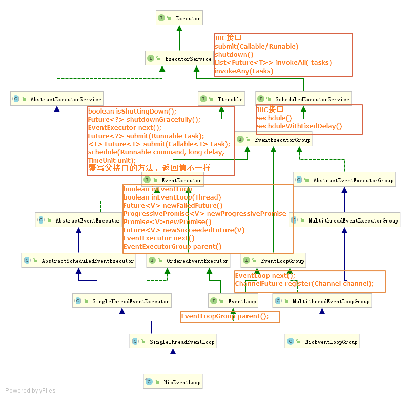
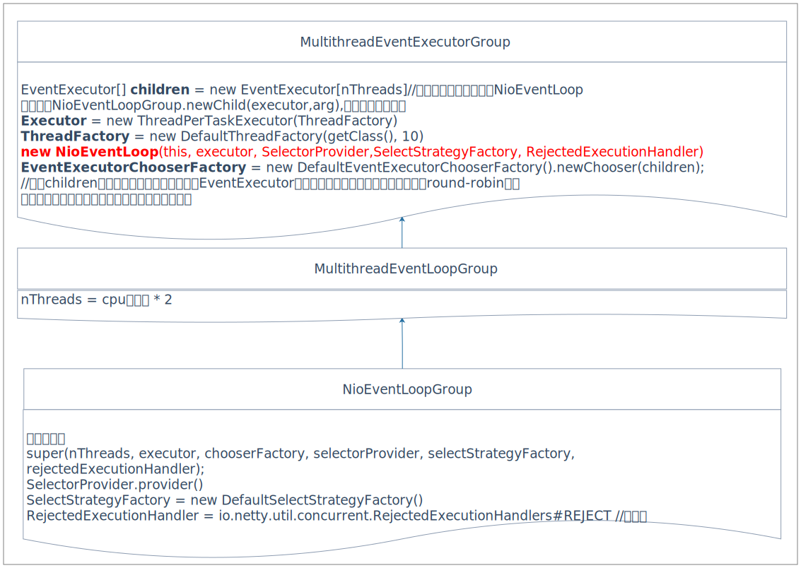
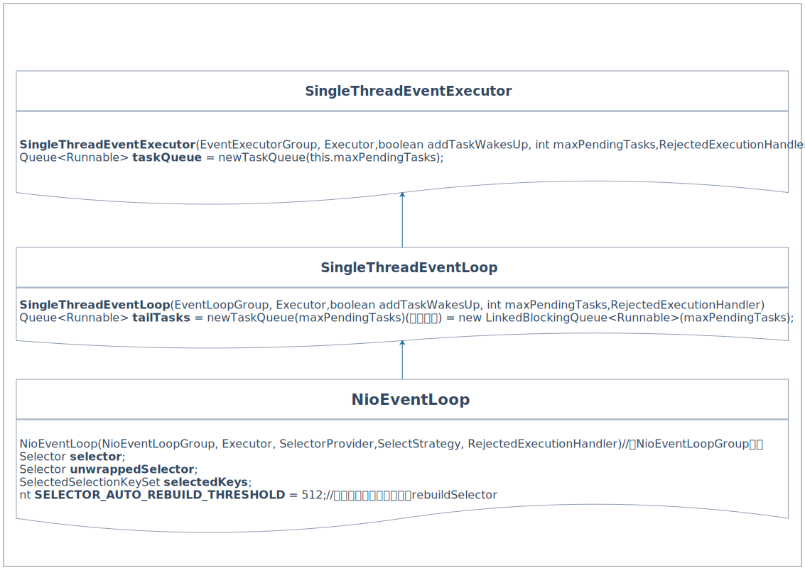
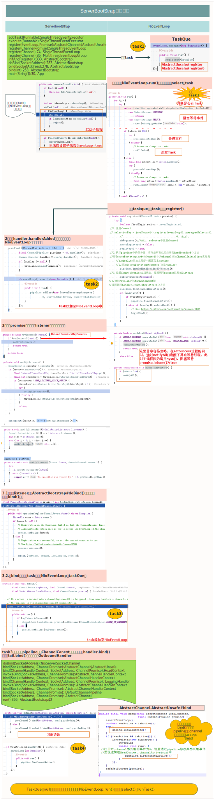
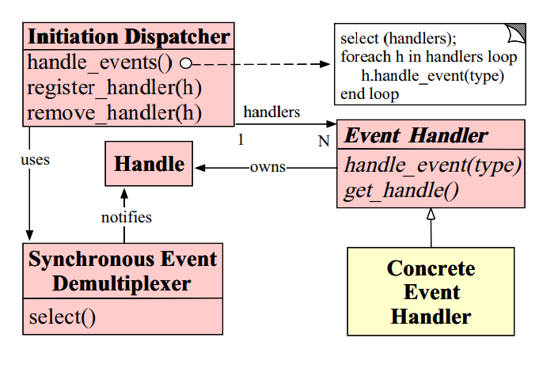
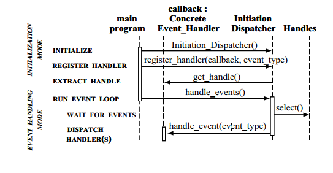
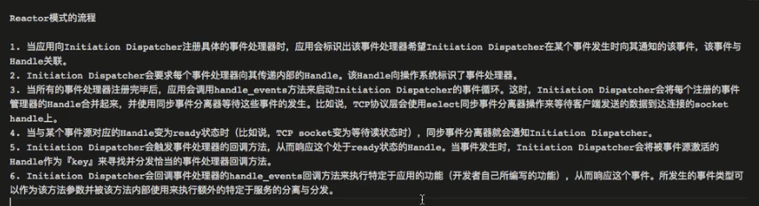

# 总结

## 线程类继承图



## NioEventLoopGroup



### 理解：

1. `NioEventLoopGroup`：可以看做是线程池，封装了最重要的对象**NioEventLoop**
2. `EventExecutorChooserFactory`：可以看做线程选择器。**NioEventLoopGroup**通过`chooser.next()`选择是哪个 `NioEventLoop` 执行工作，chooser 内部通过数组保存Executor[]，通过下标运算得到是数组第几个来执行程序。根据Executor[]数组是否是2的对数，区分为 `PowerOfTwoEventExecutorChooser` 和 `GenericEventExecutorChooser`
3. `DefaultThreadFactory`：线程工厂，通过`newThread()` 创建新的线程
4. `Executor`: 执行器，通过`execute(Runnable command)`使用线程工厂创建的线程执行`Runnable`任务
5. `NioEventLoop`：真正工作的线程实例，后续在做分析

### 主要方法

```java
//NioEventLoopGroup
EventLoop newChild(Executor executor, Object... args);//创建 EventLoop 
void rebuildSelectors() ; //调用EventLoop.rebuildSelector(),处理jdk epoll空轮询
//MultithreadEventLoopGroup
EventLoop next();//通过chooser返回下一个NioEventLoop
public ChannelFuture register(Channel channel) { //注册通道
    return next().register(channel);
}
//MultithreadEventExecutorGroup
Future<?> shutdownGracefully(long quietPeriod, long timeout, TimeUnit unit);//优雅关闭NioEventLoop
    
```


## NioEventLoop

### 初始化



### 理解

1. 

### Task任务执行流程



> 第一次注册：
>
> 1. NioEventLoop未与线程绑定，执行startThread，调用NioEventLoop中的executor创建新的线程执行NioEventLoop中的Run()方法，此时NioEventLoop.thread属性与新创新的线程绑定
> 2.  SingleThreadEventExecutor#execute(Runnable)只是将任务添加至Queue队列中
> 3. 每次都会判断线程是否启动
>
> register()，注册是感兴趣的时间为0，表示对什么事件都不感兴趣
>
> 1. 第二个参数传入的是0，表示此时将服务端channel注册到多路复用器上，服务端chennel感兴趣的事件标识符是0，即此时对任何事件都不感兴趣。（真正开始对接收事件感兴趣是在服务端channel监听端口之后）
> 2. 注册后完成，listener传播channelactive事件，修改其感兴趣的事件类型
>
> ```java
> // DefaultChannelPipeline.fireChannelActive()
> @Override
> public final ChannelPipeline fireChannelActive() {
>     // 依旧是从 head 节点开始传播
>     AbstractChannelHandlerContext.invokeChannelActive(head);
>     return this;
> }
> 
> // AbstractChannelHandlerContext.invokeChannelActive(next)
> static void invokeChannelActive(final AbstractChannelHandlerContext next) {
>     EventExecutor executor = next.executor();
>     if (executor.inEventLoop()) {
>         next.invokeChannelActive();
>     } else {
>         executor.execute(new Runnable() {
>             @Override
>             public void run() {
>                 next.invokeChannelActive();
>             }
>         });
>     }
> }
> 
> // AbstractChannelHandlerContext.invokeChannelActive()
> private void invokeChannelActive() {
>     if (invokeHandler()) {
>         try {
>             // head 节点的 handler() 返回的是 this
>             ((ChannelInboundHandler) handler()).channelActive(this);
>         } catch (Throwable t) {
>             notifyHandlerException(t);
>         }
>     } else {
>         fireChannelActive();
>     }
> }
> 
> // HeadContext.channelActive(ctx)
> @Override
> public void channelActive(ChannelHandlerContext ctx) throws Exception {
>     // 这里是将事件传递到下一个 ChannelInboundHandler，可以跟踪下看看是不是跟之前 ChannelRegistered 的传播有什么不一样
>     // 多了个之前添加的 ServerBootstrapAcceptor，虽然它并没有重写 channelActive()，所以这里只是通过它简单的往下传递而已
>     ctx.fireChannelActive();
> 
>     // 下面来看看这行代码背后做了哪些工作
>     readIfIsAutoRead();
> }
> 
> // HeadContext.readIfIsAutoRead()
> private void readIfIsAutoRead() {
>     // isAutoRead() 方法默认就返回 true
>     if (channel.config().isAutoRead()) {
>         channel.read();
>     }
> }
> 
> // AbstractChannel.read()
> @Override
> public Channel read() {
>     pipeline.read();
>     return this;
> }
> 
> // DefaultChannelPipeline.read()
> @Override
> public final ChannelPipeline read() {
>     // tail 节点的 read() 继承自 AbstractChannelHandlerContext
>     tail.read();
>     return this;
> }
> 
> // AbstractChannelHandlerContext.read()
> @Override
> public ChannelHandlerContext read() {
>     // 从 tail 节点往前查找 ChannelOutboundHandler，直到 head 节点
>     final AbstractChannelHandlerContext next = findContextOutbound();
>     EventExecutor executor = next.executor();
>     if (executor.inEventLoop()) {
>         // 我们是在 NioEventLoop 线程中执行的，所以直接调用 invokeRead() 方法
>         next.invokeRead();
>     } else {
>         Runnable task = next.invokeReadTask;
>         if (task == null) {
>             next.invokeReadTask = task = new Runnable() {
>                 @Override
>                 public void run() {
>                     next.invokeRead();
>                 }
>             };
>         }
>         executor.execute(task);
>     }
> 
>     return this;
> }
> 
> // AbstractChannelHandlerContext.invokeRead()
> private void invokeRead() {
>     if (invokeHandler()) {
>         try {
>             // head 节点的 handler() 方法返回 this，所以最终调用 HeadContext.read(ctx)
>             ((ChannelOutboundHandler) handler()).read(this);
>         } catch (Throwable t) {
>             notifyHandlerException(t);
>         }
>     } else {
>         read();
>     }
> }
> 
> // HeadContext.read(ctx)
> @Override
> public void read(ChannelHandlerContext ctx) {
>     unsafe.beginRead();
> }
> 
> // AbstractUnsafe.beginRead()
> @Override
> public final void beginRead() {
>     assertEventLoop();
> 
>     if (!isActive()) {
>         return;
>     }
> 
>     try {
>         // 最终调用 AbstractNioChannel.doBeginRead()
>         doBeginRead();
>     } catch (final Exception e) {
>         invokeLater(new Runnable() {
>             @Override
>             public void run() {
>                 pipeline.fireExceptionCaught(e);
>             }
>         });
>         close(voidPromise());
>     }
> }
> 
> // AbstractNioChannel.doBeginRead()
> @Override
> protected void doBeginRead() throws Exception {
>     // Channel.read() or ChannelHandlerContext.read() was called
>     final SelectionKey selectionKey = this.selectionKey;
>     if (!selectionKey.isValid()) {
>         return;
>     }
> 
>     readPending = true;
> 
>     // 我们之前把 channel 注册到 selector 的时候，注册的 ops 为 0，
>     // 这里我们通过 selectionKey.interestOps 方法将其修改为 SelectionKey.OP_ACCEPT，以便用来监听客户端的连接
>     final int interestOps = selectionKey.interestOps();
>     if ((interestOps & readInterestOp) == 0) {
>         selectionKey.interestOps(interestOps | readInterestOp);
>     }
> }
> ```
>
> 
>
> 资源网站
>
> 1. [netty-Future、Promise和Listener源码分析](https://blog.csdn.net/mycs2012/article/details/91358625)
> 2. [挺好的博客,解答了为啥register时是0](https://jimmy2angel.github.io/categories/)
> 3. [官方API文旦](https://netty.io/4.1/api/index.html)
> 4. [Netty 系列之 Netty 线程模型](https://www.infoq.cn/article/netty-threading-model)
> 5. [外文select分析，不明觉厉](https://pymotw.com/2/select/#module-select)
> 6. [epoll详解](https://blog.csdn.net/xiajun07061225/article/details/9250579)

> 


### 重要方法

#### 其余

```java
//1.NioEventLoop
/**
    1.优化jdk的selector，主要是自定义Set<>继承类SelectedSelectionKeySet，
    替换原来 selector中selectedKeys 以及publicSelectedKeys的类型
    2.SelectedSelectionKeySet selectedKeys保存了seletor中 selectedKeys的引用，
    也就是如果使用了优化后selector，那么调用selector.select()后NioEventLoop中就可以直接得到这些值，
    这对 NioEventLoop#processSelectedKeys(),方法判断有影响
**/
private SelectorTuple openSelector() ;
/**
	注册channel到selector中，标准的jdk实现，即
	channel.register(selector, interestOps, task);
	但改方法好像没有使用，一般使用的是
	父类中SingleThreadEventLoop#register(io.netty.channel.Channel)
**/
public void register(final SelectableChannel ch, final int interestOps, final NioTask<?> task);
/**
@see 
	当空轮询到达一定次数后，重新创建新的selector，此时需要把旧的selector中注册的channel
	及其感兴趣的事件复制到新的channel中
**/
public void rebuildSelector() ;
/**
  判断队列是否为空Queue<Runable>
  SingleThreadEventExecutor#taskQueue
  SingleThreadEventLoop#tailTasks
  区别：
**/
//SingleThreadEventLoop
protected boolean hasTasks() {
    return super.hasTasks() || !tailTasks.isEmpty();
}
//父类SingleThreadEventExecutor
protected boolean hasTasks() {
    assert inEventLoop();
    return !taskQueue.isEmpty();
}

```

**理解：**

1. `SelectedSelectionKeySet`实现set接口，写操作`add()`是O(1)的时间复杂度，而且读操作都是循环遍历，所以没有使用Hashset的实现

#### select(Boolean)

```java
/**
 1.run()方法中被调用select(wakenUp.getAndSet(false));
 2.封装了jdk中的selector.selectNow(),select(timeoutMillis)
 3.即通过一定的算法切换selectNow()、select(timeOutmimllis)、退出select()执行定时任务
 4.warkUp的值（true/false）决定是阻塞执行select操作，还是退出select()
 5.一般退出该循环前都会执行一次非阻塞的selectNow()操作
 理解：
 select(boolean)需平衡：定时任务、新任务、selectNow()、select(timeOut)几种运行方式。
 当有新任务、warkup为true、到时间执行定时任务、有新的时间产生，都退出当前select操作，
 否则一直执行当前循环，每次select(0.5)
**/
private void select(boolean oldWakenUp){
            Selector selector = this.selector;
        try {
            int selectCnt = 0;
            long currentTimeNanos = System.nanoTime();
            //delayNanos(),下个定时任务启动距离现在的剩余时间,
            //若没任务则，默认为1000 000 000
            long selectDeadLineNanos = currentTimeNanos + delayNanos(currentTimeNanos);
            //我的理解是for循环除了 空轮询会执行多次。
            //其余都是执行一次就退出,包括select()无事件返回
            for (;;) {
                long timeoutMillis = (selectDeadLineNanos - currentTimeNanos + 500000L) / 1000000L;
                //如果下个定时任务剩余时间已经超时足5毫秒，则执行非阻塞selectNow()返回执行定时任务
                //selectCnt，控制是否已经执行过selectNow
               //currentTimeNanos每次循环都会更新，所以第二次循环其实就跳出当前循环了。
               //只有当空轮询时，即select(timeout)没有事件产生也返回时，才会多次执行。
                //这里由下方rebuildSelector()
                if (timeoutMillis <= 0) {
                    if (selectCnt == 0) {
                        selector.selectNow();
                        selectCnt = 1;
                    }
                    break;
                }
                //先判断是否被手动唤醒wakeUp为true
                //或者添加了新的task
                //如是调用非阻塞的selectNow()
                //这个判断是为了在当前循环的过程中，可以退出当前循环。
                if (hasTasks() && wakenUp.compareAndSet(false, true)) {
                    selector.selectNow();
                    selectCnt = 1;
                    break;
                }
                //select(timeoutMillis),阻塞直到：有事件产生/中断/超时/wakeup()调用
                //当没有任务时，这里的timeout应该为1000.5毫秒
                int selectedKeys = selector.select(timeoutMillis);
                selectCnt ++;

                if (selectedKeys != 0 || oldWakenUp || wakenUp.get() || hasTasks() || hasScheduledTasks()) {
                    // - Selected something,waken up by user, or the task queue has a pending task.- a scheduled task is ready for processing
                    break;
                }
                if (Thread.interrupted()) {
                    //执行过程中线程被中断了
                    // See https://github.com/netty/netty/issues/2426
                    selectCnt = 1;
                    break;
                }
                long time = System.nanoTime();
                if (time - TimeUnit.MILLISECONDS.toNanos(timeoutMillis) >= currentTimeNanos) {
                    //select(timeoutMillis),等待超时无结果返回
                    selectCnt = 1;
                } else if (SELECTOR_AUTO_REBUILD_THRESHOLD > 0 &&
                        selectCnt >= SELECTOR_AUTO_REBUILD_THRESHOLD) {
                    //通过超时以及空轮询次数，判断是否重新创建selector
                    rebuildSelector();
                    selector = this.selector;
                    // Select again to populate selectedKeys.
                    selector.selectNow();
                    selectCnt = 1;
                    break;
                }
                currentTimeNanos = time;
            }
        }
}

```

#### processSelectedKey(SelectionKey,AbstractNioChannel)

```java
private void processSelectedKeys() {
    //如果使用了优化后的selector，NioEventLoop会直接保存selector.select()后的selectedKey
    //详看openSelector()方法 
    //所以对应使用优化后的处理器processSelectedKeysOptimized()
    //否则使用普通的
    if (selectedKeys != null) {
        processSelectedKeysOptimized();
    } else {
        processSelectedKeysPlain(selector.selectedKeys());
    }
}
private void processSelectedKeysOptimized() {
    for (int i = 0; i < selectedKeys.size; ++i) {
        final SelectionKey k = selectedKeys.keys[i];
        // See https://github.com/netty/netty/issues/2363
        //避免channel关闭后，selectedKeys没有被gc
        selectedKeys.keys[i] = null;

        final Object a = k.attachment();
		//判断SelectedKey的 attachment 类型选择不同的处理器
        //attachment是在注册channel是绑定的
        //jdk AbstractSelectableChannel#register(Selector sel, int ops,Object attachment)
        if (a instanceof AbstractNioChannel) {
            processSelectedKey(k, (AbstractNioChannel) a);
        } else {
            @SuppressWarnings("unchecked")
            NioTask<SelectableChannel> task = (NioTask<SelectableChannel>) a;
            processSelectedKey(k, task);
        }
        //needsToSelectAgain与 cancel(SelectionKey key)  有关
        //超过256则为true
        if (needsToSelectAgain) {
            // See https://github.com/netty/netty/issues/2363
            //置所有selectedKeys为null
            selectedKeys.reset(i + 1);
            selectAgain();
            i = -1;
        }
    }
}
/**
	1.根据select()返回的事件，执行相应的操作。避开一下JDK的BUG
	2.&运算，只有1&1才为1
**/
public abstract class SelectionKey {
	public static final int OP_ACCEPT = 1 << 4;
    public static final int OP_CONNECT = 1 << 3;
    public static final int OP_WRITE = 1 << 2;
    public static final int OP_READ = 1 << 0;
}
private void processSelectedKey(SelectionKey k, AbstractNioChannel ch){
    int readyOps = k.readyOps();
    //准备好的事件是connect时，必须调用finishConnect()
    //否则可能抛出throw a NotYetConnectedException异常
    if ((readyOps & SelectionKey.OP_CONNECT) != 0) {
        //Bug See https://github.com/netty/netty/issues/924
        int ops = k.interestOps();
        ops &= ~SelectionKey.OP_CONNECT; //0
        k.interestOps(ops);
        unsafe.finishConnect();
    }
    //准备好的事件是写事件时，强制flush
    if ((readyOps & SelectionKey.OP_WRITE) != 0) {
        ch.unsafe().forceFlush();
    }
    //准备好的事件是读或者接收连接时，强制读
    //readyOps为0则为为jdk bug，可能导致spin loop
    if ((readyOps & (SelectionKey.OP_READ | SelectionKey.OP_ACCEPT)) != 0 || 
        readyOps == 0) {
        unsafe.read();
    }
}
```


#### run()

```java
protected void run() {
    for (;;) {
        try {

            switch (selectStrategy.calculateStrategy(selectNowSupplier, hasTasks())) {
                    //这里有点 奇怪，好像calculateStrategy()返回值只能为0，key的数量，-1
                case SelectStrategy.CONTINUE://-2
                    continue;
                    //执行select(Boolean)操作，没有任务，且selectNow()没事件
                case SelectStrategy.SELECT://-1
                    select(wakenUp.getAndSet(false));
                    if (wakenUp.get()) {
                        selector.wakeup();
                    }
                default:
            }
            /**     1.ioRatio 控制执行processSelectedKeys的时间以及Task的时间比例
                	2.100，则按顺序处理了 selectedKey 后，再执行task
                	3.否则，处理Task的时间为处理selectedKey相对应的ioRatio比例的时间
                **/
            cancelledKeys = 0;
            needsToSelectAgain = false;
            final int ioRatio = this.ioRatio;
            if (ioRatio == 100) {
                try {
                    processSelectedKeys();
                } finally {
                    // Ensure we always run tasks.
                    runAllTasks();
                }
            } else {
                final long ioStartTime = System.nanoTime();
                try {
                    processSelectedKeys();
                } finally {
                    // Ensure we always run tasks.
                    final long ioTime = System.nanoTime() - ioStartTime;
                    runAllTasks(ioTime * (100 - ioRatio) / ioRatio);
                }
            }
        }
    }
}
```

理解：

run方法：

1. 通过`hasTask()`判断有没有代执行的任务，如有执行非阻塞的selectNow()，如否执行select(boolean)
2. `select(boolean)`可以理解为执行`select(timeout)`，阻塞一定时间知道满足条件（事件/超时/中断/wakeup）
3. `select(boolean)`主要还有处理epoll的空轮询问题
4. **switch**判断完后，处理`processSelectedKeys()`处理相应产生的事件，以及`runAllTasks()`处理等待的任务

启动后执行任务顺序：

```java
io.netty.channel.AbstractChannel.AbstractUnsafe#register0;
	//io.netty.channel.AbstractChannel.AbstractUnsafe#register
channel.bind(localAddress, promise).addListener(ChannelFutureListener.CLOSE_ON_FAILURE);
  // io.netty.bootstrap.AbstractBootstrap#doBind0
```


####  register(Channel)

```java
//io.netty.channel.SingleThreadEventLoop#register(io.netty.channel.ChannelPromise)
public ChannelFuture register(Channel channel) {
    return register(new DefaultChannelPromise(channel, this));
}
public ChannelFuture register(final ChannelPromise promise) {
    ObjectUtil.checkNotNull(promise, "promise");
    promise.channel().unsafe().register(this, promise);
    return promise;
}
//io.netty.channel.AbstractChannel.AbstractUnsafe#register
public final void register(EventLoop eventLoop, final ChannelPromise promise) {
    //channel绑定至NioeventLoop中
    AbstractChannel.this.eventLoop = eventLoop;
    //判断Thread.currentThread == SingleThreadEventExecutor.#thread
    //即NioEventLoop中绑定的线程是否是当前线程
    //第一次注册的时候，Thread为null
    //需要SingleThreadEventExecutor.doStartThread()中，
    //会调用 executor.execute(new Runnable())方法，
    //这个方法会创建一个新的线程，把线程绑定至NioEventLoop的thread属性中
    if (eventLoop.inEventLoop()) {
        register0(promise);
    } else {
        try {
            eventLoop.execute(new Runnable() {
                @Override
                public void run() {
                    register0(promise);
                }
            });
        } catch (Throwable t) {
            logger.warn(
                "Force-closing a channel whose registration task was not accepted by an event loop: {}",
                AbstractChannel.this, t);
            closeForcibly();
            closeFuture.setClosed();
            safeSetFailure(promise, t);
        }
    }
}
```

#### SingleThreadEventExecutor父类

##### execute(Runnable task)

```java
public void execute(Runnable task) {
    if (task == null) {
        throw new NullPointerException("task");
    }

    boolean inEventLoop = inEventLoop();
    addTask(task); //将任务添加至 taskQueue.offer(task)，超过数量则reject抛异常
    if (!inEventLoop) {//如果当前线程不是NioEventLoop中绑定的线程，说明线程刚刚绑定至EventLoop中
        startThread();//需要启动该线程
        if (isShutdown() && removeTask(task)) {
            reject();
        }
    }

    if (!addTaskWakesUp && wakesUpForTask(task)) {
        wakeup(inEventLoop);
    }
}
/**
1. ST_NOT_STARTED为1，ST_STARTED为2
2.STATE_UPDATER.compareAndSet()实际就是修改state为2
3.确保NioEventLoop中thread只与一个线程绑定
**/
private void startThread() {
    if (state == ST_NOT_STARTED) {
        if (STATE_UPDATER.compareAndSet(this, ST_NOT_STARTED, ST_STARTED)) {
            try {
                doStartThread();
            } catch (Throwable cause) {
                STATE_UPDATER.set(this, ST_NOT_STARTED);
                PlatformDependent.throwException(cause);
            }
        }
    }
}
//删除日志记录相关代码
private void doStartThread() {
    assert thread == null;
    //这个executor是真正创建线程执行任务的
    executor.execute(new Runnable() {
        @Override
        public void run() {
            thread = Thread.currentThread();//绑定线程至NioEventLoop中
            boolean success = false;
            updateLastExecutionTime();
            try {
                //调用子类NioEventLoop的run方法，即上文所分析的方法
                SingleThreadEventExecutor.this.run();
                success = true;
            }finally {
                for (;;) {
                    int oldState = state;
                    if (oldState >= ST_SHUTTING_DOWN || STATE_UPDATER.compareAndSet(
                        SingleThreadEventExecutor.this, oldState, ST_SHUTTING_DOWN)) {
                        break;
                    }
                }
                try {
                    // Run all remaining tasks and shutdown hooks.
                    for (;;) {
                        if (confirmShutdown()) {
                            break;
                        }
                    }
                } finally {
                    try {
                        cleanup();
                    } finally {
                        STATE_UPDATER.set(SingleThreadEventExecutor.this, ST_TERMINATED);
                        threadLock.release();
                        terminationFuture.setSuccess(null);
                    }
                }
            }
        }
    });
}
```

理解：

1. 非常不理解这里的`thread = Thread.currentThread();//绑定线程至NioEventLoop中`，已经理解了。
2. 这里`executor.execute(new Runnable())`中`executor`是NioEventLoopGroup初始化绑定的线程

```java
//io.netty.util.concurrent.MultithreadEventExecutorGroup初始化 
executor = new ThreadPerTaskExecutor(newDefaultThreadFactory());
//会创建一个新的线程执行任务，这个任务就是NioEventLoop中的run方法
//处理task以及select
```

1. 执行`NioEventLoop.execute()`，实际是将任务添加至`Queue<Runable>`队列中。做两个判断是否开启新的线程。
   1. `Thread.currentThread() != SingleThreadEventExecutor.this.thread`
   2. `SingleThreadEventExecutor#state != 2`
2. 说下几种可能性：

> ```java
> NioEventLoopGroup bossGroup = new NioEventLoopGroup(1);//注意这里为1
> ChannelFuture future = serverBootstrap.bind(8001).sync();
> ChannelFuture future1 = serverBootstrap.bind(8002).sync();
> ```
>
> 1. 第一次注册：**main线程**一直执行到 `register(Channel)`这里，然后将当前`NioEventLoop`绑定至`channel`属性中，判断 `inEventLoop()`，此时`Thread.currentThread()为main ` `SingleThreadEventExecutor.this.thread`则为空。此时**state**等于1，则启动新线程，并绑定至`NioEventLoop`中，线程执行`NioEventLoop中的run()`
> 2. `sync()`会阻塞直到`isDone()`返回true
> 3. 第二次注册：**main线程**也是执行到 `register(Channel)`这里，但此时因为bossGroup指定了**线程数为1**，所以拿到同样的`NioeventLoop` ，那么`Thread.currentThread()为main`，`SingleThreadEventExecutor.this.thread`为上次绑定的线程，**而state为2**，所以不启动新线程。只能作为**task任务**添加至 **NioEventLoop** 中


```java
    protected boolean runAllTasks(long timeoutNanos) {
        fetchFromScheduledTaskQueue();
        Runnable task = pollTask();
        if (task == null) {
            afterRunningAllTasks();
            return false;
        }

        final long deadline = ScheduledFutureTask.nanoTime() + timeoutNanos;
        long runTasks = 0;
        long lastExecutionTime;
        for (;;) {
            safeExecute(task);

            runTasks ++;

            // Check timeout every 64 tasks because nanoTime() is relatively expensive.
            // XXX: Hard-coded value - will make it configurable if it is really a problem.
            //由于nanoTime()损耗性能，所以没执行64次任务后才会判断是否超过运行执行任务的时间
            //允许执行任务的时间意思是selector.select()与执行任务之间时间的比值
            if ((runTasks & 0x3F) == 0) {
                lastExecutionTime = ScheduledFutureTask.nanoTime();
                if (lastExecutionTime >= deadline) {
                    break;
                }
            }

            task = pollTask();
            if (task == null) {
                lastExecutionTime = ScheduledFutureTask.nanoTime();
                break;
            }
        }

        afterRunningAllTasks();
        this.lastExecutionTime = lastExecutionTime;
        return true;
    }
```


## ServerBootStrap

父类

```java
final ChannelFuture initAndRegister() {
    Channel channel = null;
    try {
        channel = channelFactory.newChannel();
        init(channel);
    } catch (Throwable t) {
        if (channel != null) {
            channel.unsafe().closeForcibly();
            return new DefaultChannelPromise(channel, 
                                             GlobalEventExecutor.INSTANCE).setFailure(t);
        }
        return new DefaultChannelPromise(new FailedChannel(), 
                                         GlobalEventExecutor.INSTANCE).setFailure(t);
    }
    //将channel绑定至NioEventLoop（线程）中，
    //并调用
    ChannelFuture regFuture = config().group().register(channel);
    if (regFuture.cause() != null) {
        if (channel.isRegistered()) {
            channel.close();
        } else {
            channel.unsafe().closeForcibly();
        }
    }
    return regFuture;
}
```


## NioServerSocketChannel

### AbstractChannel.AbstractUnsafe#register0

```java
//ChannelFuture regFuture = config().group().register(channel);中被调用
//NioEventLoop的一个task任务执行
private void register0(ChannelPromise promise) {
    try {
        boolean firstRegistration = neverRegistered;
 //1.注册channel
 // selectionKey = javaChannel().register(eventLoop().unwrappedSelector(),
        //                                      0, this);
        doRegister();//如上，selector中注册channel
        neverRegistered = false;
        registered = true;
 //2.执行pipeline中的任务链，实际是所有已经注册的handlerAdded()方法
 //即ServerBootstrap.init(channel)中为channel添加ChannelInitializer实现类
     //1.pipeline添加主程序中配置的主handler
     //2.添加ServerBootstrapAcceptor(也是handler)
        pipeline.invokeHandlerAddedIfNeeded();
 //3.设置ChannelPromise完成状态，进而调用promise注册的listener
        //唤醒等待线程
        safeSetSuccess(promise);
//4.调用Pipeline中ChannelContext链
//进而调用handler.channelRegistered()方法
        pipeline.fireChannelRegistered();
        if (isActive()) {
            if (firstRegistration) {
                pipeline.fireChannelActive();
            } else if (config().isAutoRead()) {
                // See https://github.com/netty/netty/issues/4805
                beginRead();
            }
        }
    }
}
//###########AbstractNioChannel#doRegister###########//
protected void doRegister() throws Exception {
        boolean selected = false;
        for (;;) {
            try {
                selectionKey = javaChannel().register(eventLoop().unwrappedSelector(), 0, this);
                return;
            } catch (CancelledKeyException e) {
                if (!selected) {
                    eventLoop().selectNow();
                    selected = true;
                } else {
                    throw e;
                }
            }
        }
    }


```

## Unsafe


#### read()

```java
public void read() {
    assert eventLoop().inEventLoop();
    final ChannelConfig config = config();
    final ChannelPipeline pipeline = pipeline();
    final RecvByteBufAllocator.Handle allocHandle = unsafe().recvBufAllocHandle();
    allocHandle.reset(config);

    boolean closed = false;
    Throwable exception = null;
    try {
        try {
            do {
                int localRead = doReadMessages(readBuf);
                if (localRead == 0) {
                    break;
                }
                if (localRead < 0) {
                    closed = true;
                    break;
                }

                allocHandle.incMessagesRead(localRead);
            } while (allocHandle.continueReading());
        } catch (Throwable t) {
            exception = t;
        }

        int size = readBuf.size();
        for (int i = 0; i < size; i ++) {
            readPending = false;
            pipeline.fireChannelRead(readBuf.get(i));
        }
        readBuf.clear();
        allocHandle.readComplete();
        pipeline.fireChannelReadComplete();

        if (exception != null) {
            closed = closeOnReadError(exception);

            pipeline.fireExceptionCaught(exception);
        }

        if (closed) {
            inputShutdown = true;
            if (isOpen()) {
                close(voidPromise());
            }
        }
    } finally {
        // Check if there is a readPending which was not processed yet.
        // This could be for two reasons:
        // * The user called Channel.read() or ChannelHandlerContext.read() in channelRead(...) method
        // * The user called Channel.read() or ChannelHandlerContext.read() in channelReadComplete(...) method
        //
        // See https://github.com/netty/netty/issues/2254
        if (!readPending && !config.isAutoRead()) {
            removeReadOp();
        }
    }
}
```


## ChannelPipeline

### ChannelPipeline#addLast(EventExecutorGroup,ChannelHandler)

EventExecutorGroup在没有指定的情况下为null

```java
    public final ChannelPipeline addLast(EventExecutorGroup group, String name, ChannelHandler handler) {
        final AbstractChannelHandlerContext newCtx;
        synchronized (this) {
            checkMultiplicity(handler);

            newCtx = newContext(group, filterName(name, handler), handler);

            addLast0(newCtx);
            //在channel.register()中会被设置为true
            //即channel未与NioEventLoop绑定时，为false
            //只能把任务添加至PendingHandlerCallback task 任务链中
            //未注册前的handler的handlerAdded()方法会在初始时被调用
            //AbstractUnsafe#register0()
            //pipeline.invokeHandlerAddedIfNeeded();
            //最后也是作为task任务放在NioEventLoop处理
            if (!registered) {
                newCtx.setAddPending();
                callHandlerCallbackLater(newCtx, true);
                return this;
            }
            //当完成注册后，NioEventLoop已经与线程绑定，
            //此时将的调用ctx.handler().handlerAdded(ctx);作为NioEventLoop的任务执行
            EventExecutor executor = newCtx.executor();
            if (!executor.inEventLoop()) {
                newCtx.setAddPending();
                executor.execute(new Runnable() {
                    @Override
                    public void run() {
                        callHandlerAdded0(newCtx);//ctx.handler().handlerAdded(ctx);
                    }
                });
                return this;
            }
        }
        callHandlerAdded0(newCtx);
        return this;
    }
```


## ChannelContext


 ## ServerBootstrapAcceptor


## BufferBuf

1. 关于BufferBuf的引用计数
   1. [官方文档Reference counted objects](https://netty.io/wiki/reference-counted-objects.html)
   2. [stackOverflow关于reference-count的讨论](https://stackoverflow.com/questions/28647048/why-do-we-need-to-manually-handle-reference-counting-for-netty-bytebuf-if-jvm-gc#)
   3. 
2. 


## channelHandler


## Netty处理流程总结

> 1. NioEventLoop#run()：在runAllTask()与select()之间切换
> 2. NioEventLoop#processSelectedKeysOptimized ：根据不同的事件，执行不同响应
> 3. read/acctept事件
>    1. AbstractNioMessageChannel.NioMessageUnsafe#read()
> 4. 

## 线程模型

四组线程：

1. 主线程阻塞
2. mainReactor线程（bossgroup）：接收accept时间
3. subReactor线程（workergroup）:IO线程处理read/wirte事件
4. 业务线程：当处理的业务逻辑很耗时就需要，自定义线程池，否则阻塞Io线程

**ChannelPipeline中的文档说明**

```java
Building a pipeline
A user is supposed to have one or more ChannelHandlers in a pipeline to receive I/O events (e.g. read) and to request I/O operations (e.g. write and close). For example, a typical server will have the following handlers in each channel's pipeline, but your mileage may vary depending on the complexity and characteristics of the protocol and business logic:

Protocol Decoder - translates binary data (e.g. ByteBuf) into a Java object.
Protocol Encoder - translates a Java object into binary data.
Business Logic Handler - performs the actual business logic (e.g. database access).
and it could be represented as shown in the following example:
 static final EventExecutorGroup group = new DefaultEventExecutorGroup(16);
 ...

 ChannelPipeline pipeline = ch.pipeline();

 pipeline.addLast("decoder", new MyProtocolDecoder());
 pipeline.addLast("encoder", new MyProtocolEncoder());

 // Tell the pipeline to run MyBusinessLogicHandler's event handler methods
 // in a different thread than an I/O thread so that the I/O thread is not blocked by
 // a time-consuming task.
 // If your business logic is fully asynchronous or finished very quickly, you don't
 // need to specify a group.
 pipeline.addLast(group, "handler", new MyBusinessLogicHandler());
```


## java 和netty epoll实现

Java NIO根据操作系统不同， 针对nio中的Selector有不同的实现：

- **macosx**: [KQueueSelectorProvider](http://hg.openjdk.java.net/icedtea/jdk7/jdk/file/tip/src/macosx/classes/sun/nio/ch/DefaultSelectorProvider.java)
- **solaris**: [DevPollSelectorProvider](http://hg.openjdk.java.net/icedtea/jdk7/jdk/file/tip/src/solaris/classes/sun/nio/ch/DefaultSelectorProvider.java)
- **Linux**: [EPollSelectorProvider (Linux kernels >= 2.6)](http://hg.openjdk.java.net/icedtea/jdk7/jdk/file/tip/src/solaris/classes/sun/nio/ch/DefaultSelectorProvider.java)或 [PollSelectorProvider](http://hg.openjdk.java.net/icedtea/jdk7/jdk/file/tip/src/solaris/classes/sun/nio/ch/DefaultSelectorProvider.java)
- **windows**: [WindowsSelectorProvider](http://hg.openjdk.java.net/icedtea/jdk7/jdk/file/tip/src/windows/classes/sun/nio/ch/DefaultSelectorProvider.java)

所以毋须特别指定， Oracle jdk会自动选择合适的Selector。 如果想设置特定的Selector，可以属性：

```
-Djava.nio.channels.spi.SelectorProvider=sun.nio.ch.EPollSelectorProvider
```


### Netty

自4.0.16起, Netty为Linux通过JNI的方式提供了native socket transport.
使用native socket transport很简单，只需将相应的类替换即可。

> - NioEventLoopGroup → EpollEventLoopGroup
> - NioEventLoop → EpollEventLoop
> - NioServerSocketChannel → EpollServerSocketChannel
> - NioSocketChannel → EpollSocketChannel

如果使用maven， 加入相应的网依赖：

```
<dependency>
  <groupId>io.netty</groupId>
  <artifactId>netty-transport-native-epoll</artifactId>
  <version>${project.version}</version>
  <classifier>${os.detected.classifier}</classifer>
</dependency>
```

既然如上面所说， Oracle JDK在Linux已经默认使用epoll方式， 为什么netty还要提供一个基于epoll的实现呢？
这是[stackoverflow](http://stackoverflow.com/questions/23465401/why-native-epoll-support-is-intoduced-in-netty)上的一个问题。 Netty的核心开发者 Norman Maurer这么说的：

> - Netty的 epoll transport使用 epoll edge-triggered 而 java的 nio 使用 level-triggered.
> - 另外netty epoll transport 暴露了更多的nio没有的配置参数， 如 TCP_CORK, SO_REUSEADDR等等


# netty 零基础到精通 张龙

## P38Nio堆外内存与零拷贝深入讲解

**DirectByteBuffer**

> `HeapByteBuffer`:使用堆上内存，内部维护一个Byte[]数组
>
> `DirectByteBuffer`: 除了使用堆上内存还，还是用到到堆外内存（native），或成内存缓存区
>
> * 使用Unsafe分配堆外内存，通过ByteBuffer接口定义的变量address访问内核缓存区
> * 比如HeapByteBuffer，一般IO设备——》内核态——》用户态（使用/加工）——》内核态——》IO设备
> * 而DirectByteBuffer通过address直接处理内核态，减少了一次拷贝，也称零拷贝
>
> ```java
> public abstract class Buffer {
> 	//只用于 DirectByteBuffer，放在这里是为了提高JNI调用速度
>     //一般如果一个变量只用于子类，那么就应该在子类定义这个变量
>     // Used only by direct buffers
>     // NOTE: hoisted here for speed in JNI GetDirectBufferAddress
>     long address;
> }    
> // DirectByteBuffer构造函数
> // 关注sun的方法
> DirectByteBuffer(int cap) {                   // package-private
> 
>         super(-1, 0, cap, cap);
>   		//sun.misc.VM
>         boolean pa = VM.isDirectMemoryPageAligned();
>         int ps = Bits.pageSize();
>         long size = Math.max(1L, (long)cap + (pa ? ps : 0));
>         Bits.reserveMemory(size, cap);
> 			
>         long base = 0;
>         try {
>             // sun.misc.Unsafe
>             base = unsafe.allocateMemory(size);
>         } catch (OutOfMemoryError x) {
>             Bits.unreserveMemory(size, cap);
>             throw x;
>         }
>         unsafe.setMemory(base, size, (byte) 0);
>         if (pa && (base % ps != 0)) {
>             // Round up to page boundary
>             address = base + ps - (base & (ps - 1));
>         } else {
>             address = base;
>         }
>         cleaner = Cleaner.create(this, new Deallocator(base, size, cap));
>         att = null;
>     }
> ```
>
> 创建 `unsafe` 类，`unsafe`类只能被jdk的类所加载，所以程序需要通过反射才能获得该对象
>
> ```java
> public Unsafe getUnsafe() throws ClassNotFoundException, NoSuchFieldException, IllegalAccessException {
>         Class<?> aClass = Class.forName("sun.misc.Unsafe");
>         Field theUnsafe = aClass.getDeclaredField("theUnsafe");
>         theUnsafe.setAccessible(true);
>         Unsafe unsafe = (Unsafe) theUnsafe.get(null);
>         return unsafe;
>     }
> ```
>
> 

## p39Scattering和Gathering

**ByteBuffer数组**

> 通过直接 `read` 和`wirte` ByteBuffer数组，可以将流自动切分至不同的ByteBuffer中，用于确定分类及长度的请求很有用
>
> ```java
> public static void main(String[] args) throws IOException {
>     ServerSocketChannel channel=ServerSocketChannel.open();
>     channel.socket().bind(new InetSocketAddress(8888));
>    //channel.bind(new InetSocketAddress(8888)); // 区别是啥
>     ByteBuffer[] bf= new ByteBuffer[3];
>     bf[0] = ByteBuffer.allocate(2);
>     bf[1] = ByteBuffer.allocate(3);
>     bf[2] = ByteBuffer.allocate(4);
>     SocketChannel socketChannel = channel.accept();
>     System.out.println("有连接进来"+socketChannel.getRemoteAddress());
>     int messageLength=9;
>     while (true){
>         //读取直到buf满
>         long readed=0;
>         while (readed <messageLength){
>             long read = socketChannel.read(bf);
>             readed += read;
>             Arrays.stream(bf).forEach(n-> 
>                                       System.out.println("position:"+
>                                                          n.position()+"-"
>                                                          +"limit:"+n.limit()));
>         }
>         //翻转
>         Arrays.stream(bf).forEach(n->n.flip());
>         //写到sockechannel中
>         socketChannel.write(bf);
>         //清空
>         Arrays.stream(bf).forEach(n->n.clear());
>     }
> }
> ```


## P40 Selector

Javadoc文档解读

> 1. `selector`通过`open`方法创建，也可以通过`SelectProvider#openSelectProvide()`方法创建自定义的`Selector`
> 2. 通过`SelectableChannel#register(Selector,int)`方法，注册一个`selector`，同时一个`selectionKey`也会同时添加至 `selector` 表示，selector维护三个selectionKey集合。**channel在selector中用key表示：**
>    - key set：代表当前selector注册的channel ,`keys()`方法返回
>    - selected-key：代表 selection 操作前 selector 感兴趣的key set中，被探测到可以有至少执行一个操作的key set集合，通过执行**selection操作**，将key添加至selected-key中（不可能直接添加至selected-key当中），但是只能通过调用set集合的remove方法移除。
>    - cancelle-key：已经取消（即不感兴趣）但是还没有注销的key set。关闭channel或者调用`selectionkey#cancel`方法,都会将key添加cancelled-key set当中。在下一次的selection操作中，会将这个channel注销，这时也会在key set中移除。
> 3. selection操作
>    - `select()、select(long)、selectNow()`，该方法阻塞
>    - selection操作分为三步：
>      - 移除并清库cancelled-key，并注销channel，
>      - 底层操作系统查询当前保留下来的channel（未被删除），更新准备好执行操作的channel：如果channel的key不在`selected-key`中，添加并修改其`ready-operation`为当前准备好的operation，**丢弃**之前存储的`ready-operation`信息；如果channel已经在`selected-key se`t中，更新其`ready-operation`，**保留**以前记录的`ready-operation`
>      - 如果第二步中任意key被添加至`cancelled-key`中，会执行第一步
>
> 

代码实例：

流程：

1. 创建selector
2. selector注册serversocketchannel，及相应的感兴趣的事件，此处为accept
3. 循环处理：调用`selector.select()`方法，根据返回的selectionKey进行相应的处理
   1. selectionKey对应的事件为accept，则对应的channel为serversChannel，则将accpet返回的socketchannel注册至selector中，该通道感兴趣的事件为read
   2. selectionKey对应的事件read，则对应的channel为socketchannel，则调用read方法读取值ByteBuffer中进行相应的处理。

```java
    public static void main(String[] args) throws IOException {
        int[] port=new int[5];
        port[0]=5000;
        port[1]=5001;
        port[2]=5002;
        port[3]=5003;
        port[4]=5004;
        Selector selector = Selector.open();

        Arrays.stream(port).forEach(n-> {
            try {
                ServerSocketChannel socketChannel = ServerSocketChannel.open();
                socketChannel.configureBlocking(false);
                socketChannel.socket().bind(new InetSocketAddress(n));
                socketChannel.register(selector, SelectionKey.OP_ACCEPT);//返回selectionKey
                System.out.println("监听端口:"+n);
            } catch (IOException e) {
                e.printStackTrace();
            }
        });
        while(true){
            int numbers = selector.select();
            System.out.println("准备就绪的channel数量："+numbers);
            Set<SelectionKey> selectionKeys = selector.selectedKeys();
            System.out.println("selectionKeys:"+selectionKeys);
            Iterator<SelectionKey> iterator = selectionKeys.iterator();

            while (iterator.hasNext()) {
                SelectionKey n = iterator.next();
                if (n.isAcceptable()) {
                    ServerSocketChannel channel = ((ServerSocketChannel) n.channel());
                    SocketChannel socketChannel = channel.accept();
                    socketChannel.configureBlocking(false);//channel都必须配置为非阻塞
                    socketChannel.register(selector, SelectionKey.OP_READ);
                    iterator.remove();
                    System.out.println("获取客户端连接"+socketChannel);
                }else if (n.isReadable()){
                    SocketChannel channel = ((SocketChannel) n.channel());
                    ByteBuffer byteBuffer = ByteBuffer.allocate(1024);
                    int byteRead=0;
                    while(true) {
                        byteBuffer.clear();
                        int read = channel.read(byteBuffer);
                        if (read <= 0) {
                            break;
                        }
                        byteBuffer.flip();
                        channel.write(byteBuffer);
                        byteRead += read;
                    }
                    System.out.println("读取"+byteRead+"来自于："+channel);
                    iterator.remove();
                }

            }
        }

    }
```


## P46 字符集编解码解析


## P55 ChannelFuture

1. **juc中Future的文档解读**

   > 1. Future代表着异步计算的结果。提供许多方法来检查处理是否完成、等待处理完成、获取处理结果
   > 2. 只能通过`get()`方法获取返回结果，会**阻塞**直到处理返回结果
   > 3. 通过调用`cancel()`方法去取消 cancelled处理
   > 4. 还有其余方法来判断任务是否正常完成还是取消掉了
   > 5. 如果希望使用Future有取消能力，但是没有一个有用的返回结果，那么就是使用Future<?>形式，意味着可以返回null
   > 6. `FutureTask<V>`实现了`runnable`和`future`接口

2. Netty中Future文档解读

   > 1. 继承JDL的Future，扩展了许多方法
   > 2. 比如添加listener，`addListener(GenericFtureLister)`。因为JDK中Future的计算结果必须通过`Future.get()`方法获取，但不知道什么知道什么调用。所以扩展了Listener，这样可以在计算结果完成后通过Lisener自动返回结果
   > 3. isSuccess()，避免了JDK中isDone()方法，并不知道是成功了还是抛异常了

3. Netty中ChannelFuture文档解读

   > 1. 所有Netty中的IO操作都是异步的，这意味着当IO请求将立即返回结果，但不保证Io操作已经完成。通过返回ChannelFuture让你获知Io操作的结果或者状态。
   >
   > 2. 一个channelFuture要么是完成的要么是未完成的（`completed or uncompleted`）。当IO操作开始时，就会立刻创建一个Future对象，这个future对象初始时不可能为成功、失败或取消，因为IO操作还没有完成。如果IO操作完成了（可能是成功、失败、取消），future都会标记为completed，并且还有更多的其他信息，比如失败的原因。特别注意失败和取消都会标记为completed。
   >
   >    对比成功、失败、取消的状态对比，也从这里可以知道为什么netty要扩展自己的Future接口。
   >
   >    - isDone()是JDK的
   >    - isSuccess()是Netty的
   >
   >    ```java
   >     *                                      +---------------------------+
   >     *                                      | Completed successfully    |
   >     *                                      +---------------------------+
   >     *                                 +---->      isDone() = true      |
   >     * +--------------------------+    |    |   isSuccess() = true      |
   >     * |        Uncompleted       |    |    +===========================+
   >     * +--------------------------+    |    | Completed with failure    |
   >     * |      isDone() = false    |    |    +---------------------------+
   >     * |   isSuccess() = false    |----+---->      isDone() = true      |
   >     * | isCancelled() = false    |    |    |       cause() = non-null  |
   >     * |       cause() = null     |    |    +===========================+
   >     * +--------------------------+    |    | Completed by cancellation |
   >     *                                 |    +---------------------------+
   >     *                                 +---->      isDone() = true      |
   >     *                                      | isCancelled() = true      |
   >     *                                      +---------------------------+
   >    ```
   >
   >    
   >
   > 3. 推荐使用`Listerner`而不是调用`await()`方法，因为`await()`会阻塞直到任务执行完成，而且还可能导致死锁。
   >
   > 4. 不要再ChennelHandler中调用`await()`方法
   >
   > 5. 在ChannelHandler中相关的事件处理的方法（Event handler method，比如连接事件）通常会被 Io线程调用，如果事件处理方法中调用`await()`方法，会可能造成Io操作永远不会完成，进而造成锁。
   >
   >    如下通过Listener完成相应的逻辑，这样不会导致原线程阻塞
   >
   >    ```java
   >    //错误实例
   >    public void channelRead({@link ChannelHandlerContext} ctx, Object msg) {
   >          {@link ChannelFuture} future = ctx.channel().close();
   >          future.awaitUninterruptibly();
   >          // Perform post-closure operation
   >          // ...
   >     }
   >    //正确实例
   >    public void channelRead({@link ChannelHandlerContext} ctx, Object msg) {
   >          {@link ChannelFuture} future = ctx.channel().close();
   >          future.addListener(new {@link ChannelFutureListener}() {
   >              public void operationComplete({@link ChannelFuture} future) {
   >                  // Perform post-closure operation
   >                  // ...
   >              }
   >          });
   >    }
   >    ```
   >
   >    
   >
   > 6. 区分IO超时和等待超时（await(long)）,即Io超时应该通过Io相关的配置Option设置，而不应通过等待来确定。
   >
   >    问题：等待超时怎么用，因为等待超时后，返回为null
   >
   >    ```java
   >    //错误示例，通过等待一定时间后来判断是否已经连接 
   >    //等待超时后，future实际没有完成，所以是返回null所以这里会报nullpointexception
   >    {@link Bootstrap} b = ...;
   >      {@link ChannelFuture} f = b.connect(...);
   >     f.awaitUninterruptibly(10, TimeUnit.SECONDS);
   >      if (f.isCancelled()) {
   >          // Connection attempt cancelled by user
   >      } else if (!f.isSuccess()) {
   >          // You might get a NullPointerException here because the future
   >          // might not be completed yet.
   >          f.cause().printStackTrace();
   >      } else {
   >          // Connection established successfully
   >      }
   >      //正确示例，配置等待超时的设置（ChannelOption）
   >      // 这里通过配置连接超时，即使没完成连接也有返回值，isDone()为True，但是isSuccess()为false
   >      {@link Bootstrap} b = ...;
   >      // Configure the connect timeout option.
   >      <b>b.option({@link ChannelOption}.CONNECT_TIMEOUT_MILLIS, 10000);</b>
   >      {@link ChannelFuture} f = b.connect(...);
   >      f.awaitUninterruptibly();
   >     
   >      // Now we are sure the future is completed.
   >      assert f.isDone();
   >     
   >      if (f.isCancelled()) {
   >          // Connection attempt cancelled by user
   >      } else if (!f.isSuccess()) {
   >          f.cause().printStackTrace();
   >      } else {
   >          // Connection established successfully
   >      }
   >    ```
   >
   >    
   >
   > 7. 
   >
   >    

   4. ServerBootStrap类

      ```java
      //NioServer代码
      public static void main( String[] args ) throws InterruptedException {
              NioEventLoopGroup bossGroup = new NioEventLoopGroup();
              NioEventLoopGroup workerGroup =new NioEventLoopGroup();
              try {
      
      
                  ServerBootstrap serverBootstrap = new ServerBootstrap()
                                           .group(bossGroup, workerGroup)
                                              .channel(NioServerSocketChannel.class)
                                              .handler(new LoggingHandler())
                                              .childHandler(new MyServerInitializer());
                  //绑定端口,开始接收进来的连接
                  ChannelFuture future = serverBootstrap.bind(8001).sync();
                  //等待服务器socket关闭
                  //在本例子中不会发生,这时可以关闭服务器了
                  future.channel().closeFuture().sync();
              } finally {
                  bossGroup.shutdownGracefully().sync();
                  workerGroup.shutdownGracefully().sync();
              }
      
          }
      ```

      

      > 1. 初始化配置，给变量赋值
      >
      >    ```java
      >    AbstractBootstrap#group = BossGroup
      >    ServerBootstrap#childGroup = childrenGroup
      >    AbstractBootstrap#channelFactory = new ReflectiveChannelFactory<C>(NioServerSocketChannel.class)
      >    AbstractBootstrap#handler = new LoggingHandler()
      >    ServerBootstrap#childHandler = new MyServerInitializer()//自定义的handler
      >    ```
      >
      > 2. Bind()
      >
      >    * 为channel的pipeline添加配置的handler
      >    * 为eventgroup（bossgroup）添加`ServerBootstrapAcceptor`, 用于接收请求
      >    * `io.netty.bootstrap.ServerBootstrap.ServerBootstrapAcceptor#channelRead()`方法完成主Bossgroup到Workegroup的转移
      >
      >    ```java
      >    //主要代码
      >    private ChannelFuture doBind(final SocketAddress localAddress) {
      >        final ChannelFuture regFuture = initAndRegister();
      >        final Channel channel = regFuture.channel();
      >        if (regFuture.cause() != null) {
      >            return regFuture;
      >        }
      >    
      >        if (regFuture.isDone()) {
      >            // At this point we know that the registration was complete and successful.
      >            ChannelPromise promise = channel.newPromise();
      >            doBind0(regFuture, channel, localAddress, promise);
      >            return promise;
      >        } 
      >    }
      >    /**
      >    *io.netty.channel.nio.AbstractNioChannel#doRegister
      >    **/
      >    final ChannelFuture initAndRegister() {
      >            Channel channel = null;
      >            try {
      >                //创建NioServerSocketChannel，
      >                //其中封装了ServerSocketChannel，及SelectorKey.OP_ACCEPT
      >                channel = channelFactory.newChannel();
      >                init(channel);
      >            }
      >        //*io.netty.channel.AbstractChannel.AbstractUnsafe#register
      >        //这行代码最后会注册：selectionKey = javaChannel().register(eventLoop().selector, 0, this); 
      >            ChannelFuture regFuture = config().group().register(channel);
      >            if (regFuture.cause() != null) {
      >                if (channel.isRegistered()) {
      >                    channel.close();
      >                } else {
      >                    channel.unsafe().closeForcibly();
      >                }
      >            }
      >    }
      >    
      >    /**主要代码
      >    **为NioServerSocketChannel对象的pipeline对象添加前面配置的Handler
      >    **调用eventloop()为pipeline注册new ServerBootstrapAcceptor()
      >    **/
      >    void init(Channel channel) throws Exception {
      >        ChannelPipeline p = channel.pipeline();
      >        p.addLast(new ChannelInitializer<Channel>() {
      >            @Override
      >            public void initChannel(final Channel ch) throws Exception {
      >                final ChannelPipeline pipeline = ch.pipeline();
      >                ChannelHandler handler = config.handler();
      >                if (handler != null) {
      >                    pipeline.addLast(handler);
      >                }
      >                //问题是eventLoop什么 时候才赋值
      >                ch.eventLoop().execute(new Runnable() {
      >                    @Override
      >                    public void run() {
      >                        pipeline.addLast(new ServerBootstrapAcceptor(
      >                            ch, currentChildGroup, currentChildHandler, currentChildOptions, currentChildAttrs));
      >                    }
      >                });
      >            }
      >        });
      >    }
      >    ```
      >
      >    
      >
      >    - 创建：获取通过 NioServerSocketChannel 创建ServerSocketChannel对象
      >    - 初始化：Map<ChannelOption<?>, Object> options，通过Map对象定义的配置完成初始化
      >    - 配置Pipeline()：
      >      - 创建匿名`new ChannelInitializer<Channel>`添加配置handler（处理bossGroup）
      >      - 为NioServerSocketChannel 中的NioEventLoop创建`ServerBootstrapAcceptor`对象（其中封装了`childerHandler`、`EventLoopGroup`对象），并添加至pipeline()
      >
      > 3. 
      >
      > 


## P59 Acceptor和dispatcher

1. channelPipeline


## P60Netty只适应缓冲区分配策略及堆外内存分配策略

创建`NioServerSocketChannel`时，会创建相对应得`NioServerSocketChannelConfig`,该类封装了自适应的ByteBuffer

```java
io.netty.channel.socket.nio.NioServerSocketChannel.NioServerSocketChannelConfig;
io.netty.channel.DefaultChannelConfig;
io.netty.channel.AdaptiveRecvByteBufAllocator;//维护SIZE_TABLE数组，给定了bytebuffer的上下大小关系，比如当前bytebuffer大小为128，上一个是112，下一个为144，自动根据上一次读取的情况，按照SIZE_TABLE上下关系进行调整为（112或者144）
io.netty.channel.DefaultMaxMessagesRecvByteBufAllocator.MaxMessageHandle#allocate();
io.netty.buffer.AbstractByteBufAllocator#ioBuffer(int);
//会根据系统是否包含sun的unsafe()类决定时创建堆上内存还是直接内存
  
```


## P61 解读论文Reactor论文中5大角色



> 1. **handle：**通常指系统管理的资源，比如网络连接、打开的文件、定时器、同步对象等。在日志服务器模型中，Handler用于区分不同的客户终端，这样同步事件分离器（synchronous Event Demultiplexer）可以等待这些终端上发生的事件,日志服务器感兴趣的事件为连接（connect event）和读事件（read event），代表着有新的客户端连接进来或者有新的数据进来。
>
> 2. **Synchronous event demultiplexer(同步事件分离器)：**阻塞，等待监听Hanlders上的事件。当有handler可以准备好时返回。普通的事件分离器是`select，poll，epoll`
>
> 3. **Event Handler(事件处理器)：**指特定的由钩子方法(hood method)组成的接口，代表了对特定事件的分发操作。这些必须由程序指定的服务实现。
>
> 4. **Concrete Event Handler**：实现EVent handler接口的钩子方法以及按程序特定方式处理事件的方法。程序通过**Initiation Dispacther**注册**concrete Event Handler**以处理具体的事件，当事件达到或者发生时，initiation Dispatcher回调concrete event Handler中合适钩子方法。
>
>    日志服务器（logging server ）中**Concrete Event Handler**是**Logging handler**和**Logging
>    Acceptor**  。Logging handler用于接收和处理日志记录，**LoggingAcceptor**用于创建和连接随后用于处理日志记录的**Logging handler**
>
> 5. **Initiation Dispatcher（初始分发器）:**定义一个接口用于注册、移除、分发**Evnet handler**。最终，当同步事件分离器接收到一个新的事件产生时，它将通知Initiation Dispatcher回调特定的事件处理器（event handler）。一般的事件包括，连接`connection acceptance events`  、数据输入/输出事件、超时事件。
>
> 一般协作流程：
>
> * 当向**Initiation dispatcher**注册一个**concrete event handler**时， 表明，希望**dispatcher**在相关的**handle**上发生这个**event Handler**里包含的事件时通知它
>
> * 当所有的**Event Handler**完成注册，**Initiation Dispatcher**  调用handle_events开始事件轮询。此时，Initiation Dispatcher合并所有从注册Event Handler中包含的Handler，并使用Synchronous Event Demultiplexer 等待出现在Handles上的事件。例如，在TCP协议底层使用select synchronous事件分离器操作等待客户端日志记录事件到达已连接的socket 句柄（handles）
>
> * 当一个句柄的事件源状态转换为ready，那么事件分离器通知**Initiation Dispatcher**这个TCP socket是`ready for reading`.
>
> * Initiation Dispatcher触发Event handler钩子方法以响应准备就绪的Handles上的事件。当一个事件出现，Initiation Dispatcher使用被事件源激活的handles作为 **key** 定位及分发到恰当的 Event Handler 的钩子方法上
>
> * Initiation Dispatcher 回调Event Handler上的 `handle_event()` 钩子方法来执行程序特定与事件相一致的功能。出现的事件类型可以作为参数传递，以执行格外的服务特定分离和分发（service-specific demultiplexing and dispatching）。
>
>   




理解：

我认为最主要的是三大组件

**handler、initiation dispatcher和concrete event handler**。

参考代码：

```java
serverSocketChannel.register(selector, SelectionKey.OP_ACCEPT,attachment);
```

我认为这行代码表明了，这几个的关系。

serverSocketChannel扮演着：**handler**

selector扮演：**initiation dispatcher**

selector.select()扮演：**Synchronization event dispatcher**，也如图中**uses**

selector.select()返回**selectionKey**:代表事件event，与channel、concrete event handler相关联。

SelectionKey.OP_ACCEPT扮演着：感兴趣事件event，

attachment扮演着：**concrete event handler**，


## p65ChannelPipeline


## p90 粘包拆包


# 资源

1. [[WebSocket协议：5分钟从入门到精通](https://www.cnblogs.com/chyingp/p/websocket-deep-in.html)](https://www.cnblogs.com/chyingp/p/websocket-deep-in.html)
2. [websocket协议规范](https://tools.ietf.org/html/rfc6455#section-5.5.2)
3. [WebSocket与TCP/IP](https://zhuanlan.zhihu.com/p/27021102)
4. [Netty那点事系列文章/代码的Github地址](https://github.com/code4craft/netty-learning?spm=a2c4e.10696291.0.0.4cb619a4iJaDlc)
5. [Nio空轮询bug](https://www.cnblogs.com/jayit/p/8241634.html)
6. [官网NIO空轮询bug地址](https://bugs.java.com/bugdatabase/view_bug.do?bug_id=6670302)
7. [[ScheduleThreadPoolExecutor的工作原理与使用示例](https://www.cnblogs.com/nullzx/p/5188890.html)]
8. [NioEvent分析静态代码块中设置sun.nio.ch.bugLevel的原因](https://www.jianshu.com/p/3f6e997efd27)
9. [细节NIo地雷](https://www.jianshu.com/p/1af407c043cb)