## 安装与启动

1. 官网下载版本**Redis-x64-3.2.100**，**解压**

2. 解压目录下启动cmd，输入命令

   ```shell
   redis-server redis.windows.conf
   ```

   显示如下信息说明启动成功:

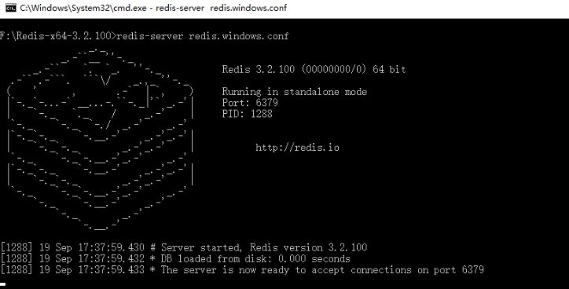

3. **安装服务：**

命令启动的方式，在cmd窗口关闭后redis服务器就关闭了，所以最好安装至本地服务。在解压目录下启动cmd，执行：

```shell
redis-server --service-install redis.windows-service.conf
```

services.msc中查看是否安装成功。


4. 启动命令窗口：

   解压目录下，启动 redis-cli

1. **常用命令**

   ```shell
   #开启服务：
   redis-server --service-start
   #停止服务：
   redis-server --service-stop
   #卸载服务：
   redis-server --service-uninstall
   #设置密码
   config set requirepass 密码
   #获取密码
   config get requirepass
   ##文件中配置密码，在redis.windows.conf
   requirepass 123456
   #登陆
   auth 密码
   #连接服务器
   redis-cli.exe -h 114.215.125.42 -p 6379
   ```

1. 设置密码，redis.windows.conf找到requirepass，并输入密码

   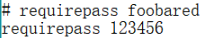

2. 登录，`auth password`

    

## redis学习

### 数据结构

1. stirng字符串
2. list列表
3. set集合
4. sorted set 有序集合
5. hash哈希

### 命令

| 命令                                      | 提示                                                         | 解释                                                         |
| ----------------------------------------- | ------------------------------------------------------------ | ------------------------------------------------------------ |
| **管理**                                  |                                                              |                                                              |
| info                                      |                                                              | 查看redis信息                                                |
| dbsize                                    |                                                              | 查看当前database中键值对的数量                               |
| auth                                      |                                                              | 输入密码登陆                                                 |
| **字符串类型**                            |                                                              |                                                              |
| set                                       |  | 设置键值对，默认覆盖旧的key的值，不管是什么类型。另外nx表示key 已存在时无法设置，xx表示key已存在是才能设置 |
| mset                                      |  | 同时设置多个键值对                                           |
| incr  <br/>incrby  <br/>decr  <br/>decrby |  | 解析string为整数，并做加减法。注意字符串必须为整数       总是原子操作，不会出现多个客户端同时对100加一的情况 |
| getset                                    |      Screen  clipping taken: 2020-03-06 13:08 | 设置新值返回旧值，当无旧值返回空                             |
| exists                                    |   （e是不存在的） | 返回传参存在的个数                                           |
| del                                       |  | 删除key，返回删除键的个数，如图ab键不存在                    |
| type                                      |      Screen  clipping taken: 2020-03-06 13:12 | 返回键的类型                                                 |
| expire                                    |      Screen  clipping taken: 2020-03-06 13:14 | 设置键的过期时间                                             |
| ttl                                       |      Screen  clipping taken: 2020-03-06 13:15 | 获取键的剩余存活时间                                         |
| **列表  类型**                            |                                                              |                                                              |
| lpush <br/>rpush  <br/>lrange             |      Screen  clipping taken: 2020-03-06 13:19 | 设置列表，比如获取最后10个进入列表的值。其中lrange的-1代表倒数第一，-2代表倒数第二 |
| rpop<br/>lpop                             |   Screen  clipping taken: 2020-03-06 13:22 | 取出列表的最后或第一个值                                     |
| brpop <br/>blpop                          |   Screen  clipping taken: 2020-03-06 13:37 | lpush和rpop模拟消费、生产队列的效果，但rpop为null直接null，那么客户端会造成没必要的消耗  所以有rpop，图中的意思是获取mylist的值，如果没有等等5秒再返回，如果5秒内有lpush或rpush操作，则返回新插入的值 |
| rpoplpush<br/>brpoplpush                  |                                                              |                                                              |
|                                           |      Screen  clipping taken: 2020-03-06 14:08 | 当key为null值是，redis就会吧key删除                It is Redis' responsibility to delete keys    when lists are left empty, or to create an empty list if the key does not    exist and we are trying to add elements to it。（Streams, Sets, Sorted Sets    and Hashes.）    From    <https://redis.io/topics/data-types-intro#strings> |
| ltrim                                     |      Screen  clipping taken: 2020-03-06 13:26 | 截取key，并重新设置key值                                     |
| llen                                      |  | 返回集合元素的个数                                           |
| 哈希                                      |                                                              | key{ property，propertyValue，…….           }                |
| hmset  hget  hmget                        | ![Machine generated alternative text: 127. O. O.  127. O. O.  "froggengo  127. O. O.  Imset  lung e t  Imset  user : 1000  user : 1000  key field  username froggengo age 26 born guangxi  username age  value [field value . ] ](file:///C:/Users/mh/AppData/Local/Temp/msohtmlclip1/01/clip_image017.png) | 设置及获取object对象名及属性名及属性值                       |
|                                           |                                                              |                                                              |
|                                           |                                                              |                                                              |
|                                           |                                                              |                                                              |
|                                           |                                                              |                                                              |
|                                           |                                                              |                                                              |
|                                           |                                                              |                                                              |
| sets                                      |                                                              |                                                              |
| sadd  smembers  sismember                 |  | sismember检查set是否包含查询值，                             |
| sinter                                    |      Screen  clipping taken: 2020-03-07 9:49 | 返回集合的交集                                               |
| sunionstore                               |      Screen  clipping taken: 2020-03-07 10:13 | SUNIONSTORE DESTINATION KEY KEY1..KEYN             将集合的并集存储在新的集合中，如果destination存在，则覆盖 |
| spop                                      |                           Screen    clipping taken: 2020-03-07 10:06 | 移出集合中指定数量的**任意位置**的元素，并返回客户端，并移出集合 |
| scard                                     |      Screen  clipping taken: 2020-03-07 10:18 | 返回集合中元素的数量                                         |
| srandmember                               |      Screen  clipping taken: 2020-03-07 10:19 | 返回集合中指定数量的元素，但不移出集合                       |
|                                           |                                                              |                                                              |
| Sorted sets                               | 游戏分数排行榜                                               |                                                              |
| zadd                                      |                Screen  clipping taken: 2020-03-07 10:56 | 添加sorted set元素。有序集合中，每个member都有一个score，用于排序中比较大小。如果两个元素socre一样，则按member的字典顺序  返回添加元素的数量，当添加的重复member重复时，更新socre，并且返回0 |
| zrange                                    |   Screen  clipping taken: 2020-03-07 10:30 | 返回指定范围的元素                                           |
| zrevrange                                 |      Screen  clipping taken: 2020-03-07 10:31 | 返回集合的反序，可以使用                                     |
| withscores                                |      Screen  clipping taken: 2020-03-07 10:33 | 返回集合元素及其score                                        |
| zrangebyscore                             |       | 返回指定score范围的元素  -inf代表负无穷     From  <https://redis.io/topics/data-types-intro#strings> |
| zremrangebyscore                          |      Screen  clipping taken: 2020-03-07 10:39 | 返回指定score返回的元素的数量，并将这这元素remove            |
| zrank  zrevrank                           |  | 返回指定元素的位置，若无则返回空                             |
| zrangebylex                               |      Screen  clipping taken: 2020-03-07 10:43 | 充给定的字母顺序返回集合元素，即不考虑score只考虑Lexicographical |
| bitmap                                    | 比如0000000代表一周7天，如果签到则对应位置设为1  空间占用计算公式是：($offset/8/1024/1024)MB  通过set key value最大为512兆，2^32次方  建立一个bitmap，每个网站用户为对应offset，如果当天登陆，则对应的offset设为1。  每天建立一个这样的bitmap，则通过bitcount可以知道每天网站登陆的用户量，通过位于运算，可以知道该offset联系登陆的次数，可以该位置每天的登陆情况 |                                                              |
| setbit                                    |   Screen  clipping taken: 2020-03-07 11:12 | 'a' 的ASCII码是 97。转换为二进制是：0110,0001  这里 offset 0 = '0' ，offset 1='1' ,offset2 =  '1',offset 6 = '0' ，offset是从左往右计数的，也就是从高位往低位。  通过setbit命令把'a'改为'b' ，'b'的ascii码98 =  0110,0010,也就是把a的offset 6设置为1，offset 7设置为0即可。  setbit返回该位置原来的值 |
| getbit                                    |  | 返回offset位置的bit值                                        |
| Bitcount                                  |  | 返回元素的的bit值设置为1的数量                               |

### 发布 订阅

#### 事务

#### 持久化


## java redis框架选择

> Jedis api 在线网址：http://tool.oschina.net/uploads/apidocs/redis/clients/jedis/Jedis.html
>
> redisson 官网地址：https://redisson.org/
>
> redisson git项目地址：https://github.com/redisson/redisson
>
> lettuce 官网地址：https://lettuce.io/
>
> lettuce git项目地址：https://github.com/lettuce-io/lettuce-core

概念：

> Jedis：是Redis的Java实现客户端，提供了比较全面的Redis命令的支持，
>
> Redisson：实现了分布式和可扩展的Java数据结构。
>
> *Lettuce：高级Redis客户端，用于线程安全同步，异步和响应使用，支持集群，Sentinel，管道和编码器。*

优点：

* Jedis：比较全面的提供了Redis的操作特性
* Redisson：促使使用者对Redis的关注分离，提供很多分布式相关操作服务，例如，分布式锁，分布式集合，可通过Redis支持延迟队列
* Lettuce：主要在一些分布式缓存框架上使用比较多

可伸缩：

* Jedis：使用阻塞的I/O，且其方法调用都是同步的，程序流需要等到sockets处理完I/O才能执行，不支持异步。Jedis客户端实例不是线程安全的，所以需要通过连接池来使用Jedis。
* Redisson：基于Netty框架的事件驱动的通信层，其方法调用是异步的。Redisson的API是线程安全的，所以可以操作单个Redisson连接来完成各种操作
* Lettuce：基于Netty框架的事件驱动的通信层，其方法调用是异步的。Lettuce的API是线程安全的，所以可以操作单个Lettuce连接来完成各种操作

### spring redis

springboot2之前redis的连接池为jedis，2.0以后redis的连接池改为了lettuce，lettuce能够支持redis4，需要java8及以上。

lettuce和jedis比较：jedis使直接连接redis server,如果在多线程环境下是非线程安全的，这个时候只有使用连接池，为每个jedis实例增加物理连接 ； lettuce的连接是基于Netty的，连接实例（StatefulRedisConnection）可以在多个线程间并发访问，StatefulRedisConnection是线程安全的，所以一个连接实例可以满足多线程环境下的并发访问，当然这也是可伸缩的设计，一个连接实例不够的情况也可以按需增加连接实例。

Redisson实现了分布式和可扩展的Java数据结构，和Jedis相比，功能较为简单，不支持字符串操作，不支持排序、事务、管道、分区等Redis特性。Redisson的宗旨是促进使用者对Redis的关注分离，从而让使用者能够将精力更集中地放在处理业务逻辑上。
原文链接：https://blog.csdn.net/zl_momomo/article/details/82788294

#### pom

```xml
<dependency>
    <groupId>org.springframework.boot</groupId>
    <artifactId>spring-boot-starter-data-redis</artifactId>
</dependency>
<!--   依赖于common-pool2 -->
<dependency>
    <groupId>org.apache.commons</groupId>
    <artifactId>commons-pool2</artifactId>
    <version>2.7.0</version>
</dependency>
<!--   序列化 -->  
<dependency>
    <groupId>com.fasterxml.jackson.core</groupId>
    <artifactId>jackson-core</artifactId>
</dependency>
<dependency>
    <groupId>com.fasterxml.jackson.core</groupId>
    <artifactId>jackson-databind</artifactId>
</dependency>
<dependency>
    <groupId>com.fasterxml.jackson.core</groupId>
    <artifactId>jackson-annotations</artifactId>
</dependency>
```

#### application.yml

```yaml

spring:
  redis:
    host: localhost
    port:  6379
    password: 82878871
    #database: 0
    lettuce:
      pool:
        max-active: 8
        max-idle: 8
        min-idle: 0
  #  timeout: 0
```


#### 配置类

```java
    @Bean("redisTemplate")
public RedisTemplate<String, Object> redisTemplate(RedisConnectionFactory redisConnectionFactory)
    throws UnknownHostException {
    RedisTemplate<String, Object> template = new RedisTemplate<>();
    template.setConnectionFactory(redisConnectionFactory);
    template.setKeySerializer(new StringRedisSerializer());
    //Jackson2JsonRedisSerializer redisSerializer = new Jackson2JsonRedisSerializer(User.class);
    Jackson2JsonRedisSerializer redisSerializer = new Jackson2JsonRedisSerializer(Object.class);
   //必须添加ObjectMapper，因为序列化后，取出来的数据 都是HashMap，不添加这个无法cast 转换为对应的类对象
    ObjectMapper om = new ObjectMapper();
    om.setVisibility(PropertyAccessor.ALL,JsonAutoDetect.Visibility.ANY);
    om.enableDefaultTyping (ObjectMapper. DefaultTyping.NON_FINAL);
    redisSerializer.setObjectMapper (om);
    template.setValueSerializer(new Jackson2JsonRedisSerializer(Object.class));
    template.setHashKeySerializer(new StringRedisSerializer());
    template.setHashValueSerializer(redisSerializer);
    return template;
}
```

#### 测试类

```java
@Test
public void testHash(){
    User user = new User("fly", "class1", 20);
    redisTemplate.opsForHash().put("user",user.getName(),user);
    // Jackson2JsonRedisSerializer redisSerializer = new Jackson2JsonRedisSerializer(User.class);
    //cast取决于serializer的配置，否则 报ClassCastException错误
    User o = (User)redisTemplate.opsForHash().get("user", user.getName());
    System.out.println(o);
}
```

#### redis存储结果

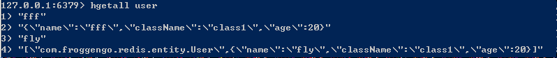

其中用户名为fly的是序列化对象添加了ObjectMapper对象的，而fff是没有添加的。

fly可以转换为User对象，而fff只能用HashMap取出来

#### ObjectMapper方法过期

```java
ObjectMapper om = new ObjectMapper();
om.setVisibility(PropertyAccessor.ALL,JsonAutoDetect.Visibility.ANY);
//方法已过期，修改为下面的方法
//om.enableDefaultTyping (ObjectMapper. DefaultTyping.NON_FINAL);
//om.activateDefaultTyping(LaissezFaireSubTypeValidator.instance);//或者
om.activateDefaultTyping(LaissezFaireSubTypeValidator.instance, ObjectMapper.DefaultTyping.NON_FINAL, JsonTypeInfo.As.PROPERTY);
```

存储的json字符串略有变动，多了`@class`

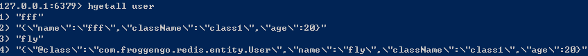

## Redisson


## Lettuce [官方文档](https://github.com/lettuce-io/lettuce-core/wiki/Getting-started-%285.0%29)

### get started

#### pom


```xml
<dependency>
    <groupId>io.lettuce</groupId>
    <artifactId>lettuce-core</artifactId>
    <version>5.3.1.RELEASE</version>
</dependency>
```

#### hello redis

```java
//单机
// Syntax: redis://[password@]host[:port][/databaseNumber]
RedisClient redisClient = RedisClient.create("redis://password@localhost:6379/0");
StatefulRedisConnection<String, String> connection = redisClient.connect();
//集群
// Syntax: redis://[password@]host[:port]
RedisClusterClient redisClient = RedisClusterClient.create("redis://password@localhost:7379");

RedisCommands<String, String> syncCommands = connection.sync();

syncCommands.set("key", "Hello, Redis!");

connection.close();
redisClient.shutdown();
```

**单机**

```java
// Syntax: redis://[password@]host[:port][/databaseNumber]
RedisClient redisClient = RedisClient.create("redis://password@localhost:6379/0");
StatefulRedisConnection<String, String> connection = redisClient.connect();

System.out.println("Connected to Redis");

connection.close();
redisClient.shutdown();
```

**单机ssl连接**

```java
// Syntax: rediss://[password@]host[:port][/databaseNumber]
// Adopt the port to the stunnel port in front of your Redis instance
RedisClient redisClient = RedisClient.create("rediss://password@localhost:6443/0");

StatefulRedisConnection<String, String> connection = redisClient.connect();

System.out.println("Connected to Redis using SSL");

connection.close();
redisClient.shutdown();
```


**redis sentinel**

```java
// Syntax: redis-sentinel://[password@]host[:port][,host2[:port2]][/databaseNumber]#sentinelMasterId
RedisClient redisClient = RedisClient.create("redis-sentinel://localhost:26379,localhost:26380/0#mymaster");

StatefulRedisConnection<String, String> connection = redisClient.connect();

System.out.println("Connected to Redis using Redis Sentinel");

connection.close();
redisClient.shutdown();
```

**cluster**

```java
// Syntax: redis://[password@]host[:port]
RedisClusterClient redisClient = RedisClusterClient.create("redis://password@localhost:7379");

StatefulRedisClusterConnection<String, String> connection = redisClient.connect();

System.out.println("Connected to Redis");

connection.close();
redisClient.shutdown();
```

**Connecting to a ElastiCache Master**

```java
// Syntax: redis://[password@]host[:port][/databaseNumber]

DefaultClientResources clientResources = DefaultClientResources.builder() //
    .dnsResolver(new DirContextDnsResolver()) // Does not cache DNS lookups
    .build();

RedisClient redisClient = RedisClient.create(clientResources, "redis://password@localhost:6379/0");
StatefulRedisConnection<String, String> connection = redisClient.connect();

System.out.println("Connected to Redis");

connection.close();
redisClient.shutdown();
```

**Connecting to ElastiCache with Master/Replica**

```java
// Syntax: redis://[password@]host[:port][/databaseNumber]
RedisClient redisClient = RedisClient.create();

List<RedisURI> nodes = Arrays.asList(RedisURI.create("redis://host1"),
                                     RedisURI.create("redis://host2"),
                                     RedisURI.create("redis://host3"));

StatefulRedisMasterSlaveConnection<String, String> connection = MasterSlave
    .connect(redisClient, StringCodec.UTF8, nodes);
connection.setReadFrom(ReadFrom.MASTER_PREFERRED);

System.out.println("Connected to Redis");

connection.close();
redisClient.shutdown();
```

**Connecting to Azure Redis Cluster**

```java
// Syntax: rediss://[password@]host[:port]
RedisURI redisURI = RedisURI.create("rediss://password@localhost:7379");
redisURI.setVerifyPeer(false); // depending on your setup, you might want to disable peer verification

RedisClusterClient redisClient = RedisClusterClient.create(redisURI);
StatefulRedisClusterConnection<String, String> connection = redisClient.connect();

System.out.println("Connected to Redis");

connection.close();
redisClient.shutdown();
```

**Lettuce with Spring**

```java
ClassPathXmlApplicationContext context = new ClassPathXmlApplicationContext(
    "com/lambdaworks/examples/SpringTest-context.xml");

RedisClient client = context.getBean(RedisClient.class);

StatefulRedisConnection<String, String> connection = client.connect();

RedisCommands<String, String> sync = connection.sync();
System.out.println("PING: " + sync.ping());
connection.close();

MySpringBean mySpringBean = context.getBean(MySpringBean.class);
System.out.println("PING: " + mySpringBean.ping());

context.close();
```

MyspringBean

```java
public class MySpringBean {

    private RedisClient redisClient;

    @Autowired
    public void setRedisClient(RedisClient redisClient) {
        this.redisClient = redisClient;
    }

    public String ping() {

        StatefulRedisConnection<String, String> connection = redisClient.connect();

        RedisCommands<String, String> sync = connection.sync();
        String result = sync.ping();
        connection.close();
        return result;
    }
}
```


 SpringTest-context.xml

```xml

<?xml version="1.0" encoding="UTF-8"?>
<beans xmlns="http://www.springframework.org/schema/beans"
       xmlns:xsi="http://www.w3.org/2001/XMLSchema-instance"
       xsi:schemaLocation="http://www.springframework.org/schema/beans http://www.springframework.org/schema/beans/spring-beans.xsd">

    <bean id="RedisClient" class="io.lettuce.core.support.RedisClientFactoryBean">
        <property name="uri" value="redis://localhost:6379"/>
    </bean>

    <bean class="io.lettuce.examples.MySpringBean" autowire="byType"/>

</beans>
```

### Redis URI and connection details

连接至redis单机、sentinel、集群，需要提供指定格式的连接url，即 `RedisURL`。可以使用它指定数据库、密码、超时时间。

```java
//指定url字符串
RedisURI.create("redis://localhost/");
//使用builder模式创建
RedisURI.Builder.redis("localhost", 6379).auth("password").database(1).build();
//通过参数设置
new RedisURI("localhost", 6379, 60, TimeUnit.SECONDS);
```

#### URI语法

单机版

> *redis* **://** [[*username* **:**] *password*@] *host* [**:** *port*] [**/** *database*][**?** [*timeout=timeout*[*d|h|m|s|ms|us|ns*]] [&_database=database_]]

```
redis :// [[username :] password@] host [: port] [/ database][? [timeout=timeout[d|h|m|s|ms|us|ns]] [&_database=database_]]
```

**Redis Standalone (SSL)**

> *rediss* **://** [[*username* **:**] *password*@] *host* [**:** *port*] [**/** *database*][**?** [*timeout=timeout*[*d|h|m|s|ms|us|ns*]] [&_database=database_]]

**Redis Standalone (Unix Domain Sockets)**

> *redis-socket* **://** [[*username* **:**] *password*@]*path* [**?**[*timeout=timeout*[*d|h|m|s|ms|us|ns*]][&_database=database_]]

**Redis Sentinel**

> *redis-sentinel* **://** [[*username* **:**] *password*@] *host1*[**:** *port1*] [, *host2*[**:** *port2*]] [, *hostN*[**:** *portN*]] [**/** *database*][**?**[*timeout=timeout*[*d|h|m|s|ms|us|ns*]] [&_sentinelMasterId=sentinelMasterId_] [&_database=database_]]
>
> 注意：redis-sentinel的uri中的密码，只应用与数据节点，必须为每个sentinel节点配置密码
>
> 注意：username只支持redis 6

**Schemes**

> - `redis` Redis Standalone
> - `rediss` Redis Standalone SSL
> - `redis-socket` Redis Standalone Unix Domain Socket
> - `redis-sentinel` Redis Sentinel

**Timeout units**

> - `d` Days
> - `h` Hours
> - `m` Minutes
> - `s` Seconds
> - `ms` Milliseconds
> - `us` Microseconds
> - `ns` Nanoseconds

### Basic usage

#### example1

```java
RedisClient client = RedisClient.create("redis://localhost");          (1)

StatefulRedisConnection<String, String> connection = client.connect(); (2)

RedisCommands<String, String> commands = connection.sync();            (3)

String value = commands.get("foo");                                    (4)

...

connection.close();                                                    (5)

client.shutdown();                                                     (6)
```

#### example2 

Using host and port and set the default timeout to 20 seconds

```java
RedisClient client = RedisClient.create(RedisURI.create("localhost", 6379));
client.setDefaultTimeout(20, TimeUnit.SECONDS);

// …

client.shutdown();
```

#### example3 Using RedisURI

```java
RedisURI redisUri = RedisURI.Builder.redis("localhost")
                                .withPassword("authentication")
                                .withDatabase(2)
                                .build();
RedisClient client = RedisClient.create(redisUri);

// …

client.shutdown();
```

#### Example 4. SSL RedisURI

```
RedisURI redisUri = RedisURI.Builder.redis("localhost")
                                .withSsl(true)
                                .withPassword("authentication")
                                .withDatabase(2)
                                .build();
RedisClient client = RedisClient.create(redisUri);

// …

client.shutdown();
```

#### Example 5. String RedisURI

```
RedisURI redisUri = RedisURI.create("redis://authentication@localhost/2");
RedisClient client = RedisClient.create(redisUri);

// …

client.shutdown();
```

### Asynchronous API

```java
CompletableFuture<String> future = new CompletableFuture<>();

System.out.println("Current state: " + future.isDone());

future.complete("my value");

System.out.println("Current state: " + future.isDone());
System.out.println("Got value: " + future.get());
```


## 分布式锁

### 资料

[Redisson 分布式锁实现分析（一）](https://www.jianshu.com/p/de5a69622e49)


## Redis管理session

### POM

```xml
<dependency>
    <groupId>org.springframework.session</groupId>
    <artifactId>spring-session-data-redis</artifactId>
</dependency>
<dependency>
    <groupId>org.springframework.boot</groupId>
    <artifactId>spring-boot-starter-data-redis</artifactId>
</dependency>
<!--    redis依赖common-pool-->
<dependency>
    <groupId>org.apache.commons</groupId>
    <artifactId>commons-pool2</artifactId>
    <version>2.7.0</version>
</dependency>
```

### 自动配置

```java
//springboot自动配置
org.springframework.boot.autoconfigure.session.RedisSessionConfiguration;
//引入
org.springframework.session.data.redis.config.annotation.web.http.RedisHttpSessionConfiguration
```

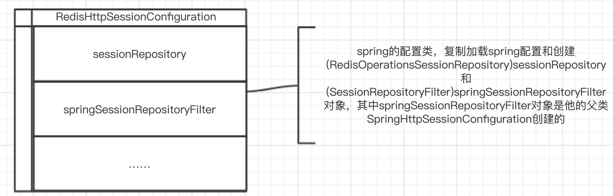

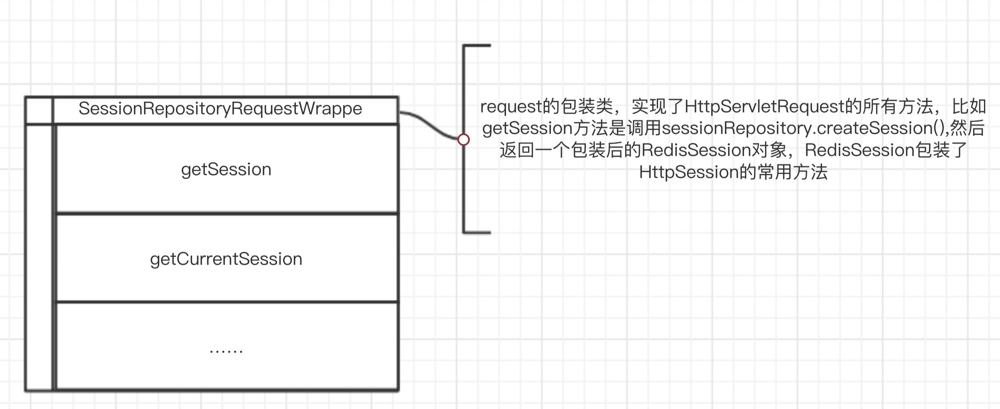

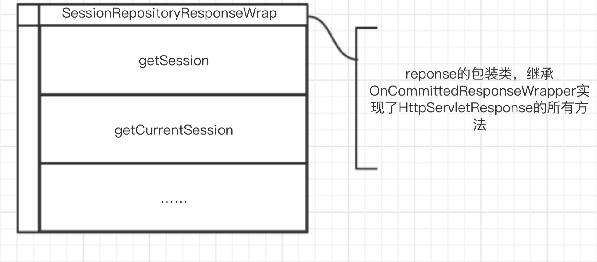

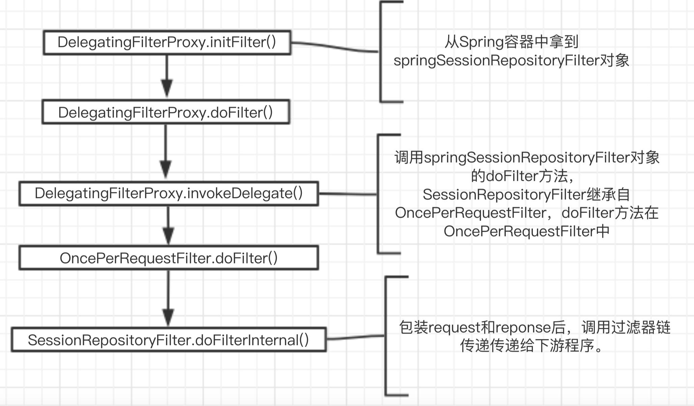

## redis课程笔记

### 1 什么是Nosql

> NoSql，泛指非关系型数据库，即Not Only SQL。随着互联网[web2.0](http://baike.baidu.com/view/733.htm)网站的兴起，传统的关系数据库在应付web2.0网站，特别是超大规模和高并发的[SNS](http://baike.baidu.com/subview/8258/5896174.htm)类型的web2.0纯[动态网](http://baike.baidu.com/view/528572.htm)站已经显得力不从心，暴露了很多难以克服的问题：
>
> 1. High performance
>
>    web2.0网站要根据用户个性化信息来实时生成动态页面和提供动态信息，所以基本上无法使用动态页面静态化技术，因此数据库并发负载非常高，往往要达到每秒上万次读写请求。关系数据库应付上万次sQL查询还勉强顶得住，但是应付上万次SQL写数据请求，硬盘I0就已经无法承受了。其实对于普通的BBS网站，往往也存在对高并发写请求的需求，例如网站的实时统计在线用户状态，记录热门帖子的点击次数，投票计数等，因此这是一个相当普遍的需求。
>
> 2. Huge Storege
>
>    类似Facebook，twitter，Friendfeed这样的SNs网站，每天用户产生海量的用户动态，以Friendfeed为例，一个月就达到了2.5亿条用户动态，对于关系数据库来说，在一张2.5亿条记录的表里面进行SQL查询，效率是极其低下乃至不可忍受的。再例如大型web网站的用户登录系统，例如腾讯，盛大，动辄数以亿计的帐号，关系数据库也很难应付。
>
> 3. High Scalability && High Availability
>
>    在基于web的架构当中，数据库是最难进行横向扩展的，当一个应用系统的用户量和访问量与日俱增的时候，你的数据库却没有办法像web server和app server那样简单的通过添加更多的硬件和服务节点来扩展性能和负载能力。对于很多需要提供24小时不间断服务的网站来说，对数据库系统进行升级和扩晨是非常痛苦的事情，往往需要停机维护和数据迁移，为什么数据库不能通过不断的添加服务器节点来实现扩晨呢？
>
> 而非关系型的数据库则由于其本身的特点得到了非常迅速的发展。NoSQL数据库的产生就是为了解决大规模数据集合多重数据种类带来的挑战，尤其是大数据应用难题。

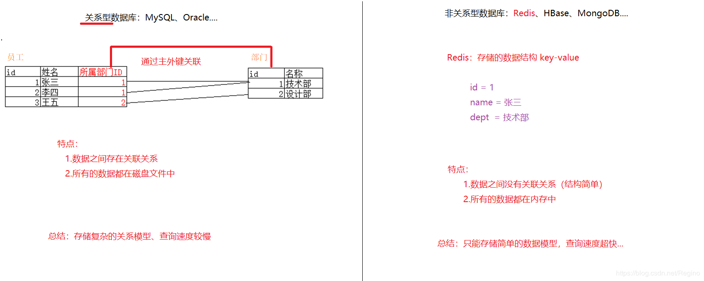

#### 1.2 Nosql的类型

 **键值（key-Value）存储数据库**

> 相关产品：Tokyo cabinet/Tyrant、Redis、Voldemort、Berkeley DB
> 典型应用：内容缓存，主要用于处理大量数据的高访问负载。
> 数据模型：一系列键值对
> 优势：快速查询
> 劣势：存储的数据缺少结构化

 **列存储数据库**

> 相关产品：Cassandra，HBase，Riak典型应用：分布式的文件系统
> 数据模型：以列簇式存储，将同一列数据存在一起
> 优势：查找速度快，可扩晨性强，更容易进行分布式扩展
> 劣势：功能相对局限

**文档型数据库**

> 相关产品：CouchDB、MongoDB典型应用：Web应用（与Key-Value类似，Value是结构化的）
> 数据模型：一系列键值对
> 优势：数据结构要求不严格
> 劣势：查询性能不高，而且缺乏统一的查询语法

 **图形（Graph）数据库**

> 相关数据库：Neo4]、InfoGrid、Infinite Graph典型应用：社交网络
> 数据模型：图结构
> 优势：利用图结构相关算法
> 劣势：需要对整个图做计算才能得出结果，不容易做分布式的集群方案

#### 1.3 Redis历史

2008年，意大利一家创业公司Merzia的创始人Salvatore Sanfilippo为了避免MySQL的低性能，亲自定做一个数据库，并于2009年开发完成了Redis的最初版本。
Salvatore Sanfilippo自己也没有想到，短短的几年时间，Redis就拥有了庞大的用户群体。Hacker News在2012年发布了一份数据库的使用情况调查，结果显示有近12%的公司在使用Redis。国内如新浪微博、街旁和知乎，国外如GitHub、Stack Overflow、Flickr、暴雪和Instagram，都是Redis的用户。

> 作者的博客：[redis作者antirez博客](http://antirez.com/latest/0)
>
> 作者github：http://github.com/antirez

#### 1.4Redis描述

> redis是一个开源的使用ANSI C语言编写、支持网络、可基于内存亦可持久化的日志型、Key-Value数据库。它具有以下特性：
>
> * **速度快，性能高**
>   Redis的数据的数据的操作是在内存里完成的，同时再配合上高效的网络IO模型。单台每秒能处理大约10万次的QPS。
> * **丰富的数据结构**
>   redis支持string，list，hash， set， sortedset等不同的数据类型。
>
> * **原子性**
>
>   Redis的所有操作都是原子性的，即操作要么成功执行，要么失败。单个操作是原子性的，多个操作也支持事务。
>
> * **多语言支持**
>   redis为客户端提供了一个简单的通信协议，现在主流的开发语言都提供了相应的client库，包括java，c++，python，ruby，php等。
> * **持久化**
>   redis支持数据的持久化，可以将内存中的数据保存在磁盘中，重启的时候可以再次加载进行使用。
> * **高可用，分布式**
>   为应对海量数据存储的要求， redis提供了对高可用与分布式应用的支持，包括复制，cluster等。

#### 1.5 使用场景

1. 缓存

   热点数据（经常会被查询，但是不经常被修改或者删除的数据），首选是使用redis缓存，毕竟强大到冒泡的QPS和极强的稳定性不是所有类似工具都有的，而且相比于memcached还提供了丰富的数据类型可以使用，另外，内存中的数据也提供了AOF和RDB等持久化机制可以选择，要冷、热的还是忽冷忽热的都可选。

2. 排行榜

   诸如统计点击数等应用。由于单线程，可以避免并发问题，保证不会出错，而且100%毫秒级性能！

3. 计数器

4. 分布式会话

5. 分布式锁

6. 社交网络

7. 最新列表

8. 消息系统

   消息队列在日常开发中使用频率很高，Redis也提供了基于内存的消息队列。当对消息可靠性要求不高时，可以使用Redis来作为消息队列。

#### 1.6 总结

优势

> 性能高
>
> 丰富的数据类型
>
> 丰富的特性
>
> 高速读写：

缺点

> * 持久化：Redis直接将数据存储在内存中，要将数据保存到磁盘上，Redis提共两种方式实现持久化。
>
>   定时快照：每隔一段时间将整个数据库写入磁盘，每次均写入全部数据，代价非常高。
>
>   基于语句追加aop：只追踪变化，当追加的log过大时，同时执行所有操作均重新执行一次，回复速度慢。
>
> * 耗内存,占用内存高

### 4 Redis配置

```properties
#1、Redis 默认不是以守护进程的方式运行，可以通过该配置项修改，使用 yes 启用守护进程（Windows 不支持守护线程的配置为 no ）
daemonize no
#2、当 Redis 以守护进程方式运行时，Redis 默认会把 pid 写入 /var/run/redis.pid 文件，可以通过 pidfile 指定
pidfile /var/run/redis.pid
#3、指定 Redis 监听端口，默认端口为 6379，作者在自己的一篇博文中解释了为什么选用 6379 作为默认端口，因为 6379 在手机按键上 MERZ 对应的号码，而 MERZ 取自意大利歌女 Alessia Merz 的名字
port 6379
#4、绑定的主机地址
bind 127.0.0.1
#5、当客户端闲置多长秒后关闭连接，如果指定为 0 ，表示关闭该功能	
timeout 300
#6、指定日志记录级别，Redis 总共支持四个级别：debug、verbose、notice、warning，默认为 notice	
loglevel notice
#7、日志记录方式，默认为标准输出，如果配置 Redis 为守护进程方式运行，而这里又配置为日志记录方式为标准输出，则日志将会发送给 /dev/null	
logfile stdout
#8、设置数据库的数量，默认数据库为0，可以使用SELECT 命令在连接上指定数据库id
databases 16
#9、指定在多长时间内，有多少次更新操作，就将数据同步到数据文件，可以多个条件配合
#Redis 默认配置文件中提供了三个条件：
###		save 900 1
###		save 300 10
###		save 60 10000
###分别表示 900 秒（15 分钟）内有 1 个更改，300 秒（5 分钟）内有 10 个更改以及 60 秒内有 10000 个更改。
save <seconds> <changes>
#10、指定存储至本地数据库时是否压缩数据，默认为 yes，Redis 采用 LZF 压缩，如果为了节省 CPU 时间，可以关闭该选项，但会导致数据库文件变的巨大
rdbcompression yes
#11、指定本地数据库文件名，默认值为 dump.rdb
dbfilename dump.rdb
#12、指定本地数据库存放目录
dir ./
#13、设置当本机为 slave 服务时，设置 master 服务的 IP 地址及端口，在 Redis 启动时，它会自动从 master 进行数据同步
slaveof <masterip> <masterport>
#14、当 master 服务设置了密码保护时，slav 服务连接 master 的密码
masterauth <master-password>
#15、设置 Redis 连接密码，如果配置了连接密码，客户端在连接 Redis 时需要通过 AUTH <password> 命令提供密码，默认关闭
requirepass foobared
#16、设置同一时间最大客户端连接数，默认无限制，Redis 可以同时打开的客户端连接数为 Redis 进程可以打开的最大文件描述符数，如果设置 maxclients 0，表示不作限制。当客户端连接数到达限制时，Redis 会关闭新的连接并向客户端返回 max number of clients reached 错误信息
maxclients 128
#17、指定 Redis 最大内存限制，Redis 在启动时会把数据加载到内存中，达到最大内存后，Redis 会先尝试清除已到期或即将到期的 Key，当此方法处理 后，仍然到达最大内存设置，将无法再进行写入操作，但仍然可以进行读取操作。Redis 新的 vm 机制，会把 Key 存放内存，Value 会存放在 swap 区
maxmemory <bytes>
#18、指定是否在每次更新操作后进行日志记录，Redis 在默认情况下是异步的把数据写入磁盘，如果不开启，可能会在断电时导致一段时间内的数据丢失。因为 redis 本身同步数据文件是按上面 save 条件来同步的，所以有的数据会在一段时间内只存在于内存中。默认为 no
appendonly no
#19、指定更新日志文件名，默认为 appendonly.aof
appendfilename appendonly.aof
#20、指定更新日志条件，共有 3 个可选值：
###   no：表示等操作系统进行数据缓存同步到磁盘（快）
###   always：表示每次更新操作后手动调用fsync() 将数据写到磁盘（慢，安全）
###   everysec：表示每秒同步一次（折中，默认值）
appendfsync everysec
#21、指定是否启用虚拟内存机制，默认值为 no，简单的介绍一下，VM 机制将数据分页存放，由 Redis 将访问量较少的页即冷数据 swap 到磁盘上，访问多的页面由磁盘自动换出到内存中（在后面的文章我会仔细分析 Redis 的 VM 机制）
vm-enabled no
#22、虚拟内存文件路径，默认值为 /tmp/redis.swap，不可多个 Redis 实例共享
vm-swap-file /tmp/redis.swap
#23、将所有大于 vm-max-memory 的数据存入虚拟内存，无论 vm-max-memory 设置多小，所有索引数据都是内存存储的(Redis 的索引数据 就是 keys)，也就是说，当 vm-max-memory 设置为 0 的时候，其实是所有 value 都存在于磁盘。默认值为 0
vm-max-memory 0
#24、Redis swap 文件分成了很多的 page，一个对象可以保存在多个 page 上面，但一个 page 上不能被多个对象共享，vm-page-size 是要根据存储的 数据大小来设定的，作者建议如果存储很多小对象，page 大小最好设置为 32 或者 64bytes；如果存储很大大对象，则可以使用更大的 page，如果不确定，就使用默认值
vm-page-size 32
#25、设置 swap 文件中的 page 数量，由于页表（一种表示页面空闲或使用的 bitmap）是在放在内存中的，，在磁盘上每 8 个 pages 将消耗 1byte 的内存。
vm-pages 134217728
#26、设置访问swap文件的线程数,最好不要超过机器的核数,如果设置为0,那么所有对swap文件的操作都是串行的，可能会造成比较长时间的延迟。默认值为4
vm-max-threads 4
#27、设置在向客户端应答时，是否把较小的包合并为一个包发送，默认为开启
glueoutputbuf yes
#28、指定在超过一定的数量或者最大的元素超过某一临界值时，采用一种特殊的哈希算法
hash-max-zipmap-entries 64
hash-max-zipmap-value 512
#29、指定是否激活重置哈希，默认为开启（后面在介绍 Redis 的哈希算法时具体介绍）
activerehashing yes
#30、指定包含其它的配置文件，可以在同一主机上多个Redis实例之间使用同一份配置文件，而同时各个实例又拥有自己的特定配置文件
include /path/to/local.conf
```

#### 内存维护策略

redis作为优秀的中间缓存件，时常会存储大量的数据，即使采取了集群部署来动态扩容，也应该及时清理内存，维持系统性能

先区分惰性删除和定时删除

* **定时删除**
  设置键的过期时间时，创建一个 Timer ，**当过期时间到临时，立刻删除键**。
  内存友好型策略，一旦键过期，就会被删除，并释放所占用的内存，Cpu 不友好，当一批数量比较多的键过期时，正好遇上Cpu 紧张的时段，这时候需要的是Cpu处理能力，而不是内存，显然 Cpu 时间用在删除过期键上，会对服务器的响应时间和吞吐量造成影响。另外当前 Redis 时间事件（无序链表O(N)）无法高效处理大量时间事件，所以定时删除并不是一种好的定时删除策略。

* **惰性删除**
  不管过期的键，在这种策略下，当键在键空间中被取出时，**首先检查取出的键是否过期，若过期删除该键，否则，返回该键。**
  很明显，惰性删除依赖过期键的被动访问，对于内存不友好，如果一些键长期没有被访问，会造成内存泄露（垃圾数据占用内存）。我们知道，Redis是依赖内存的，所以惰性删除也不是一个好的策略。

##### 设置过期时间

```shell
#为key设置过期时间
expire key timeout
#查看剩余存活时间
ttl key
#-1表示无限制时间，-2代表已经被清理
```

##### 采用LRU算法动态将不用的数据删除

1. volatile-lru：设定超时时间的数据中,删除最不常使用的数据.

2. allkeys-lru：查询所有的key中最近最不常使用的数据进行删除，这是应用最广泛的策略.

3. volatile-random：在已经设定了超时的数据中随机删除.

4. allkeys-random：查询所有的key,之后随机删除.

5. volatile-ttl：查询全部设定超时时间的数据,之后排序,将马上将要过期的数据进行删除操作.

6. Noeviction：如果设置为该属性,则不会进行删除操作,如果内存溢出则报错返回.
7. volatile-lfu：从配置了过期时间的键中删除使用频率最少的键
8. allkeys-lfu：从所有键中删除使用频率最少的键

#### 自定义配置

```shell
#修改为yes，以守护进程模式启动
daemonize no 
#注释掉，允许除本机以外的机器访问redis服务
bind 127.0.0.1
#设置密码
requirepass password
```

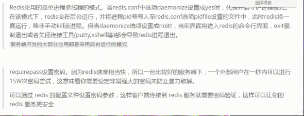

### 5 Redis启动


### 6 Redis关闭

第一种：

断电、非正常关闭，容易导致数据丢失

```shell
#使用kill强制杀死
ps -ef |grep -i redis
kill -9 pid
```

第二种：

```shell
#在cli中执行命令
shutdown
```


### 7 远程连接


### 8 docker安装redis


### 9 redis命令

> redis命令用于redis 服务上执行操作，要在redis服务器上执行命令需要一个 redis 客户端。
>
> redis客户端在redis的安装包中

reidis支持五种数据类型：string ，hash，list ，set，zset（sorted set）

常用命令 key管理

```shell
#返回满足要求的所有键，模糊匹配，比如keys abc*代表abc开头的所有key
key * 
#是否存在指定的key，返回1表示存在，0表示不存在
exists key
#设置key的过期时间，单位秒
expire key second
#key的剩余时间，key不存在时返回-2，存在但没设置剩余时间，则-1，否则代表剩余时间
#以秒为单位，返回给定 key 的剩余生存时间(TTL, time to live)。
ttl key
#以毫秒为单位返回 key 的剩余的过期时间。
PTTL key
#移除 key 的过期时间，key 将持久保持。
PERSIST key
#设置 key 的过期时间以毫秒计。
PEXPIRE key milliseconds
#设置 key 过期时间的时间戳(unix timestamp) 以毫秒计
PEXPIREAT key milliseconds-timestamp
#将当前数据库的 key 移动到给定的数据库 db 当中。
MOVE key db
#从当前数据库中随机返回一个 key 。
RANDOMKEY
#重命名，修改 key 的名称
RENAME key newkey
#仅当 newkey 不存在时，将 key 改名为 newkey 。
RENAMENX key newkey
#该命令用于在 key 存在时删除 key。
DEL key
#序列化给定 key ，并返回被序列化的值。
DUMP key
#EXPIREAT 的作用和 EXPIRE 类似，都用于为 key 设置过期时间。 不同在于 EXPIREAT 命令接受的时间参数是 UNIX 时间戳(unix timestamp)。
EXPIREAT key timestamp

#迭代数据库中的数据库键。
SCAN cursor [MATCH pattern] [COUNT count]
#返回 key 所储存的值的类型。
TYPE key

#打印命令
echo
#查看数据库的key数量
dbsize
#查看数据库库信息
info
#实时存储收到的请求，返回相关的配置
config get *
#清空当前数据库
flushdb
#清空所有数据库
flushall
```

##### 应用场景

```
expire key second
```

> 1. 限时优惠
> 2. 网站数据缓存，比如积分排行榜
> 3. 手机验证码
> 4. 限制网站访客频率(比如，1秒访问 10次)

##### key命名建议

reids单个key最大为512M

* key不要太长，尽量不超过1024字节。因为key不仅消耗内存，而且降低查找频率
* key不要太多，降低可读性
* key最好统一命名模式，比如company:111:dept:123:user:110
* key区分大小写

### 10 String类型

stirng类型是redis是最基本的类型，一个键最大存储512MB

string数据结果是最简单的key-value类型，value不仅是string，也可以是数字。

string是二进制安全的。意思是redis的string可以包含任何数据。

比如序列化对象的存储，一张图片的二进制存储，比如简单的字符串和数字

##### string命令

```shell
#命令不区分大小写，但是key_name区分大小写，key已存在，则覆盖旧值
set key_name value
#当key不存在时设置key的值，（SET if Not eXists），返回1
#否则不设置值，返回0
#分布式锁的方案之一
SETNX key value
#设置key的值为1x，过期时间为10秒
setex key  10 1x
#替换字符串
setrange string range value

####################################
#取值，key不存在，则返回nil，key不是字符串则返回一个错误
get key_name
#获取key中字符串的子字符串，从start开始，end结束,[start,end]
GETRANGE key start end
#
GETBIT KEY OFFSET
#批量读取，获取多个key
MGET key1 [key2 …]

#设定key的值，并返回key的旧值。当key不存在，返回nil
GETSET KEY_NAME VALUE
#返回key所存储的字符串的长度
STRLEN key

INCR KEY_NAME ：INCR命令key中存储的值+1,如果不存在key，则key中的值话先被初始化为0再加1
#自增，增量
INCRBY KEY_NAME 
#key中的值自减一
DECR KEY_NAME
#减去指定的值
DECRBY KEY_NAME value
#字符串拼接，追加至末尾，如果不存在，为其赋值
append key_name value：
```

##### 应用场景

> 1. String通常用于保存单个字符串或JSON字符串数据
> 2. 因为String是二进制安全的，所以可以把保密要求高的图片文件内容作为字符串来存储
> 3. 计数器：常规Key-Value缓存应用，如微博数、粉丝数。INCR本身就具有原子性特性，所以不会有线程安全问题

### 11 hash类型

hash是一个string类型的field和value的映射表，**hash特别适用于存储对象**。将一个对象类型存储在hash类型比存在string类型中要占用更少的内存

每个hash可以存储2^32-1键值对。可以看成KEY和VALUE的MAP容器。相比于JSON，hash占用很少的内存空间。

```shell
#为指定的key设定field和value
HSET key_name field value
#同时设置多个field-value
hmset key field value[field1,value1]
########
#取值
hget key field
#取多个值
hmget key field[field1]
#：返回hash表中所有字段和值
hgetall key
#：获取hash表所有字段
hkeys key
#：获取hash表中的字段数量
hlen key
################
#删除一个或多个hash表的字段
hdel key field [field1]
##其他
#field存在则设置值
hsetnx key field value
#field上的整数加上increment
hincrby key field increment
#浮点数加上increment
hincrbyfloat key field increment
#是否存在
hexists key field
```

##### 应用场景

Hash的应用场景，通常用来存储一个用户信息的对象数据。

1. 相比于存储对象的string类型的json串，json串修改单个属性需要将整个值取出来。而hash不需要。
2. 相比于多个key-value存储对象，hash节省了很多内存空间
3. 如果hash的属性值被删除完，那么hash的key也会被redis删除

### 12 spring boot整合jedis


### 13 list

#### 命令

```shell
#将一个或多个值插入到列表头部(从左侧添加)
LPUSH key value1 [value2] 
# 在列表中添加一个或多个值(从右侧添加)
RPUSH key value1 [value2]
#将一个值插入到已存在的列表头部。如果列表不在，操作无效
LPUSHX key value 
#一个值插入已存在的列表尾部(最右边)。如果列表不在，操作无效。
RPUSHX key value 

###取值语法：#########
#//获取列表长度
LLEN key 
#//通过索引获取列表中的元素
LINDEX key index 
#//获取列表指定范围内的元素
LRANGE key start stop 
######
#返回列表中指定区间内的元素，区间以偏移量 START 和 END 指定。 其中 0 表示列表的第一个元素， 1 表示列表的第二个元素，以此类推。也可以使用负数下标，以 -1 表示列表的最后一个元素， -2 表示列表的倒数第二个元素，以此类推。
######

###删除语法：#####
#移出并获取列表的第一个元素(从左侧删除)
LPOP key 
#移除列表的最后一个元素，返回值为移除的元素(从右侧删除)
RPOP key 
#移出并获取列表的第一个元素， 如果列表没有元素会阻塞列表直到等待超时或发现可弹出元素为止。
实例
BLPOP key1 [key2 ] timeout
#在以下实例中，操作会被阻塞，如果指定的列表 key list1 存在数据则会返回第一个元素，否则在等待100秒后会返回 nil 。
redis 127.0.0.1:6379> BLPOP list1 100
#移出并获取列表的最后一个元素， 如果列表没有元素会阻塞列表直到等待超时或发现可弹出元素为止。
BRPOP key1 [key2 ] timeout
#对一个列表进行修剪(trim)，就是说，让列表只保留指定区间内的元素，不在指定区间之内的元素都将被删除。
LTRIM key start stop 

#####修改语法：####
#通过索引设置列表元素的值
LSET key index value 
#在列表的元素前或者后插入元素
#描述：将值 value 插入到列表 key 当中，位于值 world 之前或之后。
LINSERT key BEFORE|AFTER world value 


#####高级语法：####
#移除列表的最后一个元素，并将该元素添加到另一个列表并返回
RPOPLPUSH source destination
##示例描述：
##RPOPLPUSH a1 a2 //a1的最后元素移到a2的左侧
##RPOPLPUSH a1 a1 //循环列表，将最后元素移到最左侧
###
#从列表中弹出一个值，将弹出的元素插入到另外一个列表中并返回它； 如果列表没有元素会阻塞列表直到等待超时或发现可弹出元素为止。
BRPOPLPUSH source destination timeout
```


#### 应用场景

项目常应用于：1）对数据量大的集合数据删减，2）任务队列

* 对数据量大的集合数据删减
  列表数据显示、关注列表、粉丝列表、留言评价等…分页、热点新闻（Top5)等
  利用`LRANGE`还可以很方便的实现分页的功能,在博客系统中，每片博文的评论也可以存入一个单独的`list`中。

* 任务队列
  (list通常用来实现一个消息队列，而且可以确保先后顺序，不必像`MySQL`那样还需要通过`ORDER BY`来进行排序)

  > 任务队列介绍(生产者和消费者模式)：
  > 在处理Web客户端发送的命令请求时，某些操作的执行时间可能会比我们预期的更长一些，通过将待执行任务的相关信息放入队列里面，并在之后对队列进行处理，用户可以推迟执行那些需要一段时间才能能完成的操作，这种将工作交给任务处理器来执行的做法被称为任务队列（task queue）。
  >
  > RPOPLPUSH source destination
  > 移除列表的最后一个元素，并将该元素添加到另一个列表并返回


### 14 Set&Zset

Redis 的 Set 是 String 类型的无序集合。集合成员是唯一的，这就意味着集合中不能出现重复的数据。
Redis 中集合是通过哈希表实现的，所以添加，删除，查找的复杂度都是 O(1)。
集合中最大的成员数为 2^32 - 1 (4294967295, 每个集合可存储40多亿个成员)。
类似于JAVA中的 Hashtable集合

redis的集合对象set的底层存储结构特别神奇，底层使用了intset和hashtable两种数据结构存储的，intset我们可以理解为数组，hashtable就是普通的哈希表（key为set的值，value为null）。

```shell
#########赋值语法：###########
# 向集合添加一个或多个成员
SADD key member1 [member2]

#########取值语法：###########
#获取集合的成员数
SCARD key 
#返回集合中的所有成员
SMEMBERS key 
# 判断 member 元素是否是集合 key 的成员(开发中：验证是否存在判断）
SISMEMBER key member
#返回集合中一个或多个随机数
SRANDMEMBER key [count] 

#########删除语法：###############
#移除集合中一个或多个成员
SREM key member1 [member2] 
#移除并返回集合中的一个随机元素
SPOP key [count] 
#将 member 元素从 source 集合移动到 destination 集合
SMOVE source destination member

#########差集语法：###############
#返回给定所有集合的差集(左侧）
SDIFF key1 [key2] 
#返回给定所有集合的差集并存储在 destination 中
SDIFFSTORE destination key1 [key2] 
##########交集语法：############
#返回给定所有集合的交集(共有数据）
SINTER key1 [key2] 
#返回给定所有集合的交集并存储在 destination 中
SINTERSTORE destination key1 [key2] 
###########并集语法：#############
#返回所有给定集合的并集
SUNION key1 [key2] 
#所有给定集合的并集存储在 destination 集合中
SUNIONSTORE destination key1 [key2] 
```


#### 应用场景

常应用于：对两个集合间的数据[计算]进行交集、并集、差集运算

1. 以非常方便的实现如共同关注、共同喜好、二度好友等功能。对上面的所有集合操作，你还可以使用不同的命令选择将结果返回给客户端还是存储到一个新的集合中。
2. 利用唯一性，可以统计访问网站的所有独立 IP

#### ZSET

Redis 有序集合和集合一样也是string类型元素的集合,且不允许重复的成员。

* 不同的是每个元素都会关联一个double类型的分数。redis正是通过分数来为集合中的成员进行从小到大的排序。

* 有序集合的成员是唯一的,但分数(score)却可以重复。

* 集合是通过哈希表实现的，所以添加，删除，查找的复杂度都是O(1)。 集合中最大的成员数为 2^32 - 1 (4294967295, 每个集合可存储40多亿个成员)


Redis的ZSet是有序、且不重复

```SHELL
###########赋值语法：#############
#向有序集合添加一个或多个成员，或者更新已存在成员的分数
ZADD key score1 member1 [score2 member2]

############取值语法：###########
#获取有序集合的成员数
ZCARD key 
# 计算在有序集合中指定区间分数的成员数
ZCOUNT key min max
#返回有序集合中指定成员的索引
ZRANK key member 
#通过分数返回指定区间的成员
ZRANGEBYSCORE KEY min max [WITHSCORES][LIMIT]
#通过索引区间返回有序集合成指定区间内的成员(低到高)
ZRANGE key start stop [WITHSCORES]
#返回有序集中指定区间内的成员，通过索引，分数从高到底
ZREVRANGE key start stop [WITHSCORES]
#返回有序集合中指定分区区间的成员，分数为从高到低排序
ZREVRANGEBYSCORE KEY max min [withsocres]
###########删除语法：############
# 移除集合
del key
#移除有序集合中的一个或多个成员
ZREM key member [member ...] 
#移除有序集合中给定的排名区间的所有成员(第一名是0)(低到高排序)
ZREMRANGEBYRANK key start stop 
#移除有序集合中给定的分数区间的所有成员
ZREMRANGEBYSCORE key min max 
#增加menber元素的分数increment，返回更改后的分数
ZINCREBY KEY INCREMENT MENBER
```

#### 应用场景

常应用于：排行榜

* 比如twitter 的public timeline可以以发表时间作为score来存储，这样获取时就是自动按时间排好序的。
*  比如一个存储全班同学成绩的Sorted Set，其集合value可以是同学的学号，而score就可以是其考试得分，这样在数据插入集合的时候，就已经进行了天然的排序。
*  还可以用Sorted Set来做带权重的队列，比如普通消息的score为1，重要消息的score为2，然后工作线程可以选择按score的倒序来获取工作任务。让重要的任务优先执行。


### Hyperloglog

#### [翻译Redis new data structure: the HyperLogLog](http://antirez.com/news/75)

一般来说，我喜欢随机算法，但其中有一个我特别喜欢，因为即使你知道他是怎么工作的，站在一个程序员角度来说他仍像魔术一般。它完成某些东西所用的时间或空间是不符合逻辑的。这个算法就叫hyperloglog，今天它将作为redis'的一种新的数据结构向大家介绍。

**统计不重复的元素**

统计不重复的元素，比如统计今天连接到网站的IP地址，用户搜索的关键字，要求记住所有当前遇到不重复元素，用已存在的集合匹配下一个元素，但遇到新元素时增加计数。

这需要和我们要统计的集合的基数（元素的数量）成正比的内存空间，但这一般是不允许的。

有一类算法使用随机化，以便于在仅仅使用非常小的空间便能计算出集合中不重复元素的数量。。目前被知道最好打的算法是hyperloglog。

算法发表在http://algo.inria.fr/flajolet/Publications/FlFuGaMe07.pdf，google在2013年的一篇论文中深入介绍了他的实现及变种。[http://static.googleusercontent.com/media/research.google.com/en//pubs/archive/40671.pdf](http://static.googleusercontent.com/media/research.google.com/en/pubs/archive/40671.pdf)

**怎么起作用？**

其他资源比如http://blog.aggregateknowledge.com/2012/10/25/sketch-of-the-day-hyperloglog-cornerstone-of-a-big-data-infrastructure/【3】

在此，我将使用【3】中发现的一个非常聪明的列子来讨论基本的想法。想象一下，你花费一天来抛硬币，统计不间断遇到正面的次数（遇到背面就停止），如果你告诉我最大次数是3，那么我猜你没有真实抛很多次硬币。如果你最长一次是13，那么你可能抛了很多次硬币。

然而入股你第一次获得10次正面，虽然这个看起来不太可能，然后你停止抛硬币，我将提供你抛硬币次数一个错误的估计。现在我要求你重复你的实验，这次用10个硬币，10张小纸条，每个纸条记录每个硬币连续是正面最长的次数。这次观察到更多的数据，我的估计会更好一点。

长话短说这就是hyperloglog，它哈希每个你观察到的新元素，哈希值的某部分用于计算寄存器register（硬币+小纸条，在我们之前的实验，我们将原始的集合分割成一个个小集合）的索引。哈希值的另一部分用于从右往左0的长度，N+1个0的概率是N个0概率的二分之一，所以通过观察那些记录了不同子集中最大0的长度的寄存器，heyperloglgo可以给出非常好的近似基数cardinality。

**Redis的实现**

hyperloglog的标准差是1.04/(m开方)，m是寄存器的数量。

redis使用16384个寄存器，所以标准差是0.81%。

由于用在redis实现的哈希函数有64位，我们用前14位hash来计算16k个寄存器的位置，使用剩余的50位


#### 理解

图片理解：[HyperLogLog in Presto: A significantly faster way to handle cardinality estimation](https://engineering.fb.com/data-infrastructure/hyperloglog/)

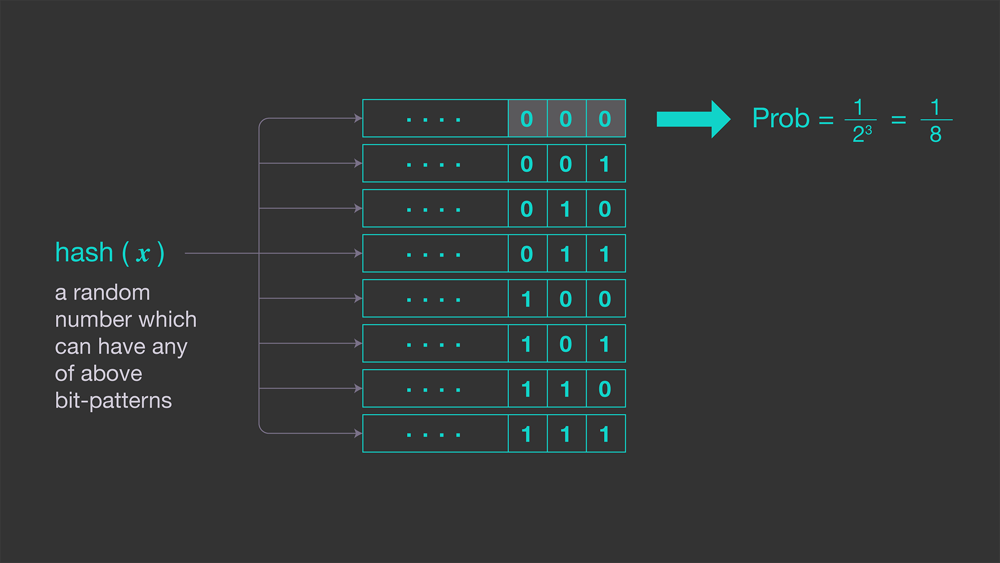

在数据量足够大，hash足够均匀的情况下。hash的每一位出现0、1的概率一样都是0.5。而 比如出现000的概率是1/8，那么认为此时样本数据就是8。


理论解释:[[解读Cardinality Estimation算法（第三部分：LogLog Counting）](http://blog.codinglabs.org/articles/algorithms-for-cardinality-estimation-part-iii.html)]


即：

1. 数据经过hash后，服从均匀分布，[图片来源](http://blog.codinglabs.org/articles/cardinality-estimate-exper.html) 

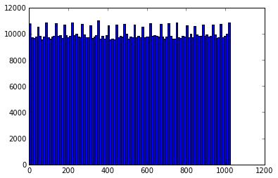

2. 0的后缀长度为幂律分布

   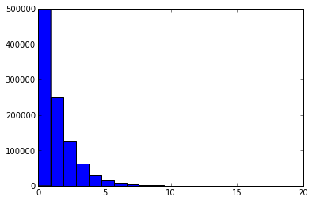

3. 

####  

#### 资料

1. https://engineering.fb.com/data-infrastructure/hyperloglog/
2. [五种常用基数估计算法效果实验及实践建议](http://blog.codinglabs.org/articles/cardinality-estimate-exper.html)
3. [Redis new data structure: the HyperLogLog](http://antirez.com/news/75)
4. [hyperloglog算法论文](http://algo.inria.fr/flajolet/Publications/FlFuGaMe07.pdf)
5. [hyperloglog测试实验](http://content.research.neustar.biz/blog/hll.html)

 

 

 

### 15 发布订阅

### 16 事务

Redis 事务可以一次执行多个命令（允许在一次单独的步骤中执行一组命令），并且带有以下两个重要的保证：

* 批量操作在发送 EXEC 命令前被放入队列缓存，然后按顺序执行
* 收到 EXEC 命令后进入事务执行，事务中任意命令执行失败，其余的命令依然被执行。
* 在事务执行过程，其他客户端提交的命令请求不会插入到事务执行命令序列中。

#### 事务的错误处理：

1. 队列中的某个命令出现了报告错误，执行时整个的所有队列都会被取消。

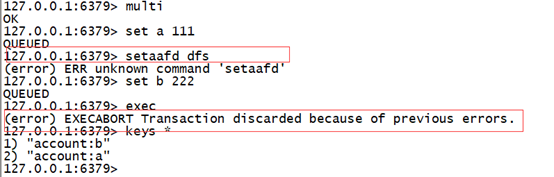

2. 如果执行的某个命令报出了错误，则只有报错的命令不会被执行，而其它的命令都会执行，不会回滚。如下图所示

   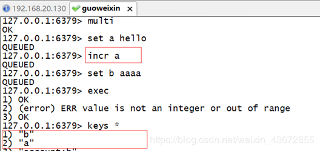


#### 命令

```shell
#取消事务，放弃执行事务块内的所有命令。
DISCARD
#执行所有事务块内的命令。
EXEC
#标记一个事务块的开始。
MULTI
#Redis Unwatch 命令用于取消 WATCH 命令对所有 key 的监视。
#如果在执行WATCH命令之后，EXEC命令或DISCARD命令先被执行的话，那就不需要再执行UNWATCH了
UNWATCH

#监视一个(或多个) key ，如果在事务执行之前这个(或这些) key 被其他命令所改动，那么事务将被打断。
WATCH key [key ...]
```

> 如图，监听a，并在事务执行过程中，a被另一个事务修改，那么事务被取消


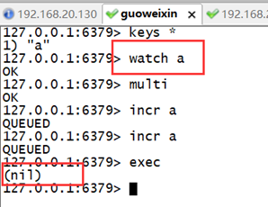

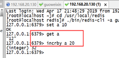


#### 应用场景

- 一组命令必须同时都执行，或者都不执行。
- 我们想要保证一组命令在执行的过程之中不被其它命令插入。

例如：商品秒杀（活动）。


### 17 Redis数据淘汰策略redis.conf

Redis官方给的警告，当内存不足时，Redis会根据配置的缓存策略淘汰部分Keys，以保证写入成功。当无淘汰策略时或没有找到适合淘汰的Key时，Redis直接返回out of memory错误。

#### 最大缓存配置

在 redis 中，允许用户设置最大使用内存大小maxmemory 512G

##### redis 提供6种数据淘汰策略：

* volatile-lru：从已设置过期时间的数据集中挑选最近最少使用的数据淘汰
* volatile-lfu：从已设置过期的Keys中，删除一段时间内使用次数最少使用的
* volatile-ttl：从已设置过期时间的数据集中挑选最近将要过期的数据淘汰
* volatile-random：从已设置过期时间的数据集中随机选择数据淘汰
* allkeys-lru：从数据集中挑选最近最少使用的数据淘汰
* allkeys-lfu：从所有Keys中，删除一段时间内使用次数最少使用的
* allkeys-random：从数据集中随机选择数据淘汰
* no-enviction（驱逐）：禁止驱逐数据(不采用任何淘汰策略。默认即为此配置),针对写操作，返回错误信息

> 建议：了解了Redis的淘汰策略之后，在平时使用时应尽量主动设置/更新key的expire时间，主动剔除不活跃的旧数据，有助于提升查询性能

### 18 Redis持久化

#### RDB

RDB：是redis的默认持久化机制。RDB相当于照快照，保存的是一种状态。

快照是默认的持久化方式。这种方式是就是将内存中数据以快照的方式写入到二进制文件中,默认的文件名为dump.rdb。

rdb是Redis DataBase缩写，功能核心函数rdbSave(生成RDB文件)和rdbLoad (从文件加载内存)两个函数


> 优点：
>
> * 快照保存数据极快、还原数据极快
> * 适用于灾难备份
>
> 缺点：
>
> * 小内存机器不适合使用,RDB机制符合要求就会照快照

#### 启动方式

* 服务器正常关闭时 ./bin/redis-cli shutdown

* key满足一定条件，会进行快照

  > vim redis.conf 搜索save
  >
  > * save 900 1 //每900秒（15分钟）至少1个key发生变化，产生快照
  > * save 300 10 //每300秒（5分钟）至少10个key发生变化，产生快照
  > * save 60 10000 //每60秒（1分钟）至少10000个key发生变化，产生快照

#### AOF

由于快照方式是在一定间隔时间做一次的，所以如果redis 意外down 掉的话，就会丢失最后一次快照后的所有修改。如果应用要求不能丢失任何修改的话，可以采用aof 持久化方式。

`Append-only file:aof` 比快照方式有更好的持久化性，是由于在使用aof 持久化方式时,redis 会将每一个收到的写命令都通过write 函数追加到文件中(默认是appendonly.aof)。当redis 重启时会通过重新执行文件中保存的写命令来在内存中重建整个数据库的内容。

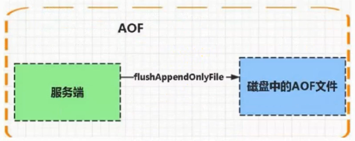

每当执行服务器(定时)任务或者函数时flushAppendOnlyFile函数都会被调用,这个函数执行以下两个工作
aof写入保存:

* WRITE :根据条件,将aof_ buf中的缓存写入到AOF文件
* SAVE :根据条件,调用fsync或fdatasync函数,将AOF文件保存到磁盘中。

#### 启动方式

有三种方式如下（默认是：每秒 fsync 一次） appendonly yes -启用 aof 持久化方式

* appendfsync always //收到写命令就立即写入磁盘，最慢，但是保证完全的持久化
* appendfsync everysec //每秒钟写入磁盘一次，在性能和持久化方面做了很好的折中
* appendfsync no //完全依赖 os，性能最好,持久化没保证

#### 产生的问题

`aof` 的方式也同时带来了另一个问题。持久化文件会变的越来越大。例如我们调用 `incr test`命令 100 次，文件中必须保存全部的 100 条命令，其实有 99 条都是多余的。

### 19 Redis缓存与数据库一致性

#### 实时同步;

对强一致要求比较高的，应采用实时同步方案，即查询缓存查询不到再从DB查询,保存到缓存;更新缓存时,先
更新数据库，再将缓存的设置过期(建议不要去更新缓存内容，直接设置缓存过期)。

* @Cacheable :查询时使用,注意Long类型需转换为Sting类型，否则会抛异常
* @CachePut:更新时使用,使用此注解, -定会从DB.上查询数据
* @CacheEvict :删除时使用;
* @Caching :组合用法

非实时同步:

```
实时:一-方修改，另一方同步修改
非实时:一方修改，另一方向不需要同步修改
	1个文章1分钟内被100万点击(点击数100万)
定时任务(凌晨2点触发定时任务) :将redis num值询出来更新mysq1
	redis incr num
	num=100万
	mysq1 num:0;
异步队列:
	消息队列:
电商网站:
	注册完成--》1邮箱发送注册成功欢迎信息      4
			-》 2手机号发送(注册成功)欢迎信息 3
			--》3将注册的信息插入到数据库     1  8秒钟
	异步队列:
		流量的削峰
		异步
			中间件:解决方案
```


#### 异步队列

​	对于并发程度较高的，可采用异步队列的方式同步，可采用kafka等消息中间件处理消息生产和消费。

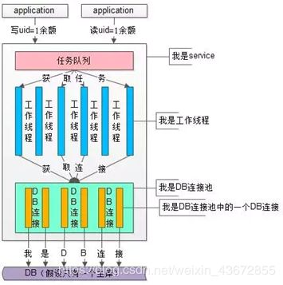

####  使用阿里的同步工具canal

canal实现方式是模拟mysql slave 和master的同步机制，监控DB bitlog 的日志更新来触发缓存的更新，此种方法可以解放程序员双手，减少工作量，但在使用时有些局限性。

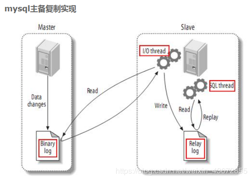

1.  master 将改变记录到二进制日志(binary log)中(这些记录叫做二进制日志事件，binary log events,可以通过show binlog events进行查看) ; 
2. slave 将master的binary log events 拷贝到它的中继日志(relay log); 
3. slave 重做中继日志中的事件，将改变反映它自己的数据。

#### canal原理

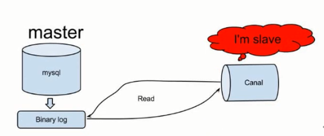

1. canal 模拟mysql slave的交互协议，伪装自己为mysql slave,向mysql master发送dump
协议。
2. mysql master收到dump请求，开始推送binary log给slave(也就是canal)e
3. canal解析binary log对象(原始为byte流)+

#### 采用UDF自定义函数的方式

 面对mysq|的API进行编程,利用触发器进行缓存同步,但UDF主要是C/C++语言实现,学习成本高。


### 20 缓存穿透、缓存雪崩、缓存击穿（热点Key）

穿透：一直访问数据库没有的key

* 布隆过滤器，如果key存在数据库，那么一定能通过过滤器，不存在数据库的也可能通过过滤器，但几率小

  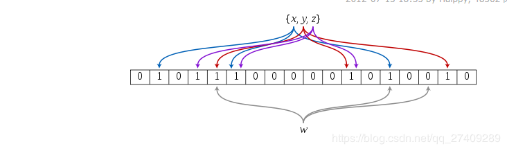

  将所有数据库可能的key值，经过布隆过滤器映射到bitmap中，那么请求key时先判断bitmap是否为1，这样就能过滤掉不存在的key了。布隆过滤器就是相当于hash值散列到桶里，但是因为有hash冲突，所有就多个hash函数，如果某个key的多个hash值都相同，那么基本可以认为该key就是我们存在的key。

  布隆过滤器常见还有黑名单的用法

* 在接口访问层对用户做校验，如接口传参、登陆状态、n秒内访问接口的次数；

雪崩：key的过期时间同时失效

* 过期时间分布均匀
* 加分布式锁

击穿：击穿表示底层数据库有数据而缓存内没有数据。强调单个key在缓存没有，且某瞬间高并发，来不及缓存。

## 资料

1. [redis作者antirez博客](http://antirez.com/latest/0)
2. https://groups.google.com/forum/#!forum/jedis_redis
3. [spring redis 官方文档](https://docs.spring.io/spring-boot/docs/2.3.1.RELEASE/reference/htmlsingle/#production-ready) 
4. [优秀博客](https://my.oschina.net/u/4360916/blog/4357926)
