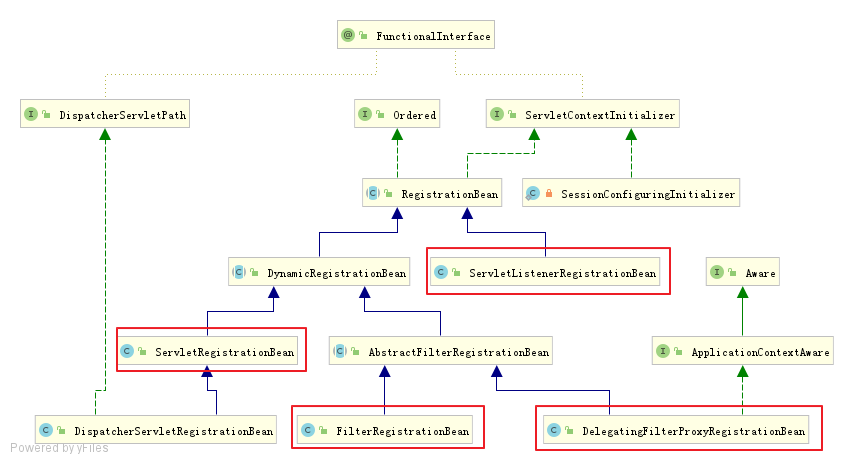
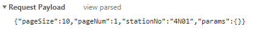

### servlet容器启动历史演变

1. servlet3.0以前

   * web.xml 中配置 servlet 和 filter

2. servlet3.0 新特性

   * 提供 @WebServlet，@WebFilter 

   * 运行时动态注册 servlet

     ```java
     ServletRegistration.Dynamic addServlet(String servletName,Class<? extends Servlet> servletClass)
     ServletRegistration.Dynamic addServlet(String servletName, Servlet servlet)
     ServletRegistration.Dynamic addServlet(String servletName, String className)
     T createServlet(Class clazz)
     ServletRegistration getServletRegistration(String servletName)
     Map<String,? extends ServletRegistration> getServletRegistrations()
     ```

     1. ServletContextListener 的 contexInitialized 方法中调用

     2. 或ServletContainerInitializer 的 onStartup()

   * 容器在启动时使用 JAR 服务 API(JAR Service API) 来发现 ServletContainerInitializer 的实现类，@HandlesTypes可以指定希望处理的类

3. Spring framework的支持

   * ```
     SpringServletContainerInitializer implements ServletContainerInitializer
     //实现onstartup(),调用spirng容器WbeApplicationInitilizer接口
     ```

   * 注解开发时，通常通过实现AbstractAnnotationConfigDispatcherServletInitializer接口来启动容器,[官网示例](https://docs.spring.io/spring/docs/5.1.2.RELEASE/spring-framework-reference/web.html#mvc-servlet)

     ```java
     public class MyWebAppInitializer extends AbstractAnnotationConfigDispatcherServletInitializer {
         @Override
         protected Class<?>[] getRootConfigClasses() {
             return new Class<?>[] { RootConfig.class };
         }
         @Override
         protected Class<?>[] getServletConfigClasses() {
             return new Class<?>[] { App1Config.class };
         }
         @Override
         protected String[] getServletMappings() {
             return new String[] { "/app1/*" };
         }
     }
     ```

### SpringBoot中在servlet容器中注册filter、listener、servlet

1. 使用servlet规范中的注解

```java
@WebServlet，@WebFilter，@WebListener
配置类添加@ServletComponentScan
```

2. 使用 RegistrationBean 

   ```java
   ServletRegistrationBean 
   FilterRegistrationBean 
   ServletListenerRegistrationBean
   DelegatingFilterProxyRegistrationBean
       
   @Bean
   public FilterRegistrationBean helloWorldFilter() {
       FilterRegistrationBean helloWorldFilter = new FilterRegistrationBean();
       myFilter.addUrlPatterns("/hello/*");
       myFilter.setFilter(new HelloWorldFilter());
       return helloWorldFilter;
   }
   ```

   

### Tomcat启动

```java
org.springframework.context.support.AbstractApplicationContext#onRefresh
   //调用子类实现
org.springframework.boot.web.servlet.context.ServletWebServerApplicationContext#onRefresh
org.springframework.boot.web.servlet.context.ServletWebServerApplicationContext#createWebServer
org.springframework.boot.web.embedded.tomcat.TomcatServletWebServerFactory#getWebServer
//找出BeanFactory中查找ServletWebServerFactor   
getBeanFactory().getBean(beanNames[0], ServletWebServerFactory.class);
//执行servletConextInitializer
getSelfInitializer()
//返回webServer
//即TomcatServletWebServerFactory负责实例化TomcatWebServer
(TomcatWebServer)((ServletWebServerFactory)factory).getWebServer(getSelfInitializer());
//TomcatStarter实现了ServletContainerInitializer接口，在tomcat启动时会调用器onstartup方法
org.springframework.boot.web.embedded.tomcat.TomcatStarter#onStartup
//进而会调用Tomcat中的ServletContextInitializer，进而调用springBeanFactory中的ServletContextInitializer的Bean
org.springframework.boot.web.servlet.ServletContextInitializerBeans#addServletContextInitializerBeans
```

* 注意`ServletContextInitializer`与`ServletContainerInitializer`区别，

  * 一个是servlet容器调用，一个是spring容器调用，都是用于加工`ServletContext`

  * `ServletContainerInitializer`是servlet规范，在servlet容器启动时也即是tomcat启动时候由`StandContext`调用，springboot对`ServletContainerInitializer`的实现是`TomcatStarter`，实现调用`ServletContextInitializer`的实现。

  * 都是加工`ServletContext`，为什么springboot要搞自己的一套东西呢？[官方答复](https://github.com/spring-projects/spring-boot/issues/321)

    > This was actually an intentional design decision. The search algorithm used by the containers was problematic. It also causes problems when you want to develop an executable WAR as you often want a `javax.servlet.ServletContainerInitializer` for the WAR that is not executed when you run `java -jar`.
    >
    > See the `org.springframework.boot.context.embedded.ServletContextInitializer` for an option that works with Spring Beans.

* `ServletContextInitializer`有哪些实现？

  

  这就回到了怎么通过spring注册filter、listener、servlet的问题了。

  这段代码很隐蔽，是通过lamda函数式接口传给`TomcatStarter`执行的

  ```java
  	private void addServletContextInitializerBeans(ListableBeanFactory beanFactory) {
  		for (Entry<String, ServletContextInitializer> initializerBean : getOrderedBeansOfType(
  				beanFactory, ServletContextInitializer.class)) {
  			addServletContextInitializerBean(initializerBean.getKey(),
  					initializerBean.getValue(), beanFactory);
  		}
  	}
  ```

  再说清楚点吧。

  * 首先理解函数式接口

    `this::selfInitialize`最后会以`ServletContextInitializer`接口的形式传给`TomcatStarter`,因为`ServletContextInitializer`本来就是函数式接口只有一个方法`onstartup()`，所以调用`ServletContextInitializer`的`onStartup()`方法就是调用`selfInitialize(ServletContext servletContext)`

  * 相当于：

    ```java
    tomcatq启动过程调用TomcatStarter.onstartup(){//因为实现了ServletContainerInitializer
        	ServletContextInitializer.onStartup(){//这里只是注册在TomcatStarter中的
                addServletContextInitializerBeans(beanFactory)//获取spring容器的 ServletContextInitializer
                   SpringBeanFacory.ServletContextInitializer.onStartup(){
                    //完成filter、listener、servlet的注册
                }
            }
    	}
    ```

  ```java
  /**
  *@see org.springframework.boot.web.servlet.context.ServletWebServerApplicationContext#createWebServer
  创TomcatServer过程会传ServletContextInitializer给tomcatStart
  **/
  private org.springframework.boot.web.servlet.ServletContextInitializer getSelfInitializer() {
  		return this::selfInitialize;
  	}
  
  	private void selfInitialize(ServletContext servletContext) throws ServletException {
  		prepareWebApplicationContext(servletContext);
  		ConfigurableListableBeanFactory beanFactory = getBeanFactory();
  		ExistingWebApplicationScopes existingScopes = new ExistingWebApplicationScopes(
  				beanFactory);
  		WebApplicationContextUtils.registerWebApplicationScopes(beanFactory,
  				getServletContext());
  		existingScopes.restore();
  		WebApplicationContextUtils.registerEnvironmentBeans(beanFactory,
  				getServletContext());
  		for (ServletContextInitializer beans : getServletContextInitializerBeans()) {
  			beans.onStartup(servletContext);
  		}
  	}
  ```

  * 从BeanFactory中此时会找到两个ServletContextInitializer的实现

    ```java
    filterShiroFilterRegistrationBean//org.apache.shiro.spring.web.ShiroFilterFactoryBean.SpringShiroFilter
    //FilterRegistrationBean<T extends Filter>
    DispatcherServletRegistrationBean
    ```

### org.springframework.web.servlet.DispatcherServlet初始化

#### 初始化

```java
org.springframework.web.servlet.HttpServletBean#init
    org.springframework.web.servlet.FrameworkServlet#initServletBean
    org.springframework.web.servlet.FrameworkServlet#initWebApplicationContext
    org.springframework.web.servlet.FrameworkServlet#initFrameworkServlet(空)
    	org.springframework.web.servlet.DispatcherServlet#onRefresh
    		org.springframework.web.servlet.DispatcherServlet#initStrategies
    
  	protected void initStrategies(ApplicationContext context) {
    	//部分来自DispatcherServlet.properties
		initMultipartResolver(context);//StandardServletMultipartResolver
		initLocaleResolver(context);//AcceptHeaderLocaleResolver
		initThemeResolver(context);
		initHandlerMappings(context);
    /** 0 = "faviconHandlerMapping"
        1 = "requestMappingHandlerMapping"
        2 = "viewControllerHandlerMapping"
        3 = "beanNameHandlerMapping"
        4 = "resourceHandlerMapping"
        5 = "defaultServletHandlerMapping"
        6 = "welcomePageHandlerMapping"
        */
		initHandlerAdapters(context);
    /**
    	RequestMappingHandlerAdapter
    	HttpRequestHandlerAdapter
    	SimpleControllerHandlerAdapter
    */
		initHandlerExceptionResolvers(context);
    /**
    	DefaultErrorAttributes
    	HandlerExceptionResolverComposite
    */
		initRequestToViewNameTranslator(context);
    /**
        "beanNameViewResolver" -> {BeanNameViewResolver@13126} 
        "mvcViewResolver" -> {ViewResolverComposite@13140} 
        "defaultViewResolver" -> {InternalResourceViewResolver@13141} 
        "viewResolver" -> {ContentNegotiatingViewResolver@13142} 
        "thymeleafViewResolver" -> {ThymeleafViewResolver@13143} 
    */
		initViewResolvers(context);
		initFlashMapManager(context);
	}
```

### Tomcat至Spring处理

```java
org.apache.catalina.core.StandardWrapperValve#invoke()
    org.apache.catalina.core.StandardWrapper#allocate()
        org.apache.catalina.core.StandardWrapper#initServlet()
    org.apache.catalina.core.ApplicationFilterFactory#createFilterChain()
    	filterChain.setServlet(servlet);//servlet作为链的末尾执行
		org.apache.catalina.core.ApplicationFilterChain
	filterChain.doFilter (request.getRequest(), response.getResponse());	
		new RequestFacade(this)
        new ResponseFacade(this);  
    org.apache.shiro.web.servlet.AbstractShiroFilter#createSubject()
    
        
      //spring实现相似的链式 
org.springframework.web.servlet.handler.AbstractHandlerMapping#getHandler
org.springframework.web.servlet.handler.AbstractHandlerMapping#getHandlerExecutionChain
    0 = {ConversionServiceExposingInterceptor@10417} 
    1 = {ResourceUrlProviderExposingInterceptor@10418} 
org.springframework.web.servlet.mvc.method.annotation.RequestMappingHandlerAdapter#invokeHandlerMethod//真正处理
```

* **ApplicationFilterFactory**装配Filter和servlet

* org.apache.shiro.web.servlet.AbstractShiroFilter#createSubject

* ```
  RequestMappingInfo
  ```

* **RequestMapping**

  **RequestMapping注解有六个属性，下面我们把她分成三类进行说明。**

  **【1】value， method**

  value：指定请求的实际地址，指定的地址可以是URI Template 模式；

  method： 指定请求的method类型， GET、POST、PUT、DELETE等；

  ------

  **【2】consumes，produces**

  consumes： 指定**处理请求的提交内容类型（Content-Type）**，例如application/json, text/html;

  produces: 指定**返回的内容类型**，仅当request请求头中的(Accept)类型中包含该指定类型才返回；

  ------

  **【3】params，headers**

  params： 指定request中必须包含某些参数值时，才让该方法处理。

  headers： 指定request中必须包含某些指定的header值，才能让该方法处理请求。

### MVC注解：

* **@ControllerAdvice**

### Request详解

1. [四种常见的 POST 提交数据方式](https://imququ.com/post/four-ways-to-post-data-in-http.html)

   * HTTP协议以ASCII码传输，建立在TCP/IP协议之上，将请求分为三部分：请求行、请求头、请求体

   * Post提交的数据必须在请求体中，服务器通过不同的Content-Type采用不同的编码方式进行解析

   * 常见三种方式

     ```properties
     # 1.<form>表单提交方式，不设置enctype属性默认以这种方式提交
     ## title=test&sub%5B%5D=1&sub%5B%5D=2&sub%5B%5D=3
     Content-Type:application/x-www-form-urlencoded
     # 2.<form>表单提交方式，指定enctype属性multipart/form-data
     ## 这种方式一般用于提交文件，boundary用于分割字段
     Content-Type:multipart/form-data;boundary=----WebKitFormBoundaryrGKCBY7qhFd3TrwA
     ######## 完整示例
     POST http://www.example.com HTTP/1.1
     Content-Type:multipart/form-data; boundary=----WebKitFormBoundaryrGKCBY7qhFd3TrwA
     
     ------WebKitFormBoundaryrGKCBY7qhFd3TrwA
     Content-Disposition: form-data; name="text"
     
     title
     ------WebKitFormBoundaryrGKCBY7qhFd3TrwA
     Content-Disposition: form-data; name="file"; filename="chrome.png"
     Content-Type: image/png
     
     PNG ... content of chrome.png ...
     ------WebKitFormBoundaryrGKCBY7qhFd3TrwA--
     ##########################################################################
     
     # 3.application/json
     ## 适合 RESTful 的接口，复杂的数据层次
     Content-Type: application/json;charset=utf-8
     ####完整示例
     POST http://www.example.com HTTP/1.1 
     Content-Type: application/json;charset=utf-8
     
     {"title":"test","sub":[1,2,3]}
     ##########################################################################
     
     ## 4.text/xml
     ##不常用
     
     ```

     

   * 

     

2. Request的parameter和attribute区别

   

3. post、get、content-type

   > 常见的媒体格式类型如下：
   >
   > -   text/html ： HTML格式
   > -   text/plain ：纯文本格式   
   > -   text/xml ： XML格式
   > -   image/gif ：gif图片格式  
   > -   image/jpeg ：jpg图片格式 
   > -   image/png：png图片格式
   >
   >   以application开头的媒体格式类型：
   >
   > -   application/xhtml+xml ：XHTML格式
   > -   application/xml   ： XML数据格式
   > -   application/atom+xml ：Atom XML聚合格式  
   > -   application/json  ： JSON数据格式
   > -   application/pdf    ：pdf格式 
   > -   application/msword ： Word文档格式
   > -   application/octet-stream ： 二进制流数据（如常见的文件下载）
   > -   application/x-www-form-urlencoded ： <form encType=””>中默认的encType，form表单数据被编码为key/value格式发送到服务器（表单默认的提交数据的格式）
   >
   >   另外一种常见的媒体格式是上传文件之时使用的：
   >
   > -   multipart/form-data ： 需要在表单中进行文件上传时，就需要使用该格式
   >
   >    以上就是我们在日常的开发中，经常会用到的若干content-type的内容格式。

   * get

   * post ，指定 `headers: { 'Content-Type': 'application/json; charset=utf-8' }`

     

     加了`Content-Type: "application/json;charset=UTF-8"`之后，post的数据会已流的形式传输，可以用`request.getInputStream()`来获得流，然后读取流中的参数数据。无法通过`request.getParameter("arr")`获取数据

     > 

   * post

3. Request Payload和Form Data区别

   * Request Payload ：请求头部的 Content-Type: application/json，并且请求正文是一个 json 格式的字符串。 必须加 @RequestBody 才能将请求正文解析到对应的 bean 中，且只能通过 request.getReader() 来获取请求正文内容
   * Form Data ：请求头部的 Content-Type: application/x-www-form-urlencoded，并且请求正文是类似 get 请求 url 的请求参数，无需任何注解，springmvc 会自动使用 MessageConverter 将请求参数解析到对应的 bean，且通过 request.getParameter(...) 能获取请求参数

4. Tomcat解析request的参数

   ```java
   /**
    @see org.apache.catalina.connector.Request#parseParameters
    **/
   // 文件上次请求，不解析parameter
   if ("multipart/form-data".equals(contentType)) {
       parseParts(false);
       success = true;
       return;
   }
   
   if( !getConnector().isParseBodyMethod(getMethod()) ) {
       success = true;
       return;
   }
   //对于Content-Type不是application/x-www-form-urlencoded,不做处理，所有无法获取parameter
   if (!("application/x-www-form-urlencoded".equals(contentType))) {
       success = true;
       return;
   }
   ```

   服务器默认只解析解析HttpRequestLine（HTTP请求行）和解析HttpHeader（HTTP请求头）

   如果需要获取请求体的内容，则需调用

   ```java
   request.getInputStream();
   request.getParameter();
   
   ```

   

5. @RequestParam和@RequestBody

   1. get，`url？key1=value&key2=value2`

   2. post，`context-type：application/x-www-form-urlencoded`,在请求体中生成类型get的keyvalue形式

      此时，@RequestParam或者request.getParameter可以获取值

   3. post，非`context-type：application/x-www-form-urlencoded`，比如`Content-Type: application/json;charset=utf-8`,只能通过@RequestBody获取

6. 实战问题

   1. post，`context-type：application/x-www-form-urlencoded`。怎么在后台取值

      * 需求：

        > `request.getParameter()`获取分页相关的参数，并设置至pagehelper中
        >
        > 如果使用post，`Content-Type=application/json`格式，无法通过`request.getParameter()`获取值
        >
        > 使用`context-type：application/x-www-form-urlencoded`，格式可以满足需求，但spring怎么封装值Bean中呢？

      * @RequestParam，只能获取一个个key的值。相当于`request.getParameter()`

      * 那么怎么可以直接封装在Bean中呢，就是什么注解也不加，@RequestParam和@RequestBody都不要加。`@RequestBody`会导致

        ```
        Content type 'application/x-www-form-urlencoded;charset=UTF-8' not supported
        ```

      * 如果封装的Bean中有Map需要传值，则urlcode中的key需修改下格式

        ```JAVA
        //入参Bean类
        class TestBean {
         HashMap beanPropertyName;
        }
        beanPropertyName[key]=value ;//自动封装到HashMap中
        //即json对象如下  
        var j={
                  pageSize: pager.pageSize,
                  pageNum: pager.current,
                  'params[beginTimes]': this.queryParam.qsDate[0],
                  'params[endTimes]': this.queryParam.qsDate[1]
                }
        //调用qs.stringify(parameter) 后
        //转为
        pageSize=10&pageNum=1&params%5BbeginTimes%5D=2019-04-04&params%5BendTimes%5D=2019-12-31;
        //对应格式为
        pageSize: 10
        pageNum: 1
        params[beginTimes]: 2019-04-04
        params[endTimes]: 2019-12-31;
        //mybatis中通过.操作符使用，如下
        to_date(#{params.optBeginTime},'yyyy-MM-dd')
        ```

      * 问题：

        * 印象中文档写的，是当没有注解时候，默认使用`@RequestParameter`，但是添加该注解会报错。难道是跨域引起的吗？项目是node.js加springboot，Controller已加上`@CrossOrigin`

      * 

### 入参数据校验

1. JSR对List<>类型入参无效，参考[Stack Overflow](https://stackoverflow.com/questions/28150405/validation-of-a-list-of-objects-in-spring#)
   1. 原因JSR只对javaBean有效，所以可以将List<>在次包裹为一个Bean
   2. 在Controller上添加`@validated`,注意要配合`ControllerAdvice`使用
   3. [嵌套list的校验](https://www.cnblogs.com/javastack/p/10297550.html)

### 问题

1. shiroFilter怎么注册到servlet容器中

### 参考

1. [Spring 揭秘 -- 寻找遗失的 web.xml](https://www.cnkirito.moe/servlet-explore/?utm_source=tuicool&utm_medium=referral)